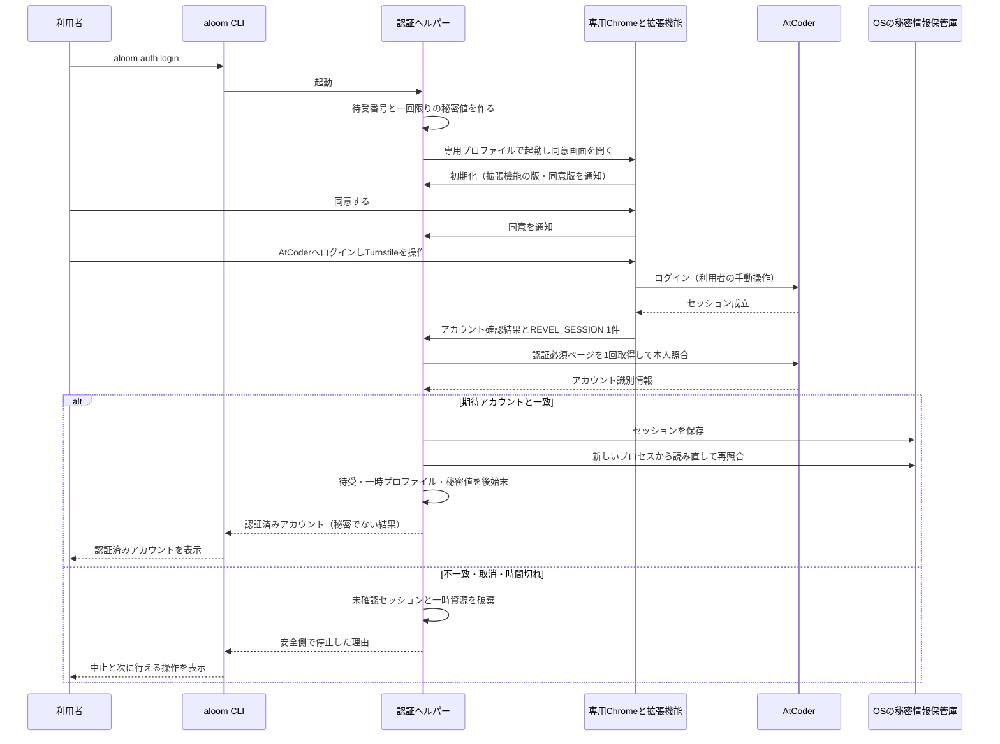

# AlgoLoom AtCoder認証設計

> 対象: MVPで利用者本人のAtCoderセッションを確立、確認、保管、失効処理する境界
>
> 状態: 認証方式の正本。方式Cは技術検証用。方式Aは現行CDP候補を不適合とし、通常Chrome状態を維持するCookie限定取得境界を`p0-23`で実証済み。`p1-02`で期限を推測しない認証失敗分類、`p1-03`でCookie更新・明示期限・再起動・失効・競合・秘密情報保管庫障害の安全停止を実証済み。`TD-09`では署名済みChrome拡張機能と認証付き折返し通信の組み合わせを次の実機検証候補に選定し、`TD-10`で追加P0 `V-12`の検証計画を確定した。2026年8月26日に、配布物と実行ファイル署名の境界を§3.6の契約として追加した。製品形態の成立は未検証であり、`V-12`の合格前に採用確定とは扱わない
>
> 決定日: 2026年8月11日
>
> 最終更新日: 2026年8月26日
>
> 関連文書:
> - [MVPスコープ](../product/mvp.md)
> - [Core契約](core-contracts.md)
> - [セキュリティ設計ガイド](../quality/security-design.md)
> - [配布方針ガイド](../operations/algoloom-distribution.md)
> - [AtCoder公開情報に基づく配布判断記録](../project/atcoder-public-policy-review.md)
> - [AtCoder認証・認可の境界整理](../project/atcoder-authentication-authorization-boundary.md)
> - [AtCoder認証UX設計](../project/atcoder-authentication-manual-operation-automation.md)
> - [拡張機能の責任境界と提出の縮退運転設計](../features/extension-boundary-and-degraded-submission.md)
> - [`JudgeAdapter`技術検証計画](../project/judge-adapter-verification.md)
> - [技術検証の実施手順](../verification/judge-adapter/README.md)

## ドキュメント概要

本書は、Cloudflare Turnstileが存在する現在のAtCoderに対して、Bot対策を回避せずに利用者本人のセッションをAlgoLoomの提出経路へ渡す方法を定義します。セッションの取得方法、秘密情報の保管、アカウント確認、失効、検証と公開のゲートを分けます。

## 用語

本文では日本語表記を優先し、製品名、規格名、コード上の識別子を次のように対応付けます。

| 日本語表記 | 英語・コード上の表記 | 本書での意味 |
|---|---|---|
| クッキー | Cookie | ブラウザーがサイト単位で保持する情報。方式Aでは`REVEL_SESSION`だけを取り込み対象にする |
| 公式拡張機能配布基盤 | Chrome Web Store | Chrome拡張機能を署名、審査、配布するGoogleの公式基盤 |
| 限定公開 | unlisted | 検索一覧には表示せず、配布先URLを知る利用者が追加できる公式拡張機能配布基盤の公開範囲 |
| クッキー操作機能 | Cookies API、`chrome.cookies`、`browser.cookies` | 拡張機能が許可された接続先のクッキーを問い合わせるブラウザー機能 |
| 拡張機能の処理担当 | extension service worker | 拡張機能の背景処理を担い、ページ本文へ秘密値を渡さずクッキーを取得する処理 |
| 認証付き折返し通信 | authenticated loopback | `127.0.0.1`だけで待ち受け、一回限りの秘密値で送信元と実行を結び付ける端末内通信 |
| 認証ヘルパー | authentication helper | AlgoLoom本体に含まれる認証専用の処理。`aloom`のサブコマンドとして起動し、専用ブラウザーの起動、拡張機能からのクッキー受領、本人照合、秘密情報保管庫への保存、後始末を担う。別途ダウンロードするアプリケーションではない（§1.2） |
| ネイティブ連携通信 | native messaging | ブラウザーへ登録した端末側プログラムと拡張機能が標準入出力で通信する仕組み |
| ブラウザー共通拡張仕様 | WebExtensions | Firefox等が対応する拡張機能の共通的な仕組み |
| 非管理Chrome | unmanaged Chrome | AlgoLoomが企業向けポリシー、外部拡張設定またはOSレジストリを書き換えず、Chromeの標準的な利用者向け導線で使用するChrome。利用者の普段使いプロファイルと同じという意味ではない |
| 利用者の既存プロファイル | existing user profile | 利用者が普段の閲覧に使い、履歴、Cookie、保存パスワード、既存拡張機能等を所有するChromeプロファイル。AlgoLoomは参照、複製または変更しない |
| AlgoLoom専用データディレクトリ | AlgoLoom-owned user data directory | AlgoLoomが非標準の`--user-data-dir`で作成し、用途、保持物、寿命、削除方法を管理するChromeデータ領域 |
| アプリケーション連結暗号化 | App-Bound Encryption | Windows版Chromeがクッキー等の復号をアプリケーションの実体へ結び付ける保護機構 |
| 自動操作識別値 | `navigator.webdriver` | ブラウザーが自動操作下にあることを示す標準属性 |
| ブラウザー開発者向け制御方式 | CDP、WebDriver | ブラウザーを外部プログラムから制御する仕組み。Cloudflare保護ページでは使用しない |
| 安全側停止 | fail closed | 条件を確認できないときに推測や迂回をせず、該当機能を停止すること |

## 0. 結論

MVPは認証方式と製品形態を次の順で確定します。

1. `V-02`以降の技術検証では、**方式C**として、利用者が通常のブラウザでログインした後に`REVEL_SESSION`を検証用クライアントへ手動で取り込みます。方式Cの`V-02`は[`p0-04`](../verification/judge-adapter/results/2026-08-11-p0-04.md)で合格しました。
2. MVP製品では、**方式A**として、空の専用可視ブラウザーで利用者が手動ログインし、`REVEL_SESSION`だけをOSの秘密情報保管庫へ渡します。現行の`--remote-debugging-pipe`とCDPによる候補実装は不適合です。[`p0-23`](../verification/judge-adapter/results/2026-08-12-p0-23.md)で、CDP等を使わない通常Chrome、手動読込の検証専用拡張、認証付き折返し通信、macOS Keychainによる取り込み境界を実証しました。
3. `TD-09`の机上比較では、**公式拡張機能配布基盤で限定公開する署名済みChrome拡張機能と、認証付き折返し通信を組み合わせる形態**を`V-12`へ進める一案に選定しました。これは実機検証対象の選定であり、公式拡張機能配布基盤の審査通過、標準画面からの追加、実サービスとの互換性、配布物の安全性を`V-12`で確認するまで製品採用を確定しません。

方式Cでセッションを取り込めただけでは`V-02`合格ではありません。同じセッションから現在のアカウント識別情報を一意に取得し、未認証状態と区別し、期待する本人アカウントと一致して初めて合格です。

`p0-08`と[`p0-09`](../verification/judge-adapter/results/2026-08-12-p0-09.md)では可視専用ブラウザのログイン時にCloudflare検証が失敗しました。[`p0-10`](../verification/judge-adapter/results/2026-08-12-p0-10.md)で、現行ヘルパー相当では`navigator.webdriver: true`となり、CDPなしの通常ChromeはCloudflare公式互換性チェッカーへ合格することを確認しました。そこで`p0-23`では、空の可視Chromeへ人が拡張を手動読込し、loginとCloudflare検証を操作した後だけ、service workerがChrome Cookies APIで`REVEL_SESSION`を限定取得する境界へ変更しました。本人照合、Keychain保存、新規プロセスからの同一アカウント再照合、全一時資源の後始末まで成立したため`V-10`は合格です。

`p0-23`の拡張と一時Swiftヘルパーは検証支援経路です。方式Aの製品採用方針は維持しますが、手動読込の拡張を製品へ流用せず、署名・配布された別の製品用拡張機能と製品用ヘルパーを作ります。ローカル通信境界と各OSの秘密情報保管庫抽象化も、同じ実装のまま確定したとは扱いません。

## 1. 認証の責任分担

| 工程 | 担当 | 境界 |
|---|---|---|
| AtCoderのユーザー名・パスワード入力 | 利用者 | AlgoLoomは値を受け取らず、保存しない |
| Turnstileの操作 | 利用者 | 自動操作、突破、代行を実装しない |
| ログイン画面と認証判断 | AtCoder・ブラウザ | AlgoLoomは成功をCookieの存在だけで断定しない |
| セッションの取り込み | 方式Cでは利用者、方式Aでは認証ヘルパー | `https://atcoder.jp`の`REVEL_SESSION`だけを許可する |
| セッションの保管 | 認証セッション保管境界 | 履歴DB、作業領域、設定ファイルから分離する |
| アカウント確認 | `JudgeAdapter` | 提出せず、同じセッションから識別情報を取得する |
| 提出・判定確認 | 可視専用browser・利用者・`JudgeAdapter` | アカウント確認後に提出を準備し、Turnstileと最後の提出操作は利用者がbrowserで行う。受理済み提出の判定はAdapterが確認する |

認証セッションの取得と、外部学習資料を既定のブラウザで開く`BrowserLauncher`は別の責任です。`BrowserLauncher`は引き続きCookie、プロファイル、ログイン状態を読みません。方式Aの認証ヘルパーだけが、利用者の明示した認証操作中に専用プロファイルの許可されたCookieへアクセスできます。

CoreとCLIは生のCookie値を受け取りません。`AtCoderSessionProvider`は、認証済み通信を実行する間だけAtCoder Adapterへ不透明なセッション参照または認証済みHTTPクライアントを貸し出し、生の値を文字列として境界外へ返さない契約とします。利用側へ返すのは、認証状態、アカウント一致結果、更新要否等の秘密でない結果だけです。

### 1.1. Chrome本体、管理状態、プロファイルの所有境界

方式Aは、利用者が導入済みのGoogle Chrome本体を選択して起動します。ただし、利用者が普段使うプロファイルは渡さず、AlgoLoomが所有する別のデータディレクトリを指定します。「非管理Chrome」は、AlgoLoomがChromeの管理者にならないことを表し、「利用者の普段使いChromeプロファイルを使うこと」を表しません。

```text
利用者の端末
├─ Google Chrome本体                        外部tool。AlgoLoomは更新・改変しない
│  ├─ 企業向けポリシー・外部拡張設定        外部環境。AlgoLoomは追加・変更しない
│  └─ 利用者の既存プロファイル              利用者所有。参照・複製・変更しない
└─ AlgoLoom所有領域
   ├─ クリーンなテンプレートプロファイル    採用時だけ、拡張機能と最小設定を保持する
   └─ 実行用一時プロファイル                認証または提出の1実行後に全体を削除する
```

Chrome本体、企業向けポリシー、外部拡張設定および既存プロファイルは、利用者または別製品が所有する外部環境です。AlgoLoom専用データディレクトリと、AlgoLoom名前空間で保存する秘密情報保管庫の項目は、保存場所、内容、寿命、削除方法を製品契約で定義するAlgoLoom所有データです。後者を端末へ作成すること自体は、外部環境の書換えとは扱いません。

既に組織管理されているChromeで標準追加が禁止される場合は、管理設定を解除または上書きせず、認証・提出だけを非対応として停止します。

### 1.2. 認証ヘルパーとは何か

認証ヘルパーは、**AlgoLoom本体に含まれる認証専用の処理**です。利用者が別途ダウンロードするアプリケーションではありません（§3.6）。`aloom auth login`のとき、または`aloom submit`で再認証が必要になったときにだけ起動し、認証が終わると終了する短命なプロセスとして動きます。常駐しません。

#### なぜ必要か

Chrome拡張機能はChromeの中でしか動けません。認証を1回完了させるには、Chromeの外でしか行えない処理があります。

| 必要な処理 | 拡張機能だけで行えるか |
|---|---|
| AlgoLoom専用データディレクトリでChromeを起動する | 行えない。ブラウザーの外からしか起動できない |
| OSの秘密情報保管庫へセッションを保存する | 行えない |
| CLIへ結果を返す | 行えない |
| テンプレートプロファイルを複製し、実行後に破棄する | 行えない |
| 新しいプロセスから同じアカウントを再照合する | 行えない |

つまり認証ヘルパーは、**Chromeの中（拡張機能）と端末の中（OSの秘密情報保管庫とCLI）を橋渡しする側**です。拡張機能は「許可された1件のクッキーを取り出して渡す」ところまでを担当し、それ以降を認証ヘルパーが担当します。

#### 何を実行するか

1回の認証で次を順に行います。

| 順 | 処理 | 補足 |
|---|---|---|
| 1 | 認証付き折返し通信の待受を開く | `127.0.0.1`の動的な待受番号を1つ確保し、一回限りの秘密値を作る |
| 2 | 専用プロファイルでChromeを起動する | 利用者の既存プロファイルは渡さない（§3.3） |
| 3 | 同意画面を配信する | `http://127.0.0.1:<待受番号>/bootstrap`として認証ヘルパー自身が返す |
| 4 | 拡張機能からの通知を検査する | `Host`、送信元、拡張機能の配布元、秘密値、本文の大きさ、手順の順序を確認する。順序は「初期化 → 同意 → アカウント確認 → クッキー受領」に固定する |
| 5 | 受け取ったセッションで本人を照合する | 認証必須ページを1回だけ取得し、期待するアカウントと一致するか確認する（§3.5） |
| 6 | 一致した場合だけ保存する | OSの秘密情報保管庫のAlgoLoom名前空間へ保存する（§4.1） |
| 7 | 新しいプロセスから再照合する | 保存した値が実際に使えることを確認する |
| 8 | 後始末する | 待受を閉じ、実行用一時プロファイルを削除し、秘密値と未確認のセッションを破棄する |
| 9 | CLIへ結果を返す | 認証済みアカウント、次に行える一つの行動等、秘密でない結果だけ |

生のクッキー値が存在するのは、認証ヘルパーの中と秘密情報保管庫の中だけです。CLI、履歴DB、作業領域、`argv`、環境変数、通常ログへは渡しません（§1、§4.1）。

#### 何を実行しないか

- AtCoderへのログイン操作、Turnstileの操作、最後の提出操作。これらは利用者が可視ブラウザーで行います
- CDP、WebDriver、リモートデバッグによるブラウザー制御（§3.3）
- `REVEL_SESSION`以外のクッキーの読み取りと、利用者の既存プロファイルの参照
- 常駐。認証1回ごとに起動し、終了します

#### 全体の流れ



#### 拡張機能との責任分担

拡張機能でしか行えないのは、**クッキーを1件取り出すこと**と、**提出フォームへソースコードと言語を設定すること**の2つだけです。同意画面の表示、アカウント照合、提出IDの取得、判定確認は、いずれも認証ヘルパーが行います。

この分担は、拡張機能の更新頻度を下げるための設計判断です。拡張機能には「ブラウザの中でしか実現できない能力」だけを置き、AtCoder固有の知識はAlgoLoom本体へ置きます。詳細と、拡張機能側で固定する項目は[拡張機能の責任境界と提出の縮退運転設計 §2](../features/extension-boundary-and-degraded-submission.md#2-拡張機能の責任境界)を正とします。

`V-12`の検証支援物では、この責任をGoで書いた独立した実行ファイルとして作り、macOS Keychainへの読み書きだけをSwiftのアダプタへ分けています。これは検証の都合による構成であり、製品では`aloom`と同じパッケージに含めます（§3.6）。検証支援物の拡張機能は`/settings`のHTMLからアカウント識別情報を読みますが、製品では認証ヘルパーへ一本化します。

## 2. 方式C: 技術検証用の手動取り込み

### 2.1. 適用範囲

方式Cは`V-02`〜`V-09`の技術検証を再開するための限定経路です。MVPの通常導線、非対話実行、CI、共有端末またはリモート実行の認証方式として採用しません。

### 2.2. 手順

1. 検証者本人が通常利用しているブラウザでAtCoderへログインします。
2. 検証者がブラウザの開発者ツールから`https://atcoder.jp`の`REVEL_SESSION`だけを確認します。
3. 値を、入力を画面へ表示しない対話プロンプトから検証用クライアントへ一度だけ貼り付けます。
4. 検証用クライアントはCookie名、ホスト、パスを固定し、値を`argv`、環境変数、シェル履歴または通常ログへ渡しません。
5. リポジトリ外の所有者専用一時領域で`V-02`を実行します。
6. 検証完了後に一時Cookieと作業領域を削除します。

### 2.3. 安全条件

- 利用者本人のセッションだけを使い、他人のCookieを受け付けません。
- 取り込むCookieを`REVEL_SESSION`一つに限定します。他のCookieが必要だと観測した場合は自動的に対象を広げず、別の設計判断へ戻します。
- クリップボードへ残り得ることを事前に示します。AlgoLoomがクリップボードの消去を保証したとは表示しません。
- 一時ディレクトリは作成時から`0700`、一時ファイルは作成時から`0600`相当にします。
- 生のCookie、`Cookie`・`Set-Cookie`ヘッダー、生のHTMLを成果物へ残しません。
- 方式Cで得たセッションを製品の対応済み認証導線の根拠にしません。

## 3. 方式A: MVP製品候補の可視専用ブラウザ

### 3.1. 製品形態候補の机上比較

#### 3.1.1. 比較の前提

`TD-09`では、2026年8月24日時点の公式資料と`p0-23`の観測事実を使い、製品形態だけを机上比較しました。机上で契約に適合できることと、現在の実サービス、配布基盤、3つのOSで実際に成立することを分けます。

評価記号は次の意味です。

| 記号 | 意味 |
|---|---|
| ○ | 既存契約と公式仕様から、机上では要件を満たせる |
| △ | 既存契約には抵触しないが、実サービス、配布基盤または対象OSでの実証が必要 |
| × | 必須要件を満たせないか、既存の安全境界を弱めるため除外する |

候補は次の3つです。

| 候補 | 製品形態 | 配布と受け渡し |
|---|---|---|
| A | 公式ストアの署名済みChrome拡張機能 | 公式拡張機能配布基盤で限定公開し、利用者が初回だけクリーンなテンプレートプロファイルへ標準画面から追加する。認証または提出ではテンプレートの一時複製を使い、クッキー操作機能で取得した値を認証付き折返し通信へ一度だけ渡す |
| B | Chrome専用プロファイルの保存領域を終了後に読む方式 | 拡張機能を使わず、Chromeの全対象プロセス終了を確認した後、利用者の明示操作により専用プロファイルのクッキー保存領域を読んで対象値を選別する |
| C | Firefox専用プロファイルと署名済み拡張機能 | Mozillaが署名した自己配布用拡張機能を製品へ同梱し、利用者が空の一時専用プロファイルへ標準画面から追加する。ブラウザー共通拡張仕様のクッキー操作機能と認証付き折返し通信を使う |

#### 3.1.2. 安全性と対応環境の比較

| 観点 | 候補A | 候補B | 候補C |
|---|---|---|---|
| 3つの対象OS | △ 拡張機能と折返し通信は共通化できるが、ブラウザー起動、標準画面からの追加、秘密情報保管庫は実機確認が必要 | × Windows版Chromeはクッキーへアプリケーション連結暗号化を段階導入している。macOSとLinuxもOSの秘密情報保管庫を使い、3つのOSで同じ安全な復号境界を置けない | △ Firefoxと拡張機能は3つのOSに存在するが、起動、追加、秘密情報保管庫は未検証 |
| Cloudflare互換性 | △ CDP、WebDriver、リモートデバッグを使わないため自動操作識別値を真にする要因は追加しない。ただし拡張機能が保護処理へ干渉しないことは実サービスで再確認する | △ ログイン中は通常ブラウザーであり自動操作しないが、終了後の保存領域読取りはCloudflare互換性とは別の安全性問題を持つ | △ 通常の可視Firefoxを人が操作する。対応ブラウザーでも拡張機能が影響し得るため実サービス確認が必要 |
| 既存プロファイル非参照 | ○ AlgoLoom所有のテンプレートと実行用一時複製だけを使う | ○ 実行ごとの空の一時専用プロファイルだけを読む | ○ 実行ごとの空の一時専用プロファイルだけへ追加する |
| `REVEL_SESSION`だけへの限定 | ○ クッキー操作機能へ接続先、名前、経路、安全属性を指定し、候補が厳密に1件のときだけ受け渡せる | △ 問い合わせ条件と出力は対象値1件に絞り得るが、対応保証のない保存形式と復号処理を製品が直接扱う | ○ クッキー操作機能へ接続先、名前、経路、安全属性を指定し、候補が厳密に1件のときだけ受け渡せる |
| 配布物と通常ログへの秘密情報非混入 | △ `p0-23`と同じ値非表示境界を適用できるが、署名済み配布物と製品用ヘルパーを別途検査する | △ 値を出力しない実装は可能だが、暗号化保存領域と復号処理が新たな秘密情報境界になる | △ 候補Aと同じ値非表示境界を適用できるが、署名済み配布物と製品用ヘルパーは未検査 |
| §8の不採用条件 | ○ 不採用条件を追加しない | △ 専用プロファイルの通常読取りだけなら直ちに抵触しない。ただし保護の無効化、迂回または権限昇格が必要になった時点で不適合 | ○ 不採用条件を追加しない |

Cloudflareは主要なデスクトップブラウザーを対応対象とする一方、自動操作ブラウザーを非対応とし、拡張機能が検証へ影響し得ると説明しています。このため候補Aと候補Cは、公式上の対応だけで合格にせず実サービスで確認します。Chromeの公式資料は、WindowsとmacOSで一般利用者へ直接配布する拡張機能を公式拡張機能配布基盤で署名・配布すること、クッキー操作機能には`cookies`権限と対象接続先の権限が必要なことを示しています。候補Aはこの標準経路に従います。

#### 3.1.3. 利用者操作と通信方式

利用者操作は候補選定後のUX契約として定義し、除外候補の旧導線は維持しません。候補Aでは、初回だけ利用委譲への同意、標準画面での拡張機能追加、AtCoderログインを求めます。導入完了の検出、初期化、セッション取り込み、本人確認、保存、後始末は自動化し、再認証では原則としてAtCoderログインだけを求めます。

ネイティブ連携通信は、OS別の登録文書と永続的な回収対象を増やすため除外します。動的な待受番号、一回限りの秘密値、送信元、本文上限、状態順序を検査して実行終了時に閉じられる認証付き折返し通信を先に検証します。

#### 3.1.4. 選定結果

`V-12`へ進める候補は、**候補Aの「公式拡張機能配布基盤で限定公開する署名済みChrome拡張機能と、認証付き折返し通信の組み合わせ」一つ**とします。理由は次のとおりです。

1. `p0-23`で合格した、通常Chrome、クッキー操作機能、対象値1件への限定、認証付き折返し通信、本人照合、後始末という安全境界を維持し、変更点を署名・公式配布・標準追加画面・製品用ヘルパーへ限定できる。
2. Chromeが一般利用者向けに定める署名済み配布経路を使い、デベロッパーモード、手動読込、ブラウザー自動制御を必要としない。
3. ブラウザーの保存領域や復号鍵を直接扱わず、利用者の既存プロファイルと他のクッキーを参照しない。
4. ネイティブ連携通信の登録文書を通常環境へ残さず、実行単位の折返し通信と一時専用プロファイルを回収対象として閉じられる。

候補Bは除外します。現在のブラウザーが備えるクッキー保護を弱めずに3つのOSで成立させられず、対象値1件だけへ対応保証された読取り境界を置けないためです。候補Cは不適合とは断定しませんが、`V-10`の実証済みブラウザーと配布系統を同時に変更するため、今回の実機検証対象にはしません。候補Aが不合格の場合に候補Cへ自動的に切り替えず、方式Aの再設計として比較条件と検証計画を見直します。

この選定はAtCoder、CloudflareまたはGoogleによるAlgoLoomへの許諾ではありません。公式拡張機能配布基盤の審査通過も、AtCoderでの利用許諾を意味しません。

#### 3.1.5. 次の実機検証へ渡す条件

`TD-10`では、少なくとも以下を`V-12A`〜`V-12E`の合格条件、停止条件、検証層へ変換しました。詳細は[`JudgeAdapter`技術検証計画 §3.1.1](../project/judge-adapter-verification.md#311-v-12-方式a製品形態の検証)を正とします。

- 限定公開した製品用拡張機能を、利用者が開発者向け設定なしで標準画面からクリーンなテンプレートプロファイルへ初回だけ追加できる。
- ChromeへのGoogleアカウントの追加または同期を要求せずに拡張機能を追加できる。要求される場合は、利用者の既存ブラウザー環境へ影響させず不合格として停止する。
- 拡張機能の追加後、利用者に初期化ページへ戻る操作や拡張機能画面の操作を求めず、固定IDで導入完了を検出してテンプレートを確定できる。
- Chromeと拡張機能の更新前後を含め、テンプレートを安全に複製・起動・破棄できる。完全性を確認できないテンプレートは破棄し、次回だけ初回設定へ戻す。
- 審査済みの拡張機能識別子、版、権限、配布元を固定し、想定外の版または権限なら認証を開始しない。
- 公式拡張機能配布基盤の説明で、拡張機能の単一目的、扱う認証情報、端末内の製品用ヘルパーだけへ渡すこと、外部サーバーへ送らないこと、保存先、削除時点、権限の理由を事前に開示し、利用者の明示同意を得る。
- 標準追加画面とセーフブラウジングが表示する権限・信頼性の警告を記録し、AlgoLoomが警告を隠したり、保護機能の無効化を案内したりしない。利用者が中止した場合は外部作用前の取消として後始末する。
- 権限を`cookies`、`storage`、`https://atcoder.jp/*`、`http://127.0.0.1/*`と、折返し通信の初期化に必要な最小の処理へ限定する。`debugger`、`webRequest`、`tabs`、`scripting`、`nativeMessaging`を要求しない。
- 認証付き折返し通信は`127.0.0.1`だけで動的な待受番号を使い、一回限りの秘密値、`Host`、署名済み拡張機能の送信元、本文上限、状態順序を検査する。秘密値を通常ログへ出さない。
- Cloudflare保護ページをリモート制御せず、自動操作識別値が真でないことと、利用者の手動操作で互換性確認を通過することを確認する。
- 今回の認証処理を初期化した有効時間内だけCookie更新を監視し、接続先、名前、経路、安全属性、非分割状態を検査して`REVEL_SESSION`を厳密に1件取得する。他のクッキーを読み取らず、ページ本文、クリップボード、引数、環境変数へ渡さない。
- 本人照合後だけOSの秘密情報保管庫へ保存し、新しいプロセスから同じ本人を再照合する。未確認または不一致の値を確定保存しない。
- 取消、時間切れ、拡張機能追加の中断、ブラウザー終了、値受領直後の異常終了を含め、孤児プロセス、待受処理、利用可能な一時専用プロファイル、未確認のセッションを残さない。
- 拡張機能が追加できない、審査・公開状態を確認できない、権限が増えている、CloudflareまたはAtCoderに拒否される場合は安全側停止し、手動読込、候補B、候補C、CDP、WebDriver、直接HTTP提出へ切り替えない。
- 拡張機能の配布物、製品用ヘルパー、通常ログ、エラー、成果物に秘密情報または実行固有値が含まれない。

### 3.2. 利用者の導線

次のUX契約を採用します。実現手段であるテンプレート複製等は`V-12`の合格前に製品成立済みとは扱いません。詳細な画面遷移は[AtCoder認証UX設計](../project/atcoder-authentication-manual-operation-automation.md)を参照します。

| 場面 | 利用者の操作 | 自動処理 |
|---|---|---|
| 初回セットアップ | `aloom auth login`、利用委譲への初回同意、拡張機能の追加・権限承認、AtCoderログイン | Web Storeを開く、導入検出、テンプレート確定、AtCoderへの遷移、限定取り込み、本人確認、保存、後始末 |
| 明示ログイン・再認証 | `aloom auth login`、AtCoderログイン | 一時複製の起動、限定取り込み、本人確認、保存、後始末 |
| `submit`中の再認証 | `aloom submit`、AtCoderログイン、最後の提出操作 | セッション失効を検出し、事前表示後にブラウザを自動起動する。認証後は同じブラウザで提出確認へ進む |
| 有効なセッションでの提出 | `aloom submit`、最後の提出操作 | 認証画面を出さず、提出確認を同じ一往復で準備する |

共通契約は次のとおりです。

- CLIからブラウザへ1回移り、完了後にCLIへ戻る一往復とする。ブラウザ表示中にCLIへ戻ってURL、code、commandまたはCookieを入力させない。
- 初回同意は、取得対象、用途、保存先または権限が変わるまで再確認しない。拡張機能も初回だけ追加し、テンプレートが安全に再利用できない場合だけ再設定する。
- `submit`で再認証が必要な場合は、ブラウザを開くことと中止方法をCLIへ表示してから自動起動する。追加の認証commandやYes/No確認を要求しない。
- 待機中はCLIからいつでも取消できる。取消、ブラウザ終了または時間切れでは提出せず、秘密値と一時資源を回収する。
- CLIへ戻った時点で、認証済みアカウント、提出結果または次に行える一つの行動を表示する。

### 3.3. ブラウザ境界

- 利用者の既存ブラウザプロファイル、履歴、保存パスワード、拡張機能、他サイトのCookieを探索または複製しません。
- 非標準の専用`user-data-dir`を使用し、認証ヘルパーの子プロセスとして起動します。
- Cloudflare保護ページの表示と操作中にCDP、WebDriver、リモートデバッグのpipeまたはportを使用しません。ローカル限定でも`navigator.webdriver`が真になる経路は不適合です。
- ヘッドレス化、ブラウザ指紋の偽装、stealth設定、Turnstileのクリック自動化を行いません。
- `navigator.webdriver`を隠すフラグやスクリプト、AutomationControlledの無効化、ユーザーエージェント偽装を行いません。
- 可視ブラウザで利用者が操作してもAtCoderまたはCloudflareから拒否される場合があります。その場合は自動化検知を回避せず、方式Aを不合格として停止します。
- タイムアウト、利用者によるウィンドウ終了、ヘルパー異常終了を通常の中断状態として扱い、孤児プロセスと一時プロファイルを残さないようにします。

### 3.4. 認証経路に現れるOS差

Chrome Web Storeの標準追加画面、拡張機能識別子、Manifest V3、クッキー操作機能、認証付き折返し通信のプロトコルは、3つの対象OSで共通の契約を置けます。OS差は主に、Chromeとhost OSを接続する境界へ現れます。

| 領域 | native macOS | native Linux | native Windows | 検証する契約 |
|---|---|---|---|---|
| Chrome本体の検出・起動 | `.app` bundleと実行file | distribution、package、実行file名の差 | `.exe`の配置と起動規則 | 対応Chromeを一意に選び、専用`--user-data-dir`で可視起動する |
| profile・cache配置 | `Application Support`と`Library/Caches`が分かれ得る | XDG系directoryとcache配置 | local app data配下とfile lock | AlgoLoom所有領域だけを複製・削除し、既存profileへ触れない |
| process終了・file回収 | background processとfile使用中状態 | process group、desktop環境、distribution差 | process treeとopen fileの削除制約 | 完全終了後だけ複製し、取消・異常終了後に孤児processと一時profileを回収する |
| 秘密情報保管庫 | macOS Keychain | Secret Service等。desktop sessionによって利用不能の場合がある | WindowsのOS保護領域 | AlgoLoom名前空間で保存・取得・更新・削除し、利用不能なら平文へ退避せず停止する |
| 外部拡張導入 | Chrome Web Storeを指す外部拡張JSONと利用者の有効化確認 | system位置のJSONから自動導入可能 | Registry設定と利用者の有効化確認 | 一般利用者向け経路ではいずれも使わず、標準追加画面を使う |

標準画面からの拡張機能追加を手動にする直接の理由はOS差ではなく、Chromeの利用者承認を維持するためです。OS差は、外部拡張設定等による代替の無人導入を3 OS共通の閉じた製品契約にできない理由と、追加後の自動処理をOSごとに検証する理由になります。一般的なprocess、path、file操作のOS差は[言語・実行環境の可搬性設計 §6](language-and-platform-portability.md#6-hostplatform契約)を参照します。

### 3.5. 取り込みの確定条件

Cookieの出現やログイン後のURLだけでは成功としません。次をすべて満たした場合だけ取り込みを確定します。

- Cookieの送信先が`https://atcoder.jp`へ限定されている。
- Cookie名が`REVEL_SESSION`である。
- 認証必須ページがログインページへ誘導されない。
- 許可リスト化した構造からアカウント識別情報を一意に取得できる。
- 取得した識別情報が、利用者が確認した期待アカウントと完全一致する。
- 値をログ、エラー、テレメトリ、履歴DB、作業領域へ出していない。

不一致、識別不能または応答構造の変更では、取得したセッションを確定保存せず、提出も行いません。

### 3.6. 配布物と実行ファイル署名の境界

> 判断日: 2026年8月26日

方式Aは、認証用Chrome拡張機能とAlgoLoom本体という2つの配布物だけで成立させます。**どちらか一方だけでは認証が成立しません。** 2つは性質も配布経路も異なり、1つへまとめることはできません。

拡張機能の版と可用性をAlgoLoomが制御できないことから生じる運用リスクは、[Chrome拡張機能配布の運用リスクと緩和策](../project/chrome-extension-distribution-risks.md)へ分けて記録します。採用した緩和策は次の2つで、設計内容は[拡張機能の責任境界と提出の縮退運転設計](../features/extension-boundary-and-degraded-submission.md)を正とします。

1. 拡張機能には、ブラウザの中でしか実現できない能力だけを置く。AtCoder固有の知識はAlgoLoom本体へ置き、AtCoder側の変更へPyPIの更新だけで追随する
2. 拡張機能が使えない場合に提出を続ける縮退運転を持つ。検知、通知、利用者の明示操作を伴わない縮退運転は採用しない

#### 3.6.1. 2つの配布物は性質が異なる

| 観点 | 認証用Chrome拡張機能 | 認証ヘルパー |
|---|---|---|
| 実体 | HTML、CSS、JavaScriptのファイル群 | 端末で動くAlgoLoom本体の一部。`aloom`のサブコマンドとして動作する（§1.2） |
| 配布経路 | Chrome Web Store（限定公開） | PyPI（`pip`、`pipx`、`uv tool`） |
| 取得する主体 | Chromeが取得し、Chrome所有のプロファイルへ展開する | 利用者がAlgoLoomを導入するときに一緒に入る |
| 利用者の操作 | 初回だけ標準追加画面で追加を承認する | AlgoLoomの導入1回 |
| 真正性の担保 | Chrome Web Storeの署名。AlgoLoomは固定の拡張機能識別子、バージョン、配布元、権限を照合してから認証を開始する | 利用者自身が導入したAlgoLoomのプロセスであること |
| OSの実行ファイル保護の対象か | 対象外。利用者のファイルシステムへ実行ファイルとして置かれない | 対象になり得る。条件は§3.6.4 |

#### 3.6.2. 2つを1つの配布物へまとめない

| できないこと | 理由 |
|---|---|
| 拡張機能をAlgoLoomのパッケージへ同梱し、`pip`や`curl`で導入する | Chromeは一般利用者向けにChrome Web Store経由の追加しか受け付けない。`.crx`の直接インストールはmacOSとWindowsで無効であり、手動読込にはデベロッパーモードが必要になる。§3.1.5の「開発者向け設定なしで標準画面から追加できる」条件と、固定の配布元を照合する契約が成立しなくなる |
| 認証ヘルパーを拡張機能へ同梱する | 拡張機能はネイティブコードを実行できず、ブラウザーの起動、OSの秘密情報保管庫への保存、CLIへの応答を行えない（§1.2） |

「実行ファイルを`curl`で取得できるのだから、拡張機能も同じ経路で配れる」とは扱いません。`curl`、Homebrew、`git clone`等で取得できるのは端末側の実行ファイルだけであり、拡張機能の導入経路にはなりません。

#### 3.6.3. 利用者から見た導入の流れ

```text
1. AlgoLoomを導入する               pipx install algoloom          ← 1回
2. aloom auth login を実行する
3. AlgoLoomが専用ブラウザーで限定公開の掲載ページを開く
4. 利用者が標準追加画面で拡張機能の追加を承認する                   ← 手動はここだけ
5. AlgoLoomが固定の拡張機能識別子で導入完了を検出し、続きを自動で進める
```

利用者がChrome Web Storeを自分で検索する必要はありません。掲載ページを開くところまでAlgoLoomが行います。この一往復が実際に成立するかは`V-12B`で確認します。

#### 3.6.4. 実行ファイル署名が必要になる条件

macOSのGatekeeperとWindowsのSmartScreenは、**ダウンロードされた実行ファイルに付く印**（macOSのquarantine属性、WindowsのMark-of-the-Web）を見て動きます。したがって有償の署名制度への加入が必要かどうかは、**端末側の実行ファイルをどうやって利用者の端末へ届けるか**だけで決まります。拡張機能の配布経路はこの判断に関係しません。

| 端末への届き方 | 印が付くか | Developer ID署名・notarization |
|---|---|---|
| 拡張機能をChrome Web Storeから追加する | 付かない。そもそも実行ファイルではない | 不要 |
| AlgoLoomを`pip`、`pipx`、`uv tool`で導入する | 付かない | 不要（**製品はこれ**） |
| 実行ファイルを`curl`、`git clone`、Homebrew等で取得する | 付かない | 不要 |
| 実行ファイルをブラウザー、メール、AirDrop等で受け取る | **付く** | **必要** |
| `.dmg`、`.pkg`、`.msi`等のインストーラを配る | **付く** | **必要** |

下2行を採らないことが§3.6.5の契約です。したがって方式Aでは、Apple Developer ProgramもAuthenticode証明書も必要になりません。

なお、印が付かない経路を選ぶことは、警告の回避ではありません。回避とは、表示された警告を利用者に無効化または上書きさせること（quarantine属性の削除、「このまま開く」の選択、`spctl`の無効化等）を指します。上の表の上3行はいずれも警告を発生させず、パッケージマネージャーでコマンドラインツールを導入する通常の手順です。

#### 3.6.5. 契約

- **AlgoLoomは、OSの実行ファイル署名・notarization制度に依存する独立配布物を作りません。** 認証ヘルパーを、AlgoLoom本体とは別にダウンロードさせる実行ファイル、インストーラ、`.dmg`、`.pkg`、`.msi`として配布しません。
- 認証ヘルパーは`aloom`と同じパッケージから配布し、利用者が既に導入した実行環境の上で動作させます。
- 利用者へ、OSの保護機構が出す警告の無効化または上書きを求めません。
- Apple Developer Program、Authenticode証明書等の有償の署名制度への加入を、方式Aの成立条件にしません。加入が必要になる配布形態を採る場合は、実装判断ではなく設計変更として扱います。

理由は次のとおりです。認証ヘルパーの真正性は、利用者自身が導入したAlgoLoomが起動した子プロセスであることで担保されます。OSの実行ファイル署名が防ぐのは、素性の分からない実行ファイルをダウンロードして実行する経路であり、方式Aにはその経路がありません。方式Aの認証・認可の強度は、§3.1.5に挙げた拡張機能の照合と認証付き折返し通信の検査、および§3.5の取り込み確定条件が担っています。ヘルパーへDeveloper ID署名を付けても、これらの強度は上がりません。

`V-12`の検証支援物であるGoヘルパーとSwift Keychainアダプタは、検証の都合で作った独立した実行ファイルであり、製品形態ではありません。検証では、印が付かない経路でreviewerへ受け渡します。詳細は[V-12 Chrome Web Store配布準備 §4.2](../verification/judge-adapter/v12-chrome-web-store-preparation.md#42-採用するreviewer用helperの受渡し方式)を参照します。

## 4. セッションの保管と更新

### 4.1. 保管先

- 製品版は、macOS Keychain、WindowsのOS保護領域、Linux Secret Service等のOSの秘密情報保管庫を第一候補とします。
- AlgoLoom専用の名前空間へ、AtCoderセッションと確認済みアカウント識別情報の参照を分けて保持します。
- Cookieを履歴DB、SQLiteのバックアップ、作業領域、設定ファイル、エクスポート、クラウド同期、テレメトリまたはクラッシュレポートへ含めません。
- 秘密情報保管庫が利用できない場合、平文ファイルへ自動的に切り替えません。影響を提出機能だけへ限定し、安全な準備方法を示します。
- 方式Cの検証用一時ファイルは、製品版の平文フォールバックではなく、検証終了時に破棄する限定例外です。

秘密情報保管庫が保証する範囲を次のとおり限定し、これを超える表示を行いません。

| 保証する | 保証しない |
|---|---|
| セッションを平文ファイルとして残さないこと | 同じ利用者として動作する他のプロセスから読めないこと |
| OSのロック解除状態と利用者のセッションに従うこと | 端末を管理者権限で操作できる者から保護すること |
| 削除対象と削除方法が一意に定まること | ローカルの削除がAtCoder側のセッション失効を意味すること |

「AlgoLoomだけが読める」とは表示しません。macOS Keychainの項目のアクセス制御は呼び出し元の実行ファイルへ紐づきますが、§3.6の契約により認証ヘルパーはPythonの実行環境の上で動作するため、信頼される実行ファイルはインタプリタになります。専用の実行ファイルを用意しても、ad-hoc署名では再ビルドのたびに識別子が変わり、更新のたびにアクセス制御が失効します。3つのOSでの実際の保証範囲と表示文言は`TD-12`で確認します。

### 4.2. Cookie更新への追従

AtCoderが`Set-Cookie`を返した場合は、HTTPクライアントのCookie jarを更新できます。ただし、現在の値を固定して使うことも、すべての応答で値が更新されることも前提にしません。

- サーバーが返していない有効期限を推測または生成しません。
- Cookie更新を「セッション延命」または「実質無期限」と表示しません。
- セッション維持だけを目的とするバックグラウンド通信を行いません。
- 同時実行で新しいCookieを古いCookieが上書きしないよう、認証済み通信と保管更新を排他します。
- 更新後のセッションでも同じアカウント識別情報を確認してから永続化します。
- Cookie更新、明示期限、旧値の短時間利用、競合と秘密情報保管庫障害は[`p1-03`](../verification/judge-adapter/results/2026-08-13-p1-03.md)で観測しました。1アカウント、macOS、短時間の結果であり、AtCoder固有の長期保証や他OSへ一般化しません。

### 4.3. 失効と削除

- 認証情報が存在しない場合は未認証として通信前に停止します。Cookieなしの認証必須ページ対照がログインページへ誘導されることは`p1-02`で再確認しました。
- サーバー由来として保持した明示期限が現在時刻以前の場合だけ、期限切れとして通信前に停止します。サーバーが返していない期限を生成しません。
- 期限が不明な既存認証情報で認証必須ページからログインページへ誘導された場合は、未認証または期限切れとして送信前に停止します。誘導だけから期限切れと断定しません。
- 利用者はAlgoLoomの秘密情報保管庫からセッションを削除できます。
- ローカルの値を削除しても、AtCoder側のセッション失効を保証したとは表示しません。サーバー側の失効が必要な場合はAtCoder公式画面の操作を案内します。

## 5. 認証状態とエラー分類

| 分類 | 判定に使う情報 | 次の安全な行動 |
|---|---|---|
| 認証済み | 認証必須ページの成功と一意なアカウント識別情報 | 期待値一致後だけ提出準備へ進む |
| 未認証 | 認証情報の不存在、Cookieなしの認証必須ページからログインページへの許可された誘導 | 方式Aの認証を案内する |
| 期限切れ | サーバー由来の明示期限が現在時刻以前 | 外部通信前に停止し、方式Aの再認証を案内する |
| 未認証・期限切れ | 期限不明の既存認証情報でログインページへの許可された誘導 | 原因を推測せず認証情報を破棄し、方式Aの再認証を案内する |
| アカウント不一致 | 取得値と確認済み期待値の不一致 | セッションを確定せず提出を停止する |
| AtCoder・Cloudflare側の拒否 | 403、challenge等の許可リスト化した分類 | 自動再試行せず、時間を置くか公式情報を確認する |
| ページ構造の変更 | 200応答だが識別情報を一意に解釈できない | 未認証とみなさず、Adapterの互換性エラーとして停止する |
| 通信障害 | 接続、TLS、名前解決、タイムアウト | 外部作用前かを示して停止し、利用者が確認した後の新しい明示操作としてだけ再開する |
| 秘密情報保管庫の障害 | 読み書き、ロック、アクセス拒否 | 提出だけを停止し、ローカル機能は継続する |

認証確認は初回提出前と各提出直前に行います。Cookieの存在、HTTP 200、外部ツールの「ログイン済み」という真偽値だけで、意図したアカウントと断定しません。

`V-02`で認証必須ページの成功と期待するアカウント識別情報を確認しても、それは対象コンテストまたは問題への提出認可を確認した意味ではありません。認証必須ページを閲覧できる最小限の認可と、提出ページへのアクセス、ジャッジ言語の利用可否、CSRF検証を含む提出POSTの受理を分けます。提出に関する成立性は、`V-05`で言語を一意に解決し、明示承認後の`V-03`で実際の提出受理と提出IDを確認するまで未確認として扱います。

方式CのHTTP経路では対象提出フォーム内Turnstileを完了できないため、`V-03`は、空の専用プロファイル、通常の可視ブラウザ、手動読込の検証専用拡張、利用者によるログイン・Turnstile・最後の提出操作を使う別経路で再検証できます。この経路はCookieを取得または保管せず、方式Aのセッション取り込み、`V-10`または製品の認証方式が成立した証拠にはしません。検証専用拡張を製品採用したとも扱いません。

`p0-14`では、この経路でCloudflare互換性、本人照合、フォーム、言語、Turnstile、明示承認まで成立しましたが、フォーム`submit`イベント後にソース空欄が報告され、提出IDを得られませんでした。フォームイベントはnetwork POSTの観測と同一視せず、送信開始後に受理を確認できない状態は`REMOTE_STATUS_UNKNOWN`として再提出を禁止します。`p0-15`では、Ace表示中の非表示`textarea`だけを書き換え、Ace内部の空状態を同期していなかったことを原因と特定しました。検証支援コードは、利用者によるAce→プレーン欄→Ace→プレーン欄の往復とAce上の目視確認を必須にし、往復後・承認時・送信時に可視欄と`FormData`へ直列化されるソースを再検査します。不一致なら既定送信を遮断します。この修正だけで`V-03`または製品経路が成立したとは扱いません。

## 6. 技術検証とMVPゲート

| ゲート | 目的 | 合格条件の要点 |
|---|---|---|
| `V-02` | 方式Cで主要導線の検証を再開する | 手動取り込み後、未認証と認証済みを区別し、期待するアカウント識別情報を取得する |
| `V-07` | 認証失敗後の安全な行動を決める | 通常観測とローカル制御を分け、期限を推測せずに未認証、期限切れ、拒否、ページ構造変更、通信障害を分類する |
| `V-10` | 方式AをMVP製品候補として採用できるか判断する | 可視の専用ブラウザ、人によるログイン、必要Cookieだけの取得、同じアカウント確認、既存プロファイル非参照、秘密情報非漏えい、正常な後始末を実証する |
| `V-11` | Cookie更新・失効処理を設計できるか判断する | `Set-Cookie`の有無と更新、プロセス再起動後の利用、失効分類、排他更新を、推測値なしで扱える |
| `V-12` | 方式Aの配布可能な製品形態と一往復UXを採用できるか判断する | 署名済み限定公開拡張機能、製品相当helper、認証付き折返し通信、基準template、秘密情報保管庫を同じcampaignで組み合わせ、`V-12A`〜`V-12E`をすべて合格させる |

`V-01`〜`V-04`と`V-10`は実装開始条件1〜3を保護するP0です。`p0-23`によりこのP0は5/5となり、対応する技術検証は充足しました。`V-12`は方式Aの製品形態を保護する追加P0です。既存の5/5という完了実績を変更しませんが、`V-12`が合格するまで署名済み拡張機能と一往復UXの組み合わせを製品成立済みとは扱いません。

方式Aの1OS・1ブラウザでの成立を`V-10`で実証したため、他の開始条件も満たした段階で製品実装を開始できます。MVP完了には、native macOS、native Linux、native Windowsの対応ブラウザと秘密情報保管庫について、少なくとも次を満たす検証マトリクスが必要です。

- 可視ブラウザの起動、利用者による中断、タイムアウト、孤児プロセスの回収
- 既存プロファイルを参照していないこと
- 秘密情報保管庫への保存、取得、更新、削除と、利用不能時の安全停止
- ログ、エラー、DB、エクスポート、配布物への秘密情報非混入
- アカウント変更、期限切れ、ページ構造変更の送信前停止

### 6.1. 検証環境と自動化可能性の境界

「利用者による拡張機能の追加・権限承認」と「未実証のため採用していない自動処理」を区別します。前者はChromeの標準導線とAlgoLoomの同意境界であり、検証環境を高忠実度にしても無人化しません。後者は実装可能性を否定したものではなく、次の観測対象を実機または同等環境で確認できれば採用候補にできます。

| 検証層 | 主な対象 | 使用できる環境 | その層だけでは証明しないこと |
|---|---|---|---|
| OS非依存の契約test | 状態遷移、許可リスト、通信schema、秘密値の非記録 | 通常CI、mock、fixture | Chrome・OS統合の成立 |
| 3 OS統合test | Chrome検出・起動、profile複製、file lock、process回収、秘密情報保管庫 | 対象OSのVMまたはself-hosted runner。可視desktop sessionと実OS serviceを備える | Chrome Web Store標準追加と本番Challengeの互換性 |
| 配布導線test | 署名済み限定公開版、固定ID・版・権限、標準追加画面、Chrome更新前後 | 対応版の通常Google Chromeを入れた代表端末または同等のfull desktop VM。追加承認は人が操作する | 自動操作browserでの本番Challenge通過 |
| 実サービスsmoke | AtCoder login、Cloudflare、Cookie限定取得、本人照合、後始末 | 通常Chromeを自動制御せず、人が操作する代表環境。物理端末を少なくとも最終確認へ含める | 将来の恒久的互換性 |

VMを一律に不適合とは扱いません。検証対象がprocess、filesystem、profile複製または秘密情報保管庫であり、対象OSのkernel、desktop session、権限、保管庫service、通常Chromeを本番相当に用意できるなら、同等環境として利用できます。一方、headless CI、Chrome for Testing、WebDriver等は回帰testには有用でも、通常Chromeの標準追加導線や本番Cloudflare互換性の合格根拠にはしません。Cloudflareは本番Challengeを解く自動browserを対応対象外とし、emulationは物理端末と結果が異なり得るためです。

## 7. 公開と公式情報の再確認

個人の技術検証と、第三者へ配布する製品の判断を分けます。

- 個人の技術検証は、終了済み過去問1件、本人のアカウント、1件以下の提出、有限のアクセス、Bot対策を回避しない既存条件で実施します。
- 他の周辺ツールが存在することや、利用規約に自動化の名指しがないことを、AlgoLoomの方式への許諾とみなしません。
- AtCoderは非公式toolをサポートせず問い合わせにも回答しないと公式告知しています。したがって通常の問い合わせ回答を公開gateにせず、[公開情報に基づく配布判断](../project/atcoder-public-policy-review.md)の条件を方式Aへ適用します。この判断は許諾ではありません。
- 限定公開Betaの開始前と各release前に、公式告知、利用規約、Turnstile、対応browser、account照合、提出form、提出ID、判定状態の互換性を再確認します。
- 可視専用browserで利用者がlogin、Turnstile、最後の提出buttonを操作できない場合、sessionを用いた直接HTTP POST、headless化、stealth、指紋偽装へfallbackせず、提出だけを停止します。
- 公式情報または互換性の変更によって方式Aを変更・停止する必要がある場合は、認証だけでなくMVP scope、配布方針、開発用仕様を同じ変更で更新します。

## 8. 採用しない前提と方式

- ユーザー名・パスワードをAlgoLoomへ入力または保存する方式
- フォームPOST、Selenium等による無人ログイン
- Cloudflare保護ページを`--remote-debugging-pipe`、リモートデバッグport、CDP、WebDriverで制御する方式
- `navigator.webdriver`や他の自動化信号を隠蔽する方式
- CAPTCHA・Turnstileの自動突破または回避
- 利用者の既存ブラウザプロファイルからのCookie探索
- 他人のCookie、共有セッション、クラウド経由のセッション受け渡し
- `argv`、環境変数、設定ファイル、履歴DBへのCookie保存
- Cookieの有効期限、更新頻度、セッション延長期間の推測
- 送信結果が不明な場合の認証再試行を理由とした自動再提出
- 可視browser経路が成立しない場合の、sessionを用いた直接HTTP提出へのfallback
- 方式CをCIや非対話実行で使うこと
- 拡張機能の初回追加をなくすために、独自forkまたは専用buildのChromiumをMVP製品runtimeとして同梱・配布すること
- Chrome for Testingまたは自動操作用browserを、通常Google Chromeの代わりとなるMVP製品runtimeとして利用すること

## 9. 参考資料

- [AtCoder利用規約](https://atcoder.jp/tos?lang=ja)
- [非公式ツールとCAPTCHAに関する告知](https://atcoder.jp/posts/1456?lang=ja)
- [`online-judge-tools` Cloudflare関連Issue](https://github.com/online-judge-tools/oj/issues/934)
- [Chrome DevTools Protocol: Storage.getCookies](https://chromedevtools.github.io/devtools-protocol/tot/Storage/#method-getCookies)
- [Chromeのリモートデバッグに関する変更](https://developer.chrome.com/blog/remote-debugging-port)
- [Chrome拡張機能の公式配布方式](https://developer.chrome.com/docs/extensions/how-to/distribute)
- [Chrome拡張機能の外部導入方式](https://developer.chrome.com/docs/extensions/how-to/distribute/install-extensions)
- [ChromiumのUser Data Directory](https://chromium.googlesource.com/chromium/src/+/HEAD/docs/user_data_dir.md)
- [Chrome for Testing](https://developer.chrome.com/docs/automation-and-testing/chrome-for-testing)
- [Chrome公式拡張機能配布基盤の公開範囲](https://developer.chrome.com/docs/webstore/cws-dashboard-distribution)
- [Chrome拡張機能の権限宣言](https://developer.chrome.com/docs/extensions/develop/concepts/declare-permissions)
- [Chromeのクッキー操作機能](https://developer.chrome.com/docs/extensions/reference/api/cookies)
- [Chromeのネイティブ連携通信](https://developer.chrome.com/docs/extensions/develop/concepts/native-messaging)
- [Chrome公式拡張機能配布基盤の審査過程](https://developer.chrome.com/docs/webstore/review-process)
- [Chrome公式拡張機能配布基盤の利用者データ開示要件](https://developer.chrome.com/docs/webstore/program-policies/disclosure-requirements)
- [Chrome拡張機能の標準追加手順](https://support.google.com/chrome/answer/2664769?hl=ja)
- [Windows版Chromeのアプリケーション連結暗号化](https://developers-jp.googleblog.com/2024/08/improving-security-of-chrome-cookies-on.html)
- [Firefox拡張機能の署名と配布](https://extensionworkshop.com/documentation/publish/signing-and-distribution-overview/)
- [Firefox拡張機能の自己配布](https://extensionworkshop.com/documentation/publish/self-distribution/)
- [Firefoxのクッキー操作機能](https://developer.mozilla.org/ja/docs/Mozilla/Add-ons/WebExtensions/API/cookies)
- [Cloudflare Turnstileの自動テストに関する説明](https://developers.cloudflare.com/turnstile/troubleshooting/testing/)
- [Cloudflare Challenge solve issues](https://developers.cloudflare.com/cloudflare-challenges/troubleshooting/challenge-solve-issues/)
- [Cloudflareの対応ブラウザ](https://developers.cloudflare.com/cloudflare-challenges/reference/supported-browsers/)
- [W3C WebDriver: `navigator.webdriver`](https://www.w3.org/TR/webdriver1/#interface)
