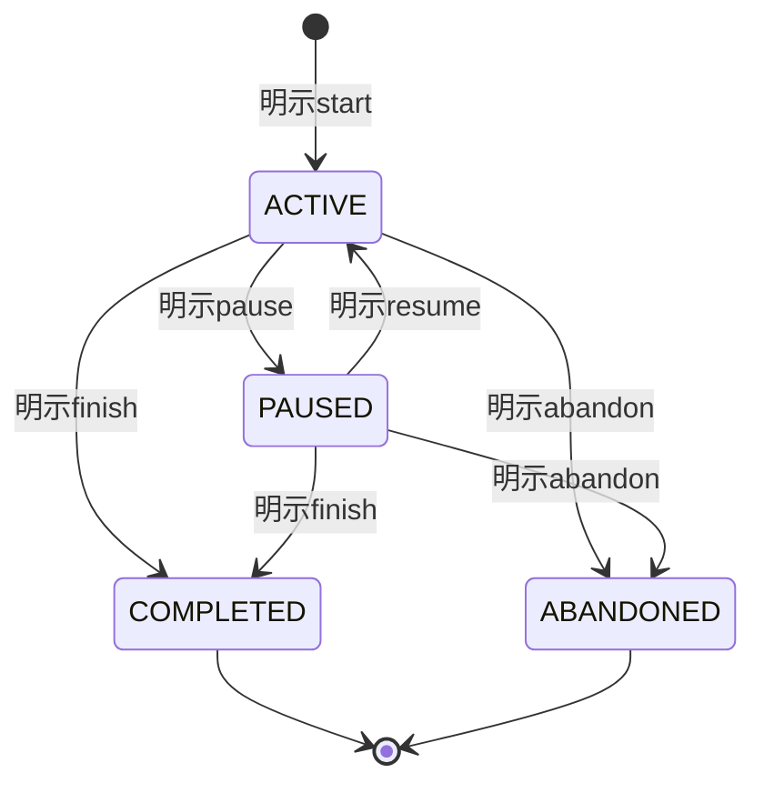

# AlgoLoom MVPスコープとCore契約（Core契約）

## ドキュメント概要

本書は、AlgoLoom Coreが共通して守るUX、データの権威、workspace、問題取得、local test、履歴、提出、保存、Securityの不変契約を定義します。

## 1. 用語

| 用語 | 本書での意味 |
|---|---|
| Core | AI、Cloud同期、外部Viewer等を設定しなくても成立する日常機能と共通契約。 |
| workspace | 編集中のsourceと問題directoryを置く、利用者が通常のfilesystem操作で管理できる作業領域。 |
| context | commandが処理対象とするworkspace、問題、sourceの組み合わせ。 |
| problem checkout | ある問題のsourceを編集する一つの物理directory。同じ問題に複数存在でき、移動・rename可能。 |
| source snapshot | ある時点の正確なsource bytesと、その由来や問題等を結び付けた不変記録。 |
| checkpoint | 利用者の明示操作によって提出前のsource snapshotを履歴へ残す節目。 |
| SolveAttempt | ある問題へ一度取り組む開始から終了までを表し、同じ問題の解き直しを別の試行として区別する学習記録。 |
| FocusInterval | SolveAttempt内でpauseを除いて能動的に取り組んだ一つの時間区間。 |
| learning milestone | 最初の公開sample通過、初回提出、初AC等、SolveAttempt内の意味ある到達点。 |
| submission operation | 外部送信前の耐久保存から、判定確定または状態不明からの回復までを表す提出操作記録。 |
| verdict observation | AtCoderから判定状態を取得した時刻付きの観測記録。 |
| 冪等性 | 同じ操作を再実行しても、重複や上書きによって既存データを壊さない性質。 |
| データの権威 | あるデータの正しい状態を最終的に決定する取得元または記録。 |
| LanguageProfile | 言語固有のtemplate、toolchain診断、build/run計画を提供し、他言語から独立した組み込み境界。 |
| HostPlatform | OS固有のprocess、path、terminal、file操作を閉じ込める境界。 |
| AtCoderSessionProvider | AtCoder認証用の可視専用browser、sessionの取得、secret storeへの保管をCoreと`JudgeAdapter`から分離する境界。 |
| optional Capability | Coreの安定した契約を利用して後から追加でき、未導入・失敗時にもCoreを変化させないAI reviewやCloud同期等の機能。 |
| 外部所有環境 | Editor、shell、plugin、toolchain、Provider runtime、OS設定等、AlgoLoomではなく利用者または外部toolが所有する永続状態。 |
| 外部学習資料 | AtCoder上の問題、解説、他ユーザーの提出code等、AlgoLoomが内容の権威・所有者にならず公式ページをbrowserで参照する資料。 |

## 2. 共通Core契約

### 2.1. 共通UX

1. Editor、問題種別、将来の教材ごとに別application相当のmodeを作らない。
2. 同じ意味の操作には同じ基本導線、出力構造、errorと回復方法を使う。
3. 同じcommand名を、対象ごとに異なる意味へ流用しない。
4. 内部のAdapter、Provider、Repository等を日常のCLIへ露出させない。
5. 任意機能が未設定でもCoreを利用できる。
6. 外部提出、source送信、削除等の作用は、利用者の明示操作なしに行わない。
7. 部分失敗時は、失敗より先に成功済みの事実と保持されたデータを示す。
8. 再実行で既存source、sample、metadata、履歴を壊さない。
9. CoreはAI review、Cloud同期等のoptional Capabilityの型、設定、SDK、保存状態へ依存しない。
10. optional CapabilityはCoreの安定したPortまたはquery契約へ一方向に依存できるが、失敗によってCoreの成功済み状態を変更しない。
11. ローカルで主目的を満たせる操作は、無関係なnetwork、保守処理、optional Capabilityを待たずに結果を返す。
12. 主目的に外部通信またはcode実行が必要な場合は、無期限に待たず、timeoutまたは取消後も完了済み状態と後続の確認方法を示す。
13. 履歴と時間を他者との順位付けや単一skill scoreへ変換せず、利用者自身の過去のSolveAttemptを振り返るために扱う。
14. 時間計測を利用しなくても、test、checkpoint、submit、履歴参照の意味と利用可否を変えない。
15. 中断して破棄できない処理を主目的の完了後へ分離する場合は、その入力、意図、後続確認に必要な状態を先に耐久保存し、process終了後も状態確認と安全な再試行を可能にする。中断して破棄できるのは、主目的とユーザーdataへ影響しない再取得可能な補助処理だけとする。
16. 外部学習資料は利用者の明示操作で公式ページをbrowser表示し、解説本文または他ユーザーのcodeをCoreへ取得、保存、再表示しない。
17. browser起動要求の成功をページload、login、閲覧、理解の成功とみなさず、browser起動失敗によってworkspace、SolveAttempt、test、提出、履歴の成功状態を変更しない。

### 2.2. データの権威

| データ | 権威 |
|---|---|
| 編集中のsource | workspace上の通常file |
| 問題IDと問題ページ | AtCoder |
| 公開sample | 取得時点のAtCoder。ローカルdataには取得元と取得時刻を持つ |
| submission ID、judge上の判定、judge execution time / memory | AtCoder |
| AtCoder上の解説と他ユーザーの提出code | AtCoder公式サイトと各コンテンツの権利者。AlgoLoom DBへ本文を保存しない |
| AlgoLoom導入後のsnapshotと操作履歴 | ローカルのAlgoLoom DB |
| SolveAttempt、FocusInterval、learning milestone | 利用者の明示操作とAlgoLoomが観測したCore eventを、安定IDと状態遷移を保って保存するローカルのAlgoLoom DB |
| credentialとsession | AlgoLoom DBではなく、credentialごとに定義したownerとsecret store。AtCoder sessionは利用者がbrowserで確立し、AlgoLoom namespaceのOS secret storeへ保存する |

履歴DBはworkspaceの代わりに現在のsourceを管理しない。workspaceの移動、rename、削除は、保存済み履歴の削除を意味しない。

### 2.3. workspaceとcontext

- workspaceと問題directoryは通常のfilesystem操作で移動、renameできる。
- 絶対pathとdirectory名を問題や履歴の恒久IDにしない。
- 問題directoryには、問題ID、judge、schema version等の宣言的metadataを置く。
- 現在directory、明示source、親directoryから安全に一意な場合だけcontextを推測する。
- 複数候補、欠損、矛盾がある場合は暗黙に一つを選ばない。
- context解決の失敗は、AtCoderへの提出前に検出する。
- `get`は選択された1言語のsourceだけを作り、全対応言語のtemplateを同じ問題directoryへ一括生成しない。
- 同じ問題を別言語で解く場合は別directoryを既定として推奨し、正規問題IDによって同一問題へ関連付ける。
- 同じ問題をfreshに解き直す場合も別のproblem checkoutを既定とし、directory名やsuffixではなく正規問題IDによって同一問題へ関連付ける。
- problem checkoutとSolveAttemptを同一概念または恒久的な1対1関係にせず、一つのcheckoutで複数のSolveAttemptを順次開始できるようにする。
- 利用者が同じdirectoryへ複数言語sourceを置くことは禁止しないが、候補が複数なら先頭file、更新時刻、hiddenなactive language等から暗黙に選ばない。
- sourceを明示した場合は、拡張子とprofile、問題contextの整合を検証し、外部作用前に対象sourceと言語を確認できるようにする。
- 編集中sourceの権威はEditor上の未保存bufferではなく、workspaceへ保存された通常fileとする。AlgoLoomはEditor APIやpluginから未保存内容を取得・推測しない。
- `.vscode`、`.idea`等のEditor固有fileをCoreの利用条件として生成・要求せず、問題metadata、source候補、実行commandとして解釈しない。
- workspaceの移動・renameを特定のEditor APIやfile watcherで追跡せず、各command開始時に現在のfilesystemとmetadataからcontextを再検証する。
- Core互換性と公式連携を分離する。Editor / Viewer Adapterや将来のpluginが未導入・失敗でも、通常fileとCLIによるCore操作を停止させない。

metadata fileの名称と形式、探索上限、明示option名は機能設計で決める。

### 2.4. 設定と実行commandの信頼境界

#### 組み込みprofileと設定データ

- C++、Python、Go、Rustの標準template、toolchain診断、build/run計画はAlgoLoom組み込み`LanguageProfile`として提供する。
- 各profileは共通契約へ依存できるが、別言語の個別profileへ依存しない。
- canonical language IDをcompiler executable名、local version、AtCoder上の提出言語IDから分離する。
- MVPの初期保証は単一sourceと標準toolchainとし、workspace内のCargo、Go module、CMake等を自動検出して任意project buildを実行しない。
- 問題metadataは実行command、credential、endpointを含まない。
- workspace内の設定から、LLM、Cloud、AtCoder session、外部endpointを上書きできないようにする。
- MVPでは、workspaceが任意のcompile/run commandを定義する機能を提供しない。
- 利用者自身のuser-level設定による実行fileや引数の変更を将来許可する場合も、workspace設定とは信頼境界を分ける。

#### User preference契約

- Coreはuser preferenceの作成や設定fileの手編集を利用開始条件にせず、製品既定値だけで成立するcanonicalな導線を持つ。
- 永続的なuser preferenceは、表示、反復入力の既定値、AlgoLoomが利用する既存外部toolの参照と一時的な呼出方法等、Coreの意味を変えない端末所有の差分として扱う。外部tool本体の設定変更命令をuser preferenceとして扱わず、履歴DB、共有DB、exportへ端末固有設定を混入させない。
- 同じ値を明示指定できる機能では、commandごとの明示指定、user-level preference、製品既定値の順に解決する。workspace metadataを汎用的な設定上書き層として扱わない。
- preferenceは可能な限り列挙値、範囲付き数値、argv等の型付きdataとして検証し、raw shell文字列、任意code、内部class名等の実装詳細を設定契約にしない。
- commandの意味、状態遷移、データの権威、snapshotの不変性、冪等性、error分類、安全性、privacy、外部作用への同意をuser preferenceで変更できないようにする。表示設定によっても、保持されたdata、外部作用、状態不明等の重要な事実を隠さない。
- credential、session、API key等のsecretはuser preferenceから分離し、適切なcredential ownerまたはsecret storeに保持させる。
- 任意Capabilityまたは特定Adapterの設定が不正、未対応、migration不能であっても、影響をその機能へ局所化し、無関係なCore操作を停止させない。安全性または外部作用を確定できない設定は、影響する操作だけをfail closedにする。
- 設定はversion付きSchemaとして検証し、利用者が明示した差分を中心に保持する。新しい項目の追加時は既存設定をそのまま有効とし、省略された新項目へ安全な製品既定値を適用する。
- 実際に解決した値、値の由来、無視または拒否した設定を秘密情報なしで診断できるようにし、設定を無視したcanonicalな状態で問題を切り分けられる回復経路を用意する。

#### 外部所有環境への書き込み境界

通常commandは、AlgoLoom所有領域と、そのcommandで利用者が明示したworkspace上の対象以外へ、永続的な設定変更を書き込まない。

| 境界 | 許可する操作 | 禁止する操作 |
|---|---|---|
| AlgoLoomのconfig、DB、cache、temp | Schemaとcommand契約に沿った作成、更新、migration、削除 | 外部toolの設定をAlgoLoom所有dataへ複製して管理する |
| 利用者が明示したworkspace | `get`等が予告したfile作成、metadata・sample保存 | 既存sourceの無断上書き、Editor・shell・toolchain設定の配置 |
| Editor、shell、plugin、toolchain、OS設定 | read-onlyな検出、version診断、安全なargvによる既存toolの一時起動 | install、update、削除、設定file編集、plugin追加、永続的な`PATH`・環境変数変更 |
| Provider runtime、model、外部認証cache | 公式interfaceへの接続、read-only診断 | lifecycle操作、model download、認証cacheの読取・複製・変更 |
| OS keyring等のsecret store | 明示操作によるAlgoLoom namespaceの項目参照・保存・削除 | 他applicationや外部runtimeが所有する項目の変更 |

AtCoder認証だけは[AtCoder認証設計](atcoder-authentication.md)で定義した限定例外とする。`AtCoderSessionProvider`は利用者の明示操作中に空の専用browser profileを作成し、そのprofileから`REVEL_SESSION`だけをAlgoLoom namespaceのsecret storeへ移せる。既存browser profileまたは他applicationの認証cacheにはこの例外を適用しない。

- child processへ渡すargv、読み取り専用option、working directory、必要最小限の環境変数は、そのprocessだけの一時的な実行条件として構成し、hostの設定へ永続化しない。
- alias、completion、Editor最適化等の導入支援は、外部設定fileを直接編集するより、設定断片、差分、利用者が実行できる手順を生成する方法を優先する。
- 外部設定を変更する将来のsetup helperを検討する場合は、通常commandから分離し、対象pathと差分の事前表示、backup、冪等性、rollbackを契約化する。これらを保証できなければ実行しない。

#### process起動

- `LanguageProfile`はshell文字列ではなくargv、working directory、source、artifact、timeout区分等からなるBuildPlan / RunPlanを返す。
- processは`HostPlatform`境界を介してargv配列で起動し、source path等をshell文字列へ連結しない。
- 通常の子processへAtCoder sessionや不要な環境変数を渡さない。専用の`AtCoderSessionProvider`でもsessionを`argv`または環境変数へ渡さず、process間の受け渡しを認証操作中の限定されたchannelへ閉じる。
- process tree終了、path、terminal、file操作のOS差異を各commandまたは個別language profileへ重複させない。
- native macOS、native Linux、native Windowsでsuccess、compile error、runtime error、timeout、出力量超過、取消等を共通分類へ正規化する。

これにより、取得元不明のworkspaceを開いただけで任意commandが実行される状態を避ける。

### 2.5. 通信とoffline動作

#### 操作ごとの通信要否

- `get`、`submit`、判定確認等、目的上必要な操作だけがAtCoderへ通信する。
- `test`、checkpoint、履歴一覧、source表示、差分、exportはCloudやAtCoderを必要としない。

#### 自動通信

- 自動telemetry、利用統計送信、crash report送信は行わない。
- MVPのCoreは自動Cloud同期を行わない。MVP後に利用者が明示的に同期を有効化した場合の時間上限付きpushはoptional Capabilityの契約とし、Coreの成功条件や通常の読み取り経路へ含めない。
- 自動update確認を導入する場合はMVP後の明示的なprivacy判断とし、Coreの起動条件にしない。

#### 通信error

- network errorを履歴保存失敗やlocal test失敗と混同しない。

### 2.6. 出力とerror

- 通常出力と診断出力を分離し、scriptから利用する将来性を壊さない。
- success、利用者入力error、環境error、外部サービスerror、状態不明を区別する。
- terminalへ出す外部文字列とユーザーcodeは制御文字を無害化する。
- timeout後にprocess、提出、判定、履歴がどの状態かを示す。
- 内部詳細を通常表示から省略する場合も、利用者の目的、保持されたdata、外部作用、再実行の安全性に影響する事実は省略しない。
- module名、stack trace、raw HTTP response、Provider固有error等は通常表示から分離し、利用者がSubsystemを判別しなくても次の行動を選べる表現にする。
- 詳細な内部traceは既定で表示せず、秘密情報を除いた診断経路から確認できるようにする。

exit codeとmachine-readable出力の詳細は機能設計で決める。

---

## 3. 問題取得契約

### 3.1. 取得対象

- 利用者が一件ずつ明示したAtCoderの正規問題IDまたは公式問題URLだけを取得する。
- 問題本文、画像、解説、hidden testをAlgoLoomの配布物へ含めない。
- local test用に、問題ページで公開されているsample入出力だけを取得する。
- 一括crawlとbackground crawlを行わない。

### 3.2. 冪等性と部分失敗

- 同じ問題を同じ場所で再取得しても、利用者が編集したsourceを上書きしない。
- 既存sampleとmetadataは、由来と内容を確認してから安全に再利用または更新する。
- directory作成、metadata保存、sample取得、template作成の完了段階を識別できる。
- 途中失敗後の再実行で、重複fileや破損したcontextを増やさない。
- 同じ問題の別directoryが存在しても、自動mergeまたは削除しない。
- `get`の主結果は整合したworkspace、metadata、sample、template、ユーザーDBの開始問題とし、公式問題ページのbrowser表示は失敗しても主結果を無効にしない補助動作とする。

### 3.3. 解き直し用problem checkout

- 同じ問題の解き直しは新しいSolveAttemptとして保存し、前回の時刻、duration、milestone、snapshot、submissionを上書きしない。
- freshな解き直しでは、既存sourceを変更せず、同じ正規問題IDを持つ新しいsibling checkoutへ組み込みtemplateを作ることを既定とする。
- `abc300_a--02`等の生成名と表示上のordinalは利用者の便宜に限定し、問題またはSolveAttemptの恒久IDにしない。
- 検証済みのlocal sampleを再利用できる場合は不要なnetwork取得を避ける。MVPでは可搬性を優先し、新しいcheckoutの`test/`へ安全にcopyできるが、symlinkまたはhard linkを既定にしない。
- snapshotから開始する場合は、利用者自身が明示した不変snapshotだけを新しいcheckoutへmaterializeし、元snapshotを変更しない。
- 他ユーザーのcodeまたは外部解説のsample codeを解き直しの開始元としてimportしない。
- activeまたはpausedなSolveAttemptが存在する場合、暗黙にpause、finish、abandon、mergeせず、既存状態と選択肢を示す。
- directory作成、metadata、sample、template、SolveAttempt保存の完了段階を識別し、同じ操作の再実行で重複checkoutまたは重複attemptを作らない。

詳細は[解き直しworkflow設計](../features/revisit-workflow.md)を正とする。

### 3.4. 外部学習資料への参照

- MVPでは、公式問題ページとAtCoder問題別解説ページを、利用者の明示操作または`get`の補助動作としてdefault browserで開けるようにする。
- 他ユーザーの提出一覧への導線はMVP後の近接拡張とし、current problem、AC、current language等のfilterをAtCoder公式ページへ渡すだけにする。
- 外部資料のHTML、本文、画像、PDF、動画、sample code、他ユーザーのcode・author・submission IDをAlgoLoom processへ取得してDB、cache、temp、log、telemetry、export、Cloud同期へ保存しない。
- 問題別解説ページに公式解説とユーザー解説が併記される場合があるため、AlgoLoomは「公式解説を取得した」と表示せず、「AtCoderの解説ページを開く」と表示する。
- spoiler-sensitiveな資料は、終了済み問題であることを確認し、current SolveAttemptが未ACなら利用者の明示確認後にだけ開く。non-interactive実行では明示optionなしに開かない。
- 開催中または終了状態を確認できない場合はspoiler-sensitiveな資料を開かない。参加中のvirtual contestやADT等を完全に推測できない限界を初回案内とhelpへ示す。
- 外部学習資料を開く`BrowserLauncher`はbrowser Cookie、profile、login情報を読取・複製せず、AtCoder認証をbrowserへ委譲する。認証専用browserを扱う`AtCoderSessionProvider`とは同じ境界にしない。
- browser起動要求が成功しても、ページload、login、資料の存在、閲覧完了をAlgoLoomから断定しない。
- URL構成またはbrowser起動に失敗しても、問題context、workspace、SolveAttempt、test、提出、履歴を変更しない。

詳細は[外部学習資料参照設計](../features/external-learning-resources.md)を正とする。

---

## 4. local test契約

### 4.1. testが保証すること

MVPの`test`が保証するのは、**取得済みの公開sampleに対するlocal実行結果**である。

- sample一致をAtCoderでのACまたはcode全体の正しさと表現しない。
- compile、各sample実行、比較を区別して表示する。
- compile時間とsampleごとのlocal run時間を、単位と対象を明示して表示する。
- どのsampleが、どの理由で失敗したかを確認できる。
- timeout、出力量超過、signal終了、compile error、実行errorを誤って不一致と表示しない。
- 実行順序と結果表示順序を安定させる。

空白、改行、浮動小数、special judge等の比較方式は機能設計で明示する。MVPでAtCoderのjudgeを再現できない形式は、近似判定であることを表示するか、未対応として停止する。

### 4.2. 実行安全性

- MVPでは本人が書いたcodeだけを実行対象とする。
- compileと実行に個別のtimeoutを持つ。
- stdout、stderr、生成file、process数等へ妥当な上限を設ける。
- timeout時は子processを含めて終了できるよう、対応OSごとのprocess管理を検証する。
- 4言語×3 OSの正式保証matrixで代表的なbuild/runを確認し、詳細なprocess障害は各`HostPlatform`の契約テストで検証する。
- 強いsandboxはMVPの必須条件にしないが、未信頼codeを対象へ加える前に再設計する。

### 4.3. local実行計測

local実行計測は、利用者が実装の極端な遅さや性能変化へ気付くための参考値であり、AtCoder judge環境の再現または精密benchmarkを保証するものではない。

| 観測値 | MVPでの扱い | 保存 | 注意 |
|---|---|---|---|
| compile duration | build processの開始から終了までを表示 | 全build eventは保存しない | cache導入後はcache hitと実測を区別する |
| local run duration | 公開sampleごとのprocess durationを表示 | 全local test eventは保存しない | OS、負荷、runtime、入力規模に依存する |
| local peak memory | MVP後にOSごとの取得範囲と意味を検証して段階導入 | MVPでは保存しない | 単に「使用memory」と表示せず、peak RSS等の意味と計測範囲を示す |
| judge execution time / memory | AtCoderが返した場合だけ提出の観測として扱う | nullableなsubmission / verdict観測として保存する | local値と同一条件の値として比較しない |

- local durationは、可能な限りwall clock変更の影響を受けないmonotonic clockで測る。
- 表示精度は計測分解能と実際のばらつきを超えて細かく見せず、極端に短い処理を精密な性能差として評価させない。
- local peak memoryを追加する場合は、値、単位、計測対象processの範囲、計測方法、HostPlatform、toolchain observationを関連付け、取得不能を`0`として保存しない。
- 計測失敗または未対応はtest自体の失敗にせず、`unavailable`と理由を表示する。ただしtimeoutやmemory limit exceeded等、実行結果そのものは通常の失敗分類として扱う。
- localとjudgeの観測値を、言語間、OS間、利用者間のrankまたは単一scoreへ変換しない。

---

## 5. 学習履歴契約

### 5.1. MVPで保存する履歴

MVPでは次を保存する。

1. 利用者が明示的に開始したSolveAttempt、FocusInterval、終了状態
2. SolveAttempt中にAlgoLoomが観測した最初の公開sample通過、初回提出、初ACのlearning milestone
3. 利用者が明示的に作成したcheckpoint
4. 提出操作前に耐久保存したsource snapshotと操作状態
5. AtCoderが受理したsubmission ID、問題、言語、アカウント、提出時刻
6. 判定確認で得た観測と最終判定、およびAtCoderが返した場合のjudge execution timeとjudge memory
7. source snapshot間の関係と、差分選択に必要なmetadata

MVPでは、Editorの保存、source変更、local testのたびにsource全文を自動保存しない。最初の公開sample通過は未終了のSolveAttemptのmilestoneとして一度だけ記録できるが、全local testの永続的なイベント履歴と自動checkpointは、利用者への価値とprivacyを検証した後の拡張とする。

したがってMVPの「学習履歴」は、AlgoLoom導入後の**明示的なSolveAttemptとcheckpoint、提出の軌跡、その試行中に観測した最小milestone**を意味する。端末上のすべての編集履歴やAtCoder上の全過去履歴を意味しない。

### 5.2. snapshotの不変条件

- snapshotは保存後にsource本文を上書きしない。
- 提出snapshotは、外部送信に使った正確なsource bytesを保持する。
- code hashはその正確なbytesから計算し、文字コードや改行を後から暗黙に正規化しない。
- 問題、judge、言語、作成理由、端末生成UTC時刻を記録する。
- AtCoder時刻と端末時刻を同一の意味で扱わない。
- source sizeへ上限を設け、上限超過時は提出前に説明して停止する。
- 同じ内容のsnapshotを内部で重複排除する場合も、利用者が作った履歴イベントを失わない。

### 5.3. checkpoint

- checkpointは利用者の明示操作でだけ作る。
- checkpoint作成は外部通信を行わない。
- checkpointを作らなくてもtestとsubmitを利用できる。
- 同じsourceに対する重複操作をどう見せるかは機能設計で決めるが、無断で別のsourceへ差し替えない。
- Editorのsaveはworkspace上の現在fileを更新する操作、checkpointは保存済みsourceを不変snapshotとして履歴へ追加する操作であり、同じ「一時保存」として扱わない。
- AlgoLoomはEditorの未保存bufferを取得、保存、復元しない。checkpoint対象はcommand開始時にworkspaceから読んだ保存済みsourceである。
- `pause --checkpoint`や`test --checkpoint`相当の複合導線を将来設ける場合も、利用者の明示optionとして扱い、pauseまたはtestだけで暗黙にsnapshotを作らない。

MVP後の自動checkpointはopt-inとし、常駐daemonや短い時間間隔による監視より、AlgoLoomが観測できるeventを候補にする。

| 候補event | 扱い |
|---|---|
| 明示pause | opt-in時だけcheckpointを作る候補。pauseの時間状態保存をcheckpoint失敗に巻き込まない |
| 明示test | `test --checkpoint`相当、または利用者が有効化した場合だけ候補にする |
| 最初の全公開sample通過 | 学習上意味のある節目だが、milestoneとsnapshotを別recordとして扱う |
| 提出直前 | 自動checkpointではなく、提出契約上の必須submission snapshotを作る |

自動checkpointを採用する前に、保存対象、保持期間、容量上限、同一内容の重複表示、無効化、export・同期範囲を定義する。内容hashによる内部重複排除を行っても、利用者に見せるeventの意味を失わず、workspaceのsourceを変更しない。

### 5.4. 履歴表示と差分

- 履歴はnetworkを待たずにローカルDBから表示する。
- checkpoint、提出待ち、提出済み、判定待ち、最終判定を混同しない。
- `show`は保存済みsnapshotを読み取り専用の内容として表示する。
- `diff`は比較対象を利用者が確認できるようにし、暗黙の「最良版」を作らない。
- 初回提出と最新AC等の便利な既定値を設けても、比較対象を明示できるようにする。

### 5.5. 既存履歴と削除

- MVPはAtCoder上の既存提出を自動importしない。
- 履歴の説明では「AlgoLoomで記録した履歴」と明記する。
- workspaceやsource fileの削除を、履歴DBの削除として扱わない。
- MVPでは個別履歴の同期削除やtombstoneを扱わない。
- 履歴削除機能を追加するときは、export、影響確認、復旧可能性を先に設計する。

### 5.6. SolveAttemptと学習時間

時間計測は、利用者が明示的に開始したSolveAttemptに対してだけ行う。`get`、最初の`test`、Editorでのfile保存を暗黙の開始時刻にしない。問題を取得して後日解く場合や、考察だけを行う時間を誤って扱わないためである。



状態名とcommand名は機能設計で変更できるが、少なくともactive、paused、completed、abandonedを混同しない。別の問題または同じ問題の新しいSolveAttemptを開始するとき、既存のactiveまたはpausedな試行を暗黙にpause、終了、mergeしない。

#### 保存する時刻とduration

| 値 | 意味 | 注意 |
|---|---|---|
| `started_at` / `ended_at` | 端末が記録したUTCの時点 | AtCoder時刻と同一視しない |
| FocusInterval | startまたはresumeからpause、finish等までの区間 | pause中を能動時間へ含めない |
| `active_duration` | 妥当なFocusIntervalの合計 | wall clockの単純な開始・終了差と区別する |
| milestone時のactive duration | その到達点までに確定した能動時間 | 後から試行全体が延びても上書きしない |
| process duration | compile、run、polling等の機械処理時間 | 人間の学習時間、judge実行時間と混同しない |

- 現在時刻の後退、極端な飛躍、欠損したinterval等を検出した場合、負の値や推測値で補正せず、影響するdurationを不確実または算出不能として表示する。
- start、pause、resume、finishは、同じ操作の再実行でFocusIntervalを重複作成しない。
- 常駐daemon、Editor plugin、file watcherをMVPの計測条件にしない。状態は各明示操作で耐久保存し、process終了後も再開・終了できるようにする。
- 時間計測はsource snapshotの自動保存を意味しない。codeを残す境界はcheckpointと提出snapshotの契約を維持する。

#### 経過時間の表示

MVPでは、active durationを継続的に再描画するtimerを通常画面へ常駐させない。明示的な`status`相当を正規の確認経路とし、`test`、checkpoint等の意味ある操作では、activeなSolveAttemptがある場合だけ短い補助表示を行える。

```text
Attempt: active
Active:  23 min
Started: 2026-07-20 14:05 JST
```

- 通常表示は秒単位で増え続ける精密値を強調せず、表示精度と丸めを一貫させる。
- `active duration`、中断を含む`wall elapsed`、local process duration、judge execution timeをラベルで区別する。
- 時間計測を開始していない場合、各`test`で開始を繰り返し促したり、未計測をerrorまたは不完全な履歴として扱ったりしない。
- 将来の`status --watch`、shell prompt、Editor連携は明示的な長時間表示またはmachine-readable出力の利用者としてCoreから分離し、常駐daemonをCore要件にしない。

#### learning milestone

| milestone | 記録条件 | 時間の基準 |
|---|---|---|
| 最初の公開sample通過 | currentかつ未終了のSolveAttemptに関連するlocal testで、取得済み公開sampleが初めてすべて一致した | そのlocal test完了時点までに確定したactive duration |
| 初回提出 | currentかつ未終了のSolveAttemptに関連するsubmission IDをAtCoderから初めて取得した | 送信開始前に耐久保存した時点のactive duration |
| 初AC | SolveAttemptに関連する提出の最終判定として最初のACを観測した | ACした提出の送信開始時に保存したactive duration。判定polling時間を加えない |

- sample通過とACを同じmilestoneとして扱わない。
- 初回提出のmilestoneに使うactive durationは送信開始前に提出操作へ保存し、通信断の後でsubmission IDを回復した場合も、回復時刻へ置き換えない。
- 初ACのmilestoneを記録しても、FocusIntervalを過去へさかのぼって暗黙に改変しない。ACした提出までのdurationは提出時に保存した値を使い、遅い判定確認によって増やさない。初AC確認時にSolveAttemptを自動終了するかは機能設計で決める。
- submit、判定確認、DB保存が部分失敗した場合も、確定済みmilestoneを黙って削除または別の試行へ付け替えない。
- 同じ問題を解き直す場合は新しいSolveAttemptを作り、前回の開始時刻とdurationを上書きしない。
- hint、解説、外部提出一覧、AI利用等の追加文脈は将来のopt-in記録にできるが、外部本文を保存せず、browser起動と実際の閲覧・理解を混同せず、利用有無を善悪、順位、公開scoreへ変換しない。

履歴表示ではwall elapsed、active duration、process duration、judge execution timeを同じ「実行時間」として表示しない。時間を比較する場合は利用者自身が選んだSolveAttemptを中心とし、他者平均との差や利用者間rankをCoreの既定表示にしない。

---

## 6. 提出契約

### 6.1. 原則

AtCoderへの送信とローカルDBのcommitは、一つの原子的transactionにはできない。したがって`submit`を一回の関数呼び出しではなく、回復可能な状態遷移として扱う。

外部送信前に、少なくとも次をローカルへ耐久保存する。

- 一意なoperation ID
- 正規問題IDとjudge
- AtCoder account identity
- 言語
- 提出時に解決したjudge固有の言語ID、表示名、処理系・version
- 送信する正確なsource snapshotとcode hash
- 作成時刻
- 現在のoperation state

提出は空の可視専用browserへ準備し、利用者がsourceを目視してTurnstileと最後の提出操作を行う。AlgoLoomは最後の操作を自動化せず、このbrowser経路が成立しない場合にsessionを使った直接HTTP POSTへfallbackしない。

### 6.2. 状態遷移

状態名は実装設計で変更できるが、意味として次を区別する。

```text
PREPARED
  ├─ 外部送信前に失敗 ─→ FAILED_BEFORE_SEND
  └─ 送信開始 ─→ SEND_STARTED
                    ├─ submission ID取得 ─→ REMOTE_ACCEPTED
                    │                          └─ VERDICT_PENDING
                    │                                └─ FINAL
                    └─ 応答不明 ─→ REMOTE_STATUS_UNKNOWN
```

| 状態 | 意味 | 許される次の行動 |
|---|---|---|
| `PREPARED` | sourceと提出意図は保存済み。外部送信は未開始 | 送信開始または安全な取消 |
| `FAILED_BEFORE_SEND` | 外部へ送られていないことを確認できる失敗 | 原因修正後に新しい明示操作 |
| `SEND_STARTED` | 外部へ到達した可能性がある | 結果確認。無条件再送は禁止 |
| `REMOTE_ACCEPTED` | submission IDを取得済み | そのIDの判定確認 |
| `VERDICT_PENDING` | AtCoderで判定中 | 後から同じIDを再確認 |
| `FINAL` | 最終判定を取得済み | 履歴参照、差分、明示的な次の提出 |
| `REMOTE_STATUS_UNKNOWN` | 送信されたか安全に断定できない | 最近の提出または公式画面を確認。自動再送は禁止 |

### 6.3. 冪等性と再実行

- AlgoLoom独自のoperation IDをAtCoderのidempotency keyと誤認しない。
- submission ID取得後は、同じ操作の再実行でcodeを再提出しない。
- 判定pollingのtimeoutは提出失敗を意味しない。
- `REMOTE_STATUS_UNKNOWN`では、account、問題、時刻等から安全に候補を確認する。
- 一意に復元できない場合はAtCoderの公式提出一覧を案内し、利用者の確認なしに履歴へ結び付けない。
- 「AtCoder提出」「ローカル保存」「判定確認」を別の結果として表示する。

### 6.4. verdictの保存

- 判定確認で得た状態は、取得時刻を持つ観測として扱う。
- AtCoderがexecution timeまたはmemoryを返した場合は、単位を正規化したnullableな観測として、取得元と取得時刻を伴って保存する。
- judge値が欠損している、形式を安全に解釈できない、または取得できない場合、`0`や推測値で補わず、判定の保存自体は継続する。
- Judge Adapterのraw HTML、stdout、stderr、表示文字列をそのまま業務Schemaにせず、値、単位、取得状態を共通型へ正規化する。
- pendingから最終判定への進行を、source snapshotの上書きとして実装しない。
- 最終判定を得た後に外部状態との差異を検出した場合、履歴を黙って書き換えず再照合の事実を記録する。
- AtCoderへ確認できないとき、推測した判定を保存しない。

### 6.5. AtCoderアカウント

- MVPは一つのAtCoderアカウントを使用する。
- 初回または失効時は`AtCoderSessionProvider`が可視の専用browserを明示操作で起動し、利用者がusername、password、Turnstileを手動で操作する。
- `AtCoderSessionProvider`は利用者の既存browser profileを参照せず、`https://atcoder.jp`の`REVEL_SESSION`だけをOSのsecret storeへ保存する。
- CoreとCLIへ生のCookie値を返さず、AtCoder Adapterには不透明なsession参照または認証済みHTTP clientをaccount確認等の必要な通信中だけ貸し出す。可視browserで利用者が行う最後の提出操作を、sessionを使った直接HTTP POSTへ置き換えない。
- 手動Cookie importは技術検証の方式Cだけに限定し、MVPの通常導線、CI、共有環境または非対話実行へ提供しない。
- 提出準備前と最後の提出操作前に、現在のsessionがどのアカウントか確認できなければならない。
- 初回提出時にaccount identityをローカルへ関連付ける。
- 以前と異なるアカウントを検出した場合は、送信前に停止して説明する。
- Cookie、password、session tokenを履歴DB、export、logへ保存しない。
- secret storeを利用できない場合は平文設定fileへ自動fallbackせず、提出だけを停止する。
- 複数アカウント対応は、履歴の分離と切替UXを設計した後の拡張とする。

session取得、保管、更新、失効とbrowserの安全条件は[AtCoder認証設計](atcoder-authentication.md)を正とする。

### 6.6. AtCoderのAI学習拒否設定の案内

AtCoderは2026年8月以降、拒否設定が反映されていない提出sourceをAI学習用データの販売対象とする方針を公開している。

- AlgoLoomで初めて提出補助を使う前に、一度だけ簡潔な非blocking案内を表示する。
- [AtCoder公式の説明](https://info.atcoder.jp/overview/about/ai-training-opt-out)と設定先へ案内する。
- AlgoLoomは拒否設定を代行、推測、保証しない。
- 案内を読まないことを理由に、通常の提出を恒常的に妨げない。
- AtCoderの方針変更に備え、案内文とURLをリリース前に再確認する。

---

## 7. 保存、migration、export契約

### 7.1. ローカル保存

- MVPはPython標準`sqlite3`によるローカルSQLiteを既定かつ唯一の履歴保存方式とする。
- Turso SDK、Cloud account、Cloud credentialを基本packageの依存にしない。
- 1回の業務操作に必要なDB更新は明示transactionでcommitまたはrollbackする。
- foreign key、unique constraint、schema versionを有効にする。
- DB lock、disk full、破損、migration失敗を外部提出失敗と区別する。

### 7.2. migration

- schema versionをDB内に記録する。
- migration前に、少なくとも復旧可能なローカル退避を作る。
- migration失敗時に旧Schemaを破壊したまま通常起動しない。
- 新しいCLIが未知の将来Schemaを勝手にdowngradeしない。
- migrationと回復の契約テストをMVPに含める。

### 7.3. export

- MVPは、人間が保存先を選べる明示的なexportを提供する。
- exportにはformat version、作成時刻、AlgoLoom versionを含める。
- 問題、SolveAttempt、FocusInterval、learning milestone、checkpoint、submission、verdict、source snapshotと関連付けを欠損なく含める。
- AtCoderの解説本文、画像、PDF、動画、他ユーザーのcode・author・submission ID等、外部参照先の本文・個別識別情報をexportへ含めない。
- Cookie、token、password、環境変数、不要な絶対pathを含めない。
- export作成中のDB更新によって不整合な組み合わせを出力しない。
- exportを新しいDBへ自動restoreする機能はMVP対象外だが、形式を文書化し、sourceをAlgoLoomなしでも回収できるようにする。

この`export`は、学習履歴を欠損なく持ち出す私的な可搬性・退避を目的とし、公開用にdataを最小化した成果物ではない。GitHub等へそのまま公開することを安全な標準導線として案内しない。自分のsourceだけをallowlist方式でlocalへ切り出す公開候補bundleはMVP後の別機能候補とし、GitHub認証、repository作成、commit、push、visibility変更をCoreまたは`export`へ追加しない。詳細は[公開用solution bundle将来設計](../features/public-solution-bundle-design.md)を参照する。

自動backup、世代管理、Cloudへの暗号化backup、完全なrestore UXはMVP後とする。

---

## 8. 内部境界

MVPでは、将来の全機能を先回りした抽象化を作らない。一方、変更可能性と障害境界が明確な箇所は分離する。

最低限、次の責任を直接結合しない。

| 境界 | 責任 |
|---|---|
| CLI / Application | 入力と表示を、業務状態遷移から分ける |
| `JudgeAdapter` | 問題取得、認証確認、可視browserへの提出準備、提出ID・判定確認をAtCoder固有処理へ閉じ込める。人による最後の提出操作は代行しない |
| `AtCoderSessionProvider` | 可視専用browserによる認証、必要なsessionだけの取得、secret storeへの保存を、Coreと`JudgeAdapter`から分ける |
| `ReferenceLinkProvider` | judge固有の問題、解説、提出一覧URLの構成をCore commandから分け、外部本文を取得しない |
| `BrowserLauncher` | OSへのURL起動要求をページ取得・login・表示完了から分ける |
| `HistoryStore` | transaction、SolveAttempt、FocusInterval、milestone、snapshot、提出操作、queryをSQLite詳細から分ける |
| `LanguageProfile` | template、toolchain診断、BuildPlan / RunPlanを言語ごとに閉じ込め、他言語へ波及させない |
| `HostPlatform` / `ProcessRunner` | compileと実行、timeout、出力上限、process tree終了、path等をOS差分から分ける |
| workspace context | path探索とmetadata検証を各commandへ重複させない |

Cloud同期を実装しないMVPで、`SyncCoordinator`や同期状態を日常のDomainへ持ち込まない。将来Adapterを追加できるよう、SQLite固有処理をCLIから直接呼ばないことで十分とする。

AI reviewを実装しないMVPで、Provider、prompt、review設定、review状態をCoreのsubmission、snapshot、verdictへ持ち込まない。将来AI reviewを追加する場合は、Coreの安定したsnapshot・verdict・diff queryへ一方向に依存し、review revisionを別の追記型recordとして保存する。Coreの提出ServiceからReview Backendを呼び出さず、review拒否・失敗・timeout・response不正が提出、test、履歴の成功状態を変更しない。

学習データAPIやWeb dashboardを実装しないMVPで、HTTP、OAuth、API scope、dashboard固有fieldをCoreの履歴recordへ持ち込まない。将来追加する場合は、Coreの安定したqueryからversion付きRead Modelを構成し、SQLite tableや内部Schemaを外部契約として直接公開しない。公式dashboard、local data access、Hosted APIのいずれもCoreの履歴の意味を変更せず、一方向に依存する。詳細は[学習データアクセス・可視化API将来設計](../features/learning-data-access-api-design.md)を参照する。

個別language profile、個別HostPlatform Adapter、Editor / IDE非依存境界、Editor / Viewer公式連携、optional Capabilityの依存規則と契約テストは[言語・実行環境の可搬性設計](language-and-platform-portability.md)を参照する。

---

## 9. PrivacyとSecurityのMVP基準

### 9.1. telemetryとsecret

- 自動telemetryを送信しない。
- source、履歴、path、ユーザー名をcrash reportへ自動送信しない。
- secretをworkspace、履歴DB、export、debug logへ保存しない。

### 9.2. fileとterminal

- file permission、atomic write、安全な一時file、path traversal対策を実装する。
- 外部文字列、compiler出力、ユーザーcodeをterminalへ出す前に制御文字を扱う。

### 9.3. 外部通信

- 問題取得と提出にrequest timeout、上限付きretry、適切な間隔を持たせる。
- hidden test取得、一括crawl、CAPTCHA回避、session共有を実装しない。

### 9.4. code実行

- 自作codeのみを前提とするMVPでも、timeoutと出力量上限を省略しない。

セキュリティ対策が主要導線を妨げる場合でも、無効化して通すのではなく、原因と安全な回復方法を設計する。

---
