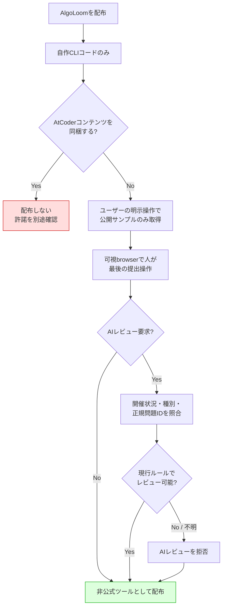
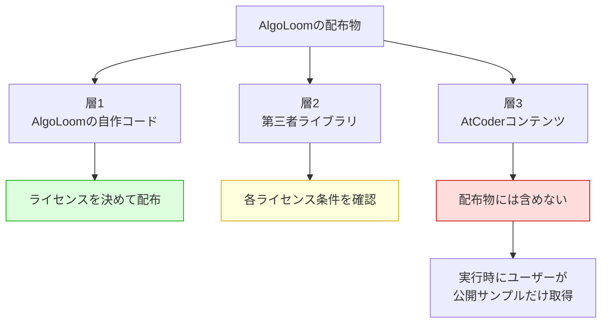
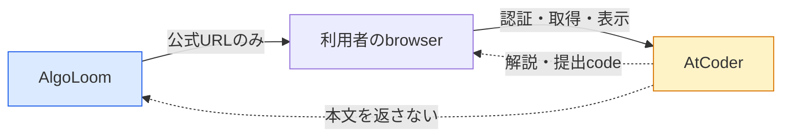
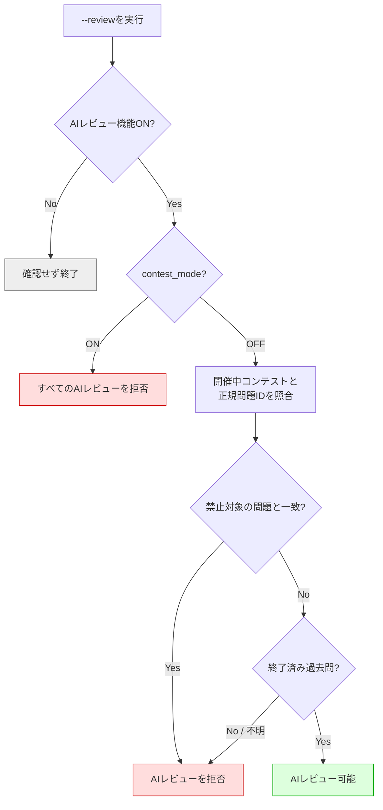
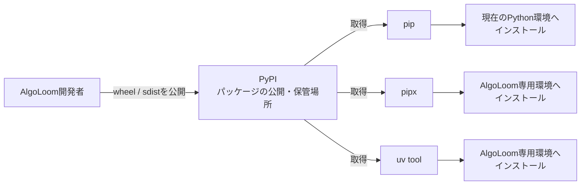
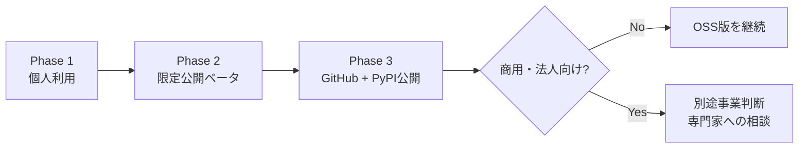

# AlgoLoom 配布方針ガイド

> 対象: AtCoder学習用ローカルCLI「AlgoLoom」の公開・配布
>
> 主な機能: 公開サンプル入出力の取得、ローカルテスト、ユーザー操作による提出、履歴保存、公式問題・解説ページへのbrowser参照、ユーザーが選択したLLM ProviderによるAIレビュー
>
> 関連文書:
> - [MVPスコープ](../product/mvp.md)
> - [Core契約](../architecture/core-contracts.md)
> - [AtCoder認証設計](../architecture/atcoder-authentication.md)
> - [AtCoder公開情報に基づく配布判断記録](../project/atcoder-public-policy-review.md)
> - [言語・実行環境の可搬性設計](../architecture/language-and-platform-portability.md)
> - [AlgoLoom LLM Provider選択・実行基盤設計](../features/llm-provider-design.md)
> - [外部学習資料参照設計](../features/external-learning-resources.md)
> - [解き直しworkflow設計](../features/revisit-workflow.md)
>
> 作成日: 2026年7月15日
>
> 更新日: 2026年8月24日
>
> 重要: 本文書は法的助言ではなく、公開情報に基づく設計・配布上の判断材料である。規約やコンテストルールは変更されるため、実装開始、限定公開Beta、各releaseの前に最新版を確認し、商用・法人用途等では必要に応じて法律の専門家へ相談すること。

---

## ドキュメント概要

本書は、AlgoLoomを非公式CLIとして公開・配布するためのAtCoderコンテンツ、アクセス、提出、AIレビュー、認証、privacy、package、表示に関する判断と確認事項を定義します。

## 0. 結論

AlgoLoomは、次の条件を守ることで、**AtCoderの非公式な補助CLIとして配布することが現実的**である。

### AtCoderコンテンツの取得

- AtCoderの問題文、画像、公開サンプル入出力を配布物へ同梱しない。
- ユーザーが指定した問題だけを、ユーザー自身の操作で取得する。
- 取得対象は問題ページで公開されているサンプル入出力に限定する。
- 隠しシステムテストの取得、一括クロール、Bot対策の回避を実装しない。

### 提出

- 提出にはユーザー自身のAtCoderアカウントとセッションを使う。
- 空の可視専用browserで、利用者がlogin、Turnstile、最後の提出操作を行う。成立しない場合に直接HTTP POSTへfallbackしない。

### AIレビュー

- AIレビュー要求時に開催状況・コンテスト種別・正規問題IDを照合し、禁止対象の開催中問題では機能的に拒否する。
- AIレビュー機能OFFと、参加中に全AI機能を止める`contest_mode`を用意する。
- AIレビューを拒否しても、AIを使わないローカルテストや通常の提出までは一律に停止しない。

### アクセス・表示・同期

- リクエスト間隔、再試行、提出確認などの安全策を既定で有効にする。
- AtCoderの問題・解説・提出一覧は公式URLをdefault browserで開き、解説本文や他ユーザーのcodeをAlgoLoomへ取得・保存・再表示しない。
- 他ユーザーの提出一覧はMVP後の候補とし、外部資料用`BrowserLauncher`がbrowser所有のAtCoder sessionを利用する。外部資料の導線ではCookieやbrowser profileをAlgoLoomから読まない。
- AtCoder公式またはAtCoder公認のツールだと誤解されない表示にする。
- 公開版ではTurso同期を任意機能とし、各ユーザーが自分のDBと認証情報を用意する。

ただし、これはAtCoderからAlgoLoomへ個別の許諾が与えられたことを意味しない。AtCoderは非公式toolをサポートせず問い合わせにも回答しないと公式告知しているため、通常のtool support問い合わせを公開gateにしない。[12項目の判断記録](../project/atcoder-public-policy-review.md)に従い、公式sourceと互換性を継続確認し、確認不能時は該当する外部機能だけを停止する。



---

## 1. 用語

### 1.1. 法律・規約に関する用語

| 用語 | 意味 |
|---|---|
| 著作物 | 思想や感情を創作的に表現したもの。文章、画像、プログラムなどが該当し得る |
| 著作権 | 著作物を複製、公衆送信、翻案などすることについて著作者等が持つ権利 |
| 複製 | データをPCへ保存するなど、著作物を再製すること。インターネットからのダウンロードも含まれ得る |
| 再配布 | 入手したデータを、自分以外の第三者へさらに配ること |
| 公衆送信 | Webサイトや公開リポジトリなどを通じて、不特定または多数の人が受信できる状態にすること |
| 私的使用 | 個人や家庭内などの限られた範囲で、仕事以外の目的に使用すること |
| 引用 | 報道、批評、研究などのため、必要性や主従関係などの条件を満たして他人の著作物を利用すること |
| 利用規約 | サービス提供者とユーザー間の利用条件。法律上可能な行為でも、契約上制限される場合がある |
| 個別コンテストルール | 一般利用規約とは別に、特定のコンテストへ適用されるルール。一般規約より具体的なルールが優先され得る |
| 免責 | 損害等について責任範囲を説明すること。免責を書くだけで許諾を得たり、規約違反を解消したりはできない |

### 1.2. 技術に関する用語

| 用語 | 意味 |
|---|---|
| 公開サンプル入出力 | 問題ページ上で例として公開されている入力と期待出力 |
| 隠しシステムテスト | ジャッジに使われる非公開のテストデータ。公開サンプルとは異なる |
| スクレイピング | Webページをプログラムで取得し、必要な情報を抽出すること |
| 提出補助 | CLIが提出対象を準備・確認し、可視browser上の最後の提出操作を利用者へ委ねること |
| セッション | ログイン済み状態を識別するための情報。Cookieやトークン等を含み、パスワードと同様に慎重な管理が必要 |
| レート制限 | 短時間に大量のアクセスを送らないよう、リクエスト頻度を制限する仕組み |
| バックオフ | エラー発生時、待ち時間を徐々に長くしながら再試行する仕組み |
| fail closed | 状況を安全と確認できない場合、危険な可能性がある機能を許可せず停止する設計 |
| fixture | テスト用に用意する固定データ。AlgoLoomでは架空の問題データを使用する |
| PyPI | Pythonパッケージを公開・保管するサービス。AlgoLoomの配布ファイルを置く場所 |
| pip | PyPI等からPythonパッケージをダウンロードし、現在のPython環境へインストールするツール |
| pipx | Python製CLIごとに専用の仮想環境を作ってインストールするツール。ほかのPython環境と依存関係が衝突しにくい |
| uv tool | `uv`が提供するCLIインストール機能。pipxと同様に、CLIを分離した環境へインストールできる |
| 仮想環境 | Python本体や依存パッケージをプロジェクト・CLIごとに分離する仕組み |
| wheel / sdist | Pythonパッケージの配布形式。PyPI等からインストールするために使う |
| SBOM | 配布物に含まれるソフトウェア部品や依存関係の一覧 |
| 正規問題ID | AtCoder上で問題そのものを識別する文字列。表示名やURL全体ではなく問題照合に使う |
| `contest_mode` | ユーザーがコンテスト参加中であることを明示し、すべてのAI機能を止める手動の安全装置 |
| 実行時確認 | 常時監視せず、AIレビュー要求時に開催状況を確認する方式 |
| 内容ハッシュ（content hash） | ファイルの正確なバイト列から計算し、内容の同一性を比較する値。互換性そのものは証明しない |
| 互換性確認（compatibility check） | AtCoder側の変更後も`JudgeAdapter`が依存する必須条件が成立するかを確認すること |

### 1.3. AtCoderのコンテスト名

ABC・ARC・AGC・AHC・ADT・AWCの正式名称、難度、Rated範囲、ルール、開催頻度は、[AIレビュー安全設計の「AtCoderの主なコンテスト名」](../features/ai-review-safety-design.md#12-atcoderの主なコンテスト名)にまとめる。

要点は次のとおりである。

| 略称 | 分類 | 開催頻度の公式目安 | AIレビュー上の扱い |
|---|---|---|---|
| ABC | Algorithm・初心者～中級者向け | 毎週 | 開催中の対象問題は拒否 |
| ARC | Algorithm・中級者～上級者向け | 月1回ほど | 開催中の対象問題は拒否 |
| AGC | Algorithm・世界上位者向け | 年5～6回ほど | 開催中の対象問題は拒否 |
| AHC | Heuristic・最適化問題 | 短期・長期合わせて月1回ほど | AHC専用ルールで判定 |
| ADT | ABC過去問の練習 | 平日1日2回 | ADT専用ルールで判定 |
| AWC | 実験的な平日Algorithmコンテスト | Beta版は日次開催 | 対象回の明示ルールで判定 |

---

## 2. 確認できた事実とAlgoLoomの判断

法的・規約上の事実と、AlgoLoomが安全側で採る設計方針を混同しないことが重要である。

| 論点 | 確認できた事実 | AlgoLoomの判断 |
|---|---|---|
| AtCoder上の文章・画像等 | 権利はAtCoderまたは第三者に帰属すると利用規約に記載 | 問題文、画像、公開サンプルを配布物へ同梱しない |
| ユーザーの提出コード | 作成ユーザーに所有権・著作権が帰属すると利用規約に記載 | 自分のコードをDBへ保存し、`show` / `diff`で閲覧できる |
| 他ユーザーの提出コード | 作成ユーザーに所有権・著作権が帰属する。AtCoder公式資料ではcontest終了後の復習として閲覧が案内されている | AtCoder提出一覧をbrowserで開く導線だけをMVP後に検討し、code本文を取得・保存・再表示しない |
| AtCoderの解説 | サービスを構成する文章・画像等の権利はAtCoderまたは権利者に帰属し、公式解説とユーザー解説が併記される場合がある | 問題別解説ページをbrowserで開き、本文、画像、PDF、動画、sample codeを取得・保存しない |
| スクレイピング | 一般利用規約には名指しの禁止を確認できない | 明示許諾とは考えず、1問単位・低頻度・ユーザー操作限定にする |
| 提出補助 | submit等へCAPTCHAが導入され、非公式toolはサポート対象外と告知されている | 可視browserで人が最後の提出操作を行い、連続提出防止、自動loopなし、直接HTTP POST fallbackなしで提供する |
| アカウント共有 | 利用規約で禁止 | 各ユーザーが自分のセッションだけを使う |
| サービスへの損害 | 損害を与える、またはその恐れのある行為を禁止 | 大量取得、過度なポーリング、Bot対策回避を実装しない |
| AI利用 | ABC・ARC・AGC開催中は原則禁止だが、過去問練習は対象外。2026年8月29日以降の短期AHCには生成AIを原則禁止する専用ruleが適用される | 開催状況・種別・正規問題ID・rule versionを実行時に照合し、禁止対象または判定不能ならfail closedで停止する |
| 企業・団体での利用 | 採用試験・査定等への過去問利用に制限がある | AlgoLoomを採用試験・査定用途に使用しない旨を明記する |

参照:

- [AtCoder利用規約](https://atcoder.jp/tos?lang=ja)
- [非公式ツールとCAPTCHAに関する告知](https://atcoder.jp/posts/1456?lang=ja)
- [非公式ツールとCAPTCHAに関する告知](https://atcoder.jp/posts/1456?lang=ja)
- [コンテスト中のルール](https://info.atcoder.jp/overview/contest/rules)
- [AtCoder生成AI対策ルール](https://info.atcoder.jp/entry/llm-rules-ja)
- [AHC生成AI利用ルール](https://info.atcoder.jp/entry/ahc-llm-rules-ja)
- [短期AHCにおける生成AI利用ルール](https://info.atcoder.jp/entry/short-ahc-llm-rules-ja)
- [AtCoder Daily Training](https://atcoder.jp/contests/adt_top?lang=ja)
- [企業・団体におけるAtCoderの利用](https://info.atcoder.jp/utilize/school/riyou)

---

## 3. 配布物を3層に分ける



### 層1: AlgoLoomの自作コード

- CLI、DB処理、設定、同期処理、LLM Provider連携などはAlgoLoom作者の著作物である。
- MITまたはApache-2.0等、明示的なOSSライセンスを付ける。
- AtCoder公式ツールと誤認される説明やデザインにしない。

### 層2: 第三者ライブラリ

- online-judge-tools、CLIフレームワーク、Turso SDK等が該当する。
- 配布方法によっては、ライセンス本文や著作権表示の同梱が必要になる。
- `THIRD_PARTY_NOTICES.md`と依存関係一覧を用意する。
- LLM Provider本体やモデルは同梱しない。ユーザーが自分で選択・管理し、Providerとモデルごとのライセンスを確認する。

online-judge-toolsはMITライセンスであり、コピーまたは実質的部分を配布する場合は、著作権表示と許諾表示を保持する必要がある。

- [online-judge-tools](https://github.com/online-judge-tools/oj)
- [online-judge-tools LICENSE](https://raw.githubusercontent.com/online-judge-tools/oj/master/LICENSE)

### 層3: AtCoderコンテンツ

次のものは配布物へ入れない。

- 問題文
- 問題画像、図、PDF
- 公開サンプル入力・出力
- 解説本文や解説画像
- 解説PDF、動画、解説内のsample code
- 他ユーザーが提出したcode
- 隠しシステムテスト
- AtCoderロゴ
- 実際のAtCoder問題を使ったスクリーンショット

READMEや自動テストには、AlgoLoom作者が作成した架空の問題とfixtureを使用する。

---

## 4. 問題文・サンプル入出力の扱い

### 4.1. 権利についての正確な表現

AtCoder利用規約には、サービスを構成する文章、画像、プログラム、その他のデータ等の権利が、ユーザー自身の作成物を除き、AtCoderまたは権利者に帰属すると記載されている。

ただし、この条項だけから「すべての数値や単純な入出力例が個別に著作物である」と断定することはできない。著作物に該当するかは、創作的な表現かどうか等によって個別に判断される。

AlgoLoomには個別判断を行う利益がないため、**公開サンプルも含めてAtCoderコンテンツとして非同梱にする**。

### 4.2. 実行時取得

実行時にユーザー自身のPCへ保存する行為は、AlgoLoomの配布物に問題データを含める「再配布」とは異なる。ただし、ローカルへの保存は複製に当たり得る。

個人的な過去問学習では、私的使用のための複製が成立する可能性がある。一方、業務・採用・査定などの用途は同じ前提で扱えない。

- [文化庁 著作権テキスト](https://www.bunka.go.jp/seisaku/chosakuken/seidokaisetsu/pdf/94215301_01.pdf)
- [文化庁 著作権施策に関する総合案内](https://www.bunka.go.jp/seisaku/chosakuken/index.html)

### 4.3. 実装ルール

- `get`はユーザーが指定した1問だけを処理する。
- 問題文は保存せず、公式問題ページをブラウザで開く。
- 保存対象は公開サンプル入出力だけにする。
- `oj download --system`相当の隠しテスト取得を使用しない。
- 全問題・全コンテストの一括取得機能を提供しない。
- 取得済みサンプルのキャッシュはユーザー端末内だけに置く。
- キャッシュやDB dumpをGitへ誤ってコミットしないよう`.gitignore`を用意する。
- 問題が開催中コンテストに属する場合は、取得・表示に関する個別ルールも確認する。

### 4.4. スクリーンショットと引用

引用の条件を満たせば利用できる可能性はあるが、READMEの装飾目的の転載が当然に引用になるわけではない。権利判断を単純にするため、初期版では実際の問題文・画像・サンプルをREADMEやデモ動画へ載せない。

デモでは次を使用する。

- 架空の問題ID
- 作者が作成した短い問題文
- 作者が作成したサンプル入出力
- AtCoderのロゴや画面を含まないターミナル画面

### 4.5. 解説と他ユーザーの提出code

解説と他ユーザーの提出codeは、local sampleのような実行時保存対象にはしない。AlgoLoomは、既存の正規問題IDとcontest IDから公式URLを構成し、利用者のdefault browserへ起動要求を渡すだけにする。



- 問題別解説ページはMVPで明示的に開けるようにする。
- 他ユーザーのAC提出一覧はMVP後の近接拡張とする。
- 解説本文、title、画像、PDF、動画、sample code、他ユーザーのcode・author・submission ID・個別提出URLをAlgoLoomへ取得・保存しない。
- HTML、screenshot、clipboard、browser history、Cookie、profile、login状態も取得しない。
- browser起動要求の成功を、ページload、login、資料の存在、閲覧完了と表示しない。
- 未AC時にはspoiler確認を行い、contest終了を確認できない場合は開かない。
- AC提出を模範解答または最良実装と表示せず、利用者間rankへ利用しない。

詳細は[外部学習資料参照設計](../features/external-learning-resources.md)を正とする。

---

## 5. スクレイピングとアクセス負荷

### 5.1. 現在確認できること

2026年8月24日時点のAtCoder一般利用規約には、「スクレイピング」や「自動提出」を名指しした禁止条項は確認できない。一方で、次の包括的な禁止事項がある。また、2025年4月17日の公式告知は、非公式toolをサポートせず問い合わせにも回答しないこと、submit等へのCAPTCHA導入により非公式toolからの提出が難しくなることを明記している。

- AtCoderまたは第三者へ著しい不利益をもたらす行為
- AtCoderまたはサービスへ損害を与える、またはその恐れのある行為
- AtCoderが不適切と判断する行為

したがって、「明示的に禁止されていない」ことを「許可されている」と読み替えてはならない。

### 5.2. 他ツールの存在について

online-judge-tools、atcoder-cli、AtCoder Problems等が利用されていることは、周辺ツールが実際に存在することの参考にはなる。しかし、AlgoLoomに対する許諾や、すべてのアクセス方法に対する黙認の証拠にはならない。

AtCoder自身もAtCoder Problemsを非公式サービス・非公式APIと説明している。

- [AtCoder Problemsの説明](https://info.atcoder.jp/more/contents/problems)

### 5.3. AlgoLoomのアクセス方針

| 操作 | 方針 |
|---|---|
| 問題取得 | ユーザーが指定した1問だけ |
| 一括取得 | 実装しない |
| キャッシュ | ローカルキャッシュを優先し、同じページを繰り返し取得しない |
| リクエスト間隔 | 同一originへの開始間隔は2秒を初期下限とし、無効化optionを提供しない。2秒はAtCoderの公式推奨値ではない |
| server指示 | `Retry-After`等が初期下限より長ければserver指示を優先する |
| 429・403・challenge | 同じ操作内で自動再試行せず停止する |
| 5xx・通信失敗 | 同じ操作内で自動再試行せず、利用者が状態を確認した後の新しい明示操作としてのみ再開する |
| 判定ポーリング | 間隔と最大待機時間を設定する |
| User-Agent | 直接HTTPは`AlgoLoom/<version> (+https://github.com/mgmaru/algo-loom-design)`を初期値とし、account・端末・OS等を含めない。可視browserは変更しない |
| background通信 | 起動時通信、常時監視、session維持、一括crawlを行わない |
| Bot対策 | 回避や迂回を実装しない |

---

## 6. 提出補助

### 6.1. 基本方針

- ユーザーが明示的に`submit`を実行した場合だけ提出する。
- 提出先URL、問題ID、言語、ファイル名を表示して確認を求める。
- 短時間の重複提出を検知する。
- 自動再提出ループを実装しない。
- テスト成功を理由に無条件で自動提出しない。
- AtCoderの応答が不明な場合、同じコードを即座に再送しない。
- 可視専用browserで利用者がTurnstileと最後の提出buttonを操作する。これを無人のHTTP POSTへ置き換えない。

online-judge-toolsにも提出待機や確認を外す機能は存在するが、プロジェクト自身が安全装置を外すことを推奨していない。AlgoLoomは安全側の既定値を維持する。

### 6.2. 特別なコンテスト

企業コンテストや業務直結型コンテスト等には、一般利用規約以外の個別規約が適用されることがある。

- 提出前にコンテストトップページの個別規約を確認できるリンクを表示する。
- 個別規約を機械的に完全判定できるとは考えない。
- 対応可否が不明なコンテストでは警告し、必要に応じてブラウザからの手動提出を案内する。

---

## 7. AIレビューとコンテストルール

詳細設計は、[AlgoLoom AIレビュー安全設計](../features/ai-review-safety-design.md)を正とする。

### 7.1. 過去問と開催中問題を分ける



2026年8月24日時点では、開催中のABC・ARC・AGCにおいて、生成AIの使用は限定された翻訳用途等を除いて原則禁止されている。Unrated参加者にも適用され、コード補完、バグ診断、コード変換も禁止例に含まれる。過去問練習にはこのルールは適用されない。

したがって、ABC等が開催されているという理由だけで、無関係な終了済み過去問まで一律にレビュー拒否しない。レビュー対象が開催中問題と同じかを正規問題IDで照合する。

AHCには別の生成AIルールがある。2026年8月18日に公開され、2026年8月29日から適用される短期AHC ruleは、開催中の生成AIを原則禁止し、対話的なreview・debug・testも禁止対象とする。ADTは過去のABC問題を再利用する練習用virtual contestである。AWC Betaは対象回のpageでAI利用を明示的に許可しているが、Beta終了時のrule変更が予告されている。contest種別、rule version、適用期間を特定してから適用方針を決める。

### 7.2. AlgoLoomの実装方針

- `ai_review_enabled = false`なら、開催確認もLLM Provider呼び出しも行わない。
- `contest_mode = true`なら、問題照合前にすべてのAIレビューを拒否する。
- 常時監視を行わず、AIレビュー要求時だけ開催状況を確認する。
- 問題タイトルやファイル名ではなく、AtCoderの正規問題IDで照合する。
- ABC・ARC・AGCの開催中問題と一致したら`--review`を拒否する。
- 開催中問題とは異なる終了済み過去問はレビュー可能とする。
- ABC・ARC・AGCではRated / Unratedを区別しない。
- 初期版では開催中AHCの同一問題を拒否する。特に2026年8月29日以降の短期AHCは現行の禁止ruleに従い、単発review等の製品側制限だけで解禁しない。
- ADTは専用ルールで判定し、AIなしの練習には`contest_mode`を推奨する。
- AWC Betaは、対象回の個別ページでAI利用の明示許可を確認できた場合だけ注意表示付きで許可する。
- コンテスト種別、問題ID、開催状態、適用ルールを確認できない場合は拒否する。
- ローカルOllama等の端末内Providerであっても生成AI利用であることに変わりはない。
- ユーザーが自己責任を選択するだけの安易な上書きオプションは設けない。
- ルールページへのリンクと、レビューを利用できない理由を表示する。
- コンテスト一覧は短時間キャッシュするが、次のコンテスト開始前に失効させる。

### 7.3. 免責だけでは不十分

「各自でルールを確認してください」と表示するだけでは、安全な既定値にならない。AlgoLoomは技術的に判定できる範囲でAI機能を停止し、規約違反を誘発しにくい設計にする。

参照:

- [AtCoder生成AI対策ルール](https://info.atcoder.jp/entry/llm-rules-ja)
- [AHC生成AI利用ルール](https://info.atcoder.jp/entry/ahc-llm-rules-ja)
- [短期AHCにおける生成AI利用ルール](https://info.atcoder.jp/entry/short-ahc-llm-rules-ja)
- [コンテスト中のルール](https://info.atcoder.jp/overview/contest/rules)
- [AtCoder Daily Training](https://atcoder.jp/contests/adt_top?lang=ja)
- [AtCoder Weekday Contest 0109 Beta](https://atcoder.jp/contests/awc0109)

---

## 8. 認証とCloudflare等のBot対策

### 8.1. 基本方針

- MVPは[AtCoder認証設計](../architecture/atcoder-authentication.md)の方式Aを製品候補とする。
- AlgoLoomは可視の専用browserを明示操作で起動し、username、password、Turnstileの操作を利用者へ委ねる。
- password入力型の自動loginを持たず、online-judge-toolsのlogin成否を認証契約にしない。
- ユーザー自身が取得したセッションだけを利用する。
- パスワードを保存しない。
- `REVEL_SESSION`だけをOSのsecret storeにあるAlgoLoom namespaceへ保存し、履歴DB、設定file、workspaceへコピーしない。
- セッション情報をTurso、ログ、バックアップ、クラッシュレポートへ含めない。
- 複数人で同じAtCoderセッションを共有しない。
- 方式Cの手動Cookie importは技術検証だけに限定し、配布版、CI、共有環境、非対話実行へ提供しない。
- sessionの取得後と提出前にaccount identityを確認し、一致しない場合は停止する。

### 8.2. Bot対策への対応

AtCoderの認証方式、browserまたはBot対策の変更により、方式Aが動作しなくなる可能性がある。これはAtCoderがAlgoLoom向けに保証する認証APIではないため、互換性リスクとして扱う。

次の機能は実装しない。

- CAPTCHAやTurnstileの自動突破
- username・passwordの自動入力またはlogin formの自動POST
- ブラウザ指紋の偽装
- 他人のCookieの取得・共有
- 利用者の既存browser profile、他siteのCookie、password storeの探索
- ブロック回避のためのプロキシ切り替え
- AtCoderが意図したアクセス制限の迂回

認証できない場合は提出だけを停止し、local testと履歴を継続できるようにする。方式Aのbrowserが拒否された場合はheadless化、stealth設定、指紋偽装または直接HTTP POST fallbackを追加せず、公式情報を再確認して互換性修正が可能か判断する。

方式Aは`V-10`に合格した技術原理だけでMVP製品形態が成立したとは扱わない。限定公開Beta前に、対象OS・browserでsession取得・保存・更新・削除、人による最終提出操作、通信上限、非送信情報を検証し、[公開情報の再確認gate](../project/atcoder-public-policy-review.md#5-再確認gate)に合格させる。

- [online-judge-tools Cloudflare関連Issue](https://github.com/online-judge-tools/oj/issues/934)

### 8.3. AtCoder側の変更検知と互換性確認

AtCoder側の仕様はAlgoLoomが管理できないため、[機能設計の`F-SUBMIT-05`](../../spec/features.md#85-atcoder側の変更検知と互換性確認f-submit-05)と[技術検証計画の継続的な互換性確認](../project/judge-adapter-verification.md#9-実装後の継続的な互換性確認)を配布・保守手順に含める。

- releaseするAlgoLoomの版ごとに、maintainerが対応する`contest.js`の取得先、内容hash、確認時刻、`JudgeAdapter`の必須条件の確認結果を記録する。
- 実行時は提出に必要なpage・formで必須条件を確認する。hash確認だけを目的とする追加GETを利用者の各提出に課さず、常駐processによる無期限監視も行わない。
- 変更を検出したら保守者へ通知し、新しい値を自動で確認済みとしない。差分を調べ、アカウント識別、問題とジャッジ言語の一意な解決、ソースコードの同期、提出IDの識別、判定状態の解釈を個別に確認する。
- ハッシュが同じでも、ページ構造、サーバー応答、認証方式またはBot対策の変更は起こり得る。そのため、ハッシュの一致だけで提出可能と判定しない。
- 変更検出、非互換または確認不能の場合は、提出だけを安全側で停止する。Bot対策の迂回や、旧形式を推測する無条件の代替経路は追加しない。
- `contest.js`の本文は配布物やリポジトリへ保存せず、内容ハッシュと匿名化した確認結果だけを残す。

---

## 9. 推奨する配布方法

### 9.1. 第1段階: GitHub + PyPI

初期公開は、ソースコードとPythonパッケージとして配布する。

PyPIとpipは同じものではなく、次の役割分担になる。



- **PyPI**はAlgoLoomのパッケージを置く場所である。
- **pip**、**pipx**、**uv tool**は、PyPIからパッケージを取得してインストールする手段である。
- `pip install algoloom`でも導入できるが、現在のPython環境へ依存パッケージも追加される。
- CLIアプリでは、専用の仮想環境を自動作成する`pipx`または`uv tool`を推奨する。
- 推奨コマンドをREADMEの先頭に示し、通常の`pip`は代替手段として案内する。
- 基本packageをnative macOS、native Linux、native Windowsへ同じPyPI packageから導入できるようにし、OSごとの手順差は案内へ閉じ込める。
- Windows向け案内はnative Windows上のPowerShell等を対象とし、WSLを正式対応経路として暗黙に案内しない。

```bash
# 推奨: CLI専用の環境へインストール
pipx install algoloom

# 推奨: uvを利用している場合
uv tool install algoloom

# 代替: 現在のPython環境へインストール
pip install algoloom
```

#### Package名とcommand名

配布package名とterminalで実行するcommand名を分離する。

| 区分 | 名前 | 配布上の扱い |
|---|---|---|
| 製品名 | AlgoLoom | ブランドと表示名 |
| Python package | `algoloom` | PyPIで利用可能か公開前に再確認する |
| 正式command | `aloom` | 文書、help、completionの既定 |
| 互換command | `algoloom` | `aloom`と同じmain functionを呼ぶconsole script |
| 任意alias | `al` | ユーザー自身がshellへ設定する短縮形 |

Python packageのentry pointでは、少なくとも次の2つを同じ処理へ割り当てる。

```toml
[project.scripts]
aloom = "algoloom.__main__:main"
algoloom = "algoloom.__main__:main"
```

- 新しい利用例は`aloom`で記載する。
- `aloom`と`algoloom`で引数、終了code、stdout / stderr、設定・保存先を変えない。
- `algoloom_workspace`やOS標準directory内の`algoloom`等、command以外の既存namespaceは変更しない。
- `al`を配布物の実行fileとして自動配置せず、shell aliasの設定例だけを案内する。
- shell設定fileをAlgoLoomから書き換えない。completionを含む設定commandを表示し、実行判断をユーザーへ委ねる。
- install後に`aloom --version`と`algoloom --version`が同じversionを返すことをtestする。

| 項目 | 方針 |
|---|---|
| ソース | GitHubで公開 |
| Python配布 | PyPIでwheel / sdistを公開 |
| インストール | `pipx install algoloom`または`uv tool install algoloom` |
| MVP対応OS | native macOS、native Linux、native Windows。WSLは対象外 |
| MVP解答言語 | C++、Python、Go、Rustの組み込みprofile |
| AlgoLoomのライセンス | MITまたはApache-2.0を選択 |
| 第三者表示 | `THIRD_PARTY_NOTICES.md`を同梱 |
| 依存関係 | バージョン範囲またはlock fileで管理 |
| AtCoderデータ | 一切同梱しない |
| デモデータ | 作者が作成した架空fixtureだけを同梱 |
| クラウド同期 | 任意機能。既定はローカルのみ |
| Editor / IDE | Coreの必須依存なし。通常fileを編集できるユーザー選択の外部toolを利用し、公式連携は任意Adapterとして別途表示 |

AlgoLoom Coreは特定のEditor / IDEへ依存させず、保存済みの通常fileとCLIだけで利用できるようにする。配布物はNeovim、VS Code、Emacs等の本体やpluginを同梱せず、インストール、更新、ユーザー設定の変更も行わない。`show`と`diff`の外部Viewer連携はCore互換性と分離した任意機能とし、Viewerがない環境でもterminal fallbackによって履歴を参照できるようにする。公式連携がないEditorをCore非対応と表示せず、Core互換性だけを根拠にEditor固有機能を検証済みとも表示しない。

#### 外部環境への非侵襲性

配布とsetupでは、AlgoLoom自身のinstallと、AlgoLoomが利用する外部toolの管理を分ける。

| 対象 | 配布・setupで行うこと | 行わないこと |
|---|---|---|
| AlgoLoom package・entry point | package managerの通常契約に沿ってinstall・update・uninstallする | 無関係なPython環境やsystem packageを変更する |
| alias・completion | shellごとの設定例や生成commandを表示する | shell設定fileへ自動追記する |
| Editor / Viewer連携 | Adapterと設定断片、手順を提供する | Editor、plugin、ユーザー設定をinstall・update・変更する |
| compiler / runtime | 必要なversionと公式導入手順を診断・案内する | OS package managerを実行し、toolchainや`PATH`を変更する |
| Provider runtime・model | 公式資料と接続診断を提供する | install、service登録、起動・停止、model downloadを行う |

外部設定の自動適用を将来検討する場合も、通常commandやAlgoLoom本体のinstallへ混ぜない。設定断片の生成で代替できない実需を確認し、変更対象、差分、backup、冪等性、rollbackを保証できる専用helperとしてのみ評価する。

### 9.2. 第2段階: GitHub Releases / Homebrew

PyPI版の動作とライセンス監査が安定した後に追加する。

- GitHub Releasesでハッシュ付き成果物を公開する。
- Homebrew tapを用意する。
- 対応Python、OS、online-judge-toolsのバージョンを記載する。
- 単一実行ファイルへ依存コードをバンドルする場合、該当ライセンスを成果物へ含める。
- 可能であればSBOMを生成する。

### 9.3. 商用・法人向け配布

有料配布、法人研修、採用関連機能を提供する場合は、無料OSS版と同じ判断で進めない。

- 現在のMVPと初期公開は無料OSSに限定する。
- AtCoder過去問を採用試験、coding試験、査定、採用活動に利用させない。
- 事業形態を具体化し、その時点で公式の事業窓口・partner制度があれば利用する。非公式toolの通常support問い合わせに置き換えない。
- 必要に応じて法律の専門家へ相談する。
- 採用・査定用途は将来もsupport対象外とする。

---

## 10. 非公式表示とブランド

AlgoLoomはAtCoder公式または公認と誤認されないようにする。

README、PyPI、Webサイト、およびCLIには次の趣旨を記載する。

> AlgoLoomは非公式の第三者製ツールであり、AtCoder株式会社とは提携しておらず、AtCoder株式会社による保証・公認を受けていません。

### 表示ルール

- 製品名にAtCoderを含めない。
- CLIでは、バージョン表示と最上位のヘルプで示す。READMEを読まずにインストールする利用者へも届かせるためである。
- サブコマンドのヘルプ、通常のコマンド出力、初回起動では繰り返さない。日常操作のたびに同じ説明を出すと、本当に重要な警告の効果が下がる。
- AtCoderロゴをアプリアイコンやロゴとして使用しない。
- 「AtCoder対応」は事実を説明する通常の文章として用い、公式性を示唆しない。
- AtCoderサイトのデザインを模倣しない。
- AtCoderロゴを将来使用する場合は、公式ガイドラインに従い、必要な連絡を行う。

- [AtCoderロゴ利用ガイドライン](https://info.atcoder.jp/logoguide)

---

## 11. Turso・LLM Provider・プライバシー

### 11.1. 公開版のTurso

公開配布物へ、開発者所有のTurso URLやトークンを埋め込んではならない。

- 既定はローカルDBのみとする。
- Turso同期はユーザーが明示的に有効化する。
- 各ユーザーが自分のTurso DBとトークンを設定する。
- 提出コード、判定結果、レビューがCloudへ保存されることを設定時に説明する。
- Cloud同期を無効に戻す方法と、データexport方法を用意する。
- AtCoderのセッションCookieやパスワードは同期対象外にする。

### 11.2. LLM Provider

#### 初期状態と選択

- 初期状態ではAIレビューをOFF、Providerを未選択にする。
- Review Backendは、Model API BackendとAgent Bridge Backendを区別して扱う。
- OllamaとLM Studioをlocal Model APIの初期候補とし、必須Providerにしない。
- remote APIはBYOKを基本とし、OpenAI API、Anthropic API、Gemini API / Vertex等を個別に評価する。
- Codex等のCoding Agent連携は、Providerが提供する公式の組み込みinterfaceがあり、review-onlyの権限制約を保証できる場合に限る。
- Provider、Backend種別、endpoint、モデル、実行場所、課金経路はユーザーが明示的に選択する。

#### runtimeとmodelの管理

- AlgoLoomはProvider本体、OSサービス、GPU runtime、モデルをインストール、更新、起動、停止、削除しない。
- OSのpackage managerやベンダーのinstallerをAlgoLoomから実行しない。
- モデルを初期設定中やレビュー実行中に暗黙でdownloadしない。
- 選択したProviderが失敗しても別Providerへ自動fallbackしない。

#### 送信条件

- Providerへの入力内容、送信先、local / remoteの別をREADMEと設定時の画面で説明する。
- remote Providerへ送る場合、提出コード等が端末外へ送信されることを明示し、事前に同意を得る。

#### credential

- Provider endpointとcredential参照はworkspace設定へ置かず、user-level設定で管理する。credential値は外部runtime、credential helper、環境変数、OS keyringから解決し、project、DB、Cloud同期へ保存しない。
- keyringが利用できない場合も、平文fileへ自動fallbackしない。
- password、social login情報、OAuth token、`~/.claude`、`~/.gemini`、`~/.codex`等の認証cacheをAlgoLoomから要求、読取、複製しない。
- Claude CodeとGemini CLIのsubscription credentialは第三者applicationから転用せず、対応する公式API経路を案内する。

#### Agent Bridgeの権限

- Agent Bridgeへworkspace全体、write、shell、MCP、browser、plugin権限を渡さず、一時sessionをreview後に破棄する。

#### 配布・利用条件・保守

- Provider本体やモデルをAlgoLoomへ同梱しない。
- ユーザーが選ぶProviderとモデルごとのライセンス、料金、data policyはユーザー側でも確認が必要である。
- Providerを変更しても、AtCoderルールの安全判定を迂回できないようにする。
- Providerの利用規約、認証方式、料金、data policyは変更され得るため、Adapter実装時と各release前に公式資料を再確認する。

### 11.3. 保存してはいけない情報

- AtCoderパスワード
- AtCoderセッションCookie
- Tursoトークン
- ローカル環境変数の全内容
- ブラウザプロファイル
- 不要な個人情報

---

## 12. リポジトリと配布物の除外設定

`.gitignore`とビルド設定で、次のファイルを除外する。

```text
# AtCoderから取得した公開サンプル
algoloom_workspace/**/test/

# ローカルDBと同期情報
*.db
*.db-wal
*.db-shm
*.db-journal

# 認証・設定
.env
*.cookie
cookie.jar
credentials.*

# バックアップ・dump
*.dump
*.backup

# ユーザーの解答コードを含むワークスペース
algoloom_workspace/
```

除外設定だけに依存せず、リリース前に成果物の内容を一覧表示して検査する。

本節はAlgoLoom自身のsource repositoryと配布物を対象とし、利用者が自分の解答codeを公開するためのrepository構成を定義するものではない。将来その公開支援を採用する場合も、workspace全体や完全版exportを公開対象にせず、[公開用solution bundle将来設計](../features/public-solution-bundle-design.md)のallowlistに基づくlocal bundleとして分離する。

---

## 13. 配布版の安全機能

| 機能 | 必須動作 |
|---|---|
| `get` | 1問ずつ、公開サンプルのみ、ローカルキャッシュ優先 |
| `test` | ローカルだけで実行 |
| `submit` | 提出内容を表示して確認、連続提出を抑止 |
| `--review` | 実行時に種別・正規問題ID・開催状態を照合。禁止対象との一致または判定不能なら拒否 |
| `ai_review_enabled` | OFFなら開催確認もLLM Provider呼び出しも行わない |
| `contest_mode` | ONなら対象問題にかかわらず、すべてのAIレビューを拒否 |
| 判定確認 | 間隔付きポーリング、最大待機時間あり |
| 認証 | 方式Aの可視専用browserで本人がloginし、確認済みsessionをOSのsecret storeから使用 |
| 同期 | 認証情報を除外し、ユーザー自身のTursoへ送る |
| エラーログ | コード、Cookie、トークンをマスク |
| 更新確認 | AtCoder規約・AIルールのリンクを表示可能にする |

---

## 14. 配布前チェックリスト

### AtCoderコンテンツ

- [ ] 問題文、画像、公開サンプル、解説を配布物に含めていない。
- [ ] 解説本文・画像・PDF・動画・sample codeと、他ユーザーの提出codeを実行時にも取得・保存・再表示していない。
- [ ] 外部資料の参照が公式URLの`BrowserLauncher`だけで、Cookie、profile、login状態を扱う認証browserと分離されている。
- [ ] テストfixtureはすべて作者が作成した架空データである。
- [ ] 隠しシステムテスト取得を実装していない。
- [ ] 一括問題取得を実装していない。
- [ ] READMEやスクリーンショットにAtCoder問題を転載していない。

### アクセス・提出

- [ ] レート制限を既定で有効にしている。
- [ ] レート制限を簡単に無効化できない。
- [ ] serverの待機指示を尊重し、429、403、challenge、5xx、通信不明で同じ操作内の自動再試行をしない。
- [ ] 起動時通信、一括crawl、常時監視、session維持通信を行わない。
- [ ] 提出前確認がある。
- [ ] 自動再提出ループがない。
- [ ] 利用者が可視browserでTurnstileと最後の提出操作を行い、直接HTTP POSTへfallbackしない。
- [ ] 判定ポーリングに間隔と上限がある。
- [ ] `contest.js`の内容ハッシュ変更と、ハッシュが同じ場合の必須条件不成立をどちらも検出できる。
- [ ] 未確認の内容ハッシュを自動で受け入れず、互換性を確認できない場合は提出だけを停止する。
- [ ] browser起動要求の成功を、ページload、login、資料の存在、閲覧成功と表示していない。
- [ ] 未AC時の解説・提出一覧にspoiler確認があり、終了状態を確認できない問題では開かない。

### AI

- [ ] ファイル名ではなく正規問題IDで開催中問題と照合する。
- [ ] ABC・ARC・AGCの開催中問題と一致した場合はAIレビューを拒否する。
- [ ] 開催中問題と異なる終了済み過去問を一律拒否しない。
- [ ] コンテスト種別・問題ID・開催状態・適用ルールを確認できない場合は拒否する。
- [ ] ABC・ARC・AGCではRated / Unratedにかかわらず同じAI制限を適用する。
- [ ] AHC、ADT、AWC、その他のコンテストをABC系と同一ルールで処理しない。
- [ ] 2026年8月29日以降の開催中短期AHCでAI reviewを拒否する。
- [ ] AIレビューOFFでは開催確認とLLM Provider呼び出しを行わない。
- [ ] `contest_mode` ONではすべてのAIレビューを拒否する。
- [ ] 現行のABC・ARC・AGC・AHCルールへのリンクがある。

### 認証・プライバシー

- [ ] AtCoderパスワードを保存しない。
- [ ] セッションCookieをDBやTursoへ保存しない。
- [ ] 可視の専用browserを使用し、既存browser profileと他siteのCookieを参照していない。
- [ ] ID・パスワード入力とTurnstile操作を自動化していない。
- [ ] `REVEL_SESSION`以外のCookieを自動取得せず、account identity確認後だけOSのsecret storeへ保存している。
- [ ] keyringを利用できない場合に平文fileへ自動fallbackしていない。
- [ ] 認証browserの取消、timeout、異常終了で孤児processと一時profileを残さない。
- [ ] トークンをログへ出力しない。
- [ ] Cloudflare等のBot対策回避を実装していない。
- [ ] Turso同期がオプトインになっている。

### ライセンス・表示

- [ ] AlgoLoom自身のLICENSEがある。
- [ ] `THIRD_PARTY_NOTICES.md`がある。
- [ ] バンドルする全依存関係のライセンスを確認した。
- [ ] online-judge-toolsのMIT表示を保持している。
- [ ] 非公式・非公認であることをREADMEとPyPIへ記載した。
- [ ] 非公式・非公認であることをバージョン表示と最上位のヘルプで確認でき、サブコマンドのヘルプと通常の出力では繰り返していない。
- [ ] AtCoderロゴを無断で製品ロゴとして使用していない。

### リリース

- [ ] wheel / sdistの中身を一覧で確認した。
- [ ] `aloom`と互換commandの`algoloom`が同じentry point・version・終了codeで動作する。
- [ ] `al`を自動配置せず、shell設定fileも変更していない。
- [ ] Editor、plugin、toolchain、Provider runtime、OS設定を配布・通常commandからinstall、update、変更、削除していない。
- [ ] completionやEditor連携は、外部設定の自動編集より設定例・生成手順を優先している。
- [ ] `.gitignore`対象ファイルが混入していない。
- [ ] Cookie、トークン、実ユーザーコードをsecret scanした。
- [ ] 対応バージョンと既知の制約を記載した。
- [ ] native macOS、native Linux、native Windowsで基本package、entry point、4言語の代表的な`get → test` smoke testを確認した。
- [ ] WSL、project build、未検証toolchainを対応済みと表示していない。
- [ ] 現在の`contest.js`の内容ハッシュと`JudgeAdapter`の必須条件を再確認し、AlgoLoomの版と確認日を記録した。
- [ ] AtCoderの最新規約、非公式tool告知、AI rule、ADT、logo guide、`robots.txt`を再確認した。

---

## 15. 公開情報から整理した12項目

AtCoderは非公式toolをサポートせず問い合わせにも回答しないと公式告知しているため、次の項目を通常問い合わせの質問表ではなく、AlgoLoomの条件付き配布判断として扱う。公式根拠、詳細な制約、再確認条件は[AtCoder公開情報に基づく配布判断記録](../project/atcoder-public-policy-review.md)を正とする。

| # | 項目 | 現在の判断 |
|---:|---|---|
| 1 | 公開sampleを1問ずつlocal保存 | 終了済み過去問1件、利用者の明示操作、配布・一括取得なしで進める |
| 2 | browser sessionを提出補助へ利用 | 非サポート経路として、人によるlogin・Turnstile・最終提出、`REVEL_SESSION`限定、direct POST fallbackなしで進める |
| 3 | access間隔・再試行 | 公式値ではない2秒の初期下限、server指示優先、自動再試行なし、有限pollingとする |
| 4 | User-Agent | 直接HTTPだけ`AlgoLoom/<version> (+公開support URL)`、可視browserは変更しない |
| 5 | 公開sample cache | 問題単位の作業用local cacheに限定し、共有・Cloud同期・公開exportをしない |
| 6 | AI reviewの開催中判定 | contest種別・正規問題ID・rule versionを照合し、禁止対象・不明をfail closed。AI reviewはMVP外 |
| 7 | ADTで再利用中の過去問 | `ALLOW_WITH_NOTICE`をプロジェクト判断とし、`contest_mode`を案内する |
| 8 | 「AtCoder対応」の表記 | 「AtCoderの終了済み過去問に対応する非公式CLI」と非公式表示を併記し、logoを使わない |
| 9 | 無料OSS版と有料版 | MVPは無料OSS。有料・法人は別判断、採用・査定用途はsupportしない |
| 10 | 問題別解説page | 本文を取得せず公式URLをdefault browserで開く方式でMVPへ含める |
| 11 | filter付き提出一覧 | MVP後のbrowser-only候補。code・HTML・Cookieを取得せず、crawlしない |
| 12 | 可視専用browserのsession取込 | 人による操作、本人照合、secret store、既存profile非参照、Bot対策回避なしを必須とする |

12項目はAtCoderから許諾を得た一覧ではない。規則・互換性を確認できない項目は該当機能だけを停止し、実装開始、限定公開Beta、各releaseのgateで公式情報を再確認する。

---

## 16. 段階的な配布計画



### Phase 1: 個人利用

- ローカルDBを既定にする。
- [MVPスコープ](../product/mvp.md)と[Core契約](../architecture/core-contracts.md)に従い、終了済み過去問の公開sample取得、local test、人による最終操作を伴う提出補助、履歴、exportを検証する。
- C++、Python、Go、Rustをnative macOS、native Linux、native Windowsで検証し、言語とOSの差異が他profile・他OSへ波及しないことを契約テストで確認する。
- AI review、`contest_mode`、Cloud同期をMVPへ含めない。
- 実データがリポジトリへ混入しないことを確認する。
- 方式Cで`V-02`〜主要導線を検証し、方式Aを`V-10`で別途検証する。

### Phase 2: 限定公開ベータ

- [配布判断記録のgate](../project/atcoder-public-policy-review.md#5-再確認gate)に従い、公式情報と認証・提出互換性を再確認する。
- 少人数で認証、取得、提出、規約表示を検証する。
- 方式Aのsession取得、保存、更新、削除を対象OSの実機で検証する。
- アクセス数とエラーを、秘密情報を含めずに確認する。
- online-judge-toolsの互換性問題を整理する。

### Phase 3: GitHub + PyPI公開

- LICENSEと第三者ライセンスを同梱する。
- 非公式表示を明記する。
- セキュリティ・プライバシー説明を公開する。
- 規約変更時に機能を停止・更新できる保守体制を用意する。

### Phase 4: 商用・法人向け

- OSS公開とは別の判断を行う。
- 採用試験・査定用途を禁止する。
- 事業形態に対応する公式窓口・partner制度があれば確認し、通常の非公式tool support問い合わせとは分ける。
- 利用規約、プライバシーポリシー、サポート範囲を整備する。

---

## 17. 公式・一次資料

### AtCoder

- [AtCoder利用規約](https://atcoder.jp/tos?lang=ja)
- [AtCoderのはじめかた](https://info.atcoder.jp/overview/contest/intro)
- [Algorithm Contest](https://info.atcoder.jp/overview/contest/algorithm)
- [Heuristic Contest](https://info.atcoder.jp/overview/contest/heuristic)
- [レーティングのしくみ](https://info.atcoder.jp/overview/contest/rating)
- [コンテスト中のルール](https://info.atcoder.jp/overview/contest/rules)
- [AtCoder生成AI対策ルール](https://info.atcoder.jp/entry/llm-rules-ja)
- [AHC生成AI利用ルール](https://info.atcoder.jp/entry/ahc-llm-rules-ja)
- [短期AHCにおける生成AI利用ルール](https://info.atcoder.jp/entry/short-ahc-llm-rules-ja)
- [企業・団体におけるAtCoderの利用](https://info.atcoder.jp/utilize/school/riyou)
- [AtCoderロゴ利用ガイドライン](https://info.atcoder.jp/logoguide)
- [AtCoder Problemsの説明](https://info.atcoder.jp/more/contents/problems)
- [AtCoder公式入門資料](https://img.atcoder.jp/file/introduction_atcoder.pdf)
- [AtCoder Daily Training](https://atcoder.jp/contests/adt_top?lang=ja)
- [AtCoder `robots.txt`](https://atcoder.jp/robots.txt)
- [AtCoder Weekday Contest 0109 Beta](https://atcoder.jp/contests/awc0109)
- [業務直結型コンテスト標準著作権等取扱規約](https://atcoder.jp/posts/384?lang=ja)

### 著作権

- [文化庁 著作権施策に関する総合案内](https://www.bunka.go.jp/seisaku/chosakuken/index.html)
- [文化庁 著作権テキスト](https://www.bunka.go.jp/seisaku/chosakuken/seidokaisetsu/pdf/94215301_01.pdf)

### 依存ツール

- [online-judge-tools](https://github.com/online-judge-tools/oj)
- [online-judge-tools LICENSE](https://raw.githubusercontent.com/online-judge-tools/oj/master/LICENSE)
- [online-judge-tools Cloudflare関連Issue](https://github.com/online-judge-tools/oj/issues/934)

### CLI命名とPython packaging

- [GitHub CLI](https://cli.github.com/)
- [Azure CLI](https://learn.microsoft.com/en-us/cli/azure/what-is-azure-cli)
- [uv First steps](https://docs.astral.sh/uv/getting-started/first-steps/)
- [kubectl Quick Reference](https://kubernetes.io/docs/reference/kubectl/quick-reference/)
- [Python Packaging User Guide: Entry points specification](https://packaging.python.org/en/latest/specifications/entry-points/)

---

## 18. 最終方針

AlgoLoomは、AtCoderの問題を配布するアプリではなく、**ユーザーが自分の権限と責任で公式サイトを利用する際のローカル作業を補助する非公式CLI**として設計・配布する。

守るべき中心原則は次のとおりである。

- AtCoderコンテンツを配布物へ含めない。
- 公開サンプルだけを、ユーザー操作で1問ずつ取得する。
- 問題・解説・他ユーザーの提出一覧は公式URLをbrowserで開き、解説本文や外部codeをAlgoLoomへ取得・保存・再表示しない。
- 他ユーザーの提出一覧はMVP後の候補とし、未AC時のspoiler、contest状態、browser認証を安全側で扱う。
- 隠しテスト、大量取得、アクセス制限回避を実装しない。
- 提出はユーザー自身のセッションで、確認付きで行う。
- AIレビュー要求時に開催状況・種別・正規問題IDを照合し、禁止対象の開催中問題ではAIレビューを停止する。
- AIレビューOFFと`contest_mode`を用意し、不要な確認処理と参加中の誤操作を防ぐ。
- AtCoder sessionはOSのsecret storeだけへ保存し、履歴DB、同期、通常log、telemetry、backupへ含めない。
- AlgoLoom自身のinstallと外部toolの管理を分け、通常操作でEditor、shell、plugin、toolchain、Provider runtime、OS設定を永続的に変更しない。
- 非公式・非公認であることを明記する。
- 第三者ライセンスを守る。
- 規約変更へ継続的に追従する。
- 商用・法人用途は無料OSSと分けて事業・法務判断を行い、採用・査定用途をsupportしない。
- 日常操作の正式commandを`aloom`とし、`algoloom`は互換command、`al`はユーザー任意のshell aliasとして扱う。

この方針はリスクを大きく下げるが、法的な保証やAtCoderからの許諾そのものではない。実装開始、限定公開Beta、各releaseでの公式情報・互換性確認を配布processの一部として扱う。
