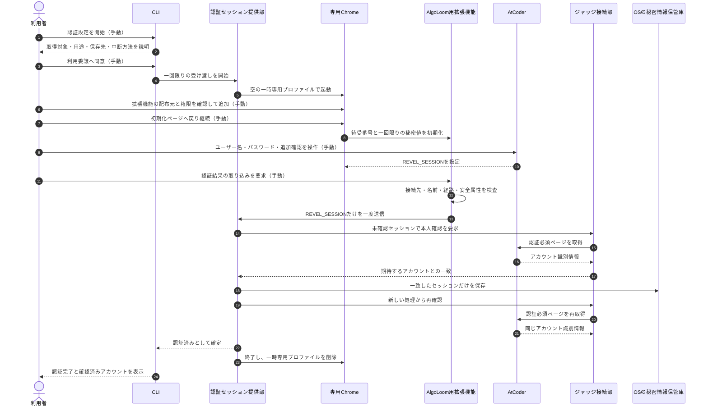
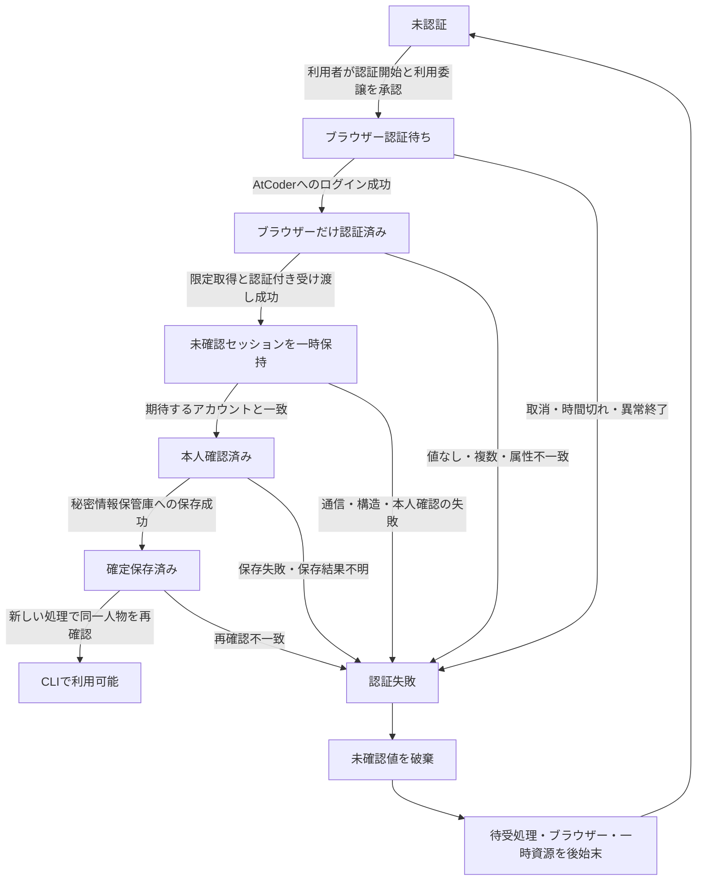
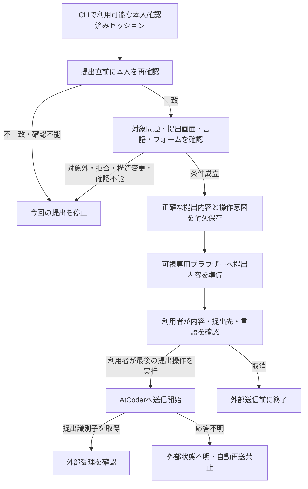

# AlgoLoomにおけるAtCoder認証・認可の境界整理

> 対象: ブラウザーでのAtCoder認証、認証情報の受け渡し、CLI側の本人確認、提出時の認可
>
> 状態: 設計検討資料。方式の採用を確定する正本ではない
>
> 作成日: 2026年8月25日
>
> 関連文書:
> - [AtCoder認証設計](../architecture/atcoder-authentication.md)
> - [AtCoder認証の手動操作削減案](atcoder-authentication-manual-operation-automation.md)
> - [Core契約](../architecture/core-contracts.md#6-提出契約)
> - [ストレスフリーUX設計](../quality/stress-free-ux-design.md#32-atcoder認証の開始期限切れ障害)
> - [MVPスコープ](../product/mvp.md)
> - [開発用機能仕様](../../spec/features.md#8-認証提出判定)

## ドキュメント概要

本書は、「利用者がAtCoderへログインした」という事実と、「AlgoLoomがその利用者としてAtCoderの機能を使える」という状態を分けて整理します。特に、`REVEL_SESSION`の取得と受け渡しで失敗し得る箇所、各状態で利用者ができること・できないこと、利用者に求める手動操作を明示します。

本書には、現在の`TD-09`で選んだ実機検証候補と、手動操作を減らすための改善案を併記します。改善案は採用済みではありません。採用する場合は、[AtCoder認証設計](../architecture/atcoder-authentication.md)をはじめとする正本を同じ変更で更新します。

## 0. 結論

認証と認可は、次の5段階に分ける必要があります。

1. **ブラウザーでの認証**: 利用者がAtCoderへ本人であることを示し、ブラウザーがセッションを得ます。
2. **AlgoLoomへの利用委譲**: 利用者が、AlgoLoomにそのセッションを使わせることへ明示的に同意します。
3. **認証情報の安全な受け渡し**: 専用ブラウザーからCLI側の認証境界へ、`REVEL_SESSION`だけを渡します。
4. **CLI側の本人確認**: 受け取ったセッションで認証必須ページを確認し、期待するAtCoderアカウントと一致することを確かめます。
5. **操作ごとの認可と最終承認**: 対象問題へ提出できる条件をその都度確認し、最後は利用者が可視ブラウザーで提出を承認します。

`REVEL_SESSION`を受け取っただけでは、4段階目の本人確認も、5段階目の提出認可も完了していません。したがって、セッションを受け取った時点で「提出権限あり」という状態を永続保存してはいけません。

現在の実機検証候補は、**Google Chromeと、公式拡張機能配布基盤から追加するAlgoLoom用拡張機能を必要とします**。この拡張機能は、`REVEL_SESSION`の読み取りとCLI側への受け渡しの両方を担います。現在案は「利用者の手動操作をAtCoderへのログインだけにする」という目標を満たしていません。

手動操作を減らす場合は、次の方針が有力です。

- 問題取得、編集、ローカルテストでは認証を要求しない。
- 認証は初回提出の前まで遅らせる。
- 初回だけ拡張機能の追加と権限確認を行う。
- 利用委譲への同意を認証開始時に得たうえで、ログイン成功後の取り込みを自動化する。
- 安全に清掃できたAlgoLoom専用プロファイルへ拡張機能だけを残し、再認証時は原則としてAtCoderへのログイン操作だけにする。
- 清掃完了を確認できない場合は専用プロファイル全体を削除し、次回だけ初回手順へ戻す。

この改善案にも、一度限りの拡張機能追加は残ります。**初回から拡張機能なし、かつ利用者の手動操作をAtCoderログインだけにする要件は、現在案では満たせません。**

## 1. 用語

本文では日本語表記を優先し、製品名、規格名、コード上の識別子を次のように対応付けます。

| 日本語表記 | 英語・コード上の表記 | 本書での意味 |
|---|---|---|
| コマンドライン操作部 | CLI | 利用者の指示を受け付ける端末上の操作部 |
| ブラウザー認証 | browser authentication | AtCoderが利用者本人を確認し、ブラウザーへセッションを設定する工程 |
| CLI側の本人確認 | session verification | CLIがパスワードで再認証するのではなく、受け取ったセッションの本人をAtCoderの認証必須ページで確かめる工程 |
| 認可 | authorization | 特定の対象へ特定の操作を実行してよいかを、その時点の条件から判断すること |
| 利用委譲 | delegation | 利用者が自分のセッションをAlgoLoomの限定された目的へ使わせることに同意する行為 |
| セッション | session | AtCoderがログイン状態を識別する仕組み |
| セッションクッキー | `REVEL_SESSION` | AlgoLoomが取り込むAtCoderのクッキー。所持者として扱われる秘密情報 |
| スクリプト読取り禁止属性 | `HttpOnly` | ページ内の処理からクッキー値を読ませない属性 |
| 所持者型秘密情報 | bearer credential | 値を所持する主体が本人として扱われ得る秘密情報 |
| 未確認セッション | transient unverified session | 受け取ったが、アカウント本人確認と確定保存が終わっていない一時的な値 |
| 公式拡張機能配布基盤 | Chrome Web Store | Chrome拡張機能を審査、署名、配布するGoogleの公式基盤 |
| クッキー操作機能 | Cookies API、`chrome.cookies` | 拡張機能が許可された接続先のクッキーを取得するブラウザー機能 |
| 認証付き折返し通信 | authenticated loopback | `127.0.0.1`だけで待ち受け、一回限りの秘密値等で実行を結び付ける端末内通信 |
| 秘密情報保管庫 | secret store | macOS Keychain等、OSが提供する秘密情報の保管領域 |
| 認証セッション提供部 | `AtCoderSessionProvider` | セッションの取得、確認、保存、削除を担当し、生の値を他の層へ返さない境界 |
| ジャッジ接続部 | `JudgeAdapter` | AtCoder固有の画面や応答を解釈する境界 |
| 最終承認 | final approval | 利用者が提出内容を確認し、可視ブラウザーで最後の提出操作を行うこと |
| 安全側停止 | fail closed | 状態を確認できないとき、推測や迂回をせず該当する外部機能だけを停止すること |

## 2. 認証と認可の切り分け

### 2.1. 段階ごとの責任

| 段階 | 誰が何を確認するか | 成功して分かること | まだ分からないこと |
|---|---|---|---|
| ブラウザー認証 | AtCoderが利用者の資格情報と必要な追加確認を検証する | 専用ブラウザー内にAtCoderのログイン状態がある | AlgoLoomがその状態を受け取れたか |
| 利用委譲 | 利用者がAlgoLoomの取得対象、用途、保存先を確認して開始する | AlgoLoomへ限定利用を許可する利用者意思がある | セッションが有効か、誰のものか |
| 安全な受け渡し | 拡張機能と認証セッション提供部が、対象、送信元、順序、値を検査する | `REVEL_SESSION`だけを未確認状態で受け取った | 期待するアカウントか、提出できるか |
| CLI側の本人確認 | ジャッジ接続部が認証必須ページからアカウントを一意に識別する | セッションが現在どのアカウントを表すか | 対象問題へ提出できるか |
| 操作ごとの認可 | ジャッジ接続部が提出画面、問題、言語、フォーム等を確認する | 今回の提出準備を進められる | AtCoderが実際の提出を受理するか |
| 最終承認と受理 | 利用者が内容を確認して最後の操作を行い、AtCoderが応答する | 提出識別子を得た場合は外部受理を確認できる | 応答不明の場合の送信有無 |

### 2.2. 誤解しやすい境界

- ブラウザーでログインしても、その状態はブラウザーの中にあります。CLIが自動的に認証済みになるわけではありません。
- AlgoLoomは利用者のパスワードを受け取らないため、CLI側で同じログイン処理を繰り返しません。CLI側で行うのは、受け取ったセッションが表す本人の確認です。
- `REVEL_SESSION`は、値を持つ主体が利用者として扱われ得る秘密情報です。ただし、値の取得はAtCoderがAlgoLoomへ包括的な提出権限を発行したことを意味しません。
- 利用者による利用委譲は、AlgoLoomと利用者の間の同意です。AtCoderが提供する標準的な第三者認可手続ではありません。
- アカウントを確認できても、対象コンテスト、問題、言語、提出画面、偽造防止値、Bot対策等の条件は操作ごとに異なり得ます。
- 提出準備が成立しても、最後の提出操作は利用者が行います。AlgoLoomは直接のHTTP送信へ切り替えません。

### 2.3. 拡張機能が担う範囲

現在案の拡張機能は、単なる転送器ではありません。次の2つを担います。

1. Chromeのクッキー操作機能を使い、スクリプト読取り禁止属性によって通常のページ処理からは読めない`REVEL_SESSION`を、許可されたAtCoderの接続先から1件だけ取得する。
2. 取得した値を、認証付き折返し通信で同じ端末上の認証セッション提供部へ一度だけ渡す。

AtCoderからブラウザーへ`REVEL_SESSION`が設定されること自体は、ログイン時にブラウザーが行います。拡張機能が必要になるのは、その値をAlgoLoomの安全な境界へ取り出して渡すためです。[`p0-23`の実機検証](../verification/judge-adapter/results/2026-08-12-p0-23.md)では、スクリプト読取り禁止属性を持つ値を拡張機能の処理担当から権限内で取得し、ページ本文へ渡さずに受け渡せることを確認しました。

## 3. 現在案の正常な流れ

図中の「手動」は利用者が操作する箇所です。

この流れでは、一時専用プロファイルの削除とともに拡張機能も削除されます。そのため、失効後の再認証でも拡張機能の追加操作が繰り返されます。

## 4. 状態遷移

### 4.1. 認証情報の確定まで

`CLIで利用可能`は「全ての提出が認可済み」という状態ではありません。本人確認済みのセッションを、次の操作ごとの確認へ使用できる状態です。

### 4.2. 提出ごとの認可と最終承認

次の状態を永続的な一つの真偽値へまとめてはいけません。

- アカウント本人を確認済みか
- セッションが現在も有効か
- 対象問題の提出画面へアクセスできるか
- 選択した言語を利用できるか
- 利用者が今回の提出内容を承認したか
- AtCoderが実際に提出を受理したか

## 5. 失敗箇所と安全な回復

| 失敗箇所 | 確認できている状態 | 保存してよいもの | 利用者への影響 | 次の安全な行動 |
|---|---|---|---|---|
| 認証セッション提供部を起動できない | 外部作用前 | 秘密でないエラー分類だけ | アカウント依存機能だけ停止 | 環境の診断方法を一つ示す |
| Chromeを起動できない | 外部作用前 | 秘密でないエラー分類だけ | 現在案の認証は開始不能 | 対応ブラウザーの導入状況を確認する |
| 拡張機能を追加できない、配布元や版を確認できない | セッション未取得 | 秘密でない配布状態だけ | 認証を中止 | 手動読込や開発者向け設定へ迂回しない |
| 利用者がログインを取消、時間切れ、ブラウザー終了 | 提出していない | 取消または時間切れの状態だけ | 認証だけ未完了 | 後始末後、利用者の明示操作で再開する |
| `REVEL_SESSION`がない、複数ある、属性が不正 | ブラウザー認証を断定できない | 生の値は保存しない | 認証だけ未完了 | 状態を説明し、再ログインを案内する |
| 折返し通信の送信元、秘密値、本文量、順序が不正 | 受け渡しの正当性を確認不能 | 生の値は保存しない | 認証だけ停止 | 待受処理と一時資源を破棄する |
| 認証必須ページへ接続できない | セッションの本人は未確認 | 未確認値はメモリー内だけ | アカウント依存機能だけ停止 | 通信障害を分類し、自動再試行しない |
| ページ構造を解釈できない | 未認証とは断定できない | 生の画面やセッションは通常記録しない | アカウント依存機能だけ停止 | 互換性修正または確認済み版を案内する |
| 期待するアカウントと異なる | 別アカウントの可能性 | 不一致という事実だけ | 提出を停止 | 未確認値を破棄し、期待アカウントで再認証する |
| 秘密情報保管庫への書込み失敗 | 本人確認済みだが確定保存なし | 平文への代替保存は禁止 | アカウント依存機能だけ停止 | 保管庫の準備方法を案内する |
| 保存結果が不明、再読込みで不一致 | 安全に利用できると断定不能 | 不一致と失敗分類だけ | アカウント依存機能だけ停止 | 値を削除し、新しい明示操作で再認証する |
| 専用プロファイルの清掃完了を確認できない | 認証成否と後始末成否を分離 | 失敗分類だけ | 次回は初回手順へ戻る可能性 | 専用プロファイル全体を削除する |
| 提出送信後に応答が不明 | 外部へ到達した可能性あり | 操作ID、時刻、対象、送信開始状態 | 結果確認が必要 | 最近の提出を確認し、自動再送しない |

全ての失敗経路で、次の原則を守ります。

- 未確認セッションを確定保存しない。
- 平文設定ファイル、引数、環境変数、クリップボードへ自動的に切り替えない。
- 通常ログ、履歴、書き出し、異常終了報告へ生の値を残さない。
- 認証情報の受け渡し処理からAtCoderへの提出を行わない。
- 原因を推測して未認証、期限切れ、拒否、構造変更を一つにまとめない。
- 認証または認可の失敗で、ローカル機能まで止めない。

## 6. 利用者ができること・できないこと

### 6.1. 状態別の機能可否

`○`は利用可能、`△`は追加確認後に利用可能、`×`はその状態では利用不可を表します。

| 利用者の操作 | セッションなし | ブラウザーだけ認証済み | 未確認セッション受領済み | 本人確認済み | 今回の提出条件を確認済み |
|---|---:|---:|---:|---:|---:|
| 初期設定と環境診断 | ○ | ○ | ○ | ○ | ○ |
| 公開問題と公開サンプルの取得 | ○ | ○ | ○ | ○ | ○ |
| ソースコードの編集 | ○ | ○ | ○ | ○ | ○ |
| ローカルテスト | ○ | ○ | ○ | ○ | ○ |
| 学習時間の計測 | ○ | ○ | ○ | ○ | ○ |
| ローカル履歴、スナップショット、差分、書き出し | ○ | ○ | ○ | ○ | ○ |
| 公式ページや解説をブラウザーで開く | ○ | ○ | ○ | ○ | ○ |
| CLIがAtCoderアカウントを表示・照合する | × | × | × | ○ | ○ |
| アカウントを伴う提出前確認 | × | × | × | △ | ○ |
| 可視ブラウザーへ今回の提出を準備する | × | × | × | △ | ○ |
| 利用者が最後の提出操作を行う | × | × | × | × | ○ |
| AlgoLoomが無人で提出する | × | × | × | × | × |

ブラウザーだけが認証済みでも、CLIから見るとセッションなしと同じです。受け渡しと本人確認が終わるまでは、アカウントを伴う操作へ進みません。

### 6.2. 認証が失効・拒否・確認不能になった場合

利用できる機能は、セッションなしの列へ戻ります。利用者のソースコード、ローカルテスト結果、学習時間、履歴、スナップショット、差分、書き出しを失わせたり、閲覧不能にしたりしません。

できないのは、本人確認済みのAtCoderアカウントを必要とする操作です。再認証が必要でも、編集中の作業を中断して直ちに認証させるのではなく、提出準備へ進む時点まで保留できます。

## 7. 利用者が手動で行う設定と操作

### 7.1. 現在の`TD-09`実機検証候補

| 時点 | 利用者の手動操作 | 毎回か | 省略できない理由 |
|---|---|---|---|
| 認証開始 | CLIから認証設定を明示的に開始する | 初回・失効時 | 予期しないブラウザー起動と秘密情報取得を避ける |
| 利用委譲 | 取得対象、用途、保存先を確認して同意する | 初回・設計変更時を基本とする | セッション利用の目的を明確にする |
| 拡張機能追加 | 公式拡張機能配布基盤で配布元、権限、版を確認して追加する | 現在案では初回・失効時 | 一時専用プロファイルを毎回削除するため |
| 初期化 | 端末内の初期化ページへ戻り、継続を選ぶ | 初回・失効時 | 拡張機能と今回のCLI処理を安全に結び付けるため |
| AtCoderログイン | ユーザー名、パスワード、必要な追加確認をブラウザーで操作する | 初回・失効時 | AlgoLoomは資格情報やBot対策を代行しないため |
| 取り込み | 認証結果の取り込みを明示する | 初回・失効時 | 現在案では取得直前の明示意思を必要とするため |
| 提出 | 対象、言語、内容を確認し、最後の提出操作を行う | 提出ごと | 外部作用を利用者の明示操作に保つため |

したがって現在案は、Google Chromeが必要であり、認証のたびにAlgoLoom用拡張機能の追加も必要です。公式拡張機能配布基盤を使う想定ですが、Googleアカウントへのログインや同期を要求しないことは`V-12`で確認すべき未検証条件です。

### 7.2. 手動操作を減らす改善案

| 時点 | 利用者の手動操作 | 目標 |
|---|---|---|
| 問題取得、編集、ローカルテスト | 認証操作なし | 初めて使う利用者が直ちに学習を始められる |
| 初回の認証 | 拡張機能の配布元と権限を一度確認して追加し、AtCoderへログインする | 初回だけの設定をまとめる |
| 2回目以降の再認証 | AtCoderへログインし、必要な追加確認を行う | 手動操作をAtCoderログイン中心にする |
| 提出ごと | 対象、言語、内容と最後の提出操作を確認する | 認証の手間を増やさず、外部作用の承認を残す |

ここでいう「再認証の手動操作をAtCoderログインだけにする」は、認証設定として要求する操作を指します。利用者が目的の機能を開始するCLI操作と、提出ごとの最終承認は、認証設定とは別に残します。

この案では、認証開始時の利用委譲を受けた後、次を自動化します。

1. 認証セッション提供部と認証付き折返し通信を起動する。
2. 拡張機能を保持したAlgoLoom専用プロファイルを起動する。
3. 利用者のログイン後に`REVEL_SESSION`を限定取得して受け渡す。
4. アカウント本人を確認し、秘密情報保管庫へ保存する。
5. 専用プロファイルからAtCoderのクッキー、履歴、入力情報、キャッシュ等を削除する。
6. 清掃を確認できた場合だけ、署名済み拡張機能と必要最小限の設定を次回用に残す。

異常終了または清掃結果不明では、専用プロファイル全体を削除します。この場合、次回は拡張機能追加を含む初回手順へ戻ります。便利さを理由に、未清掃のプロファイルを残してはいけません。

ログイン成功後の自動取り込みは、認証開始時の説明と利用委譲を取り込み直前の同意として扱えるか、操作の分かりやすさと安全性を実機で確認してから採用します。無期限にクッキーを監視する設計にはしません。

### 7.3. 利用者に要求しない操作

どの案でも、次の操作は要求しません。

- Chromeの開発者向け設定を有効にする。
- 未署名の拡張機能を手動読込する。
- 安全機能や警告を無効にする。
- GoogleアカウントをChromeへ追加し、同期を有効にする。
- ブラウザーの開発者ツールからクッキーをコピーする。
- クッキーをCLI、設定ファイル、引数、環境変数へ貼り付ける。
- AtCoderのパスワードをCLIへ入力する。
- OSの秘密情報保管庫を直接編集する。
- 利用者が普段使うブラウザープロファイルをAlgoLoomへ渡す。

## 8. 選択肢の比較

| 選択肢 | 初回認証の手動操作 | 再認証の手動操作 | Chrome | 拡張機能 | 安全性・成立性 | 現在の位置付け |
|---|---|---|---|---|---|---|
| A. 毎回削除する一時専用プロファイル | 拡張機能追加、初期化、AtCoderログイン、取り込み | 初回と同じ | 必須 | 毎回追加 | 一時資源を残さない境界は明快。製品配布は未検証 | `TD-09`で選んだ`V-12`候補 |
| B. 清掃済み専用プロファイルを再利用 | 初回の拡張機能追加、AtCoderログイン | 原則としてAtCoderログイン | 必須 | 初回だけ | 清掃範囲、残留確認、異常時削除を新たに実証する必要あり | 操作削減案。未採用 |
| C. 拡張機能を使わない別方式 | 方式により異なる | 方式により異なる | 未定 | 不要 | Chrome内部保管庫の直接読取り、OS差、暗号化、終了条件等の問題が未解決 | 再設計が必要。現行候補ではない |

選択肢Bは、利用者の「普段の再認証ではAtCoderログインだけ」という目標へ最も近い案です。ただし、次の制約があります。

- 初回の拡張機能追加は残る。
- Google Chromeへの依存は残る。
- 拡張機能の権限や版が変わった場合は、利用者による再確認が必要になる。
- 清掃を安全に証明できなければ採用できない。
- AtCoderまたは公式拡張機能配布基盤の変更により成立しなくなる可能性がある。

拡張機能を完全に使わないことを必須条件にする場合は、選択肢AやBの調整ではなく、認証方式そのものの再設計として扱います。

## 9. 目標とする利用体験

利用開始までの負担を抑えるため、次を目標とします。

| 場面 | 目標 |
|---|---|
| 初めて問題を解く | 認証もブラウザー起動も要求せず、問題取得からローカルテストまで進める |
| 初めて提出する | 一度だけ必要な認証設定とAtCoderログインをまとめ、各段階の理由を短く示す |
| セッションが有効な通常提出 | 再ログインや拡張機能操作を要求しない |
| セッション失効後の再認証 | 初回設定済みなら、原則としてAtCoderログインと必要な追加確認だけにする |
| 認証失敗 | 提出していないこと、止まった段階、次にできる一つの行動を示す |
| 作業中の失効 | 編集やローカルテストを止めず、提出準備の直前まで再認証を遅らせられる |
| 提出 | 認証操作とは別に、対象、言語、内容、最後の外部作用を利用者が確認できる |

認証の操作回数だけでなく、次の値を実機検証で測ります。

- 初回の問題取得からローカルテスト開始までに必要な認証操作数
- 初回認証の選択回数と所要時間
- 2回目以降の再認証の選択回数と所要時間
- 取消または失敗後に残るプロセス、待受処理、プロファイル、秘密情報の件数
- 利用者が「ブラウザー認証済み」と「CLI利用可能」を区別できた割合
- 認証失敗後に、説明だけで次の安全な行動を選べた割合

## 10. 方針決定で確認する事項

次の判断が必要です。

1. MVPでGoogle Chromeを必須の対応ブラウザーとしてよいか。
2. 利用者にAlgoLoom用拡張機能を一度追加してもらうことを許容できるか。
3. 「手動操作はAtCoderログインだけ」という要件は、初回認証から必須か、初回設定後の再認証からでよいか。
4. 認証開始時の一度の利用委譲を、ログイン成功後の自動取り込みまで有効とみなしてよいか。
5. AtCoderのサイト情報を清掃した専用プロファイルへ、署名済み拡張機能だけを残してよいか。
6. 清掃完了を何によって確認し、どの失敗で専用プロファイル全体を削除するか。
7. Chromeがない場合、または公式拡張機能配布基盤を利用できない場合に、提出機能の非対応を受け入れるか。
8. 拡張機能を許容しない場合、どのOS・ブラウザーを対象に認証方式を再設計するか。

## 11. 方式にかかわらず維持する不変条件

- 利用者のユーザー名、パスワード、Turnstile操作をAlgoLoomが受け取ったり代行したりしない。
- 利用者が普段使うブラウザープロファイルを探索、読取り、複製しない。
- 取得するクッキーは`https://atcoder.jp`の`REVEL_SESSION`だけに限定する。
- 受け取ったセッションは、期待するアカウントとの一致を確認するまで確定保存しない。
- 生のセッションをCore、CLI、通常ログ、履歴DB、作業領域、書き出しへ渡さない。
- 秘密情報保管庫を利用できない場合、平文へ自動的に切り替えない。
- 本人確認済みという状態を、全ての提出が認可済みという状態に読み替えない。
- 提出条件を操作ごとに確認し、最後の提出操作を利用者が可視ブラウザーで行う。
- ブラウザー経路が成立しない場合、セッションを使った直接HTTP提出へ切り替えない。
- 外部送信の有無が不明な場合、自動再提出しない。
- 認証や認可の失敗で、問題取得、編集、ローカルテスト、履歴等のローカル機能を停止しない。

## 12. 採用時に更新する文書

本書は判断材料であり、現在の設計を変更しません。方針決定後は、少なくとも次を同じ変更で整合させます。

| 文書 | 反映する内容 |
|---|---|
| [AtCoder認証設計](../architecture/atcoder-authentication.md) | 採用方式、専用プロファイルの寿命、自動取り込みの同意境界、失敗時の後始末 |
| [ストレスフリーUX設計](../quality/stress-free-ux-design.md#32-atcoder認証の開始期限切れ障害) | 認証を要求する時点、初回と再認証の操作目標、失敗時の案内 |
| [Core契約](../architecture/core-contracts.md#6-提出契約) | 認証セッション提供部と提出前確認の不変条件 |
| [MVPスコープ](../product/mvp.md) | 必須ブラウザー、拡張機能、対応OSの製品条件 |
| [開発用機能仕様](../../spec/features.md#8-認証提出判定) | 実装が満たす認証状態、機能可否、操作ごとの認可要件 |
| [未決事項一覧](unresolved-decisions.md) | 判断結果、未解決条件、再評価条件 |
| [`TODO.md`](../../TODO.md) | 実機検証、利用者体験検証、文書整合の作業 |

現在の`TD-09`選定を変更する場合は、完了済みの記録を黙って書き換えず、変更理由と新しい検証条件を追記します。
