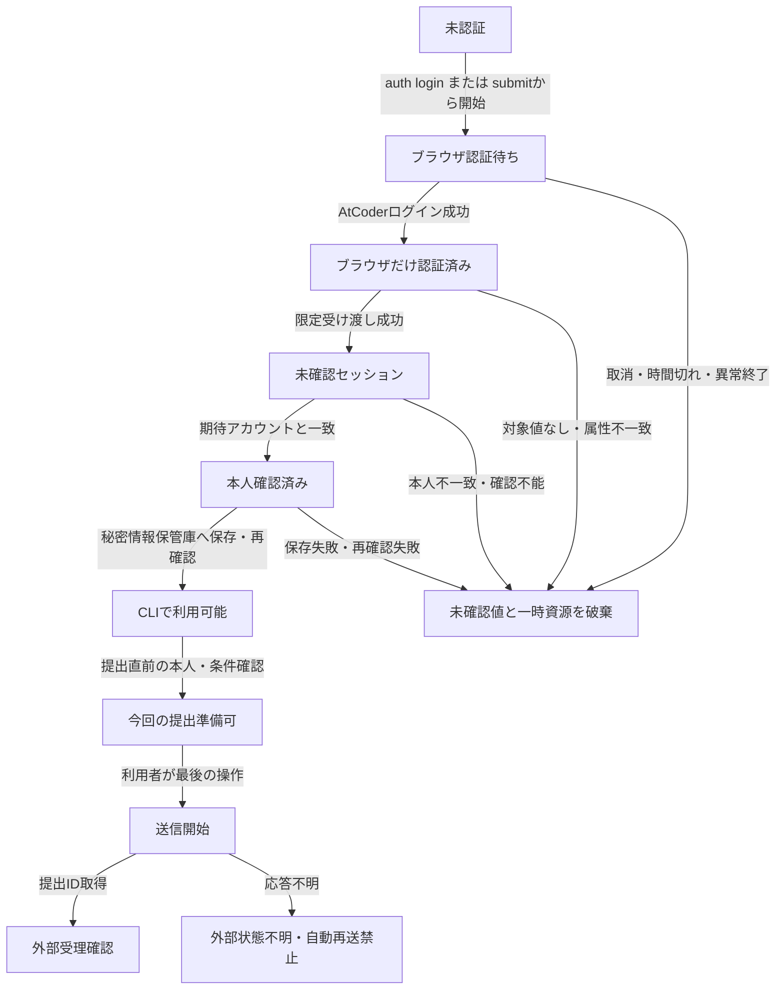

# AlgoLoomにおけるAtCoder認証・認可の境界整理

> 対象: ブラウザでのAtCoder認証、AlgoLoomへの利用委譲、セッション受け渡し、CLI側の本人確認、提出時の認可
>
> 状態: 認証と認可の概念境界。認証UXは採用済み、方式Aの製品形態は`V-12`の合格前に成立済みとは扱わない
>
> 作成日: 2026年8月25日
>
> 関連文書:
> - [AtCoder認証設計](../architecture/atcoder-authentication.md)
> - [AtCoder認証UX設計](atcoder-authentication-manual-operation-automation.md)
> - [Core契約](../architecture/core-contracts.md#6-提出契約)
> - [ストレスフリーUX設計](../quality/stress-free-ux-design.md#32-atcoder認証の開始期限切れ障害)

## ドキュメント概要

本書は、「利用者がAtCoderへログインしたこと」と「AlgoLoomがその利用者としてセッションを利用できること」と「今回の提出を実行してよいこと」を分けます。現在採用する境界だけを示し、旧導線や候補比較は残しません。

## 0. 結論

認証と認可は次の5段階に分けます。

1. **ブラウザ認証**: 利用者がAtCoderへ本人であることを示し、専用ブラウザがセッションを得る。
2. **AlgoLoomへの利用委譲**: 利用者が、取得対象、用途、保存先を確認し、セッションの限定利用へ同意する。
3. **安全な受け渡し**: 拡張機能と認証セッション提供部が`REVEL_SESSION`だけを一度受け渡す。
4. **CLI側の本人確認**: `JudgeAdapter`が、受け取ったセッションのアカウントを確認する。
5. **操作ごとの認可と最終承認**: 提出対象と条件をその都度確認し、利用者が可視ブラウザで最後の提出操作を行う。

`REVEL_SESSION`を受け取っただけでは、本人確認も提出認可も完了していません。本人確認済みセッションを保存しても、将来の全提出を認可したことにはなりません。

## 1. 段階ごとの責任

| 段階 | 担当 | 成功して分かること | まだ分からないこと |
|---|---|---|---|
| ブラウザ認証 | AtCoder、利用者、ブラウザ | 専用ブラウザにログイン状態がある | AlgoLoomがセッションを受け取れたか |
| 利用委譲 | 利用者、AlgoLoom | 限定された目的へ利用者の同意がある | セッションが有効か、誰のものか |
| 安全な受け渡し | 拡張機能、`AtCoderSessionProvider` | 許可された`REVEL_SESSION`を未確認状態で受け取った | 期待するアカウントか、提出できるか |
| CLI側の本人確認 | `JudgeAdapter` | セッションが表す現在のアカウント | 対象問題へ提出できるか |
| 操作ごとの認可 | `JudgeAdapter` | 今回の提出準備を進められる | AtCoderが実際に受理するか |
| 最終承認と受理 | 利用者、AtCoder | 提出IDを得た場合は外部受理を確認できる | 応答不明時に送信されたか |

### 1.1. 誤解しやすい境界

- ブラウザでログインしても、その状態は自動的にCLIへ移らない。
- AlgoLoomはAtCoderのパスワードを受け取らない。CLI側で行うのはパスワード認証ではなく、受け取ったセッションの本人確認である。
- `REVEL_SESSION`は所持者が本人として扱われ得る秘密情報であるが、AtCoderがAlgoLoomへ包括的な権限を発行したことを意味しない。
- 利用委譲はAlgoLoomと利用者の間の同意であり、AtCoderが提供する第三者向け認可手続ではない。
- アカウントを確認できても、問題、言語、提出フォーム、偽造防止値、Bot対策等は操作ごとに確認する。
- 提出準備が成立しても、最後の提出操作は利用者が行う。

## 2. 拡張機能と認証セッション提供部の範囲

拡張機能は次の二つだけを担います。

1. 許可された`https://atcoder.jp`から、スクリプト読取り禁止属性を持つ`REVEL_SESSION`をクッキー操作機能で1件だけ取得する。
2. 取得した値を、同じ端末の認証付き折返し通信で`AtCoderSessionProvider`へ一度だけ渡す。

`AtCoderSessionProvider`は未確認セッションを境界内に保持し、本人確認に成功した場合だけOSの秘密情報保管庫へ保存します。CoreとCLIへ生のCookie値を返しません。

拡張機能は無期限に監視しません。今回の認証処理を一回限りの秘密値と有効時間へ結び付け、初期化前、受け渡し後、取消後、時間切れ後にはCookieを渡しません。

## 3. 状態遷移

`CLIで利用可能`は、本人確認済みセッションを次の操作ごとの確認へ使用できる状態です。すべての提出が事前に認可された状態ではありません。

## 4. 失敗と回復

| 失敗 | 外部作用 | 保存 | 利用者への結果 |
|---|---|---|---|
| Chromeを起動できない | なし | なし | 対応Chromeの確認を案内する |
| 拡張機能を追加・検証できない | セッション未取得 | なし | 開発者モードや強制導入へ迂回せず、認証・提出だけを停止する |
| ログイン取消・時間切れ | 提出なし | 未確認値を破棄 | 中止済みと再開方法を示す |
| Cookieがない、複数、属性不一致 | 提出なし | 保存しない | 対象を推測せず再認証を案内する |
| アカウント不一致 | 提出なし | 保存しない | 期待値と確認結果を秘密でない範囲で示す |
| 秘密情報保管庫の障害 | 提出なし | 平文へ退避しない | 認証・提出だけを停止する |
| セッション失効 | 提出なし | 無効値を破棄 | `auth login`または`submit`内の再認証へ進む |
| 送信開始後に応答不明 | 送信済みの可能性あり | 状態不明を保存 | 自動再送せず、公式提出一覧の確認を案内する |

認証失敗はローカルtest、履歴、checkpoint、exportを停止しません。取消、時間切れ、ブラウザ終了を利用者の過失として表現しません。

## 5. 状態別の機能可否

| 状態 | ローカル機能 | AtCoder認証確認 | 提出 |
|---|---:|---:|---:|
| 未認証 | 可 | 不可 | 不可 |
| ブラウザだけ認証済み | 可 | CLIでは不可 | 不可 |
| 未確認セッション | 可 | 確認処理中 | 不可 |
| 本人確認済み・保存済み | 可 | 可 | 操作ごとの確認後に準備可 |
| アカウント不一致・確認不能 | 可 | 失敗 | 不可 |
| 失効 | 可 | 再認証が必要 | 不可 |
| 送信状態不明 | 可 | 必要時に再確認 | 同じ内容の自動再送不可 |

## 6. 利用者導線との関係

具体的な操作は[AtCoder認証UX設計](atcoder-authentication-manual-operation-automation.md)を正とします。

- 明示ログインは`aloom auth login`から開始する。
- 初回だけ利用委譲と署名済み拡張機能の追加を求める。
- `submit`で再認証が必要なら、理由と中止方法を表示してブラウザを自動起動し、別commandを要求しない。
- CLIとブラウザは一往復とし、途中のcopy-and-paste、手動ページ移動、取り込み要求を求めない。
- 待機中はCLIから取消でき、取消時は提出せず一時資源を回収する。

## 7. 不変条件

- 利用者本人のセッションだけを扱い、共有セッションまたは他人のCookieを受け付けない。
- 利用者の既存ブラウザプロファイル、保存パスワード、履歴、拡張機能、他サイトのCookieを参照・複製・変更しない。
- `REVEL_SESSION`以外が必要と観測されても、自動的に取得範囲を広げない。
- Cookieを`argv`、環境変数、clipboard、設定ファイル、workspace、履歴DB、export、通常ログへ渡さない。
- Cookieの存在やログイン後URLだけで本人確認成功とみなさない。
- アカウント不一致、構造変更、配布状態不明、秘密情報保管庫障害では安全側に停止する。
- CDP、WebDriver、stealth設定等でAtCoderログイン、Turnstileまたは最後の提出操作を自動化しない。
- 認証付きブラウザ経路が失敗しても、直接HTTP提出へ切り替えない。
- 正常終了、取消、時間切れ、異常終了で、孤児process、待受処理、未確認セッションまたは利用可能な実行用一時プロファイルを残さない。
