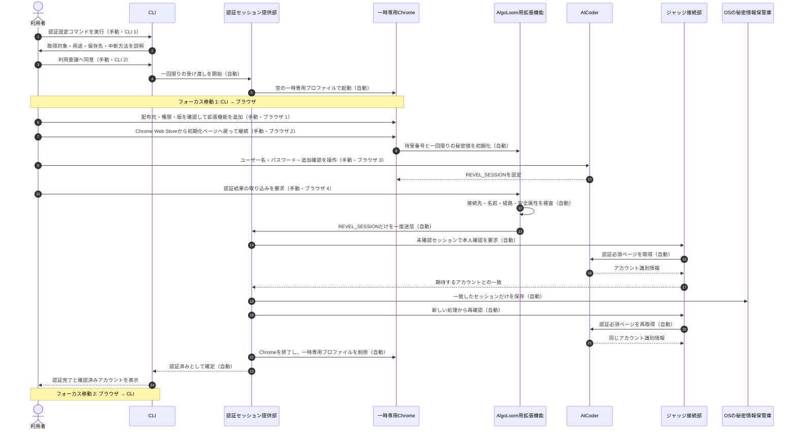
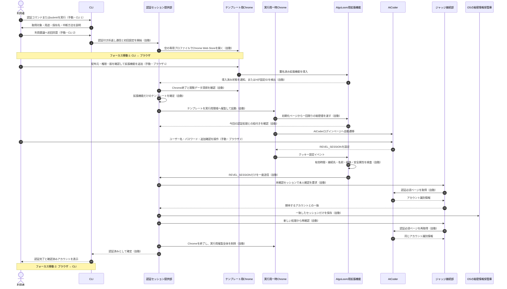
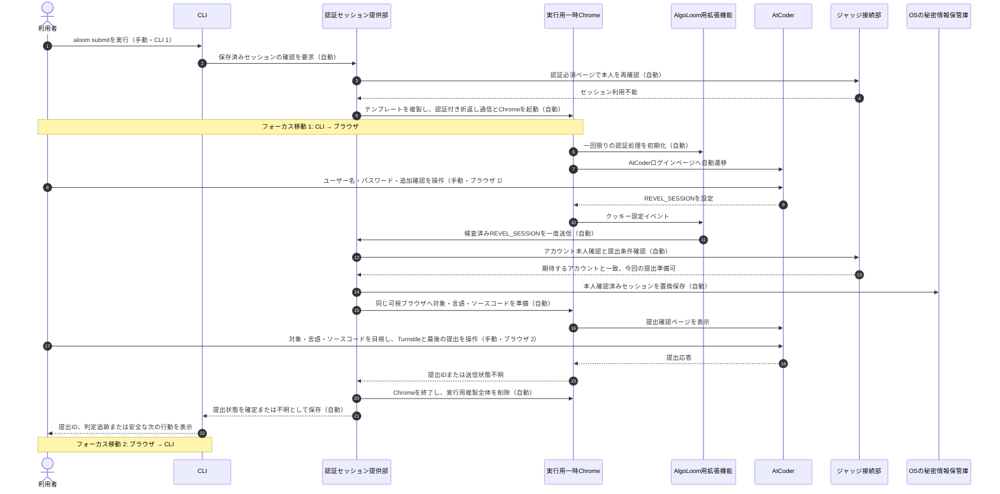
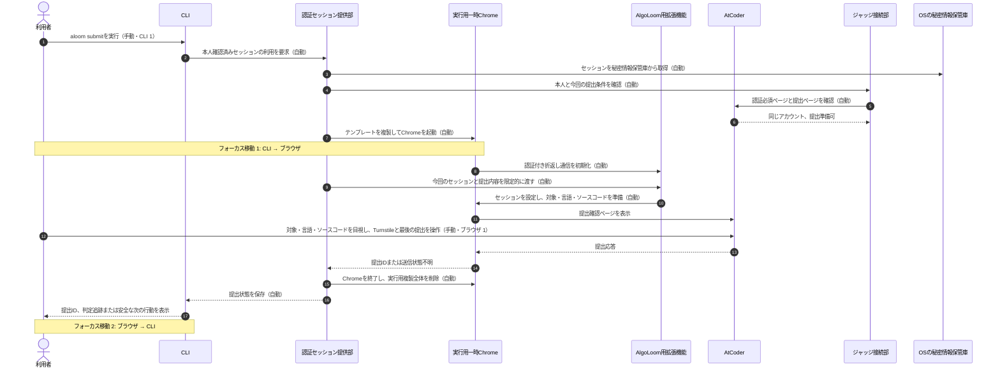

# AlgoLoomにおけるAtCoder認証の手動操作削減案

> 対象: AtCoder認証で利用者に求める操作、CLIとブラウザの往復、専用Chromeプロファイルの寿命
>
> 状態: 設計検討資料。自動化方式または製品形態の採用を確定する正本ではない
>
> 作成日: 2026年8月25日
>
> 関連文書:
> - [AtCoder認証・認可の境界整理](atcoder-authentication-authorization-boundary.md)
> - [AtCoder認証設計](../architecture/atcoder-authentication.md)
> - [Core契約](../architecture/core-contracts.md#6-提出契約)
> - [ストレスフリーUX設計](../quality/stress-free-ux-design.md#32-atcoder認証の開始期限切れ障害)
> - [MVPスコープ](../product/mvp.md)
> - [開発用機能仕様](../../spec/features.md#8-認証提出判定)

## ドキュメント概要

本書は、[AtCoder認証・認可の境界整理 §3](atcoder-authentication-authorization-boundary.md#3-現在案の正常な流れ)にある6つの認証手動操作を、どこまで安全に自動化できるか整理します。現在案と自動化案を同じ粒度のシーケンスで示し、利用者がCLIとブラウザのどちらで操作するか、両者の間で何回フォーカスを移すかを比較します。

本書の自動化案は、公式配布されたAlgoLoom用Chrome拡張機能だけを保持するクリーンなテンプレートプロファイルを初回に作成し、認証または提出時にはその複製を一時利用するものです。Chromeプロファイルの複製を製品契約として利用できることは未実証であり、採用前に対象OSとChromeの実機検証が必要です。

## 0. 結論

現在案の認証操作6つは、次のように削減できます。

| 現在の手動操作 | 自動化案 | 操作場所 |
|---|---|---|
| 認証設定を開始する | 目的のCLIコマンドの実行自体を開始意思とする | CLI。手動のまま |
| 利用委譲へ同意する | 初回と同意内容変更時だけ要求する | CLI。手動のまま |
| 拡張機能を追加する | 初回だけ要求し、クリーンなテンプレートに保持する | ブラウザ。手動のまま |
| 初期化ページへ戻り継続する | 導入済み拡張機能の検出と認証付き初期化を自動化する | 自動 |
| AtCoderへログインする | 利用者が資格情報と必要な追加確認を操作する | ブラウザ。手動のまま |
| 認証結果の取り込みを要求する | 有効時間を限定したクッキー変更検出と一回限りの受け渡しへ置き換える | 自動 |

操作数の目標は次のとおりです。表中の操作数は、ユーザー名やパスワードの文字入力、Chromeの確認ダイアログ内の個別クリック数ではなく、利用者が目的を判断して行う主な操作段階を数えます。

| 場面 | CLI上の手動操作 | ブラウザ上の手動操作 | 認証固有の追加操作数 |
|---|---:|---:|---:|
| 現在案の初回認証 | 2 | 4 | 6 |
| 現在案の失効後再認証 | 2 | 4 | 6 |
| 自動化案の初回認証 | 2 | 2 | 4 |
| 自動化案の失効後再認証（`submit`起点） | 1 | 1 | 1。起点の`submit`は除く |
| 自動化案で有効なセッションを使う通常提出 | 1 | 認証操作は0 | 0 |

`aloom submit`を起点に認証を遅延開始する場合、そのコマンドは提出を始めるためにもともと必要な操作です。この数え方では、失効後に増える認証固有の手動操作は、ブラウザ上のAtCoderログインだけです。

初回の拡張機能追加とAtCoderログインは自動化しません。通常Chromeは利用者による拡張機能の追加と権限確認を標準導線とし、Cloudflareは本番チャレンジにおける自動化ブラウザを対応対象としていないためです。利用委譲への同意も秘密情報の用途を説明するために残しますが、毎回の操作にはしません。

CLIとブラウザの間は、認証中に往復させません。CLIで開始と必要な同意を完了した後は、ブラウザ内で拡張機能追加、AtCoderログイン、必要なら提出の最終承認まで連続させ、最後にCLIへ戻します。目標は、初回、再認証、通常提出のいずれも、**CLIからブラウザへ1回、ブラウザからCLIへ1回の一往復**です。

## 1. 比較方法

### 1.1. 操作場所の表記

シーケンス図では、利用者の手動操作を次のように表記します。

| 表記 | 意味 | 例 |
|---|---|---|
| `手動・CLI` | 利用者がターミナル上で入力または選択する | コマンド実行、初回同意、取消 |
| `手動・ブラウザ` | 利用者が可視ブラウザ上で入力または選択する | 拡張機能追加、AtCoderログイン、最後の提出操作 |
| `自動` | CLI、認証セッション提供部、拡張機能等が利用者の追加操作なしで行う | 認証付き折返し通信の初期化、クッキー限定取得、本人確認、後始末 |
| `フォーカス移動` | 利用者の主な操作場所がCLIとブラウザの間で変わる | CLIから専用Chromeへ移る |

ブラウザ内のページ移動と、CLI・ブラウザ間のフォーカス移動は分けて数えます。例えばChrome Web StoreからAtCoderログインページへ自動で移動する場合、ブラウザ内のページ移動はありますが、利用者がCLIへ戻るフォーカス移動はありません。

### 1.2. 比較範囲

認証操作は、目的のCLIコマンドを開始してから、本人確認済みセッションをCLIが利用できる状態になるまでを数えます。提出ごとの対象、言語、ソースコード、Turnstileと最後の提出操作は、認証とは別の最終承認として数えます。

利用者が一度の`aloom submit`で認証と提出を連続して行う場合は、ブラウザを認証完了直後に閉じず、そのまま提出画面へ進める案も示します。これにより、認証後に一度CLIへ戻り、提出のために再びブラウザへ移る往復を避けます。

## 2. 自動化前: 現在案の正常な流れ

現在案では、CLI上の手動操作が2つ、ブラウザ上の手動操作が4つあります。認証のたびに一時専用プロファイルを削除するため、失効後の再認証でも拡張機能の追加を繰り返します。

### 2.1. 現在案の操作場所と移動

| 順序 | 手動操作 | 場所 | 操作後の主な移動 |
|---:|---|---|---|
| 1 | 認証設定コマンドを実行 | CLI | CLI内 |
| 2 | 利用委譲へ同意 | CLI | 専用Chromeの起動後、ブラウザへ移動 |
| 3 | 拡張機能を追加 | ブラウザのChrome Web Store | ブラウザ内 |
| 4 | 初期化ページへ戻って継続 | ブラウザの別ページまたはタブ | ブラウザ内 |
| 5 | AtCoderへログイン | ブラウザのAtCoder | ブラウザ内 |
| 6 | 取り込みを要求 | ブラウザの拡張機能画面 | 完了後、CLIへ戻る |

CLIとブラウザの間は一往復ですが、ブラウザ内ではChrome Web Store、初期化ページ、AtCoderログイン、拡張機能画面を利用者自身が順に見つけて操作する必要があります。操作数だけでなく、このブラウザ内のページ・タブ・拡張機能画面間の移動が認知負荷になります。

## 3. 自動化案の構成

### 3.1. クリーンなテンプレートと実行用複製

自動化案は、同じ専用プロファイルを認証後に清掃して再利用するのではなく、次の2種類を分けます。

| 種類 | 寿命 | 保持してよいもの | 保持してはいけないもの |
|---|---|---|---|
| クリーンなテンプレートプロファイル | 初回設定から再設定まで | 署名済みAlgoLoom用拡張機能、検証済みの必要最小限の設定 | AtCoderのクッキー、履歴、入力情報、パスワード、キャッシュ、認証実行の秘密値 |
| 実行用一時プロファイル | 認証または提出の1実行だけ | テンプレートの複製と、その実行中に必要な一時状態 | 実行終了後に残る全データ |

初回は、AtCoderへ移動する前に拡張機能の導入を確認し、閲覧由来のデータを清掃した状態をテンプレートとして確定します。以後はChromeの対象プロセスが存在しないことを確認してからテンプレートを所有者専用の一時領域へ複製し、その複製だけを`--user-data-dir`へ指定します。

正常終了、取消、時間切れ、本人不一致、保存失敗、異常終了のいずれでも実行用複製全体を削除します。削除を確認できない場合は認証または提出だけを失敗とし、次回の利用前に残存プロセスと実行用複製を回収します。テンプレート自体の完全性を確認できない場合は、推測で修復せずテンプレートを破棄して初回設定へ戻ります。

この方法は、清掃APIが対象にできるデータ種別やChrome内部形式へ、正常系の安全性を依存させないことを目的とします。ただしChromeは`--user-data-dir`による専用データディレクトリを提供している一方、拡張機能導入済みプロファイルの複製をAlgoLoomの製品契約として保証しているわけではありません。Chrome更新、拡張機能更新、3つの対象OSを含む実機検証を通過するまで採用しません。

### 3.2. 自動初期化と自動取り込み

初期化ページと拡張機能は、固定した拡張機能識別子と`externally_connectable`による外部メッセージを使って、導入済みであることを確認できます。初期化時は、少なくとも次を検査します。

- 送信元が今回の`127.0.0.1`上の初期化ページである。
- 待受番号と一回限りの秘密値が今回のCLI処理と一致する。
- 拡張機能の識別子、版、権限、配布元が許可済みである。
- 受け渡し状態が未使用で、有効時間内である。

ログイン後は、拡張機能の`chrome.cookies.onChanged`を今回の認証処理だけに関連付けます。クッキー更新では削除と追加の複数イベントが発生し得るため、削除イベントを除外し、接続先、名前、パス、`Secure`、`HttpOnly`、パーティション状態を検査した厳密に1件だけを一度送信します。

拡張機能を無期限に監視状態へ置きません。初期化前、時間切れ後、一度送信した後、取消後は、クッキーを受け渡しません。クッキーが設定されたことだけでログイン成功とみなさず、ジャッジ接続部によるアカウント本人確認を通過した値だけを秘密情報保管庫へ保存します。

## 4. 自動化後: 初回認証の正常な流れ

初回は、CLI上で認証開始と利用委譲への同意を行い、ブラウザ上で拡張機能の追加とAtCoderログインを行います。Chrome Web Storeから初期化ページへ戻る操作と、取り込み要求は不要です。

### 4.1. 初回認証の操作場所と移動

| 順序 | 手動操作 | 場所 | 操作後の主な移動 |
|---:|---|---|---|
| 1 | 認証コマンドまたは`submit`を実行 | CLI | CLI内 |
| 2 | 利用委譲へ初回同意 | CLI | 専用Chromeの起動後、ブラウザへ移動 |
| 3 | 拡張機能を追加して権限を承認 | ブラウザのChrome Web Store | AtCoderログインページへ自動遷移 |
| 4 | AtCoderへログイン | ブラウザのAtCoder | 認証完了後、CLIへ戻る |

利用者がブラウザ上で初期化ページを探したり、拡張機能のポップアップを開いたりする必要はありません。CLIへ戻って追加コマンドを入力する必要もありません。

## 5. 自動化後: 失効後の再認証と提出を連続する流れ

`aloom submit`の時点で保存済みセッションが利用不能と分かった場合、初回同意と拡張機能追加を繰り返しません。実行用一時プロファイルを自動作成し、利用者のAtCoderログイン後にセッションを自動取り込みします。

提出を起点に再認証した場合は、認証完了後も同じ可視ブラウザと実行用一時プロファイルを使い、提出画面へ連続して進みます。認証完了直後にブラウザを閉じてCLIへ戻し、提出のために再度ブラウザを開く往復を作りません。

### 5.1. 再認証と提出の操作場所と移動

| 順序 | 手動操作 | 場所 | 認証か提出か |
|---:|---|---|---|
| 1 | `aloom submit`を実行 | CLI | 提出開始。認証専用の追加コマンドではない |
| 2 | AtCoderへログイン | ブラウザ | 認証 |
| 3 | 対象等を確認して最後の提出操作を行う | ブラウザ | 提出の最終承認 |

この流れではCLIとブラウザは一往復です。認証だけを数えると、失効によって追加される手動操作はブラウザ上のAtCoderログイン1つです。

認証コマンドを単独で実行した場合は、本人確認と秘密情報保管庫への保存後にブラウザを閉じてCLIへ戻します。提出画面には進みません。

## 6. 自動化後: 有効なセッションを使う通常提出

保存済みセッションが本人と一致し、今回の提出条件を確認できる場合は、認証画面を表示しません。実行用一時プロファイルへセッションを限定的に設定し、提出確認ページを表示します。

通常提出でもCLIとブラウザは一往復です。CLIへ戻って確認コマンドを入力させたり、ブラウザを複数回開閉したりしません。

## 7. 自動化前後のUX比較

### 7.1. 操作数とフォーカス移動

| 場面 | CLI手動 | ブラウザ手動 | CLI→ブラウザ | ブラウザ→CLI | ブラウザ内で利用者が戻る・開く操作 |
|---|---:|---:|---:|---:|---:|
| 現在案の初回認証 | 2 | 4 | 1 | 1 | 2。初期化ページへ戻る、拡張機能画面を開く |
| 現在案の失効後再認証 | 2 | 4 | 1 | 1 | 2。初回と同じ |
| 自動化案の初回認証 | 2 | 2 | 1 | 1 | 0。Chrome Web Storeからログインへ自動で進む |
| 自動化案の失効後再認証だけ | 1 | 1 | 1 | 1 | 0 |
| 自動化案の再認証と提出 | 1 | 2 | 1 | 1 | 0。ログインから提出確認へ自動で進む |
| 自動化案の通常提出 | 1 | 1 | 1 | 1 | 0 |

現在案にもCLIとブラウザの間を何度も往復する問題はありません。主な問題は、ブラウザへ移った後に、Chrome Web Store、初期化ページ、AtCoder、拡張機能画面という異なる操作面を利用者自身が移動する点です。

自動化案は、CLI上の初回同意を残す代わりに、ブラウザへ移った後の手動ページ移動をなくします。主要な作業領域がCLIであることを考えると、次の配分を目標とします。

- 説明、同意、取消、失敗理由、再実行方法はCLIへ集約する。
- パスワード、追加確認、Turnstile、最後の提出操作はブラウザへ限定する。
- ブラウザを開いている間に、CLIへ戻ってトークンやコマンドを入力させない。
- CLIへ戻った時点では、認証または提出の結果と、次に行える一つの操作を表示する。

### 7.2. CLI上で許容する手動操作

次のCLI操作は、ブラウザ内で同じ判断を要求するよりも製品の責任と結果が分かりやすいため、残す価値があります。

| CLI操作 | 頻度 | 残す理由 |
|---|---|---|
| 認証コマンドまたは`submit`の実行 | 利用者が目的の機能を開始するたび | 予期しないブラウザ起動と秘密情報取得を防ぐ |
| 利用委譲への同意 | 初回、取得対象・用途・保存先・権限の変更時 | 拡張機能の権限ダイアログだけではAlgoLoom内の用途と保存先を十分に説明できない |
| 取消 | 待機中いつでも | ブラウザを探さず、主要な作業領域から安全に中止できる |
| 失敗後の再実行 | 自動再試行しない失敗後 | AtCoderへの外部通信を利用者の新しい意思に結び付ける |

CLI上の同意は、毎回確認しません。同意文面にバージョンを付け、同じ取得対象、用途、保存先、権限であれば再認証時に再表示せず、同意内容の確認コマンド等でいつでも確認できる形を候補とします。

### 7.3. ブラウザ上に残す手動操作

| ブラウザ操作 | 頻度 | 自動化しない理由 |
|---|---|---|
| 署名済み拡張機能の追加と権限確認 | 初回、権限追加またはテンプレート再作成時 | Chromeの標準的な利用者承認を維持する |
| AtCoderログインと必要な追加確認 | 初回・失効時 | 資格情報をAlgoLoomへ渡さず、ボット対策を自動化しない |
| 対象・言語・ソースコードの目視と最後の提出操作 | 提出ごと | 外部作用を利用者の明示承認へ結び付ける |

## 8. 採用しない自動化

操作数を減らせても、次の方式は採用しません。

- CDP、WebDriver、Puppeteer、Playwright等でAtCoderログインまたはCloudflare保護ページを制御する。
- `navigator.webdriver`等の自動化信号を隠す。
- ユーザー名、パスワード、TurnstileをCLIまたは拡張機能が入力、保存、代行する。
- 通常Chromeへ`--load-extension`等で拡張機能を無人導入する。
- OSのレジストリ、Chromeの企業向けポリシー、外部拡張設定を書き換えて一般利用者のChromeへ強制導入する。
- 利用者の既存Chromeプロファイルからクッキー、パスワード保管庫または復号鍵を探索する。
- Chrome内部の非公開クッキー保存形式を直接読み、OSごとの保護を弱める。
- 認証付きブラウザ経路が失敗した場合に、セッションを使った直接HTTP提出へ切り替える。
- 提出結果が不明な場合に、自動再提出する。

## 9. 実機検証で確認する事項

本案を採用する前に、現在の`V-12`候補とは別の派生候補として、少なくとも次を検証します。

### 9.1. 初回設定と配布

- 署名済み拡張機能を、開発者向け設定なしで標準画面から追加できる。
- ChromeへのGoogleアカウント追加または同期を要求しない。
- 拡張機能追加後、利用者が初期化ページへ戻らなくても導入完了を安全に検出できる。
- 拡張機能の識別子、版、権限、配布元を固定して確認できる。
- 管理対象Chrome等で追加できない場合、既存環境を書き換えず提出機能だけを停止できる。

### 9.2. テンプレートと複製

- macOS、Linux、Windowsで、Chrome完全終了後に複製したプロファイルの拡張機能が有効である。
- Chromeのマイナー・メジャー更新後、拡張機能の自動更新後、権限変更後の状態を分類できる。
- テンプレートにAtCoderのクッキー、履歴、入力情報、パスワード、キャッシュ、認証時の秘密値がない。
- テンプレートを実行用として直接起動しない。
- 複製失敗、Chromeのバックグラウンドプロセス残存、ファイルロック、容量不足で安全側停止する。
- 正常終了、取消、時間切れ、強制終了後に実行用複製を回収できる。
- テンプレートの完全性を確認できない場合に、部分修復せず初回設定へ戻れる。

### 9.3. 自動取り込み

- クッキーの追加・上書き・削除イベントから、許可された1件を一度だけ送信する。
- 初期化前、時間切れ後、一度送信した後はクッキーを送信しない。
- 認証付き折返し通信の送信元、`Host`、一回限りの秘密値、本文量、スキーマ、状態順序を検査する。
- アカウント不一致、識別不能、保存失敗ではセッションを確定保存しない。
- クッキー値を`DOM`、コンテンツスクリプト、CLI、通常ログ、履歴DB、作業領域、`export`へ渡さない。
- 拡張機能が存在する通常Chrome状態で、AtCoderとCloudflareの実サービス互換性を維持できる。

### 9.4. UX計測

- 初回認証、再認証、通常提出ごとのCLI手動操作数とブラウザ手動操作数。
- CLIからブラウザ、ブラウザからCLIへのフォーカス移動数。
- ブラウザ内で利用者がページ、タブ、拡張機能画面を探して移動した回数。
- 初回設定と再認証の所要時間。
- CLIへ戻らないと次へ進めない状態、ブラウザへ戻らないと次へ進めない状態の発生件数。
- 取消または失敗後に、CLIの説明だけで次の安全な行動を選べた割合。

## 10. 外部仕様から分かる境界

- Chromeは、ウェブページから拡張機能へのメッセージを`externally_connectable`で許可できます。送信元を許可しても入力を信頼せず、一回限りの秘密値と状態順序を追加検査します。[Chrome Extensions: Message passing](https://developer.chrome.com/docs/extensions/develop/concepts/messaging)
- Chromeの`chrome.cookies` APIは、対象の接続先権限の範囲で`HttpOnly`クッキーを扱い、クッキー設定・削除の変更イベントを通知できます。[Chrome Extensions: `chrome.cookies`](https://developer.chrome.com/docs/extensions/reference/api/cookies)
- Chromeは拡張機能のインラインインストールを廃止しており、利用者がChrome Web Storeの詳細ページで導入と権限を確認します。[Chrome Extensions: Inline-installation deprecation migration FAQ](https://developer.chrome.com/docs/extensions/mv2/inline-faq)
- 通常Chromeの`--load-extension`はChrome 137で削除されました。[Chrome Extensions: What's new in Chrome extensions, June 2025](https://developer.chrome.com/blog/extension-news-june-2025)
- Chromiumは`--user-data-dir`による専用データディレクトリを提供します。ただし、本書で提案するテンプレート複製の成立は、この資料だけでは保証されません。[Chromium Docs: User Data Directory](https://chromium.googlesource.com/chromium/src/+/main/docs/user_data_dir.md)
- Chromeの閲覧データ削除は、オリジンを指定できるデータ種別が限定され、保存パスワードの拡張機能からの削除はChrome 144以降無効です。このため、同じプロファイルを部分清掃して再利用する案は、別途残留確認が必要です。[Chrome Extensions: `chrome.browsingData`](https://developer.chrome.com/docs/extensions/reference/api/browsingData)
- Chrome Web Storeは認証クッキーを利用者データとして扱い、端末内だけで処理する場合も取扱いの開示を求めています。[Chrome Web Store: User Data Policy FAQ](https://developer.chrome.com/docs/webstore/program-policies/user-data-faq)
- Cloudflareは本番チャレンジにおける自動化ブラウザとSelenium、Puppeteer、Playwright、Cypress等を対応対象としていません。[Cloudflare Challenges: Supported browsers](https://developers.cloudflare.com/cloudflare-challenges/reference/supported-browsers/)
- AtCoderはログインと提出へのCAPTCHA導入理由を説明し、非公式ツールの提出をサポートしないと告知しています。[AtCoder: ジャッジキューの処理遅延と今後の対応につきまして](https://atcoder.jp/posts/1456?lang=ja)

これらの公開情報は、自動化案への許諾または将来互換性の保証ではありません。限定公開ベータ前と各リリース前に再確認します。

## 11. 方針決定時の扱い

本案は、[AtCoder認証設計 §3.1.4](../architecture/atcoder-authentication.md#314-選定結果)で選んだ実機検証候補を置き換えません。まず、次の2案を別の候補として比較します。

| 候補 | 拡張機能の残し方 | 認証後のサイトデータ | 主な未検証点 |
|---|---|---|---|
| 現行の操作削減案 | 同じ専用プロファイルへ拡張機能を残す | データ種別ごとに清掃する | 清掃範囲、パスワード等の残留、異常時削除 |
| 本書のテンプレート複製案 | AtCoder未訪問のテンプレートへ拡張機能を残す | 実行用複製全体を削除する | プロファイル複製、Chrome更新、拡張機能更新、対象3 OSの互換性 |

テンプレート複製案が実機で成立しない場合は、Chrome内部保護を迂回したり、利用者の通常プロファイルへ拡張機能を強制導入したりしません。現行の操作削減案へ戻るか、方式Aの再設計またはMVPの対応範囲見直しとして判断します。

採用する場合は、少なくとも次を同じ変更で整合させます。

| 文書 | 反映する内容 |
|---|---|
| [AtCoder認証設計](../architecture/atcoder-authentication.md) | テンプレートと実行用複製の信頼境界、自動初期化、自動取り込み、後始末 |
| [AtCoder認証・認可の境界整理](atcoder-authentication-authorization-boundary.md) | 正常系のシーケンス、手動操作数、選択肢比較、未決事項 |
| [ストレスフリーUX設計](../quality/stress-free-ux-design.md#32-atcoder認証の開始期限切れ障害) | CLIとブラウザの一往復、初回と再認証の操作目標 |
| [Core契約](../architecture/core-contracts.md#6-提出契約) | 認証セッション提供部、プロファイルの寿命、最後の提出操作 |
| [MVPスコープ](../product/mvp.md) | 必須Chrome、拡張機能、対象OS、配布条件 |
| [開発用機能仕様](../../spec/features.md#8-認証提出判定) | 初回設定、再認証、通常提出の状態と後始末 |
| [未決事項一覧](unresolved-decisions.md) | 判断結果、検証結果、再評価条件 |
| [`TODO.md`](../../TODO.md) | 派生候補の実機検証と文書整合の作業 |
