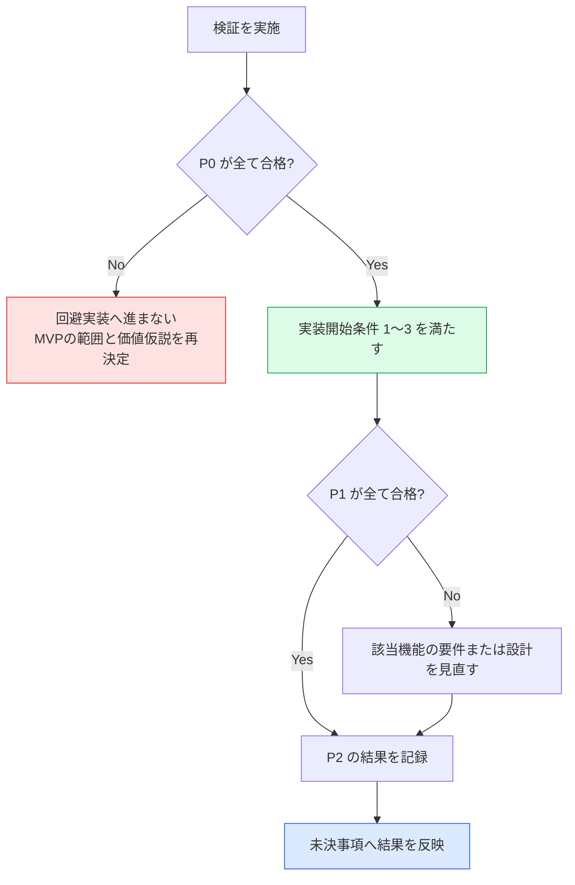

# AlgoLoom JudgeAdapter 技術検証計画

> 対象: MVPの実装を開始する前に確認する、現在のAtCoderに対する`JudgeAdapter`の技術的成立性
>
> 状態: 検証完了（方式Cによる主要導線は[`p0-04`](../verification/judge-adapter/results/2026-08-11-p0-04.md)、[`p0-07`](../verification/judge-adapter/results/2026-08-12-p0-07.md)、[`p0-16`](../verification/judge-adapter/results/2026-08-12-p0-16.md)、[`p0-22`](../verification/judge-adapter/results/2026-08-12-p0-22.md)で確認し、`V-01`〜`V-05`と`V-09`が合格。[`p0-23`](../verification/judge-adapter/results/2026-08-12-p0-23.md)で再設計後の方式AによるCookie限定取得、本人照合、Keychain保存、新規プロセス再照合、後始末を確認し、`V-10`も合格。[`p1-01`](../verification/judge-adapter/results/2026-08-13-p1-01.md)で`p0-22`の提出IDを別プロセスから再照合し、追加提出なしで最終判定を再取得したため`V-06`も合格。[`p1-02`](../verification/judge-adapter/results/2026-08-13-p1-02.md)で通常観測とローカル制御を分け、期限を推測せずに認証失敗を分類できたため`V-07`も合格。[`p1-03`](../verification/judge-adapter/results/2026-08-13-p1-03.md)でCookie更新、明示期限、再起動後の本人照合、失効・競合・秘密情報保管庫障害の安全停止を確認し、`V-11`も合格。[`p2-01`](../verification/judge-adapter/results/2026-08-13-p2-01.md)でジャッジ実行時間とメモリの単位正規化、欠損時の判定保存継続を確認し、`V-08`も合格。P0は5/5、P1は4/4、P2は2/2で、全11項目が合格。MVP実装開始条件1〜3に対応する技術検証を充足）
>
> 作成日: 2026年8月10日
>
> 関連文書:
> - [MVPスコープ §4](../product/mvp.md#4-mvpの実装開始条件)
> - [AtCoder認証設計](../architecture/atcoder-authentication.md)
> - [MVP機能設計 §14](../../spec/features.md#14-実装順序)
> - [MVP機能設計 §8.5](../../spec/features.md#85-atcoder側の変更検知と互換性確認f-submit-05)
> - [Core契約 §6](../architecture/core-contracts.md#6-提出契約)
> - [配布方針ガイド §5](../operations/algoloom-distribution.md#5-スクレイピングとアクセス負荷)
> - [未決事項一覧](unresolved-decisions.md)
> - [技術検証の実施手順と成果物](../verification/judge-adapter/README.md)

## ドキュメント概要

本書は、実装開始前に何を実証するか、どこまでできれば合格とするか、どの未決事項へ結果を反映するかを定義します。

## 0. 結論

実証する仮説は一つです。

> 現在のAtCoderに対して、利用者自身のアカウントとセッションで、入出力例の取得・アカウント確認・提出・提出IDの取得・判定確認が成立し、MVP候補の方式AでそのセッションをBot対策の回避なしに安全に確立できる。

これは[MVPスコープ §4](../product/mvp.md#4-mvpの実装開始条件)の実装開始条件1〜3を満たすための作業です。方式Cで主要導線を先に検証し、方式Aを別のP0で検証します。**いずれかのP0が不合格の場合は回避実装へ進まず、MVPの範囲と価値仮説を再決定します。**

実行固有の検証コード、一時出力、認証情報は破棄前提とします。一方、秘密情報や実行固有値を含まず、通信と外部作用の上限をレビューでき、再検証や将来の実装判断に使える汎用の検証支援コードは[`scripts/verification/`](../../scripts/verification/)へ保持できます。保持したコードを製品コードまたは実サービスの証拠とは扱いません。観測の正本は匿名化した実行記録と合否判定です。

## 1. 検証しないこと

- 性能測定、4言語×3OSの網羅（実装後の作業）
- 製品コードの作成、`JudgeAdapter`の最終インターフェース設計
- AIレビュー、クラウド同期に関わる確認
- 一括取得、非公開テストの取得、Bot対策の回避
- レート制限を意図的に発生させること

## 2. 優先度の定義

| 優先度 | 意味 | 不合格時の扱い |
|---|---|---|
| **P0** | 失敗すればMVPが成立しない | 合格するまで実装へ進まない。範囲と価値仮説を再決定する |
| **P1** | 設計した要件を実装できるかが決まる | 該当機能の要件または設計を見直す |
| **P2** | 取得できれば使う | 記録だけ残す。MVPは成立する |

## 3. 検証項目

### 3.1. P0 — 主要導線の成立

| ID | 実証すること | 合格条件 | 関係する機能 |
|---|---|---|---|
| `V-01` | 終了済み過去問1件から公開入出力例を取得できる | 入力と期待出力の組を、件数と対応関係を保って取得できる。取得元と取得時刻を記録できる | `F-PROBLEM-02` |
| `V-02` | 方式Cで取り込んだ現在のセッションがどのアカウントかを、提出せずに確認できる | 入力を表示しない対話経路で本人の`REVEL_SESSION`だけを一時的に取り込み、アカウント識別情報を一意に取得できる。空のセッションによる未認証、認証済み、ページ構造の変更を区別し、期待する本人アカウントと一致する | `F-SUBMIT-01` |
| `V-03` | 明示操作で1件を提出し、提出IDを取得できる | 提出が受理され、AtCoderが発行した提出IDを取得できる | `F-SUBMIT-03` |
| `V-04` | 提出IDを基準に判定を確認できる | 判定待ちと最終判定を区別して取得できる。取得時刻を伴う観測として記録できる | `F-SUBMIT-04` |
| `V-10` | 方式AでMVP用のセッションを安全に確立できる | Cloudflare保護ページをリモート制御状態にしない空の専用可視ブラウザで、利用者がログインとTurnstileを手動で完了できる。Bot対策を回避せず、ヘルパーが`REVEL_SESSION`だけを取得し、同じアカウント識別情報を確認できる。既存プロファイルを参照せず、秘密情報をログ等へ残さず、ブラウザ・一時プロファイルを後始末できる | `F-SUBMIT-01` |

### 3.2. P1 — 設計要件の実装可能性

| ID | 実証すること | 合格条件 | 関係する機能 |
|---|---|---|---|
| `V-05` | 正規言語IDを、対象コンテストで有効なジャッジ言語へ一意に解決できる | 言語ID、表示名、処理系、バージョンを提出時に取得し保存できる。一意に決まらない場合を検出できる | `F-SUBMIT-02` |
| `V-06` | 送信後にプロセスが落ちても、提出IDから同じ提出を再照合できる | 別プロセスから提出IDで判定を再取得できる。重複提出せずに回復できる | `F-SUBMIT-04`、`E2E-09`、`E2E-10` |
| `V-07` | 認証の失敗原因を区別できる | 未認証、期限切れ、AtCoder側の拒否、ページ構造の変更、通信障害を可能な範囲で分けられる | `F-SUBMIT-01` |
| `V-11` | Cookie更新と失効を推測なしで扱える | `Set-Cookie`の有無と更新を観測し、サーバーが返さない期限を生成せず、プロセス再起動後も同じアカウントを確認できる。期限切れ、更新競合、秘密情報保管庫の障害で提出前に安全に停止できる | `F-SUBMIT-01` |

### 3.3. P2 — 取得できれば使う観測値

| ID | 実証すること | 合格条件 | 関係する機能 |
|---|---|---|---|
| `V-08` | ジャッジ実行時間とメモリを取得できる | 返る場合は単位を正規化して保存できる。返らない場合も判定の保存を継続できる | `F-SUBMIT-04` |
| `V-09` | 外部通信の上限と再試行が設計どおり機能する | 接続・リクエスト・ポーリング全体の上限を分けて設定でき、待機指示を尊重できる | `F-PROBLEM-01` |

### 3.4. 認証方式と検証の関係

- 方式Cは`V-02`〜`V-09`の技術検証専用です。方式CをMVPの通常導線、CIまたは非対話実行の認証方式として採用しません。
- 対象提出フォーム内Turnstileのため、`V-03`だけは、通常の可視ブラウザ、検証専用拡張、利用者によるログイン・Turnstile・提出操作を使う経路で再検証できます。この経路はCookieを取得・保管せず、方式Aの成立や`V-10`合格の証拠にしません。
- 方式AはMVP製品の第一候補です。`p0-23`で代表するmacOS・Chromeの成立と`V-10`合格を確認しました。検証専用拡張と一時Keychainヘルパーを、そのまま製品の配布方式として決定したとは扱いません。
- 方式Cの`V-02`〜`V-04`と方式Aの`V-10`が合格したため、P0は5/5です。MVP実装開始条件1〜3に対応する技術検証は充足しました。
- 方式Cと方式Aの詳細な信頼境界は[AtCoder認証設計](../architecture/atcoder-authentication.md)を正とします。

## 4. 合否の判定

P0の不合格を、実装の工夫で迂回できる問題として扱いません。[MVPスコープ §7](../product/mvp.md#7-変更管理)の変更管理に従います。

## 5. 検証する未決事項

本検証は、次の未決事項へ根拠を与えます。**検証だけで決定はしません。** 得られた事実を持ち帰り、各文書で判断します。

| 未決事項 | 本検証が与えるもの | 決定する場所 |
|---|---|---|
| [2.3 実行・保持・性能の具体値](unresolved-decisions.md#23-実行保持性能の具体値) | 判定確認の所要時間、ポーリング間隔と最大待機、接続とリクエストの上限の初期値 | 実測後に確定 |
| [1.6 任意機能の具体的な導線](unresolved-decisions.md#16-任意機能の具体的な導線) | 認証状態を確認する具体的な操作と方式Aの初回・再認証導線が成立するか（`V-02`、`V-07`、`V-10`、`V-11`） | CLI設計 |
| [8.1 公開情報に基づく配布判断と再確認gate](unresolved-decisions.md#81-公開情報に基づく配布判断と再確認gate) | 配布判断に用いる事実。実際のリクエスト数、間隔、保存する内容、認証方式 | [`TD-06`〜`TD-08`](../../TODO.md#フェーズ1-公開情報による配布判断)で反映済み |

あわせて、`online-judge-tools`を`JudgeAdapter`の初期実装として採用できるかを判断できます。検証結果を持ち帰って行った採否と初期実装の方針は、[ライブラリ選定記録](library-selection.md#5-online-judge-toolsの採否)を正とします。ライブラリ名をドメインや保存スキーマの契約にはしません。

## 6. 実施の前提と安全条件

| 項目 | 条件 |
|---|---|
| 対象問題 | 終了済みの過去問1件のみ |
| アカウント | 検証者自身のAtCoderアカウント |
| 言語・OS | 1言語・1OSに限定する |
| 取得範囲 | 公開されている入出力例だけ。非公開テストと問題文を取得しない |
| アクセス | 間隔を空ける。一括取得と背後でのクロールを行わない |
| レート制限 | 意図的に発生させない。発生した場合は指示された待機時間を尊重する |
| 提出許可 | 日単位や検証全体の累積上限ではなく、目的と対象を事前に記録して明示承認した実サービス検証実行ごとに最大1件。`SEND_STARTED`相当以降は結果が成功・失敗・不明のいずれでも枠を消費し、同じ許可で再提出しない |
| Bot対策 | 回避・迂回を実装しない |
| 方式C | 検証者本人が通常のブラウザで取得した`REVEL_SESSION`一つだけを、入力を表示しない対話経路から検証用一時領域へ取り込む。`argv`、環境変数、リポジトリ、成果物へ値を置かない |
| V-03ブラウザ経路 | 空の専用プロファイルへ検証専用拡張を人が手動で読み込み、ログイン、AtCoder本体のエディタをAceからプレーン欄、Ace、プレーン欄の順に切り替え、Ace上のソースを目視確認する。Turnstileと最後の提出ボタンも人が操作する。拡張は往復後、承認時、送信時に可視プレーンテキスト欄と直列化対象のソース一致を検査する。CDP、WebDriver、リモートデバッグ、Cookie API、network監視、トークン値の読取、提出クリックの自動化を行わない。提出IDと匿名化済み観測だけを認証付きloopbackへ返す |
| 方式A | 空の専用プロファイルと可視ブラウザを使用し、ID・パスワード入力とTurnstileは人が行う。Cloudflare保護ページをCDP等でリモート制御せず、既存プロファイルの参照、`navigator.webdriver`の隠蔽、指紋偽装、ヘッドレス化、Turnstile自動操作を行わない。`p0-23`では手動読込した検証専用拡張が明示操作後に`REVEL_SESSION`だけを取得する境界を確認した |
| 記録 | ソースコード、Cookie、トークン、生のヘッダーを残さない |

## 7. 成果物

- 検証項目ごとの観測記録（取得できた項目、形式、欠損、所要時間）
- `V-01`〜`V-11`の合否判定
- 未決事項2.3へ渡す初期値の候補
- 未決事項8.1の配布判断に用いる検証事実
- P0が不合格の場合は、MVPの範囲と価値仮説の再検討案

観測記録は事実だけを残し、判断は各正本文書で行います。

匿名化済みの成果物は[`docs/verification/judge-adapter/results/`](../verification/judge-adapter/results/)へ保存し、[記録テンプレート](../verification/judge-adapter/results/run-record-template.md)を使用します。検証コード、一時出力、認証情報は成果物へ含めません。再利用可能な検証支援コードは[`scripts/verification/`](../../scripts/verification/)へ分離し、実行記録の代わりにしません。実行環境、停止条件、記録の手順は[技術検証の実施手順](../verification/judge-adapter/README.md)を参照します。

## 8. 実施順序

| 順序 | 作業 | 理由 |
|---:|---|---|
| 1 | `V-02` アカウント確認 | 他の項目の前提。提出せずに確認できるため副作用が最も小さい |
| 2 | `V-01` 入出力例の取得 | 外部への書き込みを伴わない |
| 3 | `V-05` ジャッジ言語の解決 | 提出前に必要。ここで一意に決まらなければ提出へ進まない |
| 4 | `V-03` 提出と提出IDの取得 | 最初の外部作用。明示承認した実サービス検証実行内で最大1件だけ行う |
| 5 | `V-04` 判定確認 | `V-03`の結果を使う |
| 6 | `V-06` 提出IDによる再照合 | 追加提出をせず、`V-03`の提出IDを再利用する |
| 7 | `V-10` 方式Aの認証確立 | 方式Cによる主要導線とは別の実行として、追加提出なしで製品候補を検証する |
| 8 | `V-07`、`V-11` 認証失敗・更新の分類 | AtCoderへ障害を起こさず、通常観測とローカル制御を分ける |
| 9 | `V-08`、`V-09` | 観測の記録 |

方式Cによる主要導線の実行と方式Aの実行は、別の実行記録に分けられます。方式Aの検証では追加提出を行いません。

AtCoderへの提出上限は、日単位でもリポジトリの検証全体に対する生涯上限でもありません。提出が必要な実サービス検証は、目的、対象問題、言語、使用する支援コード、既存提出を再利用できない理由、提出試行の上限を事前に記録し、人が明示承認した一つの検証実行として扱います。一つの承認につき`SEND_STARTED`相当へ進めるのは最大1回です。送信後の応答が不明、拒否、通信障害または判定観測失敗でも同じ承認で再提出せず、別の提出が必要なら理由を記録した新しい承認を行います。提出前に停止した場合は枠を消費しませんが、再開前に停止理由を解消して同じ実行目的と条件であることを再確認します。日付の変更だけで新しい提出は許可されません。

[`p0-21`](../verification/judge-adapter/results/2026-08-12-p0-21.md)により、`abc300_a`、`python-cpython`、[`atcoder_v04_integrated.py`](../../scripts/verification/atcoder_v04_integrated.py)を使い、V-03の提出ID取得直後からV-04の判定待ちと最終判定を観測する実サービス検証を1回承認しました。この承認で許可した新規提出は最大1件、自動再送と同一承認内の再提出は0回です。[`p0-22`](../verification/judge-adapter/results/2026-08-12-p0-22.md)でこの承認を使って1件を提出し、同じ提出IDの判定待ちと最終判定を取得して`V-04`へ合格しました。承認は消費済みであり、この記述を別の提出許可として再利用しません。

[`p0-23`](../verification/judge-adapter/results/2026-08-12-p0-23.md)では、追加提出なしで方式Aの`V-10`を実サービス検証しました。CDP等を使わない空の可視専用Chrome、Cookie限定取得、同一本人の照合、Keychain保存、新規プロセス再照合、後始末が成立したため合格です。これによりP0は5/5となりました。`Set-Cookie`更新、失効、競合、秘密情報保管庫障害は`V-11`へ残します。

[`p1-01`](../verification/judge-adapter/results/2026-08-13-p1-01.md)では、`p0-22`の所有者専用状態を、提出処理とは別に起動したプロセスから読み、追加提出なしで同じ提出IDの`FINAL`と最終判定`AC`を再取得しました。対象ID 1件のGETだけで回復できたため`V-06`は合格です。提出ID取得前の`REMOTE_STATUS_UNKNOWN`から一意な提出を復元する経路は、この合格根拠へ含めません。

[`p1-02`](../verification/judge-adapter/results/2026-08-13-p1-02.md)では、Cookieなしの実サービス対照1件とローカル固定入力13件を使い、未認証、サーバー由来の明示期限を過ぎた状態、AtCoder・Cloudflare側の拒否、ページ構造変更、通信障害を分けました。期限不明のログイン誘導は未認証または期限切れに留め、推測で期限切れと断定しない境界も確認したため`V-07`は合格です。実サービスの期限切れとCookieの更新・失効は`V-11`へ残します。

[`p1-03`](../verification/judge-adapter/results/2026-08-13-p1-03.md)では、方式Aの通常操作に伴う`GET /settings` 3回で`REVEL_SESSION`の値を変更する`Set-Cookie`と`Max-Age`を観測し、更新候補の本人照合後のKeychain置換、新規プロセスからの同一本人再照合を確認しました。期限なしを不明のまま扱う固定入力、明示期限切れと失効、世代付き更新競合、実Keychainの読取・書込障害を提出前停止へ関連付けたため`V-11`は合格です。P1は4/4となりました。

[`p2-01`](../verification/judge-adapter/results/2026-08-13-p2-01.md)では、`p0-22`の`submission-A`を追加提出なしで再利用し、本人提出一覧の固定フィルタ・先頭1ページから最終判定`AC`、ジャッジ実行時間11 ms、メモリ9,172 KiBを取得しました。実行時間を11 ms、メモリを9,392,128 byteへ正規化し、固定入力では欠損・未知形式でも値を補わず判定保存を継続できたため`V-08`は合格です。ローカル送信元ファイルサイズとAtCoderのコード長表示が一致しないことも観測し、前者をリモート提出の識別条件に使わない制約を得ました。P2は2/2となり、全11項目が合格しました。

## 9. 実装後の継続的な互換性確認

`V-01`〜`V-11`の合格は、検証時点のAtCoderに対する事実です。AtCoder側の提出フォーム、`contest.js`、サーバー応答またはBot対策が変更される可能性があるため、合格結果を無期限の互換性保証として扱いません。実装後は[`F-SUBMIT-05`](../../spec/features.md#85-atcoder側の変更検知と互換性確認f-submit-05)として次を継続します。

1. AtCoderのコンテストページが実際に参照する公式の`contest.js`は、release前にmaintainerが取得して確認します。実行時は提出に必要なpage・formで必須条件を確認し、hash確認だけを目的とする追加GETを利用者の各提出に課しません。明示診断を設ける場合も常駐監視にはしません。
2. 正確なバイト列の内容ハッシュを、AlgoLoomの版と対応する確認済みの値と比較します。取得先、取得時刻、ハッシュ方式、値は記録しますが、`contest.js`の本文はリポジトリへ保存しません。
3. 値が変わった場合は「壊れた」と断定せず、「変更検出・要再確認」とします。新しい値を自動で確認済みとせず、差分と`JudgeAdapter`の必須条件を確認します。
4. ハッシュが同じ場合も、アカウント識別、問題とジャッジ言語の一意な解決、ソースコードの同期、提出IDの識別、判定状態の解釈を個別に確認します。固定のセレクタまたはHTML全体の一致ではなく、これらの成立条件を契約とします。
5. 読み取り専用の確認と固定入力で十分な場合は、新規提出を行いません。新規提出でしか確認できない場合は、[§8](#8-実施順序)の承認と一件上限を新たに適用します。
6. 不一致、必須条件の不成立または確認不能を検出したら、回避実装を追加せず提出だけを停止します。ローカルテストと履歴は継続できるようにします。

2026年8月23日の予備確認では、`https://img.atcoder.jp/public/cd2aee3/js/contest.js`のSHA-256は`1f8e09170bc7a4851eccba272512749810d88fce33a820fafc83fa5495f3b2c8`でした。これは日付付きの観測値であり、仕様に固定する永続的な正解値ではありません。製品実装と各リリースは、その時点の取得先から再計算した値と必須条件の確認記録を基準にします。
