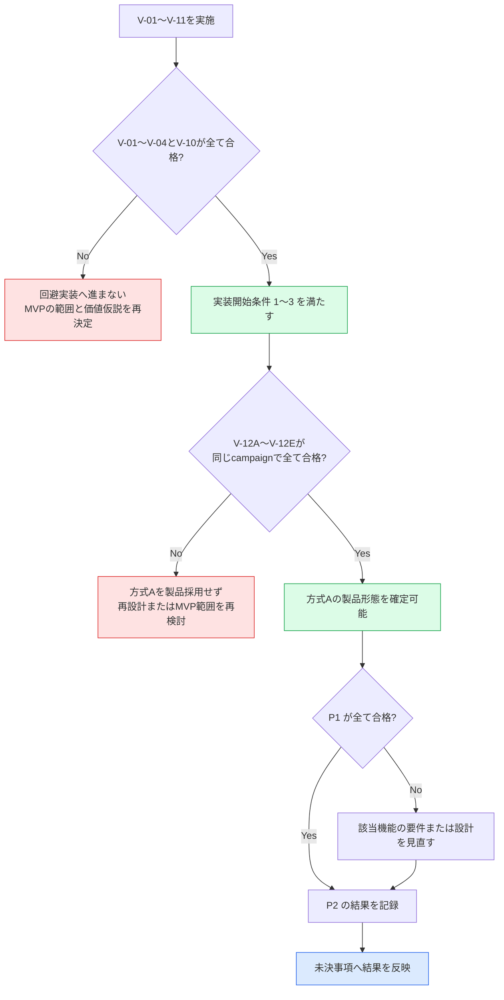

# AlgoLoom JudgeAdapter 技術検証計画

> 対象: MVPの実装を開始する前に確認する、現在のAtCoderに対する`JudgeAdapter`の技術的成立性
>
> 状態: `V-01`〜`V-11`の技術検証は完了（P0 5/5、P1 4/4、P2 2/2）し、MVP実装開始条件1〜3に対応する成立性を充足。方式Aの配布可能な製品形態と一往復UXを判定する追加P0 `V-12`は計画確定・未実施であり、合格前に製品形態の採用確定とは扱わない
>
> 作成日: 2026年8月10日
>
> 関連文書:
> - [MVPスコープ §4](../product/mvp.md#4-mvpの実装開始条件)
> - [AtCoder認証設計](../architecture/atcoder-authentication.md)
> - [AtCoder認証UX設計](atcoder-authentication-manual-operation-automation.md)
> - [MVP機能設計 §14](../../spec/features.md#14-実装順序)
> - [MVP機能設計 §8.5](../../spec/features.md#85-atcoder側の変更検知と互換性確認f-submit-05)
> - [Core契約 §6](../architecture/core-contracts.md#6-提出契約)
> - [配布方針ガイド §5](../operations/algoloom-distribution.md#5-スクレイピングとアクセス負荷)
> - [未決事項一覧](unresolved-decisions.md)
> - [技術検証の実施手順と成果物](../verification/judge-adapter/README.md)

## ドキュメント概要

本書は、実装開始前に何を実証するか、どこまでできれば合格とするか、どの未決事項へ結果を反映するかを定義します。

## 0. 結論

実証する仮説は一つです。

> 現在のAtCoderに対して、利用者自身のアカウントとセッションで、入出力例の取得・アカウント確認・提出・提出IDの取得・判定確認が成立し、MVP候補の方式AでそのセッションをBot対策の回避なしに安全に確立できる。

`V-01`〜`V-11`は[MVPスコープ §4](../product/mvp.md#4-mvpの実装開始条件)の実装開始条件1〜3を満たすための作業です。方式Cで主要導線を先に検証し、方式Aの原理を別のP0で検証しました。追加する`V-12`は、方式Aを第三者へ配布できる製品形態と、採用した一往復UXが一体として成立するかを判定するP0です。`V-12`の追加は`V-01`〜`V-11`の観測事実を変更しませんが、`V-12`が不合格なら方式Aを製品採用しません。**いずれかのP0が不合格の場合は回避実装へ進まず、MVPの範囲と価値仮説を再決定します。**

実行固有の検証コード、一時出力、認証情報は破棄前提とします。一方、秘密情報や実行固有値を含まず、通信と外部作用の上限をレビューでき、再検証や将来の実装判断に使える汎用の検証支援コードは[`scripts/verification/`](../../scripts/verification/)へ保持できます。保持したコードを製品コードまたは実サービスの証拠とは扱いません。観測の正本は匿名化した実行記録と合否判定です。

## 1. 検証しないこと

- 性能測定、4言語×3OSの網羅（実装後の作業）
- 製品コードの作成、`JudgeAdapter`の最終インターフェース設計
- AIレビュー、クラウド同期に関わる確認
- 一括取得、非公開テストの取得、Bot対策の回避
- レート制限を意図的に発生させること

## 2. 優先度の定義

| 優先度 | 意味 | 不合格時の扱い |
|---|---|---|
| **P0** | 失敗すればMVPが成立しない | `V-01`〜`V-04`・`V-10`は合格まで実装開始条件1〜3を満たさない。`V-12`は合格まで方式Aの製品形態を採用せず、依存する認証設計へ進まない。範囲と価値仮説を再決定する |
| **P1** | 設計した要件を実装できるかが決まる | 該当機能の要件または設計を見直す |
| **P2** | 取得できれば使う | 記録だけ残す。MVPは成立する |

## 3. 検証項目

### 3.1. P0 — 主要導線の成立

| ID | 実証すること | 合格条件 | 関係する機能 |
|---|---|---|---|
| `V-01` | 終了済み過去問1件から公開入出力例を取得できる | 入力と期待出力の組を、件数と対応関係を保って取得できる。取得元と取得時刻を記録できる | `F-PROBLEM-02` |
| `V-02` | 方式Cで取り込んだ現在のセッションがどのアカウントかを、提出せずに確認できる | 入力を表示しない対話経路で本人の`REVEL_SESSION`だけを一時的に取り込み、アカウント識別情報を一意に取得できる。空のセッションによる未認証、認証済み、ページ構造の変更を区別し、期待する本人アカウントと一致する | `F-SUBMIT-01` |
| `V-03` | 明示操作で1件を提出し、提出IDを取得できる | 提出が受理され、AtCoderが発行した提出IDを取得できる | `F-SUBMIT-03` |
| `V-04` | 提出IDを基準に判定を確認できる | 判定待ちと最終判定を区別して取得できる。取得時刻を伴う観測として記録できる | `F-SUBMIT-04` |
| `V-10` | 方式AでMVP用のセッションを安全に確立できる | Cloudflare保護ページをリモート制御状態にしない空の専用可視ブラウザで、利用者がログインとTurnstileを手動で完了できる。Bot対策を回避せず、ヘルパーが`REVEL_SESSION`だけを取得し、同じアカウント識別情報を確認できる。既存プロファイルを参照せず、秘密情報をログ等へ残さず、ブラウザ・一時プロファイルを後始末できる | `F-SUBMIT-01` |
| `V-12` | 方式Aの製品形態と一往復UXが一体として成立する | `V-12A`〜`V-12E`が同じcampaign manifestへ結び付き、5つすべてが合格する。署名済み限定公開拡張機能、製品相当helper、認証付き折返し通信、クリーンなテンプレート、秘密情報保管庫を組み合わせ、初回認証と`submit`からの再認証を回避手段なしで完了できる | `F-SUBMIT-01`、`F-SUBMIT-03` |

#### 3.1.1. V-12 方式A製品形態の検証

`V-12`は一つのtop-level P0 gateです。`V-12A`〜`V-12E`は原因分離と安全な再実行のためのsub検証であり、個別のP0件数へ数えません。一つでも不合格または未実施なら、`V-12`全体を部分合格にせず未合格とします。

一つの検証campaignは、不変のcampaign IDとmanifestで識別します。manifestは秘密値を含めず、少なくとも次を持ちます。

| 区分 | manifestへ記録する値 |
|---|---|
| 計画 | 本書のrevision、同意文面の版 |
| 拡張機能 | 固定ID、対象版、更新testに使う旧版と新版、配布元、権限の正規化済み一覧、source revision、署名済みbuildのhash |
| helper・通信 | helper版、配布物hash、protocol版、許可する送信元と状態遷移の版 |
| browser・host | 通常Google Chromeの版、OS名・版・CPU architecture。3 OS結果は同じmanifest内の環境別entryへ結び付ける |
| profile | template schema版、基準templateの秘密でない完全性識別子。profileの絶対path、Cookie、履歴、入力情報は含めない |

各sub結果は、campaign ID、参照したmanifest hash、環境entry、開始・終了時刻、入力の別名、証拠の種別、合否、停止理由、cleanup結果を記録します。一回限りの秘密値、Cookie、実account名、profileの絶対pathは記録しません。

##### `V-12`が対象としない範囲

`V-12`が確認するのは、検証支援物として作った拡張機能・helper・protocolによる**方式Aの成立性**です。次の2点は`V-12`の対象外であり、**`V-12`の合格をこれらが成立した証拠として扱いません。**

| # | 対象外の範囲 | 理由 | 引き渡し先 |
|---|---|---|---|
| 1 | 製品形態の拡張機能がChrome Web Storeの審査を通ること | `V-12`が審査を受けるのは「クッキーを1件読む拡張機能」である。製品形態は提出formの操作を加えるため単一目的の説明が変わる | [`TD-41`](../../TODO.md#td-41-製品形態の拡張機能の審査条件と確認gateを確定する) |
| 2 | 提出pageで動作するcontent scriptがTurnstileと共存すること | `V-12`の拡張機能は提出pageで動作せず、`V-12E`も提出確認画面までで止まる | [`TD-40`](../../TODO.md#td-40-提出ページのcontent-scriptとturnstileの共存を検証する) |

製品形態の拡張機能の責任範囲は[拡張機能の責任境界と提出の縮退運転設計](../features/extension-boundary-and-degraded-submission.md)を正とします。`V-12`の検証支援物とは責任範囲が異なるため、検証支援物のコードを製品実装へ複製しません。

##### `V-12A` 配布物・通信契約

| 項目 | 内容 |
|---|---|
| 入力 | 署名済み拡張機能、製品相当helper、protocol定義、同意文面、manifest、固定入力とmock |
| 検証層・環境 | OS非依存の契約test。通常CI、mock、fixtureで実行し、Chrome Web Store、AtCoderその他の外部serviceへ接続しない |
| 外部通信 | 外部通信0件。loopbackも実networkを開かず、固定入力または隔離したlocal test transportでprotocolを確認する |
| 事前条件 | manifestの必須項目が一意に埋まり、source revisionとbuild hashを照合でき、publisher credentialと署名用秘密値が入力・repository・成果物にない |
| 合格条件 | 固定ID・対象版・配布元・最小権限が期待値と一致する。権限は`cookies`、`storage`、`https://atcoder.jp/*`、`http://127.0.0.1/*`と初期化に必要な最小範囲に限定し、`debugger`、`webRequest`、`tabs`、`scripting`、`nativeMessaging`を要求しない。折返し通信は`127.0.0.1`の動的な待受番号、一回限りの秘密値、`Host`、署名済み拡張機能の送信元、本文上限、状態順序を検査する。接続先・名前・path・安全属性・非分割状態を検査し、`REVEL_SESSION`が厳密に1件の場合だけ一度受領できる。秘密値を通常log、error、成果物、配布物へ出さない |
| 停止条件 | manifest不一致、権限過剰、固定ID・版・配布元・hash不一致、protocol検査の欠落、対象外Cookieの受理、秘密値の出力または再利用を一つでも検出したら不合格とし、外部接続へ進まない |
| 残す証拠 | 秘密でないmanifest、build・権限照合結果、固定入力caseの件数と結果、外部通信0件、redaction検査、失敗caseが安全側停止した事実 |

##### `V-12B` 標準追加・テンプレート

| 項目 | 内容 |
|---|---|
| 入力 | `V-12A`に合格した同じ拡張機能・helper・manifest、空のAlgoLoom所有データ領域、対応版の通常Google Chrome |
| 検証層・環境 | 配布導線test。通常Chromeを備えた代表端末または同等のfull desktop VMで、拡張機能の追加・権限承認は人が標準画面から行う |
| 外部通信 | 固定したChrome Web Storeの拡張機能ページを1回開き、対象版の標準追加を1回だけ行う。利用者またはCLIが開始するnavigationと追加操作を記録し、Chrome内部のresource request数を固定契約にしない。AtCoder、Cloudflareまたは標準追加に不要な外部serviceへ意図した遷移を行わない |
| 事前条件 | 対象版が審査済み・限定公開中であること、公開範囲、固定ID、版、配布元、権限を確認できること。ChromeへのGoogle account追加・同期、developer mode、policy、外部拡張設定、OS registryを必要としないこと |
| 合格条件 | 標準画面から追加でき、警告を隠さず、利用者の中止を受け付ける。CLIが追加完了を固定ID・版・配布元・権限で自動検出し、Chromeの完全終了を確認して基準templateをcampaign中に一度だけ確定する。基準templateにAtCoderのCookie、履歴、入力情報がなく、正常な複製・可視起動・完全終了後の破棄が成立する |
| 停止条件 | 審査・限定公開状態を確認できない、標準追加できない、版・権限・配布元が不一致、既存profileまたは通常環境の変更が必要、Chromeを完全終了できない、templateの無秘密性または完全性を確認できない場合は不合格とし、`V-12D`へ進まない |
| 残す証拠 | Store状態の確認時刻、標準追加と自動検出の結果、表示された権限・警告の分類、Chrome完全終了、基準templateの確定回数、秘密でない完全性識別子、複製・破棄と既存profile非参照の結果 |

`V-12B`は、その結果を記録するためにCLIへ戻らず、同じCLI導線のまま`V-12D`へ続けます。Chromeの完全終了と、基準templateの一時複製を使うbrowserの自動再起動は同じCLI実行内の規定手順です。それ以外にsub境界で利用者がbrowserやhelperを再起動したり、配布物または基準templateを作り直したりしません。

##### `V-12C` 中断・更新・回復

| 項目 | 内容 |
|---|---|
| 入力 | 同じcampaignの配布物とmanifest、固定入力、使い捨てprofile、基準templateの読取り専用の使い捨て複製、caseごとに隔離したsecret namespace。Chrome本体等を変更するcaseは隔離した環境snapshotを使う |
| 検証層・環境 | OS非依存の契約test、native macOS・native Linux・native Windowsの3 OS統合test、更新導線だけの必要最小限の配布導線test。headless環境だけでChrome・OS統合の成立を代用しない |
| 外部通信 | 契約testと3 OS統合testは外部通信0件。配布導線testは固定した対象拡張機能について、caseごとに標準追加または更新を最大1操作だけ行い、送信先別に観測する。AtCoderとCloudflareへ接続しない |
| 事前条件 | `V-12D`の確認済み保存session、代表環境の基準template、通常系Chrome環境をcaseから隔離できる。各caseの開始前に残存process、待受、file lock、一時profile、未確認sessionが0件である |
| 合格条件 | 初回同意、拡張機能追加、browser起動、Cookie受領、本人確認、secret store保存、認証後遷移の各境界で、取消、timeout、browser終了、helper異常終了を安全側停止にできる。Chrome・拡張機能の更新前後、対象版・権限・配布元不一致、template破損、secret store障害、process・待受・file lockの競合を分類し、必要なら次回だけ初回設定へ戻す。各case後に一回限りの秘密値、未確認session、process、待受、file lock、一時profileを回収し、既存profile、基準template、通常系Chrome環境、確認済み保存sessionを変更しない |
| 停止条件 | caseを隔離できない、実サービスへの接続が必要、既存環境または基準templateを変更する、故障後のcleanupを確認できない場合はそのcaseを開始または継続しない。実際のChrome・拡張機能更新を巻き戻せない環境ではsnapshotなしに実行しない |
| 残す証拠 | case ID、中断境界、注入した故障の分類、検証層・OS、状態遷移、外部通信件数、提出0件、case前後の残存資源0件、保護対象を変更していないこと |

##### `V-12D` 初回認証

| 項目 | 内容 |
|---|---|
| 入力 | `V-12B`から連続する同じCLI実行、同じ配布物・helper・manifest・基準template、検証者本人の期待account、隔離したsecret namespace |
| 検証層・環境 | 通常Chromeを自動制御せず人が操作する代表環境での実サービスsmoke 1回目。物理端末を使用する |
| 外部通信 | browserによるAtCoder loginとCloudflareの通常通信、helperによる本人確認用`GET /settings`を最大2回に限定する。1回は保存前、1回は新しいprocessからの再照合に使う。人が行うlogin formの通信は許可し、browserのnavigationと手動操作を記録する。helper・CLIからAtCoderへのPOST、提出formのPOST、提出、session維持目的のbackground request、自動再試行は0件とする。Chrome内部のresource request数は固定契約にせず、生のnetwork logを保存しない |
| 事前条件 | `V-12A`に合格し、`V-12B`で同じ導線内の基準template確定まで成功している。manifest一致、外部条件、期待account、secret storeの隔離、開始時の残存資源0件を確認している |
| 合格条件 | 利用者がloginと必要なTurnstileだけを手動操作し、CloudflareまたはAtCoderに拒否されない。初期化ページへ戻る操作、拡張機能画面操作、URL・code・Cookieのcopy-and-pasteを求めず、`REVEL_SESSION`だけを一度受領する。本人照合後だけsecret storeへ保存し、新しいprocessから同じ本人を再照合し、CLIへ認証済みaccountを表示する |
| 停止条件 | CloudflareまたはAtCoderの拒否、リモート制御・回避設定の必要、対象Cookieの不成立、本人不一致、保存・再照合失敗、秘密値混入、cleanup不能では不合格とし、`V-12C`以降へ進まない |
| 残す証拠 | 手動操作の種類、一往復の状態遷移、本人一致、Cookie候補数、secret store保存と新process再照合、許可した外部通信の集計、追加提出0件、実行用profile・未確認session・待受処理の回収結果 |

##### `V-12E` `submit`からの再認証

| 項目 | 内容 |
|---|---|
| 入力 | 同じcampaignの配布物・helper・manifest、`V-12B`で一度だけ確定した同じ基準template、別のCLI実行、保存済みlocal sessionを削除契約に従って除去した状態、終了済み過去問1件の提出前入力 |
| 検証層・環境 | 3 OS統合testでは実サービスをstub化して自動処理とOS境界を確認する。実サービスsmoke 2回目は`V-12D`と同じ代表環境・基準templateを使い、通常Chromeを人が操作する |
| 外部通信 | 3 OS統合testは外部通信0件。実サービスsmokeではbrowserによるAtCoder login、Cloudflareの通常通信、対象の提出確認pageへの遷移と、helperによる本人確認用`GET /settings`最大1回に限定する。人が行うlogin formの通信は許可し、browserのnavigationと手動操作を記録する。helper・CLIからAtCoderへのPOST、提出formのPOST、最後の提出操作、追加提出、自動再試行、AtCoder側の意図的なsession失効は0件とする。Chrome内部のresource request数は固定契約にせず、生のnetwork logを保存しない |
| 事前条件 | `V-12A`、`V-12B`、`V-12C`の必須case、`V-12D`が同じmanifestで合格し、基準templateの完全性を再確認できる。AtCoder側sessionを失効させず、確認済みlocal sessionだけを製品の削除契約で除去し、開始時の一時資源が0件である |
| 合格条件 | `submit`相当の入口が再認証理由と中止方法を表示してbrowserを自動起動する。別の認証commandや追加のYes/No確認を挟まず、利用者の認証固有操作をAtCoder loginだけにし、認証後は同じbrowserで対象・言語・sourceを示す提出確認画面まで進む。CLIとbrowserの移動は一往復で、手動ページ探索とcopy-and-pasteを要求しない。最後の提出操作は行わない |
| 停止条件 | 別command、追加確認、手動ページ移動、別browserへの再起動、直接HTTP提出、既存profile参照が必要になるか、本人照合、同一browser遷移、cleanupを確認できない場合は不合格とする |
| 残す証拠 | 3 OS統合test結果、再認証理由・中止方法の表示、browser自動起動、手動操作、一往復と同一browserの状態遷移、外部通信集計、提出formのPOST・追加提出0件、cleanup結果 |

`V-12B → V-12D`、`V-12D`内の「login → Cookie受領 → 本人確認 → 保存 → 新process再照合」、`V-12E`内の「submit開始 → 再認証 → 同じbrowserで提出確認」の3区間は、途中結果を記録しても実行を分断しません。取消は実行を終了させるため、`V-12C`の独立caseで確認します。故障caseもcaseごとの使い捨て資源を用い、実サービスsmokeの状態へ注入しません。

基準templateは`V-12B`で一度だけ確定し、代表環境の`V-12E`が終わるまで読取り基準として保持します。各実行用profile、未確認session、待受処理はcaseごとに回収し、campaign終了時に基準template、store用一時情報、検証用secret store項目を削除します。基準template自体にAtCoderのCookie、履歴、入力情報を残しません。3 OS統合testで使うprofile fixtureは環境ごとに作る使い捨て入力であり、代表環境の基準templateや配布導線の成立証拠を置き換えません。

検証物またはmanifestが変わった場合の結果無効化規則は次のとおりです。manifestはrevisionごとに不変とし、変更後は新しいrevisionを作ります。旧結果を新しいmanifestへ直接付け替えません。表が再利用を許す結果は、当該sub検証が依存する入力projectionのhash一致を確認し、旧campaign ID、旧証拠、同一性の根拠を記した新しいsub結果として再承認できます。これにより全sub結果を同じ最終manifest revisionへ結び付けつつ、無関係な実サービスsmokeを再実行しません。入力projectionが変わる結果と、それに依存する後続結果は再実行します。

| 変更 | 直接無効になる結果 | 扱い |
|---|---|---|
| 拡張機能の固定ID、対象版、配布元、権限、source、build hash | `V-12A`〜`V-12E` | 別の製品形態として新campaignを開始する |
| 更新test用の版の組だけ | `V-12A`の版照合case、`V-12C`の更新case | 対象版と通常導線が不変なら実サービスsmokeは再利用できる |
| helper版・build hash、protocol版、状態遷移 | `V-12A`、`V-12B`、`V-12C`、`V-12D`、`V-12E` | 挙動へ影響するため新campaignを開始する |
| Chrome版 | `V-12B`、該当Chromeを使う`V-12C`、`V-12D`、`V-12E` | `V-12A`の純粋なcontract結果だけは再利用できる |
| OS・CPU architecture・secret store実装 | 該当環境の`V-12C`・`V-12E`、代表環境を変える場合は`V-12B`・`V-12D`も含む | 他の環境entryの結果は維持できる |
| template schema・完全性規則 | `V-12B`〜`V-12E` | `V-12A`の通信・配布物contractだけは再利用できる |
| 同意文面の版または権限説明 | `V-12A`〜`V-12E` | 再同意と初回導線へ影響するため新campaignを開始する |
| 判定条件を変える検証計画revision | 影響するsub結果 | 変更理由と影響範囲を記録し、旧結果を新条件の合格に読み替えない |
| 結果文書だけの誤字・匿名化修正 | なし | manifestと観測事実が不変であることをreviewする |
| 他と独立した`V-12C`故障caseの追加 | 追加caseだけ | 追加caseが合格するまで集約結果は未合格とするが、無関係な実サービスsmokeを再実行しない |

[AtCoder認証UX設計 §6](atcoder-authentication-manual-operation-automation.md#6-採用条件)との対応は次のとおりです。

| 採用条件 | 対応するsub検証・層 |
|---|---|
| 初回追加後に手動でページを戻らず導入完了を検出する | `V-12B`の配布導線testから`V-12D`の実サービスsmokeまでを分断しない区間 |
| テンプレートの複製、更新、破棄を安全に行う | `V-12B`の配布導線test、`V-12C`の3 OS統合test・更新case |
| 失効後再認証の手動操作をAtCoderログインだけにする | `V-12E`の3 OS統合testと実サービスsmoke |
| `submit`からの再認証と提出を同じbrowserで連続させる | `V-12E`の分断しない区間。最後の提出操作は行わず、提出確認画面までを確認する |
| 正常終了と全中断点で既存profileと秘密情報を汚さず一時資源を回収する | `V-12C`の契約test・3 OS統合test、`V-12D`・`V-12E`の実サービスsmoke後のcleanup |
| CLIとbrowserの移動を一往復とし、copy-and-pasteや手動探索をなくす | `V-12B → V-12D`と`V-12E`の分断しない実サービス区間 |

### 3.2. P1 — 設計要件の実装可能性

| ID | 実証すること | 合格条件 | 関係する機能 |
|---|---|---|---|
| `V-05` | 正規言語IDを、対象コンテストで有効なジャッジ言語へ一意に解決できる | 言語ID、表示名、処理系、バージョンを提出時に取得し保存できる。一意に決まらない場合を検出できる | `F-SUBMIT-02` |
| `V-06` | 送信後にプロセスが落ちても、提出IDから同じ提出を再照合できる | 別プロセスから提出IDで判定を再取得できる。重複提出せずに回復できる | `F-SUBMIT-04`、`E2E-09`、`E2E-10` |
| `V-07` | 認証の失敗原因を区別できる | 未認証、期限切れ、AtCoder側の拒否、ページ構造の変更、通信障害を可能な範囲で分けられる | `F-SUBMIT-01` |
| `V-11` | Cookie更新と失効を推測なしで扱える | `Set-Cookie`の有無と更新を観測し、サーバーが返さない期限を生成せず、プロセス再起動後も同じアカウントを確認できる。期限切れ、更新競合、秘密情報保管庫の障害で提出前に安全に停止できる | `F-SUBMIT-01` |

### 3.3. P2 — 取得できれば使う観測値

| ID | 実証すること | 合格条件 | 関係する機能 |
|---|---|---|---|
| `V-08` | ジャッジ実行時間とメモリを取得できる | 返る場合は単位を正規化して保存できる。返らない場合も判定の保存を継続できる | `F-SUBMIT-04` |
| `V-09` | 外部通信の上限と再試行が設計どおり機能する | 接続・リクエスト・ポーリング全体の上限を分けて設定でき、待機指示を尊重できる | `F-PROBLEM-01` |

### 3.4. 認証方式と検証の関係

- 方式Cは`V-02`〜`V-09`の技術検証専用です。方式CをMVPの通常導線、CIまたは非対話実行の認証方式として採用しません。
- 対象提出フォーム内Turnstileのため、`V-03`だけは、通常の可視ブラウザ、検証専用拡張、利用者によるログイン・Turnstile・提出操作を使う経路で再検証できます。この経路はCookieを取得・保管せず、方式Aの成立や`V-10`合格の証拠にしません。
- 方式AはMVP製品の第一候補です。`p0-23`で代表するmacOS・Chromeの成立と`V-10`合格を確認しました。検証専用拡張と一時Keychainヘルパーを、そのまま製品の配布方式として決定したとは扱いません。
- 方式Cの`V-02`〜`V-04`と方式Aの`V-10`が合格したため、P0は5/5です。MVP実装開始条件1〜3に対応する技術検証は充足しました。
- `V-12`は、`V-10`の合格を配布可能な製品形態の合格へ読み替えず、署名済み拡張機能、製品相当helper、テンプレートと一往復UXの組み合わせを追加で判定します。`V-12A`〜`V-12E`は方式Aのsub結果であり、方式Cや`V-03`の手動読込経路をfallbackにしません。
- 方式Cと方式Aの詳細な信頼境界は[AtCoder認証設計](../architecture/atcoder-authentication.md)を正とします。

## 4. 合否の判定

`V-01`〜`V-11`のP0 5/5という完了実績と、追加P0 `V-12`の未実施を分けて記録します。`V-12`は5つのsub結果が同じcampaign manifestで合格した場合だけ合格です。P0の不合格を、実装の工夫で迂回できる問題として扱いません。[MVPスコープ §7](../product/mvp.md#7-変更管理)の変更管理に従います。

## 5. 検証する未決事項

本検証は、次の未決事項へ根拠を与えます。**検証だけで決定はしません。** 得られた事実を持ち帰り、各文書で判断します。

| 未決事項 | 本検証が与えるもの | 決定する場所 |
|---|---|---|
| [2.3 実行・保持・性能の具体値](unresolved-decisions.md#23-実行保持性能の具体値) | 判定確認の所要時間、ポーリング間隔と最大待機、接続とリクエストの上限の初期値 | 実測後に確定 |
| [1.6 任意機能の具体的な導線](unresolved-decisions.md#16-任意機能の具体的な導線) | 認証状態を確認する具体的な操作と、方式Aの製品形態、初回・再認証の一往復導線が成立するか（`V-02`、`V-07`、`V-10`〜`V-12`） | `V-12`の結果を認証設計とCLI設計へ反映 |
| [8.1 公開情報に基づく配布判断と再確認gate](unresolved-decisions.md#81-公開情報に基づく配布判断と再確認gate) | 配布判断に用いる事実。実際のリクエスト数、間隔、保存する内容、認証方式 | [`TD-06`〜`TD-08`](../../TODO.md#フェーズ1-公開情報による配布判断)で反映済み |

あわせて、`online-judge-tools`を`JudgeAdapter`の初期実装として採用できるかを判断できます。検証結果を持ち帰って行った採否と初期実装の方針は、[ライブラリ選定記録](library-selection.md#5-online-judge-toolsの採否)を正とします。ライブラリ名をドメインや保存スキーマの契約にはしません。

## 6. 実施の前提と安全条件

| 項目 | 条件 |
|---|---|
| 対象問題 | 終了済みの過去問1件のみ |
| アカウント | 検証者自身のAtCoderアカウント |
| 言語・OS | `V-01`〜`V-11`は1言語・1OSに限定する。`V-12D`の実サービスsmokeは代表1OS、`V-12C`・`V-12E`のOS統合範囲はnative macOS・native Linux・native Windowsとする |
| 取得範囲 | 公開されている入出力例だけ。非公開テストと問題文を取得しない |
| アクセス | 間隔を空ける。一括取得と背後でのクロールを行わない |
| レート制限 | 意図的に発生させない。発生した場合は指示された待機時間を尊重する |
| 提出許可 | 日単位や検証全体の累積上限ではなく、目的と対象を事前に記録して明示承認した実サービス検証実行ごとに最大1件。`SEND_STARTED`相当以降は結果が成功・失敗・不明のいずれでも枠を消費し、同じ許可で再提出しない |
| Bot対策 | 回避・迂回を実装しない |
| 方式C | 検証者本人が通常のブラウザで取得した`REVEL_SESSION`一つだけを、入力を表示しない対話経路から検証用一時領域へ取り込む。`argv`、環境変数、リポジトリ、成果物へ値を置かない |
| V-03ブラウザ経路 | 空の専用プロファイルへ検証専用拡張を人が手動で読み込み、ログイン、AtCoder本体のエディタをAceからプレーン欄、Ace、プレーン欄の順に切り替え、Ace上のソースを目視確認する。Turnstileと最後の提出ボタンも人が操作する。拡張は往復後、承認時、送信時に可視プレーンテキスト欄と直列化対象のソース一致を検査する。CDP、WebDriver、リモートデバッグ、Cookie API、network監視、トークン値の読取、提出クリックの自動化を行わない。提出IDと匿名化済み観測だけを認証付きloopbackへ返す |
| 方式A | 空の専用プロファイルと可視ブラウザを使用し、ID・パスワード入力とTurnstileは人が行う。Cloudflare保護ページをCDP等でリモート制御せず、既存プロファイルの参照、`navigator.webdriver`の隠蔽、指紋偽装、ヘッドレス化、Turnstile自動操作を行わない。`p0-23`では手動読込した検証専用拡張が明示操作後に`REVEL_SESSION`だけを取得する境界を確認した |
| `V-12` | 署名済み限定公開拡張機能と製品相当helperを使い、同じcampaign manifest、sub検証ごとの外部通信上限、分断しない3区間、caseごとの隔離とcleanupに従う。最後の提出操作、提出formのPOST、追加提出は行わない |
| 記録 | ソースコード、Cookie、トークン、生のヘッダーを残さない |

## 7. 成果物

- 検証項目ごとの観測記録（取得できた項目、形式、欠損、所要時間）
- `V-01`〜`V-11`の合否判定と、`V-12A`〜`V-12E`を集約した`V-12`の合否判定
- `V-12`の秘密でないcampaign manifest、変更時の無効化判断、caseごとのcleanup結果
- 未決事項2.3へ渡す初期値の候補
- 未決事項8.1の配布判断に用いる検証事実
- P0が不合格の場合は、MVPの範囲と価値仮説の再検討案

観測記録は事実だけを残し、判断は各正本文書で行います。

匿名化済みの成果物は[`docs/verification/judge-adapter/results/`](../verification/judge-adapter/results/)へ保存し、[記録テンプレート](../verification/judge-adapter/results/run-record-template.md)を使用します。検証コード、一時出力、認証情報は成果物へ含めません。再利用可能な検証支援コードは[`scripts/verification/`](../../scripts/verification/)へ分離し、実行記録の代わりにしません。実行環境、停止条件、記録の手順は[技術検証の実施手順](../verification/judge-adapter/README.md)を参照します。

## 8. 実施順序

`V-01`〜`V-11`は次の順で実施済みです。

| 順序 | 作業 | 理由 |
|---:|---|---|
| 1 | `V-02` アカウント確認 | 他の項目の前提。提出せずに確認できるため副作用が最も小さい |
| 2 | `V-01` 入出力例の取得 | 外部への書き込みを伴わない |
| 3 | `V-05` ジャッジ言語の解決 | 提出前に必要。ここで一意に決まらなければ提出へ進まない |
| 4 | `V-03` 提出と提出IDの取得 | 最初の外部作用。明示承認した実サービス検証実行内で最大1件だけ行う |
| 5 | `V-04` 判定確認 | `V-03`の結果を使う |
| 6 | `V-06` 提出IDによる再照合 | 追加提出をせず、`V-03`の提出IDを再利用する |
| 7 | `V-10` 方式Aの認証確立 | 方式Cによる主要導線とは別の実行として、追加提出なしで製品候補を検証する |
| 8 | `V-07`、`V-11` 認証失敗・更新の分類 | AtCoderへ障害を起こさず、通常観測とローカル制御を分ける |
| 9 | `V-08`、`V-09` | 観測の記録 |

方式Cによる主要導線の実行と方式Aの実行は、別の実行記録に分けられます。方式Aの検証では追加提出を行いません。

`V-12`は別の一campaignとして、次の順で実行します。

| 順序 | 作業 | 後続へ進む条件 |
|---:|---|---|
| 1 | `V-12A` 配布物・通信契約 | manifest、版・権限・配布元、protocol、Cookie許可list、redactionの全caseが外部通信0件で合格する |
| 2 | `V-12B → V-12D` 標準追加から初回認証まで | `V-12B`を記録のために分断せず、同じCLI導線・配布物・helper・基準templateで`V-12D`まで合格する |
| 3 | `V-12C` 中断・更新・回復 | 必須caseが隔離環境で合格し、各case後の一時資源が0件で、基準templateと確認済みsessionを変更していない |
| 4 | `V-12E` `submit`からの再認証 | 同じmanifest・基準templateを別のCLI実行から使用し、最後の提出操作なしで同じbrowserの提出確認画面まで進む |

各sub開始時にmanifest一致と前段の合格を確認します。不一致または停止条件への該当があれば、依存する後続へ進みません。基準templateは`V-12B`で一度だけ確定し、`V-12E`まで再作成しません。`V-12C`の取消・故障caseは独立実行とし、実サービスsmokeを故障注入の対象にしません。`V-12`では提出formのPOSTと追加提出を行いません。

AtCoderへの提出上限は、日単位でもリポジトリの検証全体に対する生涯上限でもありません。提出が必要な実サービス検証は、目的、対象問題、言語、使用する支援コード、既存提出を再利用できない理由、提出試行の上限を事前に記録し、人が明示承認した一つの検証実行として扱います。一つの承認につき`SEND_STARTED`相当へ進めるのは最大1回です。送信後の応答が不明、拒否、通信障害または判定観測失敗でも同じ承認で再提出せず、別の提出が必要なら理由を記録した新しい承認を行います。提出前に停止した場合は枠を消費しませんが、再開前に停止理由を解消して同じ実行目的と条件であることを再確認します。日付の変更だけで新しい提出は許可されません。

[`p0-21`](../verification/judge-adapter/results/2026-08-12-p0-21.md)により、`abc300_a`、`python-cpython`、[`atcoder_v04_integrated.py`](../../scripts/verification/atcoder_v04_integrated.py)を使い、V-03の提出ID取得直後からV-04の判定待ちと最終判定を観測する実サービス検証を1回承認しました。この承認で許可した新規提出は最大1件、自動再送と同一承認内の再提出は0回です。[`p0-22`](../verification/judge-adapter/results/2026-08-12-p0-22.md)でこの承認を使って1件を提出し、同じ提出IDの判定待ちと最終判定を取得して`V-04`へ合格しました。承認は消費済みであり、この記述を別の提出許可として再利用しません。

[`p0-23`](../verification/judge-adapter/results/2026-08-12-p0-23.md)では、追加提出なしで方式Aの`V-10`を実サービス検証しました。CDP等を使わない空の可視専用Chrome、Cookie限定取得、同一本人の照合、Keychain保存、新規プロセス再照合、後始末が成立したため合格です。これによりP0は5/5となりました。`Set-Cookie`更新、失効、競合、秘密情報保管庫障害は`V-11`へ残します。

[`p1-01`](../verification/judge-adapter/results/2026-08-13-p1-01.md)では、`p0-22`の所有者専用状態を、提出処理とは別に起動したプロセスから読み、追加提出なしで同じ提出IDの`FINAL`と最終判定`AC`を再取得しました。対象ID 1件のGETだけで回復できたため`V-06`は合格です。提出ID取得前の`REMOTE_STATUS_UNKNOWN`から一意な提出を復元する経路は、この合格根拠へ含めません。

[`p1-02`](../verification/judge-adapter/results/2026-08-13-p1-02.md)では、Cookieなしの実サービス対照1件とローカル固定入力13件を使い、未認証、サーバー由来の明示期限を過ぎた状態、AtCoder・Cloudflare側の拒否、ページ構造変更、通信障害を分けました。期限不明のログイン誘導は未認証または期限切れに留め、推測で期限切れと断定しない境界も確認したため`V-07`は合格です。実サービスの期限切れとCookieの更新・失効は`V-11`へ残します。

[`p1-03`](../verification/judge-adapter/results/2026-08-13-p1-03.md)では、方式Aの通常操作に伴う`GET /settings` 3回で`REVEL_SESSION`の値を変更する`Set-Cookie`と`Max-Age`を観測し、更新候補の本人照合後のKeychain置換、新規プロセスからの同一本人再照合を確認しました。期限なしを不明のまま扱う固定入力、明示期限切れと失効、世代付き更新競合、実Keychainの読取・書込障害を提出前停止へ関連付けたため`V-11`は合格です。P1は4/4となりました。

[`p2-01`](../verification/judge-adapter/results/2026-08-13-p2-01.md)では、`p0-22`の`submission-A`を追加提出なしで再利用し、本人提出一覧の固定フィルタ・先頭1ページから最終判定`AC`、ジャッジ実行時間11 ms、メモリ9,172 KiBを取得しました。実行時間を11 ms、メモリを9,392,128 byteへ正規化し、固定入力では欠損・未知形式でも値を補わず判定保存を継続できたため`V-08`は合格です。ローカル送信元ファイルサイズとAtCoderのコード長表示が一致しないことも観測し、前者をリモート提出の識別条件に使わない制約を得ました。P2は2/2となり、全11項目が合格しました。

## 9. 実装後の継続的な互換性確認

`V-01`〜`V-11`の合格と、今後得る`V-12`の結果は、検証時点のAtCoder、Cloudflare、Chrome、配布基盤と対象OSに対する事実です。AtCoder側の提出フォーム、`contest.js`、サーバー応答、Bot対策、拡張機能の配布・権限またはChromeのprofile挙動が変更される可能性があるため、合格結果を無期限の互換性保証として扱いません。実装後は[`F-SUBMIT-05`](../../spec/features.md#85-atcoder側の変更検知と互換性確認f-submit-05)として次を継続します。

1. AtCoderのコンテストページが実際に参照する公式の`contest.js`は、release前にmaintainerが取得して確認します。実行時は提出に必要なpage・formで必須条件を確認し、hash確認だけを目的とする追加GETを利用者の各提出に課しません。明示診断を設ける場合も常駐監視にはしません。
2. 正確なバイト列の内容ハッシュを、AlgoLoomの版と対応する確認済みの値と比較します。取得先、取得時刻、ハッシュ方式、値は記録しますが、`contest.js`の本文はリポジトリへ保存しません。
3. 値が変わった場合は「壊れた」と断定せず、「変更検出・要再確認」とします。新しい値を自動で確認済みとせず、差分と`JudgeAdapter`の必須条件を確認します。
4. ハッシュが同じ場合も、アカウント識別、問題とジャッジ言語の一意な解決、ソースコードの同期、提出IDの識別、判定状態の解釈を個別に確認します。固定のセレクタまたはHTML全体の一致ではなく、これらの成立条件を契約とします。
5. 読み取り専用の確認と固定入力で十分な場合は、新規提出を行いません。新規提出でしか確認できない場合は、[§8](#8-実施順序)の承認と一件上限を新たに適用します。
6. 不一致、必須条件の不成立または確認不能を検出したら、回避実装を追加せず提出だけを停止します。ローカルテストと履歴は継続できるようにします。

2026年8月23日の予備確認では、`https://img.atcoder.jp/public/cd2aee3/js/contest.js`のSHA-256は`1f8e09170bc7a4851eccba272512749810d88fce33a820fafc83fa5495f3b2c8`でした。これは日付付きの観測値であり、仕様に固定する永続的な正解値ではありません。製品実装と各リリースは、その時点の取得先から再計算した値と必須条件の確認記録を基準にします。
