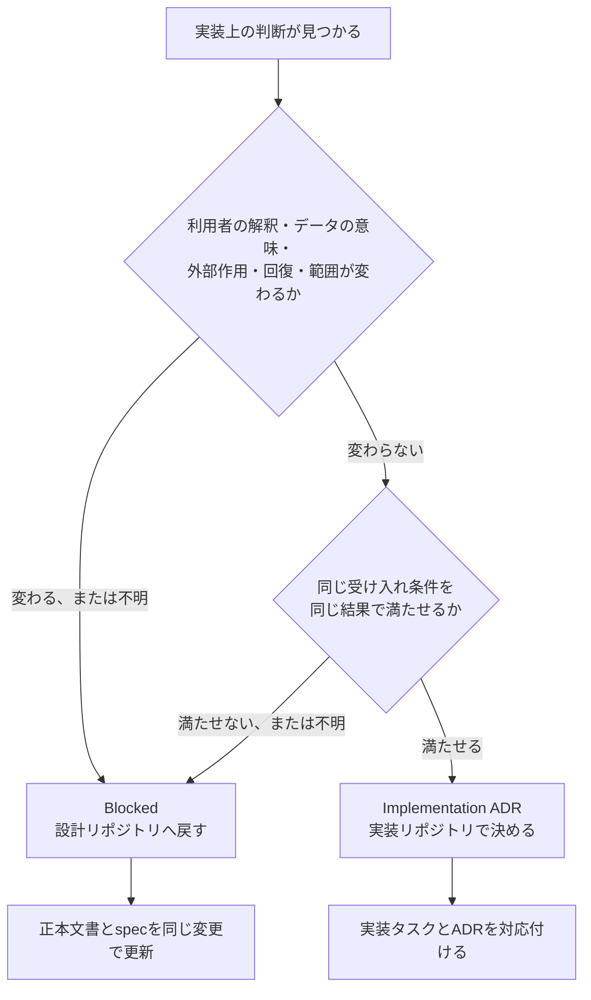

# AlgoLoom 製品契約と実装判断の境界

> 対象: 機能設計、実装準備、実装中の設計判断、コードレビュー
>
> 状態: 判断ガイド
>
> 作成日: 2026年8月24日
>
> 関連文書:
> - [契約の考え方](contract-concepts.md)
> - [MVPスコープ](../product/mvp.md)
> - [Core契約](../architecture/core-contracts.md)
> - [開発用仕様の案内](../../spec/README.md)
> - [MVP機能設計](../../spec/features.md)
> - [未決事項一覧](unresolved-decisions.md)
> - [作業TODO](../../TODO.md)
> - [ドキュメント表記規則](writing-conventions.md)

## ドキュメント概要

本書は、「製品の意味が変わる判断」と「製品契約を変えない実装判断」を区別する基準を定義します。機能をどこまで詳細化してから実装へ渡すか、実装中に見つかった判断を設計リポジトリへ戻すか、実装リポジトリのADRで決めるかを判断するために使用します。

本書は、個別機能の新しい製品判断を行う正本ではありません。MVPの範囲は[MVPスコープ](../product/mvp.md)、Coreの不変条件は[Core契約](../architecture/core-contracts.md)、個別領域は各正本文書を優先します。本書と正本文書が矛盾する場合は、正本文書を優先して本書を修正します。

## 0. 結論

本書でいう「製品の意味」とは、次の約束の集合です。

> 利用者が、操作、結果、保存データ、外部作用、失敗後の状態をどのように解釈し、何を安全だと信頼してよいか。

内部コードの構造が変わること自体を、「製品の意味が変わる」とは扱いません。同じ受け入れ条件を満たし、利用者から観測できる挙動、データの意味、安全性、回復方法が変わらないなら、クラス、モジュール、テーブル、カラム、依存性注入等は実装判断として扱えます。

一方、次のいずれかが変わる場合は、実装方法に見えても製品契約の判断です。

- 操作を実行する条件と、発生する作用
- 成功、失敗、通過、完了等の結果が保証すること
- 保存する値、状態、履歴の意味と不変条件
- 外部通信、提出、削除、秘密情報等の安全境界
- 中断や部分失敗の後に残る状態と、安全な再実行方法
- 対象利用者、対応環境、必須依存、MVPの範囲

選択肢によってこれらが変わる場合は、コードで先に決めず設計リポジトリへ戻します。変わらない場合は、実装リポジトリのADRで決められます。

## 1. 本書が扱う境界

### 1.1. 製品契約

製品契約は、実装方式を変えても維持する必要がある約束です。少なくとも次を含みます。

| 分類 | 契約の例 |
|---|---|
| 範囲 | 対象利用者、対象問題、対応OS、対応言語、MVP対象・対象外 |
| 操作 | 明示操作を必要とする作用、入力、前提条件、確認、事後条件 |
| 結果 | 成功・失敗・状態不明の分類、結果が保証する範囲 |
| データ | データの権威、論理モデル、状態遷移、不変条件、バージョン |
| 外部作用 | 通信先、送信対象、同意、提出・削除・ブラウザ起動の境界 |
| 回復 | 中断点、部分失敗、冪等性、再試行、利用者へ示す次の操作 |
| 品質 | セキュリティ、プライバシー、可搬性、非侵襲性、有限の待機 |

### 1.2. 実装判断

実装判断は、製品契約を満たす複数の実現方法から一つを選ぶ判断です。

| 分類 | 実装判断の例 |
|---|---|
| コード構造 | クラス、関数、モジュール、パッケージの名称と分割 |
| 永続化の内部 | テーブル、カラム、索引、SQLの具体形 |
| 合成 | 依存性注入、レジストリ、生成処理の構成 |
| ライブラリ利用 | 同じ契約を満たすライブラリと呼び出し方 |
| 開発環境 | ビルド、CI、テストディレクトリ、静的解析の構成 |
| 内部最適化 | キャッシュ、バッチ処理、クエリ最適化、メモリ配置 |

これらも、選択によって利用者から観測できる挙動、保存データの意味、安全性または回復方法が変わる場合は、実装判断ではなく製品契約へ昇格します。

## 2. 「製品の意味」が現れる六つの場所

### 2.1. 操作の意味

操作の意味は、「何をきっかけに、何を対象として、どの作用を起こすか」です。

例えば、学習時間計測を利用者の明示操作で開始するか、`get`や最初の`test`で自動開始するかによって、能動時間の意味が変わります。自動開始すると、問題を取得してから着手するまでの時間や、利用者が計測を望まない時間が混ざる可能性があります。

開始処理をどのクラスへ置くかは実装判断ですが、何を開始条件とするかは製品契約です。

### 2.2. 結果の意味

結果の意味は、「表示された結果から、利用者が何を結論づけてよいか」です。

`test`が入出力例の通過を表示する場合、末尾改行、行末空白、複数の空白、浮動小数をどう比較するかによって、「通過」が保証する内容が変わります。ローカルの入出力例通過をAtCoder上のACと表示することも、結果の意味を誤って広げる変更です。

比較処理の内部アルゴリズムは実装判断になり得ますが、何を一致とみなすか、どこまで保証すると表示するかは製品契約です。

### 2.3. 保存データの意味

保存データの意味は、「その値や関係が何を表し、後からどう解釈できるか」です。

AlgoLoomでは、問題チェックアウトは物理ディレクトリ、`SolveAttempt`（解答試行）は一度の学習記録です。一つの問題チェックアウトで複数の`SolveAttempt`を順次開始できるという関係を、実装上の都合で恒久的な1対1へ変えると、同じ場所での再挑戦と白紙からの解き直しを区別できなくなります。

同様に、次は保存データの意味を変える判断です。

- 保存済みのソーススナップショットを上書きできるようにする。
- 判定を取得時刻付きの観測として追記せず、常に最新値で上書きする。
- 初ACの能動時間へ判定待機時間を加える。
- 作業領域の削除を履歴DBの削除として扱う。
- AlgoLoomで記録した履歴と、AtCoderアカウント全体の履歴を区別しない。

テーブル名やカラム名は実装判断ですが、エンティティの意味、関係、多重度、不変条件は製品契約です。

### 2.4. 外部作用と安全性の意味

外部作用の意味は、「利用者の端末または外部サービスへ、何が、いつ、どの権限で作用するか」です。

AtCoderへの提出、ブラウザ起動、秘密情報の保存、将来のAIへの送信やクラウド保存は、ローカル処理と同じ意味ではありません。外部作用を開始する条件、確認、送信対象、送信先、失敗時の状態を変更すると、利用者が信頼できる安全境界が変わります。

例えば、秘密情報保管庫を利用できない場合に平文ファイルへ自動的に切り替えることは、便利な実装上のフォールバックではありません。「セッションを秘密情報保管庫だけへ保存する製品」から「条件によって平文保存する製品」への変更です。

### 2.5. 失敗と回復の意味

失敗と回復の意味は、「どこまで完了し、何が残り、同じ操作を再実行してよいか」です。

AtCoderへの送信とローカルDBのコミットは一つの原子的なトランザクションにできません。そのため、提出を単純な成功・失敗ではなく、`PREPARED`、`SEND_STARTED`、`REMOTE_ACCEPTED`、`VERDICT_PENDING`、`FINAL`、`REMOTE_STATUS_UNKNOWN`等の状態として扱います。

`REMOTE_STATUS_UNKNOWN`を単なる未実行と扱うと、自動再送によって重複提出する可能性があります。判定ポーリングのタイムアウトを提出失敗と扱うと、AtCoderが受理済みの提出を失敗だと誤表示します。

例外処理をどの関数へ置くかは実装判断ですが、状態の分類、残す事実、再試行の可否、回復操作は製品契約です。

### 2.6. 製品範囲と必須依存の意味

次のような変更は、個別機能の追加に見えてもAlgoLoomがどのような製品かを変えます。

- AIを任意機能からCoreの必須条件へ変える。
- オフライン履歴を、クラウド接続が必要な履歴へ変える。
- 通常ファイルとCLIだけのCore導線へ、特定IDEのプラグインを必須にする。
- 終了済み過去問だけのMVPへ、開催中コンテストを追加する。
- 過去の自分との比較を、利用者間の順位や単一スコアへ変える。

これらは局所的な実装タスクでは決めず、MVPスコープと関連する正本文書を更新します。

## 3. AlgoLoomにおける具体例

| 判断対象 | 製品契約として決めること | 実装リポジトリで決められること |
|---|---|---|
| 学習時間 | 明示開始、一時停止中の除外、時計異常時に推測値を保存しない | 時刻計算を担当するクラスや関数 |
| ローカルテスト | 一致の定義、結果分類、タイムアウト後にプロセスツリーを残さない | 比較処理やプロセス監視の内部構造 |
| 問題取得 | 既存ソースを上書きしない、完了段階、再実行の冪等性 | 一時ファイル名、補助関数、内部の処理分割 |
| 履歴 | スナップショットの不変性、試行とチェックアウトの関係、判定観測の追記 | SQLiteのテーブル名、カラム名、索引名 |
| 提出 | 送信前の耐久保存、送信状態不明の区別、無条件再送の禁止 | リポジトリの分割、SQLの具体形 |
| 認証 | 専用ブラウザ、既存プロファイル非参照、秘密情報保管庫、平文への非切替 | OS別アダプタの内部クラス構造 |
| 外部資料 | 本文を取得せずURLだけをブラウザへ渡す、起動成功を閲覧成功としない | URL構成用の値オブジェクト名 |
| エクスポート | ソースをAlgoLoomなしで回収できること、秘密情報と外部本文を含めないこと | 書き出し処理の内部モジュール構成 |
| CLI | 操作の意味、確認が必要な条件、終了コードの分類 | CLIフレームワーク内のハンドラ分割 |
| 出力 | 主結果、追加失敗、影響を受けないもの、次の操作の順序 | 色、余白、表の内部描画方法 |

## 4. 実装方法に見えるが製品契約になり得る判断

### 4.1. 処理順序

提出前にソーススナップショットと提出意図を耐久保存するか、送信後に保存するかは処理順序ですが、プロセス強制終了後の重複提出可能性を変えるため製品契約です。

一方、同じ耐久保存と状態遷移を保証したうえで、どの保存境界を先に呼ぶかという内部分割は実装判断です。

### 4.2. ファイル書き込み

原子的に書き込み、途中状態を正式なファイルとして残さないことは製品契約です。OSごとに一時ファイルと名前変更をどう組み合わせるかは、同じ保証を満たすなら実装判断です。

### 4.3. 制限値

タイムアウト、出力量、ソースサイズ等の具体値は、常に同じ分類になるとは限りません。

- 上限を設けること、無期限に待たないこと、上限超過を別の結果として示すことは製品契約です。
- 値によって対応可能な問題、データ消失、外部サービスへの負荷、利用者から見た成功・失敗が変わる場合、具体値も製品契約です。
- 安全な範囲内での暫定値や、実測に基づく性能調整で製品の保証範囲が変わらない場合は、実装ADRで管理できます。

未確定の間も無制限にはせず、安全な暫定値、決定する責任者、見直す条件を明示します。

### 4.4. ライブラリ選定

ライブラリ名自体は通常、実装判断です。しかし、選択したライブラリの制約によって次が変わる場合は製品契約へ影響します。

- パスワード入力型ログインを通常導線にする。
- 認証情報を平文ファイルへ保存する。
- 応答状態不明を表現できず、失敗として扱う。
- タイムアウトや再試行を分離できない。
- 特定OSまたは特定エディタを必須にする。

したがって、ライブラリは機能数だけでなく、既存の製品契約を弱めず実装できるかで選定します。

### 4.5. ファイル形式とDBスキーマ

作業領域メタデータとエクスポート形式は、利用者が移動、検査、持ち出しを行う境界であるため製品契約です。形式のバージョン、不明なバージョンの扱い、含める情報と含めない情報を設計します。

ローカルSQLiteのテーブル名、カラム名、索引等は外部契約にせず、論理モデルとマイグレーション契約を満たす限り実装判断として扱います。

### 4.6. 表示の見た目

色、スピナー、余白、表のレイアウトは通常、実装判断です。ただし、色だけで成功と失敗を区別する、状態不明を省略する、保持されたデータを隠す等、利用者の判断に必要な意味が失われる場合は製品契約へ影響します。

## 5. 判断のための問い

判断が設計リポジトリと実装リポジトリのどちらに属するか、次の順で確認します。

1. 変更すると、同じ操作をした利用者が異なる次の行動を選ぶ可能性があるか。
2. 変更すると、同じ結果表示または保存値を別の意味で解釈する必要があるか。
3. 変更すると、既存データと新しいデータを同じ意味で比較できなくなるか。
4. 変更すると、外部通信、提出、削除、秘密情報、ファイル書き込みの条件が変わるか。
5. 変更すると、失敗後に再実行してよいか、何を回復すべきかが変わるか。
6. 変更すると、対象利用者、対応環境、必須依存、MVPの範囲が変わるか。
7. 二つの実装を同じ受け入れテストへ通したとき、どちらも同じ結果と状態になるか。

1〜6のいずれかが「はい」であれば、製品契約を変更する可能性が高いため、設計リポジトリへ戻します。すべて「いいえ」で、7が「はい」であれば、実装ADRで決められる可能性が高いと判断します。

判断できない場合は、安全性とデータ完全性を推測で補わず、実装準備度を`Blocked`として設計判断へ戻します。

## 6. 機能を実装へ渡せる粒度

機能を詳細化する目的は、クラスやSQLを先に固定することではありません。実装者が製品の挙動を創作せず、一度の作業へ分解し、完了を検証できる状態にすることです。

各`F-*`について、少なくとも次を判断できる必要があります。

| 項目 | 確認する内容 |
|---|---|
| 要件ID | 機能と要件を一意に特定できる完全形のID |
| 入力・前提条件 | 受け付けるもの、拒否するもの、処理前に必要な状態 |
| 出力・事後条件 | 成功時に作る状態と、利用者へ返す主結果 |
| 状態・保存 | 状態遷移、保存対象、追記・更新・不変の区別 |
| 外部作用 | 通信、提出、ブラウザ起動、秘密情報、利用者の確認 |
| 失敗と回復 | 中断点、部分失敗、保持データ、冪等性、安全な次の操作 |
| 境界 | 利用するPort、他の機能、依存方向 |
| 検証 | 対応する`Q-*`、`E2E-*`、契約テスト、障害注入、実機確認 |
| 未決事項 | 実装前に決めること、実装ADRへ残せること、判断の記録先 |

機能説明が長いだけでは実装可能とは判断しません。短くても上記を一意に判断できれば十分です。反対に、長い説明があっても、失敗時の状態、データの意味またはテストの判定基準を実装者が選ばなければならない場合は、詳細化が不足しています。

## 7. 実装準備度の分類

[`TD-16`](../../TODO.md#td-16-完了条件の追跡表を作り機能の漏れを確認する)と[`TD-28`](../../TODO.md#td-28-実装開始条件の充足を確認する)では、各機能を次のいずれかに分類します。

| 状態 | 意味 | 次の操作 |
|---|---|---|
| `Ready` | 製品の挙動と検証方法が決まり、実装タスクへ分解できる | 実装準備へ引き渡す |
| `Blocked` | 製品の意味に関わる未決がある | 正本文書と`spec/`で判断を確定する |
| `Implementation ADR` | 製品契約を変えない実装判断だけが残る | 実装タスクとADRの記録先を対応付ける |

`Implementation ADR`は、未決の製品挙動を実装側へ委ねるための分類ではありません。クラス、モジュール、テーブル、カラム等の選択肢が、同じ製品契約と受け入れ条件を満たす場合だけ使用します。

実装中に、`Implementation ADR`とした判断が利用者から観測できる挙動、安全性、データの意味または回復方法へ影響すると分かった場合は、`Blocked`相当として設計リポジトリへ戻します。

## 8. 設計から実装への流れ

### 8.1. 機能設計

1. MVP完了条件を`F-*`、`Q-*`、`E2E-*`へ対応付ける。
2. 各機能の入力、状態、外部作用、失敗と回復、検証方法を確認する。
3. 製品の意味に関わる未決を、正本文書と`spec/`の同じ変更で確定する。
4. 製品契約を変えない実装判断だけを`Implementation ADR`として残す。

### 8.2. 実装準備

1. `Ready`または`Implementation ADR`の機能だけを実装タスクへ分解する。
2. 各タスクへ、対応する機能ID、要件ID、入力、成果物、失敗時を含む完了条件、確認手段を付ける。
3. `Implementation ADR`の判断と、実装リポジトリのADRの記録先を対応付ける。

### 8.3. 実装中

1. 受け入れ条件を満たす実装方法を選ぶ。
2. 製品契約を変えない判断をADRへ記録する。
3. 製品の挙動、範囲、データの意味、安全性、外部作用、回復方法を変える必要が判明した場合は、コードだけで解決しない。
4. 設計リポジトリへ変更提案を戻し、確定した`spec/`を再同期してから実装を続ける。

## 9. レビューチェックリスト

### 設計レビュー

- [ ] 操作の入力、前提条件、外部作用、事後条件を説明できる。
- [ ] 成功、失敗、状態不明が保証する内容を区別できる。
- [ ] 保存する値、関係、状態遷移、不変条件を説明できる。
- [ ] 各中断点で残る状態と、安全な再実行方法を説明できる。
- [ ] 対応する受け入れ条件と確認手段がある。
- [ ] 実装側へ残す判断が製品契約を変えないことを説明できる。

### 実装・コードレビュー

- [ ] 実装タスクが機能IDと要件IDへ対応している。
- [ ] 実装方法の都合で、状態、データの意味、外部作用、回復契約を弱めていない。
- [ ] ライブラリの既定動作を、未確認の製品仕様として採用していない。
- [ ] 受け入れ条件にない利用者向け挙動を、コードだけで追加していない。
- [ ] 製品契約へ影響する発見を、実装ADRだけで確定していない。
- [ ] `Implementation ADR`の選択肢が同じ受け入れ条件を満たす。

## 10. 最終方針

AlgoLoomでは、すべての実装方法を設計リポジトリで先に固定しません。固定するのは、利用者が操作と結果を解釈し、学習履歴を信頼し、外部作用と失敗から安全に回復するために必要な契約です。

製品契約を変えない実装方法は、実装リポジトリで自由に選び、ADRへ記録できます。製品の意味に関わる判断は、実装の都合で暗黙に確定せず、設計リポジトリへ戻します。

この境界を守ることで、設計を過剰に固定せず、同時に実装者が製品挙動を創作する状態を防ぎます。
