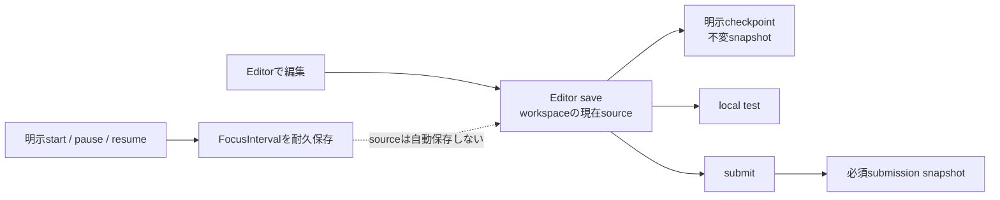

# AlgoLoom ストレスフリーUX設計

> 対象: AlgoLoomの導入、問題選択、問題取得、テスト、提出、履歴、AIレビュー、Cloud同期における利用者のストレス
>
> 状態: 設計原則・改善対象
>
> 作成日: 2026年7月17日
>
> 更新日: 2026年8月11日
>
> 関連文書:
> - [プロダクトビジョン](../product/vision.md)
> - [MVPスコープ](../product/mvp.md)
> - [Core契約](../architecture/core-contracts.md)
> - [AtCoder認証設計](../architecture/atcoder-authentication.md)
> - [言語・実行環境の可搬性設計](../architecture/language-and-platform-portability.md)
> - [問題選択・カタログ設計](../features/problem-selection-and-catalog.md)
> - [外部学習資料参照設計](../features/external-learning-resources.md)
> - [解き直しworkflow設計](../features/revisit-workflow.md)
> - [Review Backend・LLM Provider設計](../features/llm-provider-design.md)
> - [パフォーマンスと待機体験の設計](./performance-and-waiting-design.md)
> - [セキュリティ設計ガイド](./security-design.md)
> - [ローカル利用とCloud同期の段階的設計](../features/local-and-cloud-sync-design.md)
> - [AIレビュー安全設計](../features/ai-review-safety-design.md)
> - [配布方針ガイド](../operations/algoloom-distribution.md)

---

## ドキュメント概要

本書は、AlgoLoomの導入から問題取得、test、提出、履歴、任意機能までのストレス要因を分類し、優先して守るUX契約、error表示、回復導線、改善基準を定義します。

## 0. 結論

AlgoLoomの最大のUX目標は、機能を増やすことではなく、利用者が考えること、待つこと、失敗を恐れること、復旧方法を探すことを減らすことである。

中心方針を次のように定める。

> 覚えることを減らす。邪魔をしない。選択を奪わない。失敗しても迷わず戻れるようにする。

現行設計は、安全性、privacy、ユーザーの選択権、ローカル継続性を重視しており、ストレスを防ぐ良い基盤を持っている。一方、内部の責任分離がそのままCLIへ露出すると、Provider、Adapter、credential、catalog、同期状態等を利用者が理解しなければならず、別のストレスを生む。

したがって、次を不変条件とする。

1. 内部実装の複雑さを、日常の操作へそのまま露出させない。
2. Coreの利用に、任意機能の設定を要求しない。
3. 部分失敗時は、失敗だけでなく、何が成功済みかを最初に伝える。
4. 再実行しても、既存コードや履歴を壊さない。
5. エラー後に、利用者がSubsystemを判別しなくても復旧へ進めるようにする。
6. 厳格な確認と制約は、安全性、規約、privacy、データ完全性、外部作用に必要な範囲へ限定する。
7. 内部の失敗詳細は必要時に確認できる形へ分離するが、利用者の目的、データ、外部作用に影響する事実は隠さない。
8. カスタマイズなしで標準UXを成立させ、設定の追加・不整合・陳腐化によって無関係なCore操作を複雑化または停止させない。

---

## 1. 目的と対象外

### 1.1. 目的

- 現行文書に含まれるストレス要因を、利用者導線に沿って明らかにする。
- 改善すべき該当箇所と、改善が必要な理由を記録する。
- 改善の優先順位を、発生頻度、強さ、回復の難しさから決める。
- 現時点で良い設計を、改善対象とは別に記録する。
- 良い設計についても、将来の利用検証によって再評価できるようにする。
- 具体的なcommand名を決める前に、UXとして守る契約を定義する。

### 1.2. 対象外

- 最終的なcommand名、引数、option、aliasの決定
- TUIやWeb UIの具体的な画面設計
- 特定のPython CLI frameworkの選定
- 推測だけによる機能追加
- すべての待ち時間や確認をなくすこと
- 安全性や規約遵守を、操作の短さのために弱めること

ストレスフリーとは、何も表示せず、何でも自動実行することではない。利用者が現在地、結果、影響、復旧方法を理解でき、必要以上に操作を止められない状態を意味する。

### 1.3. 用語

| 用語 | 本書での意味 |
|---|---|
| Core | AI、Cloud同期、外部Viewer等の任意機能を設定しなくても利用できる中核機能。 |
| context | commandが処理対象とするworkspace、問題、sourceの組み合わせ。 |
| Subsystem | 認証、問題取得、履歴、AI review、同期等、内部で責任を分離した機能領域。 |
| 部分成功 | 一つの利用者操作に含まれる複数処理のうち、一部だけが成功した状態。 |
| 冪等性 | 同じ操作を再実行しても、既存sourceや履歴を重複・上書きによって壊さない性質。 |
| opt-in | 利用者が明示的に選択した場合にだけ機能を有効にする方式。 |
| fail closed | 安全性を判定できない場合に、処理を許可せず停止する方針。 |
| fallback | 任意toolや補助機能が利用できない場合にCore操作を継続する代替経路。 |
| noise | 利用者の主目的や次の行動を埋もれさせる、不要または過剰な表示。 |

---

## 2. 評価方法

### 2.1. ストレスの構成

本設計では、ストレスを次の3要素で評価する。

```text
ストレス = 発生頻度 × 不安・負担の強さ × 回復の難しさ
```

| 要素 | 確認すること |
|---|---|
| 発生頻度 | 毎回発生するか、初回だけか、任意機能だけか |
| 強さ | 作業を止めるか、データ損失や誤提出への不安があるか |
| 回復性 | 原因と次の行動が分かるか、安全に再実行できるか |

### 2.2. ストレスの種類

| 種類 | 例 |
|---|---|
| 記憶負担 | command、引数、問題ID、設定場所を覚える |
| 判断負担 | 複数のインストール方法やProviderから選ぶ |
| 中断 | ブラウザ、外部ドキュメント、別CLIを往復する |
| 待機 | download、compile、polling、AI、同期を待つ |
| 状態不明 | どこまで成功し、何が失敗したか分からない |
| 恐怖 | 再実行、提出、同期、削除でデータが壊れそうに感じる |
| 復旧負担 | 原因を自分で分類し、専用の診断方法を探す |
| 情報過多 | 内部用語、長いerror、毎回の確認を読む |

### 2.3. 優先度

| 優先度 | 意味 |
|---|---|
| P0 | Coreの開始・テスト・提出を妨げる。初期版で対処する |
| P1 | 日常利用で繰り返し発生し、累積ストレスになる |
| P2 | 任意または将来機能だが、利用時の負担が大きい |

---

## 3. P0: Coreで最優先に改善する部分

### 3.1. インストール前の選択と前提環境

#### 該当箇所

- [配布方針ガイド「第1段階: GitHub + PyPI」](../operations/algoloom-distribution.md#91-第1段階-github--pypi)
- [ローカル利用とCloud同期「インストールからローカル利用開始まで」](../features/local-and-cloud-sync-design.md#71-インストールからローカル利用開始まで)
- [アーキテクチャ概要「システムアーキテクチャ・技術スタック」](../architecture/overview.md#2-システムアーキテクチャ技術スタック)
- [アーキテクチャ概要「解答言語・host OS・開発環境・設定管理」](../architecture/overview.md#3-解答言語host-os開発環境設定管理)

#### 現在のストレス

- `pipx`、`uv tool`、`pip`の複数経路から選ぶ必要がある。
- Python、package installer、online-judge-tools、compiler、runtime等の前提が分散している。
- 非エンジニアや初心者は、どの方法が自分の環境を壊さないか判断しにくい。
- AlgoLoomを初めて実行する前に、複数の外部用語を理解する必要がある。
- 言語ごとのcompile / run設定を利用者が編集する必要があるか、既定値で開始できるかが明確でない。

#### 直すべき理由

最初の成功体験より前に発生するストレスは、最も離脱につながりやすい。機能が優れていても、起動できなければ評価されない。また、複数の正しい選択肢を同じ重さで提示することは、初心者にとって親切ではなく判断負担になる。

#### 改善後に守る条件

- 通常利用者へ最初に示す推奨経路は1つにする。
- 代替経路は、既にそのtoolを使っている利用者向けの補足へ分離する。
- Coreだけを使う利用者に、AIやCloudの依存を導入させない。
- 対応言語の標準的な構成は、設定fileを手編集せず開始できるようにする。
- C++、Python、Go、Rustの全toolchain導入をAlgoLoom自体のinstall成功条件にせず、利用者が選んだ言語の準備状態を個別に診断する。
- ある言語のtoolchain不足によって、別言語の`get → test`やoffline履歴を停止しない。
- 不足する外部toolは、影響を受ける機能と、影響を受けない機能を分けて示す。
- install成功と、各言語の実行準備完了を同一の状態として扱わない。

### 3.2. AtCoder認証の開始・期限切れ・障害

#### 該当箇所

- [AtCoder認証設計](../architecture/atcoder-authentication.md)
- [配布方針ガイド「認証とCloudflare等のBot対策」](../operations/algoloom-distribution.md#8-認証とcloudflare等のbot対策)
- [配布方針ガイド「提出補助」](../operations/algoloom-distribution.md#6-提出補助)
- [アーキテクチャ概要「CLIコマンド構成」](../architecture/overview.md#5-cliコマンド構成)

#### 現在のストレス

- 初回認証でbrowserが開く理由、AlgoLoomが取得する情報、保存先、中断方法を利用者が判断する必要がある。
- 提出時まで認証切れに気づかない可能性がある。
- AlgoLoom、browser、secret store、AtCoder、Bot対策のどこで失敗したか判別しにくい。
- 認証不能時に、再認証すべきか、時間を置くべきか、tool更新を待つべきかが分かりにくい。
- 外部toolのerrorをそのまま表示できないため、情報を削りすぎると原因が分からなくなる。

#### 直すべき理由

認証失敗は提出直前に作業を止め、利用者の集中を最も強く中断する。原因の所有者が複数存在するため、単に「login failed」と表示しても利用者は次に進めない。

#### 改善後に守る条件

- 初回提出より前に、認証状態を安全に確認できるようにする。
- 推奨経路は方式Aの可視専用browser一つとし、利用者がusername、password、Turnstileをbrowser上で操作することを先に示す。
- AlgoLoomが取得するのはAtCoderのsessionであり、passwordを取得しないこと、sessionをOSのsecret storeへ保存することを平易に伝える。
- 明示ログインは`aloom auth login`から開始し、CLIからbrowserへ1回移り、完了後にCLIへ戻る一往復で終える。
- 初回だけ利用委譲への同意と署名済み拡張機能の追加を求め、同意内容または権限が変わらず、専用templateが健全なら繰り返さない。
- `submit`で再認証が必要な場合は、browserを開く理由と中止方法をCLIへ表示してから自動起動する。別の認証commandや追加のYes/No確認を要求せず、認証後は同じbrowserで提出確認へ進む。
- browser表示中にCLIへ戻ってURL、code、commandまたはCookieを入力させず、ページ移動、認証結果の検出、本人確認、保存、後始末を自動化する。
- 認証中は「browser起動待ち」「利用者のlogin待ち」「account確認」「保存」の段階を示し、Cookie値は表示しない。
- CLIからいつでも取消できるようにし、取消とbrowser終了をerror扱いで責めず、提出を行っていないことと再開方法を示す。
- 期限切れ、未認証、account不一致、AtCoder側拒否、構造変更、通信障害、secret store障害を可能な範囲で分ける。
- errorには、利用者が次に行える行動を1つ示す。
- Bot対策の回避方法を案内しない。
- keyringを利用できない場合に平文fileへ自動fallbackしない。
- 認証errorを理由に、ローカルテストや履歴閲覧を止めない。

### 3.3. 問題取得の途中失敗と再実行

#### 該当箇所

- [問題選択・カタログ設計「getの処理」](../features/problem-selection-and-catalog.md#63-getの処理)
- [アーキテクチャ概要「ディレクトリ構成」](../architecture/overview.md#4-ディレクトリ構成ハイブリッド型)
- [アーキテクチャ概要「CLIコマンド構成」](../architecture/overview.md#5-cliコマンド構成)
- [セキュリティ設計「コマンド別の安全要件」](./security-design.md#7-コマンド別の安全要件)

#### 現在のストレス

問題取得は、公式確認、sample取得、directory作成、template作成、DB保存、browser起動という複数の副作用を持つ。次の途中状態が未定義である。

- sample取得後にtemplate作成が失敗した。
- directoryは作成されたがDB保存が失敗した。
- browser起動だけが失敗した。
- 同名directoryまたはsource fileが既に存在する。
- 利用者が既存fileを編集済みの状態で再実行した。
- processが途中終了した後、再実行してよいか分からない。

#### 直すべき理由

再実行が怖い操作はストレスフリーではない。問題開始は利用頻度が高く、途中状態を手作業で直させるとworkspaceやDBの不整合を生みやすい。

#### 改善後に守る条件

- 同じ入力で再実行しても、利用者が編集したsourceを上書きしない。
- 完了済みの処理と未完了の処理を判別できるようにする。
- browser起動失敗を、workspace作成失敗として扱わない。
- DB保存失敗時も、作成済みfileの場所と状態を伝える。
- 中途半端な一時fileを正式なworkspaceとして残さない。
- 既存directoryとの衝突時は、勝手なmerge、rename、削除を行わない。
- 再実行可能か、手動対応が必要かをerrorに明示する。

### 3.4. 日常的なテストとerror表示

#### 該当箇所

- [アーキテクチャ概要「CLIコマンド構成」](../architecture/overview.md#5-cliコマンド構成)
- [セキュリティ設計「testによる任意コード実行とresource制限」](./security-design.md#69-testによる任意コード実行とresource制限)
- [セキュリティ設計「ターミナルとRich表示」](./security-design.md#65-ターミナルとrich表示)

#### 現在のストレス

- compilerまたはruntimeが見つからない。
- 現在directoryや対象sourceが間違っている。
- 複数のsource候補から何を実行するか分からない。
- compiler errorが大量に表示され、最初に見るべき箇所が分からない。
- expectedとactualの差が、空白や改行を含めて見つけにくい。
- runtime error、signal、timeout、出力上限超過の意味が分からない。
- sampleごとの長い出力が、次にすべきことを埋もれさせる。
- sample成功がAtCoderでの正解を保証するように誤解される可能性がある。

#### 直すべき理由

テストは最も頻繁に繰り返す操作である。1回あたりの小さな摩擦でも、学習中に何度も蓄積する。失敗は学習上自然な状態であり、失敗するたびに責められたり、長い出力を解析させられたりしてはならない。

#### 改善後に守る条件

- 最初に、成功数、失敗数、最初に失敗したcaseを示す。
- expectedとactualの最初の差を、plain textで確認できるようにする。
- compile、run、timeout、signal、出力超過、設定不足を区別する。
- 長いraw outputは既定で省略し、省略したことと確認方法を示す。
- 利用者のコードを自動修正しない。
- 一意に推測できる対象は推測し、対象を表示する。
- 複数候補がある場合だけ利用者へ選択を求める。
- error文は、利用者を責めず、次に確認する場所を示す。

### 3.5. 提出・保存・同期・レビューの部分成功

#### 該当箇所

- [アーキテクチャ概要「CLIコマンド構成」](../architecture/overview.md#5-cliコマンド構成)
- [配布方針ガイド「提出補助」](../operations/algoloom-distribution.md#6-提出補助)
- [ローカル利用とCloud同期「submitの表示例」](../features/local-and-cloud-sync-design.md#53-submitの表示例)
- [AIレビュー安全設計「submit --reviewで拒否された場合」](../features/ai-review-safety-design.md#63-submit---reviewで拒否された場合)
- [Review Backend設計「レビュー実行フロー」](../features/llm-provider-design.md#7-レビュー実行フロー)

#### 現在のストレス

1回の提出操作に、次の独立した結果が含まれ得る。

- AtCoderへの送信
- AtCoderの判定取得
- ローカルDB保存
- Cloud同期
- AI安全判定
- AIレビュー
- AIレビュー保存

このため、次の状態が起こる。

- AtCoderではACしたが、ローカル保存に失敗した。
- 提出は成功したが、判定取得前にprocessが終了した。
- 提出と保存は成功し、同期だけpendingになった。
- 提出は成功し、AIレビューだけ拒否または失敗した。
- 応答が不明なため、再提出してよいか分からない。

#### 直すべき理由

提出は外部へ作用し、短時間の重複提出も問題になる。部分成功を一つの成功・失敗へまとめると、不要な再提出、結果の見落とし、履歴欠落への不安を生む。一方、毎回すべての内部状態を同じ強さで表示すると、情報過多になる。

#### 改善後に守る条件

- 最も重要なAtCoder判定を最初に表示する。
- 異常がない補助状態は簡潔に扱う。
- 部分失敗時は、成功済みの処理を失敗より先に示す。
- 「再提出は不要」「判定だけ再確認可能」等、重複を避ける情報を示す。
- AtCoder提出、ローカル保存、Cloud同期、AIレビューを内部で独立した結果として保持する。
- AI失敗を提出失敗として表示しない。
- 同期失敗をローカル保存失敗として表示しない。
- process終了後もsubmission ID等から結果を回収できる設計を検討する。

---

## 4. P1: 日常利用で蓄積するストレス

### 4.1. 現在地と対象fileの曖昧さ

#### 該当箇所

- [アーキテクチャ概要「ディレクトリ構成」](../architecture/overview.md#4-ディレクトリ構成ハイブリッド型)
- [アーキテクチャ概要「CLIコマンド構成」](../architecture/overview.md#5-cliコマンド構成)
- [問題選択・カタログ設計「問題を開始する」](../features/problem-selection-and-catalog.md#62-問題を開始する)

#### 直すべき理由

利用者がworkspace root、問題directory、別directoryのどこにいるかによって結果が変わると、実行前にpathと設定を常に意識する必要がある。複数言語や複数sourceがある場合、暗黙の推測は誤操作にもつながる。

#### 改善方向

- 一意に判断できる場合だけ現在contextから対象を推測する。
- 推測した問題、言語、sourceを短く表示する。
- 曖昧な場合は、勝手に先頭fileを選ばない。
- `get`は選択された1言語のsourceだけを作り、全対応言語のfileを同じ問題directoryへ一括生成しない。
- 同じ問題を別言語で解く既定導線では別directoryを推奨し、通常の単一言語projectに近い見た目を保つ。
- 利用者が同じdirectoryへ複数sourceを置いた場合はhiddenなactive languageを持たず、複数候補時だけ明示sourceを求める。
- 詳細指定による上書きを可能にする。
- workspace外で実行した場合も、単なるpath errorではなく必要なcontextを説明する。
- `get`が作る1階層layoutは推奨される開始形とし、command実行の必須条件にしない。
- workspace rootと問題contextは、固定の絶対pathやdirectory名ではなく、workspace設定と問題metadataを親方向へ探索して解決する。
- 問題metadataは問題directoryと一緒に移動可能にし、正規問題IDをpathより優先して識別に使う。

#### 標準toolとの責任境界

AlgoLoom固有のmetadata、状態遷移、外部作用を扱わない一般的なfile・directory操作は、AlgoLoomのcommandとして複製しない。利用者はshell、OSのfile manager、Editor / IDE等、既に利用している標準的な方法を選べるようにする。

これは初心者への案内を省くことを意味しない。AlgoLoomは独自の`move`や`cd`を追加する代わりに、次を行う。

- `get`等の成功時に、作成したpathと次に可能な操作を短く示す。
- 最初の問題取得からlocal testまでの推奨導線では、整理のための移動・renameを要求しない。
- contextを認識できない場合に、どのfileまたはmetadataが不足しているかを説明する。
- 必要な場合は、macOS / Linux、PowerShell、file manager等の標準操作例を文書へ分けて掲載する。
- 標準操作の知識をAlgoLoom内だけのものにせず、他の開発環境へ移せる形で案内する。

command数の少なさ自体はUX指標にしない。一般操作の単なる別名を増やさない一方、データ完全性、安全な復旧、外部送信への同意等にAlgoLoom固有の保証が必要なら、専用commandを設ける。

#### 移動・renameのサポート範囲

| 操作 | 基本方針 |
|---|---|
| workspace全体を移動・renameする | workspace内の相対構造から再認識し、継続利用できる |
| 問題directoryをworkspace内で移動・rename・階層化する | 問題metadataから再認識し、継続利用できる |
| source fileを問題directory内でrenameする | 一意に推測できるか、sourceを明示すれば利用できる |
| source fileだけを問題context外へ移動する | 暗黙に関連付けず、問題contextの明示指定または元の構成への復旧を案内する |
| 問題metadataやtestだけを分離して移動する | 不完全なcontextとして扱い、欠けている要素と影響を示す |
| 同じ正規問題IDのdirectoryが複数ある | 勝手に選択、merge、rename、削除せず、候補を示して明示指定を求める |
| sourceや問題directoryを削除する | filesystem上の削除として扱い、提出履歴やCloud dataまで暗黙に削除しない |

対応可否は特定のOS commandを監視して判断しない。各commandの開始時にfilesystem上の現在状態を読み取り、同じ結果へ到達する。これにより、terminal以外のfile managerやEditor / IDEによる操作も同等に扱う。

### 4.2. 問題選択時のブラウザ往復

#### 該当箇所

- [問題選択・カタログ設計「初期版のユーザーフロー」](../features/problem-selection-and-catalog.md#6-初期版のユーザーフロー)
- [プロダクトビジョン「プロジェクトの目的」](../product/vision.md#1-プロジェクトの目的)

#### 直すべき理由

初期版はAtCoder Problemsで問題を探し、問題IDまたはURLをCLIへ渡す。合理的な構成だが、問題を探す、識別子を見つける、copyする、terminalへ戻る、workspaceへ移動するという中断がある。「ブラウザの往復を最小限にする」という期待とも差が生じる。

#### 改善方向

- 問題IDだけでなく、利用者が取得しやすい公式URLを受け付ける方針を維持する。
- 問題発見と問題開始を別の責任として保つ。
- browserを開くこと自体を成功条件にしない。
- 将来の問題選択機能が、Coreの問題開始処理を複製しないようにする。

### 4.3. 待ち時間と進捗不明

#### 該当箇所

- [問題選択・カタログ設計「リクエスト間隔」](../features/problem-selection-and-catalog.md#84-リクエスト間隔)
- [配布方針ガイド「スクレイピングとアクセス負荷」](../operations/algoloom-distribution.md#5-スクレイピングとアクセス負荷)
- [Review Backend設計「レビュー実行フロー」](../features/llm-provider-design.md#7-レビュー実行フロー)
- [ローカル利用とCloud同期「同期有効時の通常処理」](../features/local-and-cloud-sync-design.md#73-同期有効時の通常処理)

#### 直すべき理由

問題確認、sample取得、catalog更新、compile、test、判定polling、AI、同期は正常でも待ちが発生する。無表示では停止や故障に見え、利用者は中断や再実行を行う可能性がある。

#### 改善方向

- 短時間で終わる処理へ過剰なanimationを出さない。
- 1秒を超える可能性がある処理では、現在の段階を短く示す。
- 件数や段階が分かる場合は、可能な範囲で進捗を示す。
- 安全に停止できる処理は中止可能にする。
- 中止によって残る状態と、失われる進捗を明示する。
- pollingには最大待機時間と、後から結果を確認できる経路を持たせる。

### 4.4. 確認疲れ

#### 該当箇所

- [配布方針ガイド「提出補助」](../operations/algoloom-distribution.md#6-提出補助)
- [Review Backend設計「セットアップUX」](../features/llm-provider-design.md#6-セットアップux)
- [ローカル利用とCloud同期「同期を有効化する」](../features/local-and-cloud-sync-design.md#72-既存端末で同期を有効化する)
- [ローカル利用とCloud同期「同期を無効化する」](../features/local-and-cloud-sync-design.md#76-同期を無効化する)

#### 直すべき理由

確認が多いと、利用者は内容を読まずに承認するようになる。本当に重要な警告の効果も下がる。一方、提出、remote送信、Cloud削除等は確認をなくせない。

#### 改善方向

確認は原則として次の境界へ限定する。

- 元に戻せない操作
- 端末外への新しいデータ送信
- 課金の可能性がある操作
- 通常の期待と異なる対象への作用
- データ損失または規約違反の可能性

状態表示だけで足りる情報は、対話を止める確認にしない。長い規約説明を日常操作のたびに繰り返さず、条件が変わった場合だけ再確認する。

### 4.5. 診断入口の分散

#### 該当箇所

- [ローカル利用とCloud同期「CLI設計」](../features/local-and-cloud-sync-design.md#8-cli設計)
- [問題選択・カタログ設計「コマンド設計」](../features/problem-selection-and-catalog.md#11-コマンド設計)
- [Review Backend設計「CLI案」](../features/llm-provider-design.md#65-cli案)
- [Turso設計ガイド「同期機能」](../integrations/turso-design-guide.md#11-cliとして用意したい同期機能)

#### 直すべき理由

通常診断、catalog診断、AI診断、sync診断が別々に存在すると、利用者が先に原因のSubsystemを判別しなければならない。内部の責任分離が復旧負担として露出する。

#### 改善方向

- 利用者向けの最初の診断入口は統一する。
- 内部では必要なSubsystemだけを診断する。
- errorから適切な診断へ直接進めるようにする。
- 診断結果は、内部module名ではなく利用者が行える対応でまとめる。
- 高度なSubsystem別診断は、保守やdebug用として残せる。

### 4.6. 内部用語の露出

#### 該当箇所

- [Review Backend設計「用語集」](../features/llm-provider-design.md#2-用語集)
- [ローカル利用とCloud同期「用語」](../features/local-and-cloud-sync-design.md#2-用語)
- [問題選択・カタログ設計「用語」](../features/problem-selection-and-catalog.md#2-用語)

#### 直すべき理由

Provider、Backend、Adapter、endpoint、credential source、billing mode、capability、BYOC、bootstrap、stale cache、pending等は内部設計には必要だが、通常利用者が目的を達成するためにすべて理解する必要はない。

#### 改善方向

- 通常表示では、何が起きたか、何に影響するか、次に何をするかを平易に示す。
- 内部用語は詳細表示と保守文書へ分離する。
- 固有名詞を表示する必要がある場合は、利用者への影響を併記する。
- 日本語UI内で英語の状態名を混在させる場合は、意味を一貫させる。

### 4.7. 文書間の期待不一致

#### 該当箇所

- [プロダクトビジョン「プロジェクトの目的」](../product/vision.md#1-プロジェクトの目的)
- [アーキテクチャ概要「システムアーキテクチャ・技術スタック」](../architecture/overview.md#2-システムアーキテクチャ技術スタック)
- [DB候補比較](../research/db-comparison.md)
- [ローカル利用とCloud同期の段階的設計](../features/local-and-cloud-sync-design.md)

#### 確定した整合方針

- AlgoLoom Coreはローカルで成立し、履歴の通常の読み書きはローカルDBで完結する。AtCoderへの取得・提出、任意のremote AI、任意のCloud同期は、それぞれ必要な操作でだけ外部接続を使う。
- Google Drive等のファイル同期領域に稼働中のSQLite DBを置かない。複数端末共有は、ローカルDBを土台にTurso Cloud同期を追加する構成とする。
- `log`、`show`、`diff`はCloud接続や同期完了を待たず、ローカル履歴を表示する。全端末の共有済み最新状態が必要な場合だけ、明示同期を行う。
- ブラウザ往復を最小限にする目的に対し、初期問題選択はブラウザを主経路として意図的に残す。

#### 直すべき理由

説明と実際の挙動が違うと、利用者はデータ保存先や通信有無について不安になる。開発時にも、古い正本を参照して設計が分岐する。

#### 継続して確認すること

- 「ローカルで成立するCore」と「操作時にAtCoderへ接続すること」を、README、help、同期設定画面で同じ言葉で説明する。
- 同期の最終成功時刻やpending件数を、通常の履歴表示を妨げない強さで示す。
- browser利用は、問題発見の初期経路として意図的に残すことを明示する。

### 4.8. 時間計測による焦りと記録忘れ

#### 現在のストレス

学習時間は振り返りに役立つ一方、常時増える秒数や他者との比較は、考察より速さを優先させる圧力になり得る。また、CLIでは開始、pause、resume、終了を忘れやすく、誤った長時間記録を利用者の能力として見せると履歴への信頼を失う。

| 状況 | 生じる誤解・負担 |
|---|---|
| `get`だけで自動開始 | 取得して後日解いた時間まで学習時間になる |
| 最初の`test`で自動開始 | 問題理解と実装に使った時間が記録から落ちる |
| pause忘れ | 休憩、睡眠、別作業を能動時間と誤認する |
| 秒単位の常時表示 | 深く考えることより急ぐことを促す |
| sample通過とACを統合 | 公開sample一致を正解保証と誤認する |
| 他者平均との差を表示 | 条件の異なる値を能力rankとして受け取る |

#### 改善方向

- SolveAttemptは利用者の明示操作で開始し、`get`、file保存、最初の`test`から暗黙に開始しない。
- pause、resume、終了状態を短い操作で確認でき、CLI再起動後も現在状態を回復できるようにする。
- activeまたはpausedな試行が残った状態で別の試行を始める場合、暗黙にpause、終了、mergeせず、現在状態と選べる行動を示す。
- 通常の`test`出力へ秒単位のtimerを毎回強く表示せず、明示したstatusや履歴で必要時に確認できるようにする。
- `status`相当を現在状態とactive durationの正規の確認経路にする。`test`やcheckpoint後に補助表示する場合は、計測中だけ、分単位等の落ち着いた粒度で短く示す。
- 最初のsample通過、初回提出、初ACを別のmilestoneとして表示する。
- wall elapsed、active duration、compile/run時間、judge実行時間をラベルで区別する。
- 異常な時計変更や未終了intervalがある場合、推測した精密値を表示せず、不確実な区間と修正・終了方法を示す。
- 計測しない選択を通常の使い方として扱い、開始案内を毎回繰り返さない。
- 速さだけを称賛・警告せず、差分、提出回数、解き直し等と並ぶ一つの観測として扱う。

#### timerと保存の責任境界

「経過時間を失わないこと」と「編集中codeを残すこと」は、次の別々の責任として設計する。



| 保存対象 | 所有者 | MVPの契約 | 行わないこと |
|---|---|---|---|
| 未保存buffer | Editor / IDE | AlgoLoomの対象外 | Editor APIから推測・取得・上書きしない |
| workspaceの現在source | 利用者 / Editor | `test`、checkpoint、submitがcommand開始時に読む権威 | file watcherで全変更を自動履歴化しない |
| checkpoint snapshot | AlgoLoom | 利用者の明示操作で不変保存 | pauseやtestだけで暗黙作成しない |
| submission snapshot | AlgoLoom | 外部送信前に必ず耐久保存 | checkpointの有無へ依存させない |
| FocusInterval | AlgoLoom | start / pause / resume等の状態遷移ごとに耐久保存 | code snapshotがないことを時間記録の失敗にしない |

MVP後に自動checkpointを追加する場合はopt-inとし、短い周期の常時保存ではなく、明示pause、明示test、最初の全sample通過等のevent駆動を優先する。自動checkpointの失敗によって、成功済みのpause、test、milestone、提出を失敗へ変更しない。

### 4.9. 外部資料のspoilerとbrowser障害

#### 現在のストレス

解説や他ユーザーのAC提出は学習に有用だが、意図せず開くと自力で考える機会を戻せない。一方、毎回強い確認を出すと、AC後の通常の振り返りでも確認疲れが生じる。browserを開けても、未login、404、解説未掲載等により資料が表示されない場合があり、CLIからload完了を断定すると誤解を招く。

| 状況 | 生じる誤解・負担 |
|---|---|
| WAやtest失敗後に自動表示 | 利用者が望む前に答えが見える |
| 未ACでも無確認で開く | 自力で続ける選択を失う |
| AC後も毎回確認 | 振り返りの反復操作が重くなる |
| browser起動を閲覧成功と表示 | login要求、未掲載、load失敗を見落とす |
| 「公式解説を取得」と表示 | ユーザー解説との区別や保存有無を誤認する |

#### 改善方向

- 外部資料は明示操作でだけ開き、`get`、test失敗、WA、提出完了から自動表示しない。
- 未ACのspoiler-sensitiveな資料は確認し、non-interactiveでは明示optionなしに開かない。
- AC済みの明示操作では不要な確認を繰り返さない。
- contest終了を確認できない場合は開かず、virtual contestやADTの参加文脈を完全には推測できない限界を初回案内へ示す。
- 「AtCoderの解説ページを開く」と表示し、本文取得または公式解説の存在を断定しない。
- browser起動要求成功とページload・login・閲覧成功を分離する。
- browser起動失敗時はURLと手動操作を示し、workspace、SolveAttempt、test、提出、履歴を変更しない。

### 4.10. 解き直しで前回codeが見える・消える不安

#### 現在のストレス

同じdirectoryのsourceをtemplateへresetすると、前回codeを失う不安がある。逆に前回のAC codeを残したままでは、白紙から理解を確かめたい利用者に答えが見える。attemptごとの深い専用階層を強制すると、日常の移動とEditor利用が複雑になる。

#### 改善方向

- freshな解き直しは、既存sourceを上書きせず、新しいsibling checkoutと新しいSolveAttemptを作る。
- 前回sourceを自動copyせず、選択言語の組み込みtemplateから始める。
- directory名の`--02`等は候補表示に限定し、移動・renameを許容する。
- 検証済みlocal sampleを安全に再利用し、同じ問題の再downloadを避ける。
- active / paused attemptを暗黙に変更せず、現在状態と選択肢を示す。
- file作成とDB保存の部分失敗を区別し、再実行でcheckout・SolveAttemptを重複させない。
- 成功時は問題、言語、作成場所、freshかsnapshot開始かを短く示す。

---

## 5. P2: 任意・将来機能で改善する部分

### 5.1. AIレビューのセットアップ

#### 該当箇所

- [Review Backend設計「セットアップUX」](../features/llm-provider-design.md#6-セットアップux)
- [Review Backend設計「設計原則」](../features/llm-provider-design.md#3-設計原則)
- [AIレビュー安全設計](../features/ai-review-safety-design.md)

#### 現在のストレス

AIレビュー利用時に、Provider、local / remote、APIとsubscription、endpoint、credential、model、billing、送信範囲、capability、review-only等の理解が必要になる。安全性のために必要な情報だが、最初にすべて同じ重さで見せると判断負担が大きい。

さらに、reviewの学習目的が曖昧なままでは、提出のたびに長い一般論、完成した別解、重要度の低いstyle指摘が表示され、利用者が自分で考えた内容と次に改善すべき点を見失う。履歴を暗黙にすべて送信すると、privacy上の期待にも反する。

#### 直すべき理由

AIレビューは任意であり、設定の複雑さがCoreの印象まで悪化させてはならない。また、安全説明を省略するとprivacyと課金上の不安を生むため、単純に確認を削ることもできない。

#### 改善方向

- 利用者が明示的にAIレビューを求めるまで、通常導線へ出さない。
- 提出のたびに自動実行せず、現在の実装または利用者が選んだ履歴snapshotだけをreview対象にする。
- reviewの最初に、最優先の改善点と次の問題へ持ち越せる原則を少数だけ示し、詳細や完成した別解は利用者が求めた場合に分ける。
- correctness、performance、readability、style、代替案を同じ強さで表示せず、根拠と不確実性を区別する。
- 重要な改善点がない場合は、無理に批判を生成しない。
- 履歴reviewでは、送信するsnapshot、verdict、diffの範囲を実行前に確認できるようにし、履歴全体を暗黙に送信しない。
- 一般的な選択と高度な選択を段階的に分ける。
- 利用者が選ぶ必要のないtechnical detailは安全な既定値へ寄せる。
- remote送信、課金、credential保存等、意味のある境界だけは隠さない。
- 設定失敗後に、外部文書を何ページも往復させないよう、次の1手を示す。
- AIが使えなくても、test、submit、historyを継続する。

### 5.2. Cloud同期とBYOC

#### 該当箇所

- [ローカル利用とCloud同期「既存端末で同期を有効化する」](../features/local-and-cloud-sync-design.md#72-既存端末で同期を有効化する)
- [ローカル利用とCloud同期「BYOCと将来のマネージド同期」](../features/local-and-cloud-sync-design.md#13-byocと将来のマネージド同期)
- [Turso設計ガイド](../integrations/turso-design-guide.md)

#### 現在のストレス

- Turso account、DB、token、依存package、keyring、backup、DB変換、初回push、検証が必要になる。
- `pending`、`synced`、backup等、利用者が理解する状態が増える。
- 各commandの開始・終了時のbest-effort同期が、待ち時間と出力noiseを増やす可能性がある。
- workspaceは端末ごとで、作業中sourceは同期対象外であるため、「別端末で続きを書ける」という期待とずれる可能性がある。
- Cloud同期はbackupではないため、利用者が別のbackupも理解する必要がある。

#### 直すべき理由

BYOCは本質的に上級者向けであり、完全に簡単にはできない。これを初回導線やCoreの完成条件へ置くと、AlgoLoom全体が複雑に見える。

#### 改善方向

- 初回利用と通常のローカル利用では、同期設定を要求・宣伝しない。
- 同期対象と非対象を、有効化前に平易に示す。
- 同期成功時は過剰に状態を表示せず、異常時だけ注意を引く。
- local commit成功後のCloud失敗で、command全体を失敗表示しない。
- pendingを失わせず、自動再試行と明示再試行の責任を整理する。
- BYOCからの離脱理由を検証してから、マネージド同期を検討する。

### 5.3. 問題カタログと選択UI

#### 該当箇所

- [問題選択・カタログ設計「Phase 3のCLI問題選択」](../features/problem-selection-and-catalog.md#7-phase-3のcli問題選択)
- [問題選択・カタログ設計「カタログ更新設計」](../features/problem-selection-and-catalog.md#8-カタログ更新設計)
- [問題選択・カタログ設計「エラー表示」](../features/problem-selection-and-catalog.md#14-エラー表示)

#### 現在のストレス

- 初回取得に時間がかかる可能性がある。
- 24時間経過後の自動更新が、問題選択を待たせる可能性がある。
- fzfの有無によって操作が変わる。
- stale cache、Difficulty欠損、local status等の状態がある。
- catalog障害とAtCoder公式確認の違いを利用者が意識する可能性がある。

#### 改善方向

- 既存cacheで選択可能なら、更新を理由に操作を止めない。
- 初回取得では進捗と、代替の問題開始方法を示す。
- fzf等の任意toolがなくても、基本操作を成立させる。
- Difficulty欠損をerror扱いしない。
- catalogの内部状態を、通常の問題開始へ露出させすぎない。

### 5.4. 外部Editor / Viewer Adapter

#### 該当箇所

- [プロダクトビジョン「エディタ非依存」](../product/vision.md#31-エディタ非依存)
- [言語・実行環境の可搬性設計「Editor / IDE・開発環境の可搬性」](../architecture/language-and-platform-portability.md#8-editor--ide開発環境の可搬性)
- [セキュリティ設計「外部Editor / Viewerによるshow / diff」](./security-design.md#66-外部editor--viewerによるshow--diff)

#### 現在のストレス

- 外部toolごとの設定と読み取り専用optionが必要になる。
- 「Viewerを選択する設定」と「AlgoLoomがViewer本体やEditor設定を書き換えること」の違いが曖昧だと、普段の開発環境を壊される不安が生じる。
- 安全modeが通常のユーザー設定を読み込まず、期待する操作感と異なる場合がある。
- Viewer起動失敗時のterminal fallbackが、長いcodeを突然表示する可能性がある。
- Viewer失敗と履歴取得失敗を混同しやすい。

#### 改善方向

- Viewer未設定でも履歴取得を成立させる方針を維持する。
- 通常fileとCLIによるCore互換性と、特定toolを起動する公式連携を区別し、公式連携がないEditorをAlgoLoom非対応と表現しない。
- Viewer設定は、利用者が既に導入したexecutableと一時的な呼出方法の選択に限定し、Editor本体、plugin、ユーザー設定を変更しない。
- 安全modeのoptionと環境変数はchild processだけへ適用し、hostの設定へ永続化しない。
- Editor連携に追加設定が必要な場合は、設定fileを直接編集せず、設定断片、差分、利用者が実行できる手順を優先して示す。
- Viewer失敗とDB取得成功を分けて表示する。
- 長いterminal fallbackは、要約または明示的な続きを選べるようにする。
- 安全modeとユーザー設定modeの違いを、必要な場合だけ説明する。
- 外部tool設定をCore開始の条件にしない。

---

## 6. 現時点で良い部分

本節は改善対象とは分離する。ただし、ここに記載した方針も永久に正しいとはみなさず、利用者検証と外部条件の変化に応じて再評価する。

| 良い部分 | 現時点で良い理由 | 疑う・再評価する条件 |
|---|---|---|
| AIレビューが任意で既定OFF | AIなしでCoreを利用でき、不要な通信と設定を避けられる | AIレビューを求める利用者の大半が設定で離脱する場合 |
| Cloud同期が任意で既定OFF | account、課金、通信、tokenなしで利用開始できる | 複数端末利用がCore要求になるほど需要が高まった場合 |
| エディタ非依存 | 利用者の既存環境と選択を守る | Viewer設定の負担が履歴機能の利用を妨げる場合 |
| 一般的なfile・directory操作を標準toolへ委ねる | 独自commandの学習を増やさず、既存のshell、file manager、Editor / IDEをそのまま使える | context喪失が頻発し、標準操作後の復旧を利用者へ過度に要求する場合 |
| 外部toolを通常操作でinstall・変更しない | 環境破壊と予期しない副作用への不安を防ぐ | 方針自体は維持する。導入支援の実需がある場合も、設定断片の生成を優先し、専用helperは差分、backup、冪等性、rollbackを保証できる範囲だけで再評価する |
| 自動提出しない | 誤提出、連続提出、規約上の問題を防ぐ | 提出前確認が形骸化し、別の安全な確認方法が実証された場合 |
| 暗黙のAI Provider fallbackを禁止 | codeが意図しない送信先へ渡ることを防ぐ | 利用者が事前に送信条件を理解し、明示的にfallback順を設定する需要がある場合 |
| local commitをCloudより先に行う | 通信障害で履歴を失わず、ローカル操作を継続できる | 同期方式変更により同じ保証をより単純に実現できる場合 |
| 提出・ローカル保存・同期を分離表示 | 部分成功を正確に理解できる | 正常時の表示がnoiseになり、重要な判定を埋もれさせる場合 |
| AI安全判定をProviderより前に行う | 禁止対象を外部AIへ送信せず、AtCoderルールを守れる | ルール変更、判定精度、通信障害で過剰拒否が増えた場合 |
| 判定不能時のfail closed | 規約違反や意図しないAI利用を防ぐ | 終了済み過去問の正当な利用を頻繁に妨げる場合。安全性を維持したcacheや署名済みrule dataを検討する |
| catalog障害で既存Coreを止めない | 補助サービス障害を学習継続から隔離できる | fallback経路が複雑で、利用者がかえって迷う場合 |
| Viewerがなくてもterminal fallback | 特定toolを必須にせず履歴へアクセスできる | 長いcode出力がterminalを埋め、利用者の作業を壊す場合 |
| 同期を無効化してもlocal dataを保持 | Cloud利用をやめる自由とデータ可搬性を守る | local data保持が利用者の削除意図と矛盾する場合。削除操作とは明確に分離する |
| errorと外部出力を安全なplain textとして扱う | ANSI、Rich markup、secret漏えい等を防ぐ | 安全処理により必要なdiagnostic情報まで失われ、復旧不能になる場合 |
| 時間計測が明示的で任意 | 誤った開始時刻と常時表示の圧力を避け、必要な利用者だけが自己比較へ使える | 明示操作の忘れによって有用な記録がほとんど残らない場合。自動開始ではなく摩擦の少ない明示導線を先に再評価する |
| 他者rankをCoreへ持ち込まない | 条件の異なる時間を能力評価にせず、過去の自分の振り返りへ集中できる | 方針自体は維持する。他者の解法参照に実需があっても学習資料として分離する |
| 外部資料を公式サイトのbrowser表示へ委譲する | 著作権、認証、表示責任を外部サイトへ残し、Coreへ本文を混入させない | 方針自体は維持する。URL形式変更時はAdapterとfallbackだけを再評価する |
| freshな解き直しをsibling checkoutにする | 前回codeを失わず、見ずに再挑戦でき、既存の1directory・1source契約を維持する | 利用者検証でdirectory増加が重大な負担になった場合も、既存source非破壊とSolveAttempt分離を維持して再評価する |

良い設計を守ることと、現在の実装方法を固定することは同義ではない。目的を維持しながら、より単純でストレスの少ない方法へ置き換えることを許容する。

---

## 7. ストレスフリーUX契約

具体的なcommand設計より上位の契約として、次を定める。

### 7.1. 開始

- Coreの利用開始に、AI、Cloud同期、外部Viewerの設定を要求しない。
- 最初の問題取得からlocal testまでに、workspace整理のためのfile移動・renameを要求しない。
- 最初に示す推奨経路は1つにする。
- 安全な既定値を用意し、最初から全設定を尋ねない。
- 不足するtoolがあっても、無関係な機能を利用可能にする。

### 7.2. 日常操作

- AlgoLoom固有の意味を持つ操作だけに専用commandを用意し、一般的なfile・directory操作の別名を作らない。
- 標準toolへ委ねる操作も放置せず、作成path、認識したcontext、次の行動を必要な場面で案内する。
- 安全に一意に推測できる値を毎回入力させない。
- 推測した対象を隠さず、必要なら上書き可能にする。
- 任意機能は、利用者が求めるまで通常導線へ出さない。
- 通常の成功出力は短くする。
- 詳細情報は、必要なときに取得できるようにする。
- 時間計測は明示的な開始を必要とする任意機能とし、計測しない利用者へ繰り返し開始を促さない。
- 学習時間を表示する場合は、active durationと他の時間の意味を区別し、他者との順位または単一scoreへ変換しない。

### 7.3. 学習対象をまたぐ一貫性

- AtCoder、将来のRepair教材、その他の学習対象で、開始、workspace認識、編集、test、履歴、差分、review、errorと回復の基本的なメンタルモデルを共有する。
- 学習対象を変更するための恒常的なglobal modeを設けず、workspace metadata等から現在のcontextを安全に認識する。
- 同じ意味の操作には同じcommandと出力規約を使い、対象ごとに別のcommand体系、設定体系、履歴UIを作らない。
- 外部提出等、意味と作用が本質的に異なる操作だけを対象固有とし、既存commandへ異なる意味を持たせない。
- 対象固有の追加情報や確認は、共通導線の必要な時点にだけ段階的に示す。
- 共通UXへ自然に統合できず、利用者が別製品として学び直すほど操作体験が変わる機能は、AlgoLoomへ追加せず別applicationとして分離すべきか再評価する。

一貫性とは、意味の異なる操作へ同じcommand名を強制することではない。利用者が既に理解した操作の意味、結果の読み方、履歴の探し方、失敗からの戻り方を、新しい学習対象でも再利用できることを指す。

### 7.4. 外部作用

- network通信、提出、remote AI送信、Cloud保存等の境界を隠さない。
- 確認は不可逆、外部送信、課金、意外な作用へ限定する。
- 同じ条件への確認を意味なく繰り返さない。
- 条件、送信先、送信対象が変わった場合は再確認する。

### 7.5. 失敗と回復

- 利用者が書いたsourceとlocal historyを失わない。
- 同じ操作の再実行を安全にする。
- 部分成功時は、成功済みの結果を最初に示す。
- errorには、何が失敗したか、何は影響を受けないか、次に何をするかを示す。
- 状態不明を成功または未実行とみなさず、確認が必要な事実として示す。
- 自動再試行で利用者の操作を止めずに回復でき、未解決状態も残らない一時的な失敗だけは、通常表示を増やさず内部で回復してよい。
- 利用者へ内部Subsystemの判別を要求しない。
- 自動回復が安全でない場合は、何も変更せず停止する。

### 7.6. 待機

- 短い処理へ過剰な進捗表示を出さない。
- 長い処理では、現在の段階、経過、停止可否を示す。
- 無期限に待たず、timeout後の確認方法を示す。
- background処理の失敗で、foregroundのCore結果を失敗扱いにしない。
- 実装がasyncかどうかではなく、利用者の主目的と安全な制御返却点を基準にforegroundとbackgroundを分ける。
- 中断して破棄できないbackground処理は、process終了後も状態を確認し、安全に再試行できるようにする。

### 7.7. ユーザーカスタマイズ

- user preferenceを設定しなくても、推奨される一つの標準UXでCore操作を利用できるようにする。
- カスタマイズは、複数の合理的な好みまたは端末差があり、繰り返し発生する摩擦を減らす場合だけ追加する。
- 一度だけ必要な選択は永続設定にせず、明示option等で完結できるかを先に検討する。
- 表示、反復入力の既定値、AlgoLoomが利用する既存外部toolの参照と一時的な呼出方法は、Coreの意味と安全契約を変えない範囲でカスタマイズできる。外部tool本体や永続設定はカスタマイズ対象に含めない。
- commandの意味、状態の分類、保存契約、曖昧な対象の自動選択、安全性、privacy、外部作用への同意をカスタマイズ対象にしない。
- 表示量を変更しても、外部作用、保持されたdata、状態不明、再実行の安全性等、利用者の判断に必要な事実を隠さない。
- 適用値とその由来を必要時に説明でき、標準値へ戻す方法を用意する。通常利用者へ設定階層の理解を要求しない。
- 新機能の追加時に既存設定の書き換えを要求せず、省略された項目へ安全な既定値を適用する。
- 任意機能の設定不備は影響する機能へ局所化し、AI、同期、Viewer等の設定errorでtestやoffline履歴を止めない。
- 設定項目同士の組み合わせが検証不能な規模へ増えないよう、各設定の追加時に必要性、相互作用、互換性、廃止方法を確認する。

#### カスタマイズ対象の見分け方

| 問い | Yesの場合 | Noの場合 |
|---|---|---|
| AlgoLoomが所有する状態か | Core契約を変えない範囲で設定候補にできる | 外部所有環境として直接変更しない |
| 既存toolの参照またはprocess-localな呼出条件か | 型付き設定として検討できる | installや永続設定変更なら対象外とする |
| 設定断片・手順の生成で目的を満たせるか | 利用者へ適用判断を残す | 専用helperの必要性と回復契約を別途検証する |
| 無効化・reset後にcanonicalな導線へ戻れるか | 互換性と診断を確認して採用できる | 設定として採用しない |

通常commandは、AlgoLoom所有領域と利用者がそのcommandで明示したworkspace以外の永続状態を変更しない。選択したEditor / Viewerを起動する場合も、この原則の例外にはしない。

---

## 8. 出力とerrorの共通形式

表示量は、内部で発生したevent数ではなく、利用者への影響で決める。

| 情報 | 通常表示での扱い | 利用者へ伝える理由 |
|---|---|---|
| 主目的の結果 | 最初に短く表示する | 操作が目的を達成したかを直ちに判断できるようにする |
| 保存状態・外部作用 | 失敗、pending、状態不明の場合に明示する | データ消失、重複提出、意図しない再実行への不安を防ぐ |
| 影響を受けないもの | 部分失敗時に明示する | 成功済みの処理まで失敗したという誤解を防ぐ |
| 次の行動 | 安全な行動を原則一つ示す | 利用者にSubsystemの診断と復旧手順の探索を要求しない |
| module名、stack trace、raw HTTP・Provider error | 既定では省略し、診断経路へ分離する | 内部複雑性と大量出力で主結果を埋もれさせない |

簡潔さは、失敗を成功に見せたり、重要な状態を表示しなかったりすることではない。語調だけで不安を抑えようとせず、保持されたdata、外部作用の有無、再実行の安全性を具体的に示すことで、利用者が状況を判断できるようにする。

### 8.1. 成功

成功時は、利用者の目的に対する結果を最初に短く示す。正常な内部処理をすべて列挙しない。

```text
Accepted
```

### 8.2. 部分成功

```text
Accepted

履歴を保存できませんでした。
提出自体は完了しています。再提出は不要です。
```

表示順は次とする。

1. 利用者の主目的の結果
2. 追加で失敗した処理
3. 影響を受けないもの
4. 次の行動

### 8.3. 回復可能なerror

```text
テストを開始できませんでした。

理由:
  C++ compilerが見つかりません。

影響:
  source fileは変更していません。

次にすること:
  利用環境の診断を実行してください。
```

実際のcommand名はCLI設計時に決定する。重要なのは、error codeだけで終わらず、影響と次の1手を示すことである。

### 8.4. 詳細情報

- raw compiler output、HTTP error、Provider error等は既定で大量表示しない。
- 省略した場合は、省略した事実と確認方法を示す。
- secret、source code、Cookie、tokenをdebug情報へ混入させない。
- colorだけで成功・失敗を区別しない。

---

## 9. 利用者検証

### 9.1. 最初に検証する場面

| 場面 | 確認すること |
|---|---|
| clean環境へinstall | 推奨経路だけで起動できるか |
| 4言語のうち一部toolchainだけ導入 | 利用可能な言語と不足する言語を分離して理解できるか |
| `get --lang`相当で問題取得 | 選択した1言語のsourceだけが作られるか |
| compilerなしでtest | 影響範囲と導入手順を理解できるか |
| 問題取得中に通信切断 | 再実行を安全だと判断できるか |
| workspace全体を移動・rename | 再設定なしでworkspaceを認識できるか |
| 問題directoryを移動・階層化 | directory名に依存せず正しい問題を認識できるか |
| sourceだけをcontext外へ移動 | 暗黙の誤関連付けをせず、復旧方法を理解できるか |
| file managerやEditorで移動 | shell commandによる移動と同じ結果になるか |
| Editor固有plugin・project fileなしで利用 | 保存済みの通常fileとCLIだけでCore導線を完了できるか |
| Editor上に未保存変更がある | AlgoLoomが保存済みsourceを対象にすることと、提出対象を理解できるか |
| IDE内terminalまたは非TTYで実行 | 色、幅、対話可否の差で結果の意味が変わらず、必要な明示引数を理解できるか |
| compile error | 最初に見る場所を見つけられるか |
| sample mismatch | expected / actualの差を見つけられるか |
| SolveAttemptを開始・pause・resume・終了 | 現在状態とactive durationを理解し、同じ操作の再実行で区間が重複しないか |
| activeまたはpausedなSolveAttemptを残してCLIを再起動 | 状態を失わず、次の明示操作を選べるか |
| pause忘れまたは端末時計の変更 | 誤った精密値や負のdurationを表示せず、不確実性と回復方法を理解できるか |
| 時間計測を使わない | 案内の繰り返しや機能制限なしでtest、submit、履歴を利用できるか |
| checkpoint前にEditor上の未保存変更がある | AlgoLoomがworkspaceへ保存済みのsourceだけを対象にすることを理解できるか |
| opt-inの自動checkpointが失敗 | 成功済みのpause、test、milestoneを維持し、手動checkpointの回復経路を理解できるか |
| AtCoder認証切れ | 原因の所有者と次の行動が分かるか |
| 提出成功後にDB失敗 | 再提出不要だと理解できるか |
| AIだけ失敗 | testと提出が継続可能だと理解できるか |
| Cloud障害 | local保存済みだと理解できるか |
| Viewer起動失敗 | 履歴自体は取得済みだと理解できるか |
| user preferenceなしの初回利用 | 設定fileを作成せず推奨導線を完了できるか |
| user preferenceを追加・変更・解除 | 適用結果と由来を理解し、標準状態へ戻せるか |
| 旧versionの設定で新versionを起動 | 設定変更を要求されず、追加機能へ安全な既定値が適用されるか |
| 任意機能の設定が不正 | 影響がその機能に限定され、Coreを継続できるか |
| Editor / Viewerを選択して`show`・`diff` | 外部toolを起動でき、Editor設定、plugin、shell設定には差分がないか |
| alias・completion・Editor連携を案内 | 設定fileを自動編集せず、適用内容と解除方法を利用者が理解できるか |

### 9.2. 観測指標

- 最初の成功までの時間
- 利用者が止まった時間
- 説明を読み直した回数
- 外部文書を開いた回数
- commandや設定をやり直した回数
- 設定を探すためにhelpや設定fileを往復した回数
- 標準値へ戻す方法を見つけられなかった回数
- 一般的なfile操作のためだけにAlgoLoom固有commandを探した回数
- workspace整理後にcontextを認識できなかった回数
- error後に次の行動を選べた割合
- どこまで成功したか正しく説明できた割合
- 再実行を怖いと感じた割合
- sourceまたは履歴の消失件数
- 利用を諦めた地点と理由

### 9.3. 対象者

- CLIを日常的に使う利用者
- CLI経験が浅いジュニアエンジニア
- Python package管理に不慣れな利用者
- C++等のcompiler導入経験がない利用者
- AIレビューとCloud同期を使わない利用者
- 任意機能を使おうとする利用者

熟練者だけで検証すると、記憶負担、用語、外部toolの前提が見落とされる。初心者だけで検証すると、直接commandを使いたい熟練者への過剰な案内を見落とす。両方を対象にする。

---

## 10. 実装・設計の順序

1. 文書間の矛盾を解消する。
2. installからlocal testまでの最短導線を検証する。
3. 問題取得の冪等性と途中失敗を設計する。
4. test結果とerrorの共通表示契約を決める。
5. SolveAttemptの開始・pause・resume・終了とmilestone表示を設計する。
6. Editor save、明示checkpoint、submission snapshotの表示と回復を設計する。
7. freshな解き直しのcheckout作成、履歴分離、部分失敗を設計する。
8. submitの部分成功と再確認を設計する。
9. 公式問題・解説ページのbrowser委譲とspoiler確認を設計する。
10. AtCoder認証の初回・期限切れ導線を設計する。
11. P0の利用者検証を行う。
12. P1の待機、確認、診断、用語を改善する。
13. Coreが安定した後に問題・解法タグ、自動checkpoint、他ユーザーの提出一覧、AI、同期、catalog、ViewerのP2を検証する。MVPの完了範囲は[MVPスコープ](../product/mvp.md)を正とする。

AI、同期、dashboard等の拡張より先に、install、問題取得、test、submitの一本の導線を静かで、速く、壊れず、回復可能にする。

---

## 11. 現時点で確定しないこと

- 日常commandの具体名
- 問題directoryと一緒に移動するmetadata fileの名称、形式、Schema version
- 同じ問題を検出するworkspace探索範囲と、除外directory、規模上限
- workspace、問題、source contextを明示指定するoptionの具体名
- 引数を省略できる条件
- aliasとshell completionの詳細
- interactive UIの有無
- 進捗表示の具体的な見た目
- 統一診断入口の具体名
- AtCoder認証を確認する具体的な操作
- AI Provider選択画面の具体的な階層
- Cloud同期を案内するタイミング
- Viewer fallbackの具体的な表示量
- `open problem / editorial / submissions`相当の最終command・action・option名
- 未AC時のspoiler確認文とnon-interactiveでの明示方法
- `redo`相当の最終command名、fresh・snapshot・in-placeのoption
- 解き直し用checkoutの候補名、stable local identity、途中状態marker

これらは本書のUX契約と利用者検証を満たす方法として、後の設計段階で決定する。

---

## 12. レビューチェックリスト

### Core

- [ ] 初回利用に任意機能の設定を要求していない。
- [ ] 推奨install経路が1つに見える。
- [ ] 設定fileの手編集なしで最初のlocal testへ進める。
- [ ] 問題取得を安全に再実行できる。
- [ ] test失敗時に最初に見るべき情報が分かる。
- [ ] 提出の部分成功を区別できる。
- [ ] SolveAttemptの時間計測を使わなくてもCore導線が成立する。
- [ ] start、pause、resume、終了後の状態とactive durationを理解できる。
- [ ] statusを明示的に確認でき、通常操作で秒単位のtimerを強く常時表示していない。
- [ ] Editor save、checkpoint、submission snapshot、FocusIntervalの違いを理解できる。
- [ ] freshな解き直しが前回sourceを上書き・自動copyせず、新しいcheckoutとSolveAttemptを作る。
- [ ] 解き直しの途中失敗を再実行してもcheckout・SolveAttemptが重複しない。

### 自由と安全

- [ ] エディタ、言語、AI利用有無を必要以上に制限していない。
- [ ] 外部送信と不可逆操作には必要な確認がある。
- [ ] 安全な操作へ不要な確認を追加していない。
- [ ] 推測値を上書きできる。
- [ ] 自動回復がユーザーデータを変更しない。
- [ ] 学習時間と履歴を他者rankまたは単一skill scoreへ変換していない。
- [ ] 時間の短さだけを成長として強調していない。
- [ ] 外部資料を明示操作でだけ開き、未AC時のspoilerとcontest状態を確認している。
- [ ] 解説本文や他ユーザーのcodeを取得・保存・再表示していない。
- [ ] browser起動成功とページload・login・閲覧成功を混同していない。

### ユーザーカスタマイズ

- [ ] 設定なしでcanonicalなCore導線が成立する。
- [ ] 設定項目が、実証された反復的な個人差または端末差を解消している。
- [ ] 一度だけの選択を不要に永続設定へしていない。
- [ ] 設定によってcommandの意味、保存契約、安全性、privacy、外部作用への同意が変わらない。
- [ ] 明示指定、user-level preference、製品既定値の解決結果を診断できる。
- [ ] 個別設定と全設定を標準状態へ戻せる。
- [ ] 古い設定を変更せず新versionで利用できる。
- [ ] 任意機能の設定errorが無関係なCore操作を停止させない。
- [ ] 設定の相互作用、migration、廃止方法をテストできる。
- [ ] 外部toolの選択・一時起動と、tool本体・永続設定の変更を区別している。
- [ ] 通常commandがAlgoLoom所有領域と明示workspace以外へ永続的に書き込まない。
- [ ] child process用option・環境変数をhost設定へ永続化していない。
- [ ] alias、completion、Editor連携は設定fileの直接編集より設定断片・手順の生成を優先している。

### Errorと回復

- [ ] 何が失敗したかを平易に示している。
- [ ] 何が成功済みかを示している。
- [ ] 影響を受けない機能を示している。
- [ ] 次の行動を1つ示している。
- [ ] 再実行可能かを示している。
- [ ] 状態不明を成功または未実行と誤表示していない。
- [ ] 利用者に影響する事実と、診断用の内部詳細を分離している。
- [ ] 内部Subsystemの知識を要求していない。

### 待機とnoise

- [ ] 長い処理が停止に見えない。
- [ ] 安全に中止できる処理は中止可能である。
- [ ] 利用者へ制御を返す前に必要なdataが耐久保存されている。
- [ ] 中断して破棄できないbackground処理を後から確認し、安全に再試行できる。
- [ ] 成功時に内部状態を過剰表示していない。
- [ ] raw outputと詳細情報を必要時に確認できる。
- [ ] colorなしでも状態を理解できる。

### 任意機能

- [ ] AI未設定でもCoreが成立する。
- [ ] 同期未設定でもCoreが成立する。
- [ ] catalog障害でも既知問題を開始できる。
- [ ] Viewer未設定でも履歴を参照できる。
- [ ] browserまたは外部参照Adapterが利用不能でもCore操作を継続できる。
- [ ] 他ユーザーの提出一覧機能が未導入でも、問題・解説・自己履歴の導線を利用できる。
- [ ] 任意機能を通常操作で繰り返し宣伝していない。

---

## 13. 参考資料

- [Command Line Interface Guidelines](https://clig.dev/)
- [Apple Human Interface Guidelines: Design principles](https://developer.apple.com/design/human-interface-guidelines/design-principles)
- [Apple Human Interface Guidelines: Feedback](https://developer.apple.com/design/human-interface-guidelines/feedback)
- [Apple Human Interface Guidelines: Progress indicators](https://developer.apple.com/design/human-interface-guidelines/progress-indicators)

外部ガイドはAlgoLoomの仕様を決める正本ではない。人間中心のCLI、状態の可視性、回復可能性、確認の重要度、待ち時間のfeedbackを検討する際の参考として使用する。
