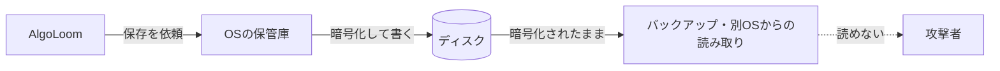
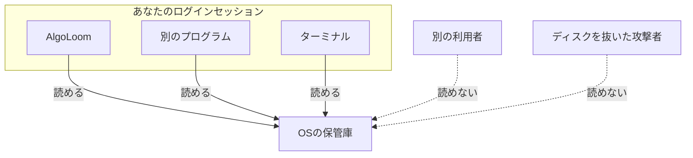
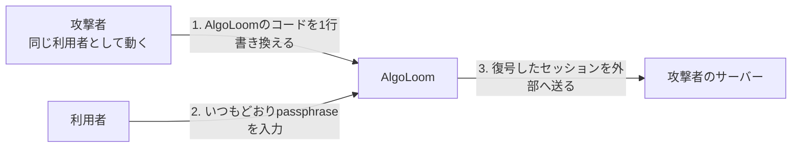

# OSの秘密情報保管庫と信頼境界：セッションを何から守れるのか

> 目的：`TD-12`（macOS）と`TD-47`（Windows）の実測を題材に、OSの秘密情報保管庫が実際に何を守るのかを理解する。
>
> 位置付け：本書は**学習用の整理メモ**であり、保証範囲と表示文言を決める正本ではない。正本は[AtCoder認証設計 §4.1](../architecture/atcoder-authentication.md#41-保管先)、観測結果は[同 §4.1.1](../architecture/atcoder-authentication.md#411-macosで観測した実際の保証範囲)（macOS）と[§4.1.2](../architecture/atcoder-authentication.md#412-windowsで観測した実際の保証範囲)（Windows）とする。
>
> 作成日：2026年9月22日 ／ OSの実装は変わり得るため、挙動に依存する判断の前に公式資料と実測で再確認すること。

---

## ドキュメント概要

本書は、ジュニアエンジニア向けに次を説明します。

1. AlgoLoomが何を保存しているか
2. **「暗号化されている」と「あなた以外読めない」は別のこと**
3. 信頼境界という考え方
4. macOSとWindowsで実測した結果と、その違い
5. **自前で暗号化しても解決しない理由**
6. 何から守れて、何から守れないか
7. 用語集

読み終えたら、手元で観測物を動かしてください（[§9](#9-手元で確かめる)）。**読むだけより速く身に付きます。**

## 1. 何を保存しているのか

AlgoLoomはAtCoderの`REVEL_SESSION`というCookieを保存します。**これはパスワードではありませんが、パスワードと同じ重さで扱います。** 持っている人はそのアカウントとしてAtCoderへアクセスできるためです。

保存するものと、保存しないものを先に押さえます。

| 保存する | 保存しない |
|---|---|
| `REVEL_SESSION`（1件だけ） | パスワード |
| 確認済みアカウント識別情報への参照 | 他のCookie |
| ― | Turnstileのtoken |

## 2. まず「平文で置かない」から始まる

一番やってはいけないのは、ファイルへそのまま書くことです。

```text
~/.algoloom/session.txt   ← これをやると、次で漏れる
  - バックアップ
  - Cloud同期（ホームディレクトリを同期している場合）
  - うっかりGitへcommit
  - 画面共有、スクリーンショット
```

そこでOSの秘密情報保管庫を使います。OSごとに名前が違います。

| OS | 名前 | 保存時の保護 |
|---|---|---|
| macOS | Keychain | 暗号化されたデータベース。loginキーチェーンの解錠状態に従う |
| Windows | Credential Manager | DPAPI（利用者の資格情報から導出した鍵）で保護 |
| Linux | Secret Service（GNOME Keyring等） | 実装による。多くはログイン時に解錠 |

**どれも保存時は暗号化されています。** ディスクを抜き取って別のOSから読んでも、中身は取り出せません。



ここまでは直感どおりです。**問題はこの次です。**

## 3. 「暗号化されている」と「あなた以外読めない」は別

鍵を持っているのはOSです。では**OSは誰に渡すのか。** ここが本題です。

| 問い | 答え |
|---|---|
| ディスクを抜き取られたら読めるか | **読めない**（鍵はログインに紐づく） |
| 別の利用者アカウントから読めるか | **読めない** |
| ロック中（ログアウト中）に読めるか | **読めない** |
| **あなたとして動く別のプログラムから読めるか** | **読める**（OSによっては確認画面が出る） |

最後の行が、多くの人がつまずくところです。**OSが引いている線は「アプリ」ではなく「ログイン中の利用者」です。**



## 4. 信頼境界という考え方

**信頼境界（trust boundary）とは、「ここから内側は信頼する」と決めた線です。** セキュリティの設計は、この線をどこに引くかで決まります。

| 線の引き方 | 例 | 内側にいるもの |
|---|---|---|
| 端末 | ディスク暗号化 | その端末で動くすべて |
| **利用者アカウント** | **OSの秘密情報保管庫** | **その利用者として動くすべてのプロセス** |
| アプリ | iOSのアプリsandbox、Androidのアプリ別領域 | そのアプリだけ |

**アプリ単位の線を引くには、OSが「アプリを識別する仕組み」を持っている必要があります。** そして識別できるのは普通、**署名された実行ファイル**です。

ここでAlgoLoomの事情が効いてきます。**AlgoLoomはPythonのコードとして配られます。** 実行するのはPythonのインタプリタです。OSから見ると、動いているのは`python`であって`AlgoLoom`ではありません。

## 5. 実測した結果

### 5.1. macOS（2026年9月20日）

macOS Keychainは**実行ファイル単位のアクセス制御を持っています。** 期待としては「AlgoLoomだけ読める」に近づけそうです。実際はこうでした。

| 観測したこと | 結果 |
|---|---|
| 許可される実行ファイルとして記録されるもの | **AlgoLoomのコードではなくインタプリタ**（`Python.app`） |
| 同じインタプリタを起動できる他のプロセスから読めるか | **読めた。確認画面なし** |
| 専用の実行ファイル（ad-hoc署名）にした場合 | 紐付けは効くが、**再ビルドのたびに読めなくなり再認可が要る** |
| `/usr/bin/security`から読んだ場合 | **確認画面が出た** |

**さらに予想外のことが起きました。** ad-hoc署名の専用実行ファイルが作り、許可一覧にその実行ファイル1件だけを持つ項目を、**Apple署名のPythonが確認画面なしで読めました。** 呼び出し元のコード署名の種類が影響していると見られますが、**仕組みは特定していません。観測した事実としてだけ記録しています。**

**「分からないことを分からないまま正確に書く」のは、推測で埋めるより価値があります。**

### 5.2. Windows（2026年9月21日）

Windowsの`CRED_TYPE_GENERIC`は、**アプリ単位の紐付けをそもそも持ちません。** 項目は利用者のアカウントへ紐づきます。

| 観測したこと | 結果 |
|---|---|
| 許可される実行ファイルの記録 | **無い** |
| 別の実行ファイル（`powershell.exe`）から読めるか | **読めた。確認画面なし** |
| 更新時の再認可 | **要らない** |
| 専用の実行ファイルにした場合 | **紐付ける先がなく、保護は変わらない** |

### 5.3. 2つを並べて分かること

**出発点が違うのに、結論は同じです。**

| | macOS | Windows |
|---|---|---|
| アプリ単位の仕組み | **ある** | **ない** |
| AlgoLoomに効くか | 効かない（インタプリタに紐づくため） | 効かない（仕組みがない） |
| 同じ利用者の他プロセスから読めるか | **読める** | **読める** |

**「仕組みがあること」と「自分のアプリに効くこと」は別です。** ここを実測せずに設計すると、保証できないことを利用者へ約束してしまいます。

## 6. では自前で暗号化すれば解決するのか

**しません。** 鍵をどこへ置くかを考えると分かります。

| 鍵の置き場所 | 何が起きるか |
|---|---|
| OSの保管庫 | **同じ境界に戻る。** 他のプロセスが鍵を読める |
| AlgoLoomのコードや配布物の中 | **秘密にならない。** OSSであり、コンパイルしても取り出せる |
| 利用者のpassphrase（毎回入力） | 境界は動く。ただし[§6.1](#61-passphraseでも残る限界)の限界がある |
| ハードウェア（Secure Enclave、TPM）＋署名済みnativeアプリ | 最も強い。**ただし配布形態を変える必要がある** |

### 6.1. passphraseでも残る限界

passphraseで暗号化すると、「保管庫を読めるだけ」では復号できなくなります。**ここまでは前進です。**

しかし、**攻撃者があなたとして動けるなら、AlgoLoom自身を書き換えられます。**



**鍵を守っても、鍵を使う側を乗っ取られます。** これは実装の不足ではなく、**隔離の単位が利用者アカウントであることの帰結**です。

ハードウェアに鍵を置いた場合も、「アプリに代わりに使わせる」形の攻撃（**confused deputy**）は残ります。鍵を取り出せなくても、**アプリへ「これを復号して」と頼めるなら結果は同じ**だからです。

### 6.2. それでも暗号化が無意味なわけではない

**脅威によります。** 自前の暗号化が効くのは、「保管庫の中身だけが漏れる」型の脅威です。効かないのは「同じ利用者として動く」型の脅威です。**何から守るのかを決めずに「暗号化すれば安全」と考えるのが、いちばん危ない思考です。**

## 7. 現在の設計で守れること・守れないこと

| # | 脅威 | 守れるか | 理由 |
|---:|---|---|---|
| 1 | 端末を紛失し、ディスクを別のOSから読まれる | **守れる** | 保存時に暗号化され、鍵はログインに紐づく |
| 2 | バックアップやCloud同期に平文で含まれる | **守れる** | 保管庫へ入れる。保管庫を使えないときも平文へ切り替えず、提出だけを止める |
| 3 | うっかりGitへcommitする、ログに出る | **守れる** | `argv`、環境変数、通常ログ、履歴DB、成果物へ出さない契約がある |
| 4 | 別の利用者アカウントから読まれる | **守れる** | OSの保管庫が利用者ごとに分離する |
| 5 | ロック中（ログアウト中）に読まれる | **守れる** | 解錠状態に従う |
| 6 | **同じ利用者として動くマルウェア** | **守れない** | OSの境界が利用者アカウントであるため。**自前の暗号化でも変わらない** |
| 7 | **端末を管理者権限で操作できる者** | **守れない** | 保管庫の外側から回避できる |
| 8 | 未確認の値を保存してしまう | **守れる** | 本人照合に成功した値だけを保存する |
| 9 | ローカルで削除したのにAtCoder側で有効なまま | **守れない（そもそも別のこと）** | ローカルの削除はAtCoder側の失効を意味しない。文言で区別する |

**この表が、[認証設計 §4.1](../architecture/atcoder-authentication.md#41-保管先)の「保証する／保証しない」と対応しています。** 保証しないことを「保証しない」と書けるのは、実測したからです。

## 8. AlgoLoomが払っているコスト

守れない範囲があるからといって、何もしないわけではありません。**守れる範囲を確実にするために、次を契約として決めています。**

- **保管庫が使えないとき、平文ファイルへ切り替えない。** 提出だけを止める
- **本人照合に成功した値だけを保存する。** 未確認の値を確定保存しない
- **`argv`、環境変数、設定ファイル、通常ログ、履歴DBへ渡さない**
- **削除対象と削除方法を一意にする**
- **「AlgoLoomだけが読める」と表示しない**

最後の1つがこの文書の結論です。**実測する前から「表示しない」と決めていましたが、実測がその判断を裏付けました。** もし逆に「AlgoLoomだけが読めます」と書いていたら、macOSでもWindowsでも嘘になっていました。

## 9. 手元で確かめる

観測物はリポジトリにあります。**AtCoderへ接続せず、固定のダミー値だけを使います。**

```console
python3 scripts/verification/secret_store_guarantees.py --self-test
python3 scripts/verification/secret_store_guarantees.py
```

別の端末で再現する手順は[秘密情報保管庫の観測手順](../verification/secret-store/README.md)にあります。**Linuxはまだ実装していません**（[`TD-48`](../../TODO.md#td-48-linuxの検証環境を確保し秘密情報保管庫が保証する範囲を観測する)）。

観測物には**`判定できなかった`という結果値**があります。「読めなかった」と混ぜないためです。**実際に読めるものを「読めなかった」と記録すると、その上に過大な保証を書いてしまいます。** 2026年9月21日のWindowsの観測で実際に起きかけました（[§4.1.2.1](../architecture/atcoder-authentication.md#4121-最初の実行が反対の結果を報告したこと)）。

## 10. 持ち帰ってほしいこと

1. **「暗号化した」は答えではありません。** 鍵をどこへ置くかが答えです
2. **信頼境界を先に決めます。** 誰から守るのかが決まらないと、対策の良し悪しを判定できません
3. **仕組みがあることと、自分のアプリに効くことは別です。** 実測しないと分かりません
4. **守れないことを正直に書くほうが、製品としては強くなります。** 過大な表示は、利用者の判断を誤らせます
5. **分からなかったことは、分からないまま正確に書きます**（macOSの観測で実際にそうしました）

## 用語集

| 用語 | 意味 |
|---|---|
| 信頼境界（trust boundary） | 「ここから内側は信頼する」と決めた線。設計の出発点 |
| 脅威モデル | 誰が、何を狙い、何ができるかの想定。これが無いと対策を評価できない |
| 平文 | 暗号化されていない状態 |
| DPAPI | Windowsの保護API。利用者の資格情報から導出した鍵で暗号化する |
| ACL（アクセス制御リスト） | 誰に何を許すかの一覧。macOS Keychainは実行ファイル単位で持つ |
| ad-hoc署名 | 開発者証明書を使わない簡易な署名。**再ビルドのたびに識別子が変わる** |
| confused deputy | 権限を持つ側に、代わりに操作させる攻撃。鍵を盗めなくても目的を達せられる |
| Secure Enclave / TPM | 鍵を取り出せない形で保持する専用ハードウェア |
