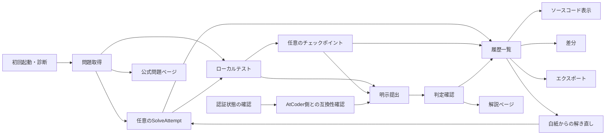
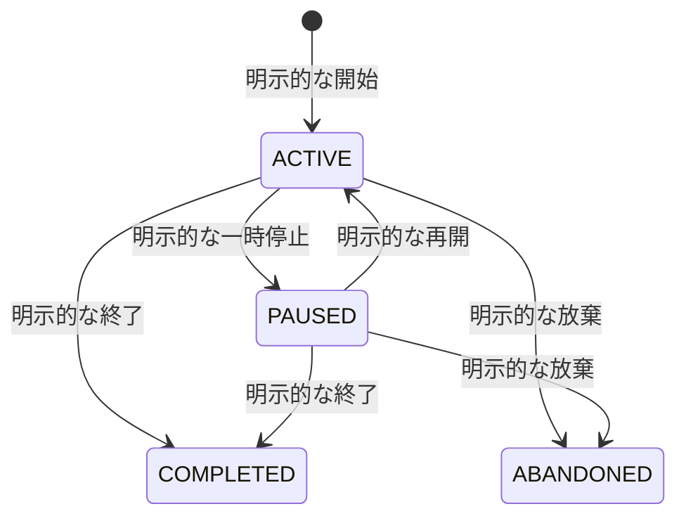
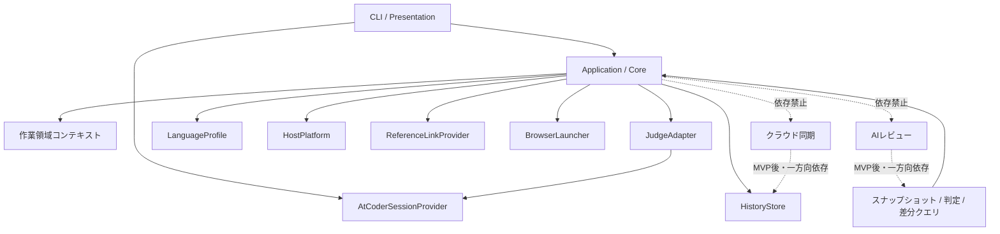

# AlgoLoom MVP機能設計

## 1. 目的と読み方

### 1.1. 本書の役割

本書は、MVPで実装する機能、依存関係、完了条件を実装単位へ分解します。

| 本書で決めること | 本書で決めないこと |
|---|---|
| 機能の単位、責任、依存関係 | サブコマンド、引数、オプション、エイリアスの最終名称 |
| 機能ごとの要件と完了条件 | クラス、モジュール、テーブル、カラムの最終名称 |
| 機能横断の品質要件 | タイムアウト、出力量、サイズ、保持期間の具体値 |
| 実装順序と受け入れシナリオ | メタデータファイルとエクスポートファイルの最終形式 |

本書は単独で読めるように書きます。`docs/`の設計文書への参照は[§18](#18-背景と正本の対応)へ集約してあり、機能を理解するために開く必要はありません。

- 共通の不変条件は[Core開発契約](core-contracts.md)、MVPの境界は[MVP実装範囲](scope.md)を優先します。
- 本書と`docs/`の設計文書が矛盾する場合は、[正本と優先順位](README.md#3-正本と優先順位)に従い、`docs/`を優先して不整合を修正します。
- MVP後の候補は[§16](#16-mvp後の機能候補)へ分離し、実装対象と混同しません。

### 1.2. AlgoLoomとMVPの範囲

AlgoLoomは、AtCoderの終了済み過去問を対象とする学習用のCLIです。利用者は自分が選んだエディタで解答を書き、公開入出力例でローカル検証し、自分のアカウントで提出し、その試行をローカル履歴として振り返ります。

クラウド、AI、専用エディタを必要とせず、途中で失敗しても成功済みのデータを失わずに再開できることを価値とします。

| 項目 | MVPの保証範囲 |
|---|---|
| 対象ジャッジ | AtCoderの終了済みAlgorithm問題 |
| ホストOS | ネイティブmacOS、ネイティブLinux、ネイティブWindows |
| 解答言語 | C++、Python、Go、Rust |
| ソース構成 | 一つの問題ディレクトリに一つのソースコード |
| 利用形態 | 一人、一つのAtCoderアカウント、一台の端末 |
| 編集手段 | 保存済みの通常ファイルを編集できる任意のエディタまたはIDE |
| 履歴 | オフラインで参照できるローカルSQLite |

MVPに含めない主な能力を次に示します。Coreへ設定項目、空の画面、日常的な案内を置かず、MVP後に別途採用判断します（[§16](#16-mvp後の機能候補)）。

- AIレビュー、クラウド同期、複数端末、共有、共同編集
- 問題カタログの取得・保存、ターミナル内の検索、推薦、タグ、苦手分野の分析
- TUI、Webダッシュボード、エディタのプラグイン、高度な外部ビューア連携
- 利用者間の順位付け、公開される能力スコア、自動的な成長評価
- AHC、対話的な問題、特殊ジャッジ、WSL、複数ファイルのプロジェクトビルド
- 他者またはLLMが書いたコードの実行
- AtCoder上の既存提出履歴の自動取り込み、テストごとの自動バージョン管理
- 保存済み履歴の削除。削除を追加する場合は、エクスポート、影響確認、復旧可能性を先に設計します
- 自動テレメトリ、利用統計の送信、クラッシュレポートの送信、自動の更新確認

### 1.3. 用語

本書に出てくる語をすべて定義します。定義の正本は[§18](#18-背景と正本の対応)を参照します。

#### 製品と範囲

| 用語 | 英語表記 | 意味 |
|---|---|---|
| MVP | MVP | 初期利用者が主要導線を実用し、学習履歴の価値とCoreの信頼性を検証できる最小の製品範囲 |
| Core | Core | AI、クラウド同期、外部ビューア等を設定しなくても成立する日常機能と共通契約 |
| 任意機能 | optional Capability | Coreの安定した契約へ一方向に依存し、未導入・失敗でもCoreを変化させない機能 |
| ジャッジ | judge | 提出されたコードを採点する外部サービス。MVPの対象はAtCoder |
| 正規問題ID | canonical problem ID | AtCoderの問題を一意に表す正規化済みの識別子。例: `abc300_a` |
| 公開入出力例 | public sample | 問題ページで公開されている入力と期待出力の組。非公開テストは対象外 |
| AC / WA | AC / WA | AtCoderの判定。ACはすべてのテストケースに正解、WAは不正解 |
| 提出ID | submission ID | AtCoderが受理した提出へ発行する識別子 |

#### 作業領域とソースコード

| 用語 | 英語表記 | 意味 |
|---|---|---|
| 作業領域 | workspace | 問題ディレクトリを配置し、AlgoLoomが作業対象として認識する通常のディレクトリ |
| 問題チェックアウト | problem checkout | ある問題のソースコードを編集する一つの物理ディレクトリ。同じ問題に複数存在でき、移動・名前変更が可能 |
| 問題メタデータ | problem metadata | 問題ディレクトリと一緒に移動する宣言的ファイル。正規問題ID、ジャッジ、スキーマバージョン等を持つ |
| コンテキスト | context | コマンドが処理対象とする作業領域、問題、ソースコードの組み合わせ |
| 正規言語ID | canonical language ID | `cpp`、`python`、`go`、`rust`等、ツールチェーン名やジャッジ上のバージョンに依存しない言語識別子 |

#### 履歴として残す記録

| 用語 | 英語表記 | 意味 |
|---|---|---|
| ソーススナップショット | source snapshot | ある時点の正確なソースコードのバイト列と、由来・問題・言語・時刻を結び付けた不変記録 |
| チェックポイント | checkpoint | 利用者の明示操作で作るソーススナップショット |
| 提出スナップショット | submission snapshot | 外部送信に使う正確なバイト列を保持する必須のソーススナップショット |
| SolveAttempt | SolveAttempt | ある問題へ一度取り組む開始から終了までの学習記録。解き直しは別のレコードにする |
| FocusInterval | FocusInterval | SolveAttempt内で一時停止を除いて能動的に取り組んだ一つの時間区間 |
| 能動時間 | active duration | 妥当なFocusIntervalの合計。実経過時間や処理時間と区別する |
| 学習マイルストーン | learning milestone | 最初の公開入出力例の通過、初回提出、初AC等、SolveAttempt内の到達点 |
| 提出操作記録 | submission operation | 外部送信前の耐久保存から、判定確定または状態不明からの回復までを表す記録 |
| 提出 | submission | AtCoderが受理し、提出IDを発行した提出 |
| 判定観測 | verdict observation | AtCoderから判定状態を取得した、取得時刻付きの観測記録 |

#### 時間

意味の異なる時間を同じ語で扱いません。

| 用語 | 英語表記 | 意味 |
|---|---|---|
| 能動時間 | active duration | 妥当なFocusIntervalの合計。利用者が実際に取り組んだ時間 |
| 実経過時間 | wall elapsed | 中断を含む、開始から終了までの時計上の時間 |
| 処理時間 | process duration | コンパイル、実行、通信等の機械処理に要した時間 |
| コンパイル所要時間 | compile duration | ビルドに要した処理時間 |
| ローカル実行時間 | local run duration | 入出力例ごとのローカル実行の処理時間 |
| ジャッジ実行時間 | judge execution time | AtCoderが返した実行時間。ローカルの値と同一条件で比較しない |
| 判定待機時間 | verdict polling time | 判定が確定するまで待った時間 |

#### 実装の境界

コードの構造を分ける単位です。名前はコード上の識別子と対応させます。

| 境界 | 責任 |
|---|---|
| `LanguageProfile` | 言語固有のテンプレート、ツールチェーン診断、`BuildPlan` / `RunPlan`の生成を閉じ込める |
| `HostPlatform` | OS固有のプロセス、パス、ターミナル、ファイル操作を閉じ込める |
| `ProcessRunner` | `HostPlatform`のうち、プロセスの起動、取消、終了、出力上限を担う |
| `BuildPlan` / `RunPlan` | `argv`、作業ディレクトリ、入出力、生成物、タイムアウト区分からなるビルド計画と実行計画。シェル文字列を含まない |
| `JudgeAdapter` | AtCoder固有の取得、認証確認、可視browserへの提出準備、提出ID・判定確認、ジャッジ言語の解決を閉じ込める。最後の提出操作は代行しない |
| `AtCoderSessionProvider` | 可視の専用ブラウザによる認証、必要なセッションだけの取得、秘密情報保管庫への保存を閉じ込める |
| `ReferenceLinkProvider` | ジャッジ固有の公式URLを構成する。外部本文を取得しない |
| `BrowserLauncher` | OSへのURL起動要求だけを担う |
| `HistoryStore` | トランザクション、履歴状態、クエリをSQLiteの詳細から分ける |
| Presentation | CLIの入力受付、確認、進捗、結果表示を担う層 |
| Application | 業務の状態遷移と、境界の呼び分けを担う層 |

#### その他

| 用語 | 英語表記 | 意味 |
|---|---|---|
| 外部学習資料 | ― | AtCoder上の問題、解説、他ユーザーのコード等、本文をAlgoLoomへ保存せずブラウザで参照する資料 |
| 外部所有環境 | ― | エディタ、シェル、プラグイン、ツールチェーン、OS設定等、AlgoLoomが所有しない永続状態 |
| 内容ハッシュ | content hash | 取得したファイルの正確なバイト列から計算する値。内容が同じかどうかの比較に使い、その内容がAlgoLoomと互換であることまでは証明しない |
| 互換性確認 | compatibility check | AtCoder側の変更後も`JudgeAdapter`が依存する必須条件が成立するかを確認すること。内容ハッシュの比較は変更を見つける入口の一つ |
| 冪等性 | idempotency | 同じ操作を再実行しても、重複や上書きによって既存データを壊さない性質 |
| 安全側で停止 | fail closed | 安全性を確認できない場合に、許可せず停止する方針 |

### 1.4. 機能IDと領域

| 記法 | 意味 |
|---|---|
| `F-<領域>-<連番>` | 機能ID。要件、実装、テストを結ぶ追跡用IDであり、CLIやモジュール名ではない |
| `R<n>` | 各機能節の要件ID。完全形は`機能ID-R<n>`（例: `F-BASE-01-R3`） |
| `Q-NN` | 機能横断の品質要件ID |
| `E2E-NN` | 受け入れシナリオID |

機能IDの領域名は、その機能を定義する節と1対1で対応します。IDを見れば、その機能が何を担い、どの節に書かれているかが分かります。

| 領域 | 担うこと | 担わないこと | 機能 | 節 |
|---|---|---|---|---|
| `BASE` | AlgoLoomを起動して実行環境を診断し、保存領域の境界を定め、各コマンドが対象とする作業領域・問題・ソースコードを一意に決める | 外部ツールの導入、問題の取得、コードの実行 | `F-BASE-01`, `F-BASE-02` | [§3](#3-基盤機能) |
| `PROBLEM` | AtCoderの一件の問題を識別し、公開入出力例とテンプレートを持つ作業ディレクトリを作り、同じ問題を白紙から解き直す | 問題の検索・推薦、問題文の保存、コードの実行 | `F-PROBLEM-01`〜`03` | [§4](#4-問題開始と解き直し) |
| `ATTEMPT` | 利用者が明示的に開始する一回の学習記録として、状態遷移、能動時間、到達点を保存する | ソースコードの自動保存、暗黙の計測開始、他者との比較 | `F-ATTEMPT-01`, `F-ATTEMPT-02` | [§5](#5-solveattemptと学習時間) |
| `TEST` | 自分のコードをリソース上限付きでビルド・実行し、公開入出力例と比較して結果を示す | AtCoderのACの保証、コードの自動修正、全テストの履歴保存 | `F-TEST-01` | [§6](#6-ローカルテストf-test-01) |
| `HISTORY` | ソースコードを不変のスナップショットとして残し、ローカルDBだけで一覧・表示・比較する | 外部通信、最良版の自動選定、編集中ファイルの管理 | `F-HISTORY-01`〜`04` | [§7](#7-スナップショットと振り返り) |
| `SUBMIT` | AtCoder側との互換性とaccountを確認し、一件ずつ可視browserへ提出を準備して最後の操作を利用者へ委ね、判定を取得時刻付きで記録する | 無人提出、直接HTTP POST fallback、無条件の再送、未確認のAtCoder側変更の自動受け入れ、判定の推測 | `F-SUBMIT-01`〜`05` | [§8](#8-認証提出判定) |
| `REFERENCE` | 問題一覧、公式の問題ページ、解説ページのURLを構成し、既定のブラウザへ開く要求を渡す | 本文・カタログ・他ユーザーのコードの取得と保存、閲覧完了の判定 | `F-REFERENCE-01`〜`03` | [§9](#9-外部学習資料f-reference-01-f-reference-02) |
| `STORAGE` | 履歴をローカルSQLiteへトランザクションで保存し、スキーマを移行し、持ち出せる形式で書き出す | クラウド同期、自動バックアップ、エクスポートからの自動復元 | `F-STORAGE-01`, `F-STORAGE-02` | [§10](#10-ローカル保存とエクスポート) |
| `OUTPUT` | 全コマンドに共通する結果の示し方、待たせ方、部分失敗からの戻し方を定める | 個別機能の業務ロジック、色やレイアウトの最終仕様 | `F-OUTPUT-01` | [§11](#11-共通出力待機回復f-output-01) |

連番は各領域内での並び順であり、優先度や実装順序を意味しません。実装順序は[§14](#14-実装順序)を参照します。
- `get`、`test`、`submit`等の操作名は責任を示す概念名であり、最終的なサブコマンド名を確定しません。
- 「〜しない」と書いた項目は禁止事項であり、実装判断で緩和できません。
- 各節の先頭にある「正本」は、要件の背景と判断理由を確認する`docs/`側の参照先です。
- 日本語と英語の使い分けは[§18](#18-背景と正本の対応)の表記規則に従います。バッククォートで囲んだ語はコード上の名前です。

## 2. MVPの機能構成

### 2.1. 主要導線



### 2.2. 機能一覧

「概要」は各機能の責務を一行で示します。要件と完了条件は「詳細」の節を正とします。

| ID | 機能 | 概要 | 依存 | 詳細 |
|---|---|---|---|---|
| `F-BASE-01` | 初回起動・環境診断 | 初回起動と明示診断で、Core、DB、選択言語の準備状態を確認し、不足するツールの影響範囲と次の行動を示す | ― | [§3.1](#31-初回起動環境診断f-base-01) |
| `F-BASE-02` | 作業領域コンテキストの解決 | 各コマンドの開始時にファイルシステムとメタデータから対象の作業領域、問題、ソースコードを再解決し、安全に一意なときだけ処理を続ける | `F-BASE-01` | [§3.3](#33-作業領域コンテキストf-base-02) |
| `F-PROBLEM-01` | 問題の識別・公式確認 | 正規問題IDまたは公式URLを正規化し、AtCoder公式で一件の問題を確認する。対象外は作用前に拒否する | `F-BASE-01` | [§4.1](#41-問題取得f-problem-01-f-problem-02) |
| `F-PROBLEM-02` | 入出力例の取得・チェックアウト作成 | 確認済みの問題から、メタデータ、選択した一言語のテンプレート、公開入出力例を持つ問題チェックアウトを一件だけ作る | `F-PROBLEM-01` | [§4.1](#41-問題取得f-problem-01-f-problem-02), [§4.2](#42-問題メタデータと公開入出力例) |
| `F-PROBLEM-03` | 白紙からの解き直し | 既存のソースコードを残したまま、同じ問題の新しい問題チェックアウトと新しいSolveAttemptを白紙のテンプレートから作る | `F-PROBLEM-02`, `F-ATTEMPT-01` | [§4.3](#43-白紙からの解き直しf-problem-03) |
| `F-ATTEMPT-01` | SolveAttemptの状態管理 | 明示操作だけでSolveAttemptを開始、一時停止、再開、終了、放棄し、状態とFocusIntervalを耐久保存する | `F-BASE-02`, `F-STORAGE-01` | [§5.1](#51-solveattempt状態f-attempt-01), [§5.3](#53-現在状態の表示) |
| `F-ATTEMPT-02` | 能動時間と学習マイルストーン | FocusIntervalから能動時間を算出し、最初の公開入出力例の通過、初回提出、初ACを別のマイルストーンとして記録する | `F-ATTEMPT-01`, `F-TEST-01`, `F-SUBMIT-04` | [§5.2](#52-能動時間と学習マイルストーンf-attempt-02) |
| `F-TEST-01` | ビルド・実行・比較 | 選択言語の`BuildPlan` / `RunPlan`をリソース上限付きで実行し、取得済みの公開入出力例との一致をローカルで確認する | `F-BASE-02`, `F-PROBLEM-02` | [§6](#6-ローカルテストf-test-01) |
| `F-HISTORY-01` | 明示的なチェックポイント | 利用者の明示操作で、保存済みのソースコードを不変のスナップショットとして履歴へ残す。外部通信は行わない | `F-BASE-02`, `F-STORAGE-01` | [§7.1](#71-保存表示対象) |
| `F-HISTORY-02` | 履歴一覧 | ローカルDBだけから試行、時間、マイルストーン、チェックポイント、提出、判定を取得し、状態を混同せず一覧する | `F-BASE-02`, `F-STORAGE-01` | [§7.1](#71-保存表示対象) |
| `F-HISTORY-03` | スナップショット表示 | 利用者が選んだスナップショットを、読み取り専用のプレーンテキストとしてターミナルへ表示する | `F-HISTORY-02` | [§7.1](#71-保存表示対象) |
| `F-HISTORY-04` | スナップショット差分 | 利用者が選んだ二つのスナップショットを`unified diff`で比較する。暗黙の最良版を作らない | `F-HISTORY-02` | [§7.1](#71-保存表示対象) |
| `F-SUBMIT-01` | AtCoder認証の確立と状態確認 | 可視の専用ブラウザで利用者が手動認証したセッションを安全に確立し、提出より前に現在のアカウントを確認する。失敗原因と次の行動を示し、ローカルのCore操作は止めない | `F-BASE-01` | [§8.1](#81-atcoder認証状態確認f-submit-01) |
| `F-SUBMIT-02` | 提出準備 | 提出対象と外部作用を利用者へ確認し、送信するソーススナップショットと提出操作記録を送信前に耐久保存する | `F-BASE-02`, `F-STORAGE-01`, `F-SUBMIT-01` | [§8.2](#82-提出前確認f-submit-02) |
| `F-SUBMIT-03` | AtCoderへの提出補助 | 互換性確認済みの`PREPARED`な一件を可視browserへ準備し、Turnstileと最後の提出操作を利用者へ委ねる。提出IDまたは送信状態不明を記録し、無条件の再送と直接HTTP POST fallbackをしない | `F-SUBMIT-02`, `F-SUBMIT-05` | [§8.3](#83-提出状態f-submit-03) |
| `F-SUBMIT-04` | 判定の確認・再確認 | 提出IDを基準に判定をポーリングし、取得時刻付きの観測として追記する。中断後も同じ提出を再確認できる | `F-SUBMIT-03` | [§8.4](#84-判定観測f-submit-04) |
| `F-SUBMIT-05` | AtCoder側の変更検知と互換性確認 | `contest.js`の内容ハッシュと`JudgeAdapter`の必須条件を確認し、未確認の変更または非互換を提出前に検知する | `F-BASE-01`, `F-SUBMIT-01` | [§8.5](#85-atcoder側の変更検知と互換性確認f-submit-05) |
| `F-REFERENCE-01` | 公式問題ページの参照 | 明示操作または`get`の補助動作として、公式問題ページのURLを構成し既定のブラウザへ起動要求する | `F-BASE-02` | [§9](#9-外部学習資料f-reference-01-f-reference-02) |
| `F-REFERENCE-02` | 解説ページの参照 | コンテストの終了とネタバレの確認を経て、AtCoderの問題別解説ページを既定のブラウザで開く。本文は取得しない | `F-BASE-02` | [§9](#9-外部学習資料f-reference-01-f-reference-02) |
| `F-REFERENCE-03` | 問題発見ページの参照 | 明示操作で問題一覧ページを既定のブラウザで開く。カタログを取得・保存せず、非公式サービスであることを示す | `F-BASE-01` | [§9](#9-外部学習資料f-reference-01-f-reference-02) |
| `F-STORAGE-01` | ローカル保存・マイグレーション | Coreの業務操作をトランザクションでローカルSQLiteへ保存し、スキーマバージョン管理、退避付きマイグレーション、障害分類を担う | `F-BASE-01` | [§10.1](#101-sqliteとマイグレーションf-storage-01), [§10.2](#102-同時実行と保守処理) |
| `F-STORAGE-02` | 学習履歴のエクスポート | 明示操作で、学習履歴とソーススナップショットを、認証情報を含まないバージョン付き形式へ持ち出す | `F-STORAGE-01` | [§10.3](#103-エクスポートf-storage-02) |
| `F-OUTPUT-01` | 共通出力・待機・回復 | 全コマンドの出力順序、エラー分類、進捗と中止、統一診断入口、非対話実行の共通契約を提供する | 全機能 | [§11](#11-共通出力待機回復f-output-01) |

### 2.3. 外部作用の有無

実装時に、どの機能がローカルで完結するかを先に確認します。

| 分類 | 機能 |
|---|---|
| ローカルだけで完結する | `F-BASE-02`, `F-ATTEMPT-01`, `F-ATTEMPT-02`, `F-TEST-01`, `F-HISTORY-01`〜`F-HISTORY-04`, `F-STORAGE-01`, `F-STORAGE-02` |
| AtCoderへ通信する | `F-PROBLEM-01`, `F-PROBLEM-02`, `F-SUBMIT-01`, `F-SUBMIT-03`〜`F-SUBMIT-05` |
| OSのブラウザへ起動要求する | `F-SUBMIT-01`の認証用専用ブラウザ、`F-REFERENCE-01`〜`F-REFERENCE-03`, `F-PROBLEM-02`の補助動作 |
| 外部ツールを読み取り専用で検出する | `F-BASE-01`, `F-TEST-01`のツールチェーン診断 |

## 3. 基盤機能

### 3.1. 初回起動・環境診断（`F-BASE-01`）

| # | 要件 | 完了条件 |
|---|---|---|
| R1 | 設定ファイルの手編集を要求しない | インストール後、推奨導線だけで最初のローカルテストへ進める |
| R2 | AI、クラウド、外部ビューアを要求しない | 任意の依存を導入しない環境でCoreが起動する |
| R3 | C++、Python、Go、Rustを個別に診断する | 一つの言語の不足が、別の言語とオフライン履歴を止めない |
| R4 | ホストOSとツールチェーンを診断する | 原因、影響する機能、公式の導入先を示す |
| R5 | 外部環境を変更しない | エディタ、シェル、プラグイン、ツールチェーン、OS設定に差分を作らない |
| R6 | DBを安全に初期化する | 外部キー、一意制約、スキーマバージョンが有効になる |
| R7 | 診断入口を一つにする | 利用者が内部の担当領域を判別せずに診断へ到達できる |
| R8 | バージョン表示を一致させる | 正式コマンドと互換コマンドが同じエントリポイント、バージョン、終了コードを返す |
| R9 | 非公式であることを示す | バージョン表示と最上位のヘルプで、AtCoder公式でも公認でもないことを確認できる |
| R10 | 非公式表示を繰り返さない | サブコマンドのヘルプ、通常のコマンド出力、初回起動では表示しない |

- インストールの完了と、各言語の実行準備の完了を同じ状態として扱いません。
- 不足する外部ツールは、影響を受ける機能と受けない機能を分けて示します。
- 外部ツールのインストール、更新、設定ファイルの編集、`PATH`の変更を通常操作で行いません。

### 3.2. 保存領域と作業領域の構成

| 領域 | 内容 | 通常コマンドで許可すること |
|---|---|---|
| AlgoLoom所有領域 | 設定、履歴DB、キャッシュ、一時領域 | スキーマと保存契約に沿った作成、更新、マイグレーション、削除 |
| 利用者が明示した作業領域 | 問題ディレクトリ、メタデータ、公開入出力例、ソーステンプレート | 予告したファイルの作成。既存ソースコードの無断上書きは禁止 |
| 外部所有環境 | エディタ、シェル、プラグイン、ツールチェーン、OS設定 | 読み取り専用の検出と、安全な`argv`による既存ツールの一時起動 |
| OSのキーリング等の秘密情報保管庫 | AlgoLoom名前空間の項目 | 明示操作による参照・保存・削除。他のアプリケーションや外部ランタイムの項目は変更しない |

`F-PROBLEM-02`が作る推奨構成を次に示します。作成後の配置は利用者が自由に変更できます。

```text
algoloom_workspace/
├── abc300_a/                 # 初回の問題チェックアウト
│   ├── <problem-metadata>    # 名称と形式は未決（§17）
│   ├── main.cpp              # 選択した1言語のテンプレートだけを生成
│   └── test/                 # 取得した公開入出力例
├── abc300_a--02/             # 白紙からの解き直し（F-PROBLEM-03）
└── abc300_a-python/          # 同じ問題を別言語で解く場合
```

- 選択した1言語のソースコードだけを作り、4言語分を同時生成しません。
- 接尾辞、表示用の連番、絶対パスを問題、問題チェックアウト、SolveAttemptの恒久IDにしません。
- 一般的なファイル・ディレクトリ操作をAlgoLoom独自のコマンドとして再定義しません。

書き込みの安全条件を次のとおりとします。

| 対象 | 条件 |
|---|---|
| 生成する名前 | 正規問題IDを正規化し、ディレクトリ名とファイル名に使える文字へ制限する |
| 書き込み先 | パスを正規化した後、AlgoLoom所有領域または明示された作業領域の内側であることを確認する |
| シンボリックリンク | 生成先と一時領域では追跡しないことを既定とする |
| 一時領域 | OSの安全なAPIで作成し、推測可能な固定名を使わず、権限を制限し、後始末する |
| 書き込み方法 | 原子的に書き込み、途中状態を正式なファイルとして残さない |

### 3.3. 作業領域コンテキスト（`F-BASE-02`）

| 状況 | 動作 |
|---|---|
| 現在ディレクトリから一意に解決できる | 認識した作業領域、問題、ソースコードを表示して使用する |
| ソースコードが明示される | 拡張子、`LanguageProfile`、親方向のメタデータと整合する場合だけ使用する |
| 複数のソースコードまたは複数のチェックアウトが候補になる | 候補を示し、明示指定を求める |
| メタデータが欠損・矛盾する | 外部作用やコード実行の前に停止する |
| 作業領域または問題ディレクトリが移動・名前変更される | 絶対パスやディレクトリ名に依存せず再認識する |
| ソースコードだけがコンテキスト外へ移動される | 暗黙に別の問題へ関連付けず、明示指定または復旧方法を示す |
| 同じ正規問題IDのチェックアウトが複数ある | 統合、名前変更、削除をせず、候補を示す |

- 各コマンドの開始時にファイルシステムとメタデータからコンテキストを再検証し、ファイル監視を正しさの条件にしません。
- エディタ固有のファイルを生成・要求せず、メタデータやソース候補として解釈しません。
- 作業領域全体へ恒久的な「現在の言語」モードを設けません。

## 4. 問題開始と解き直し

### 4.1. 問題取得（`F-PROBLEM-01`, `F-PROBLEM-02`）

```text
入力を正規化
  → AtCoder公式で一件の問題を確認
  → 公開入出力例を取得
  → メタデータ・ソースコード・テストデータを安全に作成
  → 開始した問題をローカルDBへ保存
  → 補助動作として公式問題ページを開く
```

| # | 要件 | 完了条件 |
|---|---|---|
| R1 | 正規問題IDとAtCoder公式URLを受け付ける | 不正なドメイン、曖昧なID、対象外の問題を作用前に拒否する |
| R2 | 一件だけ取得する | 一括取得、非公開テストの取得、背後でのクロールを行わない |
| R3 | 選択した一つの言語だけを作る | 組み込み`LanguageProfile`のテンプレートを一つ生成する |
| R4 | 宣言的なメタデータだけを置く | 認証情報、エンドポイント、任意のコマンドを含めない |
| R5 | 再実行を安全にする | 編集済みのソースコード、入出力例、メタデータを上書き・重複させない |
| R6 | 段階ごとの完了状態を識別する | 中断後に成功済みの段階から安全に再開できる |
| R7 | ブラウザの失敗を分離する | チェックアウトが利用可能なら問題取得は成功のまま保つ |
| R8 | 外部通信へ上限を設ける | リクエストのtimeout、同一originへの開始間隔、操作全体の上限を持ち、同じ操作内の自動再試行をしない |
| R9 | 作る前に既存を探す | 同じ正規問題IDのメタデータが一件あれば完了段階を確認して再開し、複数あれば候補を示して明示指定を求める |
| R10 | 成功時に場所を示す | 内部処理を列挙せず、作成または再利用したパスを主結果として示す |

外部通信の再試行は次の規約に従います。

| 応答 | 動作 |
|---|---|
| 正常 | 取得済みのローカルデータを優先し、同じページを繰り返し取得しない |
| `429` | `Retry-After`等の指示を記録して停止し、同じ操作内で自動再試行しない |
| `403`・challenge | Bot対策を回避せず停止する |
| `5xx`・通信失敗 | 外部作用前かを示して停止し、利用者が確認した後の新しい明示操作としてだけ再開する |

- MVPの対象は終了済みのAtCoder Algorithm問題です。AHC、対話的な問題、特殊ジャッジは、安全に処理できない場合は理由を示して停止します。
- CAPTCHA、レート制限、Bot対策を回避しません。
- 同一originへのリクエスト開始間隔は2秒を初期下限とします。これはAtCoderの公式推奨値ではなく、serverがより長い待機を示した場合はserver指示を優先します。無効化optionは提供しません。
- 直接HTTPのUser-Agentは`AlgoLoom/<version> (+https://github.com/mgmaru/algo-loom-design)`形式を初期値とし、account・端末・OS等を含めません。可視browserのUser-Agentは変更しません。

### 4.2. 問題メタデータと公開入出力例

| 対象 | 保持する内容 | 契約 |
|---|---|---|
| 問題メタデータ | 正規問題ID、ジャッジ、スキーマバージョン等の宣言的情報 | 問題ディレクトリと一緒に移動できる通常ファイルにする |
| 公開入出力例 | 入出力の内容、取得元、取得時刻 | 内容と由来を確認してから再利用または更新する |
| 未知のメタデータスキーマバージョン | 認識できないという事実 | 推測して解釈せず、影響する操作だけを停止する |

- 問題本文、画像、解説、非公開テストを取得・保存しません。
- 検証できないローカルの入出力例は、`F-PROBLEM-01`の契約に従って一問分だけ再取得します。

### 4.3. 白紙からの解き直し（`F-PROBLEM-03`）

MVPで扱う開始方法を次のとおり区別します。

| 開始方法 | ソースコードの開始点 | ディレクトリ | MVP |
|---|---|---|---|
| 白紙からの解き直し | 選択言語の組み込みテンプレート | 同階層の新しいチェックアウト | 対象（既定） |
| 現在地での新しい試行 | 現在の保存済みソースコード | 現在のチェックアウト | 対象（`F-ATTEMPT-01`の明示開始） |
| スナップショットからの解き直し | 明示した自分のスナップショット | 同階層の新しいチェックアウト | 対象外（[§16](#16-mvp後の機能候補)） |
| 再開 | 既存のソースコード | 既存のチェックアウト | 新規の試行ではない |

| # | 要件 | 完了条件 |
|---|---|---|
| R1 | 白紙のテンプレートを既定にする | 前回のソースコードを複製、初期化、上書きしない |
| R2 | 同階層のチェックアウトを作る | 既存のチェックアウトを統合、名前変更、削除しない |
| R3 | 新しいSolveAttemptを作る | 前回の時間、マイルストーン、スナップショット、判定を変更しない |
| R4 | ディレクトリ名を表示用途に限定する | 接尾辞、連番、絶対パスを恒久IDにしない |
| R5 | 検証済みの入出力例を再利用できる | シンボリックリンクやハードリンクを既定にせず、安全に複製する |
| R6 | 既存の実行中・一時停止中の試行を保護する | 暗黙に一時停止、終了、放棄、統合しない |
| R7 | ファイルとDBの部分失敗を回復する | 重複したチェックアウトや試行を作らず再実行できる |
| R8 | 開始点を表示で区別する | 白紙からの解き直しと現在地での新しい試行を混同させない |

- ファイル成功・DB失敗と、DB成功・ファイル失敗を別の回復経路として扱います。
- 後始末が必要でも、利用者のファイルを自動削除しません。
- 他ユーザーのコードや外部解説のサンプルコードを開始元にしません。

## 5. SolveAttemptと学習時間

### 5.1. SolveAttempt状態（`F-ATTEMPT-01`）



| # | 要件 | 完了条件 |
|---|---|---|
| R1 | 計測の開始を明示操作にする | `get`、ファイル保存、`test`で暗黙に開始しない |
| R2 | 計測しないことを正常状態にする | テスト、提出、履歴を制限せず、案内を繰り返さない |
| R3 | 能動時間をFocusIntervalから算出する | 一時停止中、処理時間、判定待ちを含めない |
| R4 | 状態遷移を冪等にする | 同じ操作の再実行で区間を重複作成しない |
| R5 | 時計の異常を検出する | 負の値、推測値、事実でない精密値として保存しない |
| R6 | 別の試行を保護する | 新しい試行の開始時に既存の試行を暗黙に変更しない |
| R7 | プロセス終了後も継続できる | 各明示操作で状態を耐久保存し、再起動後に再開・終了できる |

- 常駐デーモン、エディタのプラグイン、ファイル監視を計測の条件にしません。
- 時計の後退、極端な飛躍、欠損した区間は、影響する時間を不確実または算出不能として示します。

### 5.2. 能動時間と学習マイルストーン（`F-ATTEMPT-02`）

| マイルストーン | 記録条件 | 保存する時間 |
|---|---|---|
| 最初の公開入出力例の通過 | 現在かつ未終了の試行で、すべての入出力例が初めて一致 | テスト完了時点の能動時間 |
| 初回提出 | 試行に関連する提出IDを初めて取得 | 送信開始前に保存した能動時間 |
| 初AC | 試行に関連する提出で最初のACを観測 | ACした提出の送信開始時の能動時間 |

- 初ACの時間へ判定待機時間を加算しません。
- 遅れて到着した判定によって、確定済みマイルストーンの時間を増やしません。
- 部分失敗時も、確定済みマイルストーンを削除または別の試行へ付け替えません。

### 5.3. 現在状態の表示

| 対象 | 表示契約 |
|---|---|
| 正規の確認経路 | 明示的な`status`相当を現在状態と能動時間の確認経路にする |
| 通常画面 | 秒単位で増える精密値を常駐で再描画しない |
| `test`・チェックポイントの後 | 計測中のときだけ、落ち着いた粒度で短く補助表示できる |
| 時間のラベル | 能動時間、実経過時間、処理時間、ジャッジ実行時間を区別する |
| 未計測 | エラーや不完全な履歴として扱わず、開始を繰り返し促さない |

## 6. ローカルテスト（`F-TEST-01`）

### 6.1. 実行段階

| 段階 | 入力 | 結果の分類 |
|---|---|---|
| コンテキスト解決 | 作業領域、問題、ソースコード | 一意な対象、または作用前のエラー |
| ツールチェーン診断 | 正規言語ID | 利用可能、または不足するツールの診断 |
| ビルド | `BuildPlan` | 成功、コンパイルエラー、タイムアウト、出力量超過、取消 |
| 実行 | `RunPlan`、公開入出力例の入力 | 成功、実行時エラー、タイムアウト、シグナル、出力量超過、取消 |
| 比較 | 標準出力、公開入出力例の出力 | 入出力例ごとの一致・不一致 |
| 計測 | `monotonic clock` | コンパイル所要時間、入出力例ごとのローカル実行時間 |

- プロセスはシェル文字列ではなく`argv`配列で起動します。
- コンパイルと実行には別のタイムアウトとリソース上限を設けます。
- タイムアウト・取消時は対象のプロセスツリーを終了します。
- 子プロセスへAtCoderセッションや不要な環境変数を渡しません。
- すべてのローカルテストのイベントをMVPの永続履歴へ保存しません。

### 6.2. 比較方式

`test`が保証するのは取得済みの公開入出力例に対するローカル実行結果であり、AtCoder上のACではありません。

| # | 要件 | 完了条件 |
|---|---|---|
| R1 | 標準出力と公開入出力例の出力を比較する | 比較対象と比較単位を表示できる |
| R2 | 失敗の種別を不一致と混同しない | コンパイルエラー、実行時エラー、タイムアウト、シグナルによる終了、出力量超過を別分類で示す |
| R3 | ジャッジを再現できない形式を明示する | 浮動小数の許容、特殊ジャッジ、複数解等は近似判定と表示するか、未対応として停止する |
| R4 | 失敗理由を特定できる | どの入出力例が、どの理由で失敗したかを確認できる |

空白と改行の正規化規則、浮動小数の既定の許容誤差は[§17](#17-未決事項)の未決事項です。確定するまで、近似判定を「AtCoderのジャッジと一致する」と表示しません。

### 6.3. 結果表示とリソース保護

| # | 要件 | 完了条件 |
|---|---|---|
| R1 | 主結果を先に示す | 成功数、失敗数、最初に失敗した入出力例を最初に表示する |
| R2 | 差分を確認できる | 期待値と実際値の最初の差をプレーンテキストで確認できる |
| R3 | 長い出力を抑制する | 生出力を既定で省略し、省略した事実と確認方法を示す |
| R4 | 表示順序を安定させる | 実行順序と結果の表示順序を一定にする |
| R5 | 端末を占有しない | 入出力例を無制限に並列実行せず、出力量とプロセス数へ上限を設ける |
| R6 | 時間を分けて示す | コンパイル所要時間と入出力例ごとのローカル実行時間を単一の「実行時間」へ合算しない |
| R7 | 計測の失敗をテストの失敗にしない | 未対応・取得失敗は取得できない旨と理由を示す |
| R8 | 欠損値を補わない | ローカルの最大メモリはMVP対象外とし、取得不能を`0`と表示しない |

- 利用者のコードを自動修正しません。
- ローカルの値とジャッジの値を同一環境のベンチマークとして比較しません。

## 7. スナップショットと振り返り

### 7.1. 保存・表示対象

| 機能 | 保存・表示対象 | 必須条件 |
|---|---|---|
| チェックポイント（`F-HISTORY-01`） | 明示した時点の保存済みソースコード | 外部通信なし、不変のスナップショット、未保存の編集内容は対象外 |
| 提出スナップショット（`F-SUBMIT-02`） | 実際に送信するバイト列 | 送信バイト列とハッシュが一致する |
| 履歴一覧（`F-HISTORY-02`） | 試行、時間、マイルストーン、チェックポイント、提出、判定 | ローカルDBだけから取得し、状態を混同しない |
| ソースコード表示（`F-HISTORY-03`） | 利用者が選んだスナップショット | 読み取り専用、ターミナルのプレーンテキスト |
| 差分（`F-HISTORY-04`） | 利用者が確認した二つのスナップショット | `unified diff`、暗黙の「最良版」を作らない |

- チェックポイントを作らなくても`test`と提出を利用できます。
- エディタでの保存とチェックポイントを同じ「一時保存」として扱いません。
- チェックポイント、提出待ち、提出済み、判定待ち、最終判定を混同しません。
- 便利な既定候補（初回提出と最新のAC等）を設けても、比較対象を明示できるようにします。
- 履歴の対象が「AlgoLoomで記録した履歴」であり、AtCoderアカウント全体の提出履歴ではないことを利用者が判別できるようにします。
- 履歴一覧は索引とページングを持ち、件数が増えても一覧と表示の応答性を保ちます。
- 一覧の並び替えに使う識別子は許可リストから選び、外部入力から組み立てません。
- 大きなソースコードや差分は、既定で全量をターミナルへ出さず、省略した事実と確認方法を示します。

### 7.2. スナップショットの不変条件

- 保存後にソースコード本文を上書きしません。
- 正確なバイト列からハッシュを計算します。
- 文字コードと改行を暗黙に正規化しません。
- 問題、ジャッジ、言語、作成理由、端末が生成したUTC時刻を記録します。
- チェックアウトの移動・削除後も履歴として保持します。
- 内容を重複排除しても履歴イベントの意味を失いません。

## 8. 認証・提出・判定

### 8.1. AtCoder認証状態確認（`F-SUBMIT-01`）

| # | 要件 | 完了条件 |
|---|---|---|
| R1 | 初回提出より前に確認できる | 提出を試さずに現在のセッションのアカウントを確認できる |
| R2 | 失敗原因を分類する | 未認証、期限切れ、AtCoder側の拒否、ページ構造の変更、通信障害を可能な範囲で分ける |
| R3 | 所有者を示す | 認証情報の所有者がAlgoLoomでないことを平易に伝える |
| R4 | Coreを止めない | 認証エラーを理由にローカルテスト、履歴閲覧、エクスポート、チェックポイントを停止しない |
| R5 | 次の一手を示す | エラーごとに利用者が行える行動を一つ示す |
| R6 | アカウントの変更を検出する | 保存済みアカウントと異なる場合は送信前に停止して説明する |
| R7 | 手動認証でsessionを確立する | 可視の専用browserを明示操作で起動し、利用者がusername、password、Turnstileをbrowser上で操作する |
| R8 | browserとsecretを分離する | 既存profileを参照せず、`REVEL_SESSION`だけをaccount確認後にOSのsecret storeへ保存する |
| R9 | 認証中断を回復する | 取消、timeout、browser異常終了で提出せず、孤児process、利用可能な一時profile、未確認sessionを残さない |

- Cookie、パスワード、セッショントークンを履歴DB、作業領域、エクスポート、通常ログへ保存しません。
- 秘密情報保管庫を利用できない場合、平文設定ファイルへ自動的に切り替えません。
- 手動Cookie取り込みは技術検証だけに限定し、MVP製品、CI、共有環境、非対話実行へ実装しません。
- Bot対策の回避方法を案内しません。
- 複数のAtCoderアカウントの統合管理はMVP対象外です。

### 8.2. 提出前確認（`F-SUBMIT-02`）

| 確認対象 | 拒否条件 |
|---|---|
| 問題コンテキスト | 欠損、矛盾、対象外 |
| ソースコード | 複数候補、読み取り失敗、サイズ上限超過、デコード不能またはNUL等の対応外形式 |
| 正規言語IDとジャッジ言語 | 対象コンテストで対応するジャッジ言語を一意に解決できない |
| AtCoderのアカウント識別情報 | 未確認、または保存済みアカウントと異なる |
| 提出内容と外部作用 | 利用者が明示的に提出していない |

外部送信前に、少なくとも次を耐久保存します。

| 保存する事実 | 備考 |
|---|---|
| 一意な操作ID | AtCoder側の重複防止キーと誤認しない |
| 正規問題IDとジャッジ | ― |
| AtCoderのアカウント識別情報 | ― |
| 正規言語ID | ― |
| ジャッジ固有の言語ID、表示名、処理系・バージョン | 提出時に解決した事実として保存する |
| ソーススナップショットとコードハッシュ | 送信バイト列と一致させる |
| 作成時刻と操作の状態 | 端末が生成したUTC時刻 |

- 提出対象（問題、ジャッジ言語、ソースコード、ハッシュ、提出先）を表示して明示的な同意を得ます。ソースコード全文の常時表示は行いません。
- 短時間の重複提出を検知し、自動で再提出を繰り返す仕組みを実装しません。
- テストの成功を理由に無条件で自動提出しません。
- 個別ルールが適用され得るコンテストでは、規約を確認できるリンクを提出前に示します。
- 初回提出前に、AtCoderのAI学習拒否設定を一度だけ操作を止めない形で案内します。AlgoLoomは拒否設定を代行、推測、保証しません。

### 8.3. 提出状態（`F-SUBMIT-03`）

`PREPARED`なsourceは空の可視専用browser上の提出formへ準備し、利用者が内容を目視した後にTurnstileと最後の提出buttonを操作します。AlgoLoomは最後の操作を自動化せず、browser経路が成立しない場合にsessionを使った直接HTTP POSTへfallbackしません。

```text
PREPARED
  ├─ 互換性未確認・非互換・確認不能 → FAILED_BEFORE_SEND
  ├─ その他の送信前失敗 → FAILED_BEFORE_SEND
  └─ 互換性確認済み・送信開始 → SEND_STARTED
                    ├─ 提出IDの取得 → REMOTE_ACCEPTED → VERDICT_PENDING → FINAL
                    └─ 応答不明 → REMOTE_STATUS_UNKNOWN
```

| 状態 | 保持する事実 | 次の安全な操作 |
|---|---|---|
| `PREPARED` | §8.2の耐久保存内容 | 互換性確認後の送信または安全な取消 |
| `FAILED_BEFORE_SEND` | 外部へ未送信と確認できる失敗 | 原因修正後の新しい明示操作 |
| `SEND_STARTED` | 外部へ到達した可能性 | 結果の確認。無条件の再送は禁止 |
| `REMOTE_ACCEPTED` | 提出ID | 同じIDの判定確認 |
| `VERDICT_PENDING` | 最後の判定観測 | 後から同じIDを再確認 |
| `FINAL` | 最終判定と取得時刻 | 履歴、差分、明示的な次の提出 |
| `REMOTE_STATUS_UNKNOWN` | 送信の有無を断定できない事実 | 公式の提出一覧と利用者の確認 |

状態名は実装設計で変更できますが、意味の区別は変更できません。

### 8.4. 判定観測（`F-SUBMIT-04`）

- ポーリングには間隔と最大待機時間を設け、待機のタイムアウトを提出失敗として扱いません。
- 判定は取得時刻付きの観測として追記します。
- ジャッジ実行時間とメモリは、AtCoderが返した場合だけ値なしを許容する観測として保存します。
- 欠損値を`0`または推測値で補いません。
- 判定待ちから最終判定への進行を、ソーススナップショットの上書きとして実装しません。
- 最終判定の後に外部状態との差異を検出した場合、履歴を黙って書き換えず再照合の事実を記録します。
- AtCoderへの提出、ローカル保存、判定確認を別々の結果として表示します。

### 8.5. AtCoder側の変更検知と互換性確認（`F-SUBMIT-05`）

`contest.js`の内容ハッシュは、AtCoder側の変更を早く見つけるための警報であり、互換性の合否そのものではありません。ハッシュはAlgoLoomと無関係な変更でも変わり、逆に提出フォーム、サーバー応答またはBot対策だけが変わった場合は変わらない可能性があります。

| # | 要件 | 完了条件 |
|---|---|---|
| R1 | 確認済みの基準を版ごとに持つ | AlgoLoomの版、`contest.js`の公式の取得先、内容ハッシュの方式と値、確認時刻、確認結果を対応付けられる |
| R2 | 内容ハッシュの変更を検知する | 取得した正確なバイト列から内容ハッシュを計算し、確認済みの値と異なる場合を「変更検出・要再確認」として区別できる |
| R3 | ハッシュと互換性を混同しない | ハッシュの一致だけで提出可能と判定せず、不一致だけで非互換と断定しない |
| R4 | `JudgeAdapter`の必須条件を確認する | アカウント識別、問題とジャッジ言語の一意な解決、送信するソースコードとフォーム値の一致、提出IDの識別、判定状態の解釈を個別に確認できる |
| R5 | 未確認の変更を自動で受け入れない | 新しい内容ハッシュは、必須条件の確認と保守者の確認記録が完了するまで確認済みの値に追加しない |
| R6 | 必要な範囲だけを安全側で停止する | 「変更検出・要再確認」「非互換」「確認不能」のいずれかで提出だけを停止し、ローカルテスト、履歴閲覧、エクスポートを継続できる |
| R7 | 外部通信と記録を最小限にする | release時のmaintainer確認を基準更新の主経路とし、実行時は提出に必要なpageで必須条件を確認する。hash確認だけの利用者ごとの追加GETと無期限の常駐監視を行わない |
| R8 | 秘密情報と外部コンテンツを保存しない | 確認記録に、Cookie、トークン、ソースコード、生のヘッダー、生のHTML、`contest.js`の本文を含めず、取得先、取得時刻、内容ハッシュ、個別の確認結果だけを残す |

利用者の各提出で新規提出を使った互換性検証を追加実行しません。提出前に読み取れる条件はその場で確認し、提出IDと判定状態に関する条件は固定入力、既存の提出または明示承認された一件限定の実サービス検証で確認します。

`contest.js`の内容hashはrelease時にmaintainerが確認し、AlgoLoomの版と対応付けます。利用時は提出に必要なpage・formから必須条件を確認し、別のasset GETを必須にしません。明示診断を設ける場合の回数・有効期限は、[公開情報に基づく配布判断](../docs/project/atcoder-public-policy-review.md)の有限通信・自動再試行なしを下限に、工程7の実測で確定します。変更または必須条件の不成立を検出した場合は、AtCoder側の変更を検出したこと、提出を停止したこと、公式siteから手動提出できること、AlgoLoomの互換性修正または確認済み版を確認する手順を示します。

## 9. 外部学習資料（`F-REFERENCE-01`, `F-REFERENCE-02`）

| 機能 | 許可する処理 | 安全条件 | 保存 |
|---|---|---|---|
| 公式問題ページ | 公式URLを既定のブラウザへ渡す | 明示操作または`get`の補助動作 | 本文を保存しない |
| 問題別解説ページ | 公式URLを既定のブラウザへ渡す | 終了済み、未ACなら明示確認 | 本文・画像・PDF・動画を保存しない |
| 問題一覧ページ | 一覧ページのURLを既定のブラウザへ渡す | 明示操作。非公式サービスであることを示す | 一覧・カタログを保存しない |

| # | 要件 | 完了条件 |
|---|---|---|
| R1 | 表示言語を指定して開く | 利用者のアカウント設定に依存せず、同じ言語のページを開く |
| R2 | 一つの操作で一つのURLだけを開く | 求めていないページを同時に開かない |
| R3 | 自動起動を対話的な実行に限定する | 非対話的な実行と非TTYでは、`get`の補助動作としてブラウザを起動しない |
| R4 | 利用者が指定した表示手段を尊重する | 特定のブラウザを固定せず、利用者の既定設定に従う |
| R5 | ターミナルを占有し得る表示手段を補助動作に使わない | 占有し得る場合は`get`の補助動作で起動せず、明示操作でだけ開く |
| R6 | 起動に失敗したらURLを示す | 手動で到達できるURLと次の行動を示す |

| 状態 | 動作 |
|---|---|
| 終了済みの問題・明示操作 | ブラウザへ委譲する |
| 未ACの現在のSolveAttempt | ネタバレを含み得ることを確認する |
| 非対話的な実行 | 明示的なオプションがなければネタバレを含み得る資料を開かない |
| コンテスト開催中または終了を確認できない | 開かず、確認できない理由を示す |
| ブラウザの起動失敗 | URLと手動操作を示し、Coreの履歴を変更しない |

- `ReferenceLinkProvider`はURLの構成だけ、`BrowserLauncher`はOSへの起動要求だけを担当します。
- `https`と許可したホストだけを開き、`file:`、`javascript:`、`data:`等を受け付けません。
- ブラウザの起動成功を、ページの読み込み、ログイン、閲覧の成功とみなしません。
- テスト失敗、WA、タイムアウト、提出完了の後に解説を自動表示しません。
- 「AtCoderの解説ページを開く」と表示し、「公式解説を取得した」と表示しません。
- ブラウザのCookie、プロファイル、ログイン状態を読み取り・複製しません。
- MVPでは、外部資料を開いたイベント自体を履歴へ保存しません。
- 問題発見（`F-REFERENCE-03`）と、現在の問題の資料参照（`F-REFERENCE-01`、`F-REFERENCE-02`）を同じ操作にしません。前者は問題コンテキストを必要とせず、後者は必要とします。
- 問題一覧の提供元が停止しても、問題IDまたは公式URLからの取得導線を止めません。

## 10. ローカル保存とエクスポート

### 10.1. SQLiteとマイグレーション（`F-STORAGE-01`）

| # | 要件 | 完了条件 |
|---|---|---|
| R1 | Python標準の`sqlite3`を唯一のMVP保存方式にする | Turso SDKとクラウドのアカウントなしで全Core履歴を扱える |
| R2 | 業務操作をトランザクション化する | 必要な更新をコミットまたはロールバックできる |
| R3 | スキーマバージョンを保存する | 既知のバージョンだけを明示的にマイグレーションする |
| R4 | マイグレーション前に退避する | 失敗時に旧スキーマへ復旧できる |
| R5 | 未知の将来スキーマを保護する | 自動でダウングレードせず通常起動を停止する |
| R6 | 障害を分類する | ロック、ディスク容量不足、破損を外部提出の成否と分けて回復経路を示す |
| R7 | 値をパラメータとして束縛する | 動的な識別子は許可リストから選ぶ |

### 10.2. 同時実行と保守処理

| 競合し得る操作 | 必要な挙動 |
|---|---|
| 複数プロセスの同時保存 | トランザクションを短く保ち、有限時間だけ待機または安全に再試行する |
| マイグレーション中の通常コマンド | マイグレーション中は通常コマンドを安全に停止し、完了またはロールバック後に再開する |
| 保守処理と閲覧経路 | `F-HISTORY-02`〜`F-HISTORY-04`の経路でチェックポイント、バックアップ、エクスポートを実行しない |
| DBロックの上限超過 | 無期限に待機せず、使用中である事実、保存済みデータへの影響、再試行方法を示す |

### 10.3. エクスポート（`F-STORAGE-02`）

| 含める | 含めない |
|---|---|
| 形式バージョン、作成時刻、AlgoLoomのバージョン | Cookie、トークン、パスワード、環境変数 |
| 問題、SolveAttempt、FocusInterval、マイルストーン | 不要な絶対パス、端末固有の実行ファイルのパス |
| チェックポイント、提出、判定、スナップショット | 問題文、解説、画像、他ユーザーのコード |
| レコード間の関連とソースコードの回収手段 | クラウドの認証情報、プロバイダの認証情報 |

- エクスポート中のDB更新で不整合な組み合わせを出力しません。
- AlgoLoomなしでもソースコードを回収できる形式にし、形式を文書化します。
- MVPのエクスポートは私的な可搬性・退避が目的であり、公開用の安全な成果物ではありません。
- 復元、クラウドバックアップ、公開用の成果物生成はMVP対象外です。

## 11. 共通出力・待機・回復（`F-OUTPUT-01`）

### 11.1. 出力順序

| 順序 | 情報 | 通常表示での扱い |
|---:|---|---|
| 1 | 利用者の主目的の結果 | 最初に短く示す |
| 2 | 追加で失敗した処理 | 保存状態、外部作用、状態不明を明示する |
| 3 | 影響を受けないもの | 部分失敗時に明示する |
| 4 | 次の行動 | 安全な行動を原則一つ示す |

### 11.2. 結果の分類とエラー

| 分類 | 表示する事実 |
|---|---|
| 成功 | 主目的の結果 |
| 利用者の入力エラー | 不正な入力と、受け付ける形式 |
| 環境エラー | 不足するツール、影響する機能、公式の導入先 |
| 外部サービスのエラー | 外部へ到達したか、再試行が安全か |
| 状態不明 | 成功または未実行と推測せず、確認が必要な事実として示す |

- 通常の結果出力と診断出力を別の出力先へ分け、将来スクリプトから利用する余地を壊しません。
- モジュール名、スタックトレース、生のHTTP応答、外部ツールの生のエラーは既定で省略し、診断経路へ分離します。
- 認証情報、ソースコード、生のヘッダー、不要なパスを通常ログへ出しません。
- 外部文字列とコードは、制御文字とマークアップを無害化してからターミナルへ出します。
- 色だけで成功・失敗を区別しません。
- ネットワークのエラーを、履歴の保存失敗やローカルテストの失敗と混同しません。
- 未設定の任意機能を通常の導線で繰り返し案内しません。利用者が求めたときだけ案内します。
- 自動テレメトリ、利用統計、クラッシュレポート、自動の更新確認を送信しません。

### 11.3. 待機と非対話実行

| 対象 | 契約 |
|---|---|
| 1秒を超える可能性がある処理 | 現在の段階、経過、停止可否、後続の確認方法を示す |
| 短時間で終わる処理 | 過剰なアニメーションを出さない |
| 中止 | 安全に停止できる処理は中止可能にし、残る状態と失われる進捗を示す |
| 制御を返す時点 | 必要な耐久保存と状態確定より前に制御を返さない |
| 非TTY・色なし・狭い幅 | 成功・失敗の分類、履歴、スナップショット、提出の意味を変えない |
| 非対話的な実行 | 確認が必要な操作は、明示的なオプションがなければ実行しない |
| 任意の依存が未導入 | ヘルプ、`F-HISTORY-02`〜`F-HISTORY-04`が起動と表示に成功する |

## 12. アーキテクチャへの配置

| 機能領域 | 境界 | 実装側の責任 |
|---|---|---|
| CLIと表示 | CLI / Application | 入力、確認、進捗、結果表示を業務の状態遷移から分離 |
| 問題取得・認証・提出・判定 | `JudgeAdapter` | AtCoder固有の取得、認証確認、互換性確認、言語解決、可視browserへの提出準備、提出ID・判定。最後の提出操作は利用者へ委ねる |
| AtCoder session | `AtCoderSessionProvider` | 可視専用browser、人によるlogin、必要Cookieだけの取得、secret store、cleanup |
| 外部資料 | `ReferenceLinkProvider` | AtCoder固有のURLの構成。本文は取得しない |
| ブラウザ | `BrowserLauncher` | OSへのURL起動要求 |
| ビルド・実行 | `LanguageProfile` | テンプレート、診断、`BuildPlan`、`RunPlan` |
| プロセス・ファイル | `HostPlatform` / `ProcessRunner` | タイムアウト、プロセスツリー、パス、原子的なファイル操作、ターミナル |
| 履歴・エクスポート | `HistoryStore` | SQLiteのトランザクション、クエリ、マイグレーション |
| 作業領域 | 作業領域コンテキスト | メタデータ探索、曖昧性と矛盾の検出 |



- 個別の`LanguageProfile`同士、個別の`HostPlatform`実装同士を依存させません。
- 個別実装の選択は起動時の合成ルートまたはレジストリへ閉じ込めます。
- MVPで実装しないAI、クラウド同期、Web APIの型、SDK、設定、状態をCoreへ持ち込みません。

## 13. 機能横断の品質要件

| ID | 要件 | 主な対象機能 | 検証観点 |
|---|---|---|---|
| `Q-01` | ローカルファースト | `TEST`, `HISTORY`, `STORAGE` | テスト、チェックポイント、履歴、表示、差分、エクスポートがクラウドなしで成立する |
| `Q-02` | 冪等性 | `PROBLEM`, `ATTEMPT`, `SUBMIT` | 同じ操作の再実行でソースコード、履歴、外部提出を重複・破壊しない |
| `Q-03` | 部分失敗からの回復 | 全機能 | 主結果、保持データ、未完了処理、次の安全な操作を示す |
| `Q-04` | 外部作用の明示 | `PROBLEM`, `SUBMIT`, `REFERENCE` | ネットワーク通信、提出、ブラウザ起動をローカル処理と区別する |
| `Q-05` | 有限の待機 | `PROBLEM`, `SUBMIT`, `TEST`, `STORAGE` | HTTP、ポーリング、DBロック、コンパイル、実行に上限と取消後の経路がある |
| `Q-06` | リソース保護 | `TEST`, `HISTORY` | 標準出力、標準エラー出力、生成ファイル、プロセス数、表示量に妥当な上限がある |
| `Q-07` | プロセスの安全性 | `TEST`, `BASE` | `argv`配列で起動し、利用者入力をシェル文字列へ連結しない |
| `Q-08` | データ保護 | `SUBMIT`, `STORAGE` | 秘密情報、ソースコード、生のヘッダー、不要なパスを通常ログへ出さない |
| `Q-09` | ターミナルの安全性 | `TEST`, `HISTORY`, `OUTPUT` | 外部文字列とコードの制御文字・マークアップを無害化する |
| `Q-10` | 環境への非侵襲性 | `BASE`, `TEST`, `REFERENCE` | 外部ツールのインストール、更新、設定変更を通常操作で行わない |
| `Q-11` | 可搬性 | `TEST`, `PROBLEM`, `HISTORY` | 4言語を`LanguageProfile`、3つのOSを`HostPlatform`で分離する |
| `Q-12` | 待機時の体験 | `PROBLEM`, `SUBMIT`, `TEST` | 長時間処理は段階、経過、停止可否、後続の確認方法を示す |
| `Q-13` | 自己比較 | `ATTEMPT`, `HISTORY` | 時間・判定・差分を他者との順位や単一の能力スコアへ変換しない |
| `Q-14` | 外部コンテンツの境界 | `PROBLEM`, `REFERENCE`, `STORAGE` | 問題・解説・他ユーザーのコードの本文をDB、キャッシュ、エクスポートへ保存しない |
| `Q-15` | 実行環境への非依存 | `OUTPUT`, `BASE` | 非TTY、色なし、エディタ非依存、任意の依存なしでCore導線と意味が成立する |

## 14. 実装順序

| 順序 | 実装単位 | 完了条件 |
|---:|---|---|
| 1 | `JudgeAdapter`の技術検証 | 入出力例の取得、アカウント確認、提出、提出ID、判定確認が成立し、その成立条件を互換性確認の基準として記録できる（[技術検証計画](../docs/project/judge-adapter-verification.md)のP0を満たす） |
| 2 | `LanguageProfile`と`HostPlatform` | 4言語、3つのOSの契約テストと通しの検証マトリクスがある |
| 3 | ローカルDB、マイグレーション、コンテキスト | トランザクション、排他、移動・名前変更、曖昧性、障害回復を検証できる |
| 4 | 初回診断、問題取得 | クリーンな環境から一件のチェックアウトを安全に作成できる |
| 5 | ローカルテスト | ビルド、実行、比較方式、タイムアウト、プロセスツリーの終了を検証できる |
| 6 | SolveAttempt、マイルストーン、チェックポイント | 状態、時間、不変のスナップショットをオフラインで確認できる |
| 7 | 白紙からの解き直し | ファイルとDBの各中断点から重複なく回復できる |
| 8 | 認証確立、互換性確認、提出、判定の再確認 | 方式Aでセッションを安全に確立し、認証状態とAtCoder側との互換性を提出前に確認でき、送信状態不明とポーリング中断から再提出せず回復できる |
| 9 | 履歴、表示、差分、外部参照、エクスポート | オフラインの振り返りと安全な持ち出しが成立する |
| 10 | 共通出力・待機・診断の統一 | 出力順序、エラー分類、進捗、統一診断入口を全コマンドへ適用する |
| 11 | リリース前の堅牢化 | セキュリティ、障害注入、3つのOSでの実機確認、AtCoder側との互換性確認、利用者検証を満たす |

縦に一度通すため、最初から全機能を同じ深さで設計しません。ただし、提出前の耐久保存と履歴モデルを後付けにしません。

## 15. MVP受け入れシナリオ

| ID | シナリオ | 主な対象 | 合格条件 |
|---|---|---|---|
| `E2E-01` | クリーンな環境から最初の問題を解く | `F-BASE-01`, `F-PROBLEM-02`, `F-TEST-01` | 任意機能と設定ファイルの手編集なしで`get → test`を完了する |
| `E2E-02` | 4言語を3つのOSで実行する | `F-TEST-01` | ビルド・実行計画と結果の分類が共通契約に一致する |
| `E2E-03` | `get`を各段階で中断する | `F-PROBLEM-02` | 編集済みのソースコードを失わず、再実行で重複を作らない |
| `E2E-04` | コンパイル・実行をタイムアウトさせる | `F-TEST-01` | プロセスツリーを残さず、次のテストを実行できる |
| `E2E-05` | 試行を一時停止・再開する | `F-ATTEMPT-01` | 区間を重複させず、能動時間をオフラインで確認できる |
| `E2E-06` | 白紙からの解き直しを各段階で中断する | `F-PROBLEM-03` | 旧ソースコードと履歴を保ち、チェックアウト・試行を重複させない |
| `E2E-07` | チェックポイント後に作業領域を削除する | `F-HISTORY-01`, `F-HISTORY-03` | 不変のスナップショットをDBから表示・エクスポートできる |
| `E2E-08` | 提出前の保存を失敗させる | `F-SUBMIT-02` | AtCoderへ送信しない |
| `E2E-09` | 送信直後に通信を切る | `F-SUBMIT-03` | 状態不明を記録し、自動で再送しない |
| `E2E-10` | 判定のポーリングを中断する | `F-SUBMIT-04` | 提出IDから同じ提出を再確認できる |
| `E2E-11` | ブラウザの起動を失敗させる | `F-REFERENCE-01` | 作業領域、履歴、提出の成功状態を変更しない |
| `E2E-12` | DBロック、ディスク容量不足、マイグレーション失敗を起こす | `F-STORAGE-01` | 成功済みデータを失わず、復旧経路を示す |
| `E2E-13` | エクスポートを検査する | `F-STORAGE-02` | ソースコードを回収でき、秘密情報・不要なパス・外部本文を含まない |
| `E2E-14` | AI、クラウド、ビューアなしで利用する | `Q-01`, `Q-15` | Coreの主要導線を完了できる |
| `E2E-15` | 作業領域と問題ディレクトリを移動・名前変更する | `F-BASE-02` | ファイル監視なしで同じコンテキストを再認識する |
| `E2E-16` | 認証が切れた状態で利用する | `F-SUBMIT-01` | 原因の所有者と次の行動を示し、テスト・履歴を停止しない |
| `E2E-17` | 別アカウントのセッションで提出する | `F-SUBMIT-01`, `F-SUBMIT-02` | 送信前に停止し、無確認で提出しない |
| `E2E-18` | 未AC・コンテスト状態不明で解説を開く | `F-REFERENCE-02` | ネタバレを確認し、確認できない場合は開かない |
| `E2E-19` | 二つのスナップショットを比較する | `F-HISTORY-04` | 比較対象を確認・指定でき、暗黙の「最良版」を作らない |
| `E2E-20` | 時間表示を確認する | `F-ATTEMPT-02` | 能動時間、実経過時間、処理時間、ジャッジ実行時間を区別できる |
| `E2E-21` | 通常コマンドの前後で外部環境を検査する | `Q-10` | エディタ、シェル、プラグイン、ツールチェーン、OS設定に差分がない |
| `E2E-22` | 二つのプロセスが同時にDBを使用する | `F-STORAGE-01` | 無期限にロックせず、保存済みデータを失わない |
| `E2E-23` | 非TTY・色なしで実行する | `Q-15` | 結果の分類と履歴の意味が変わらず、必要な明示引数を判別できる |
| `E2E-24` | 試行を実行中・一時停止中のままCLIを強制終了する | `F-ATTEMPT-01` | 再起動後に状態を確認でき、区間を重複させず再開・終了できる |
| `E2E-25` | 端末の時計を後退・飛躍させ、未終了の区間を残す | `F-ATTEMPT-01`, `F-ATTEMPT-02` | 負の時間や推測した精密値を保存・表示せず、不確実な区間と回復方法を示す |
| `E2E-26` | 制御を返す時点の直前と直後でプロセスを強制終了する | `F-SUBMIT-02`, `F-STORAGE-01` | 外部作用を重複させず、保存済みデータを失わず、状態を誤表示しない |
| `E2E-27` | 大量出力、巨大なソースコード、巨大な差分を扱う | `Q-06` | メモリと表示が上限内に収まり、省略した事実と確認方法を示す |
| `E2E-28` | 長時間処理を明示的に中止する | `Q-12` | 残る状態と失われる進捗を示し、保存済みの結果を壊さない |
| `E2E-29` | 履歴の対象範囲を確認する | `F-HISTORY-02` | AlgoLoomで記録した履歴であり、AtCoderアカウント全体の履歴ではないと判別できる |
| `E2E-30` | 可視の専用browserでAtCoder認証を開始・中断・再開する | `F-SUBMIT-01` | 既存profileへ触れず、手動login後に期待accountを確認し、中断・異常終了でもsecret、孤児process、一時profileを残さない |
| `E2E-31` | `contest.js`の内容ハッシュ変更を模擬する | `F-SUBMIT-05` | 非互換と断定せず「変更検出・要再確認」として提出だけを停止し、新しい値を自動で受け入れない |
| `E2E-32` | 内容ハッシュを変えずに必須条件の不成立を模擬する | `F-SUBMIT-05` | ハッシュの一致を理由に続行せず、非互換として提出だけを停止する |

## 16. MVP後の機能候補

この表は実装契約ではありません。各候補は昇格条件を満たした後に、別の仕様で確定します。

製品段階は優先順位の区分であり、実装を約束するものではありません。

| 製品段階 | 意味 |
|---|---|
| Phase 2 | Coreの意味を変えずに、実需へ応じて日常利用と対応範囲を広げる近接拡張 |
| Phase 3以降 | Coreから分離した任意機能として、価値と安全性を個別に検証してから採否を決める拡張 |
| 長期 | 現在の製品範囲を前提にせず、需要を確認してから構想を具体化する候補 |

| 製品段階 | 候補 | 主な能力 | MVPへ入れない理由・採用条件 |
|---|---|---|---|
| Phase 2 | 履歴の対話的な検索 | 逐次検索、非対話的なフォールバック | 既存の`log`、`show`を必須の依存なしで維持する |
| Phase 2 | 問題カタログ・選択支援 | カタログ更新、絞り込み、`pick`、期限切れ時のフォールバック | カタログ障害で問題IDと公式URLの導線を止めない |
| Phase 2 | 問題タグ・解法タグ | 複数タグ、適用範囲、出典、ネタバレ制御 | 利用者、外部、AIの出典を分離する |
| Phase 2 | スナップショットからの解き直し | 明示スナップショットの展開、開始元スナップショットの関係 | 白紙からの解き直しの履歴分離と、外部コードを取り込まない境界を維持する |
| Phase 2 | 他ユーザーのAC提出一覧 | AtCoderの提出一覧をブラウザ表示 | コード本文、投稿者、Cookieを取得・保存しない |
| Phase 2 | 対応環境の拡張 | WSL、追加言語、プロジェクトビルド | 既存の境界と検証マトリクスを弱めない |
| Phase 2 | ローカルの最大メモリ | OS別の最大メモリ観測 | 値の意味と範囲を3つのOSで検証する |
| Phase 2 | エディタ・差分ビューア連携 | 既存ツールで表示 | 外部ツールと設定を変更せずターミナルへのフォールバックを保つ |
| Phase 2 | ターミナル内での資料表示 | 導入済みのターミナル内表示手段へURLを渡し、公式ページをターミナルで読む | 採用方針は決定済み。残る判断は表示手段の選定。本文を取得せず起動要求だけを渡す境界を維持し、検証したOSの組み合わせだけを正式対応と表示する |
| Phase 2 | 詳細なテスト履歴・自動チェックポイント | 明示的な有効化によるイベント記録 | 保存範囲、保持、重複、無効化を定義する |
| Phase 2 | 継続的なタイマー・外部連携 | 監視表示、機械可読な状態 | デーモンとエディタのプラグインをCore要件にしない |
| Phase 2 | 自己振り返りの分析 | 試行、期間、言語、差分の比較 | 他者との順位と単一スコアを作らない |
| Phase 2 | AtCoder既存履歴の取り込み | 読み取り専用の遡及取り込み | AlgoLoomで記録した履歴と区別する |
| Phase 2 | バックアップ・復元 | 世代管理、整合したバックアップ、復元 | 同期と分離し、復元で既存データを失わない |
| Phase 2 | 公開候補の成果物生成 | 一問・一ソースのローカル成果物 | 許可リスト、ルール、プライバシー検査の後に採用判断する |
| Phase 2 | 機械可読な出力 | バージョン付きJSON、安定した終了コード | 人向けの出力を解析させない |
| Phase 2 | 利用者設定 | 表示、既定値、外部ツールの参照 | Core契約を変えず、標準状態へ戻せる |
| Phase 3以降 | AIレビュー | プロバイダ設定、安全判定、同意、レビュー履歴 | Coreのスナップショット契約の安定と安全側での停止が前提 |
| Phase 3以降 | クラウド同期 | 有効化、初期構築、送受信、再試行、無効化 | 2端末、オフライン、競合、配布の検証が前提 |
| Phase 3以降 | Repair Lab | 仮説、予測、修正、検証、振り返り | 学習価値、信頼できないコードの隔離、共通の利用体験を検証する |
| 長期 | 学習データのクエリ契約 | バージョン付きの読み取りモデルと説明可能な指標 | DBのスキーマを外部契約にしない |
| 長期 | ローカルのデータアクセス | 読み取り専用のライブラリまたはローカルAPI | アカウント不要、オフライン、最小権限を維持する |
| 長期 | 公式ダッシュボード | 共通クエリを使う参照実装 | 自己比較、アクセシビリティ、Webのセキュリティを満たす |
| 長期 | ホスト型API | 認証済み本人への読み取りAPI | 所有権、権限範囲、レート制限、運用責任が前提 |
| 長期 | マネージドサービス | 同期・APIの運用 | 需要、費用、法務、プライバシーを別途判断する |
| 長期 | 統合開発環境 | 編集、資料閲覧、コマンド実行を一つの画面へまとめた専用環境 | エディタ非依存の原則の見直しが前提。それまでは利用者のツール構成の案内で代替する |

## 17. 未決事項

本書で確定しない事項です。実装前に参照先で状態を確認します。

| 領域 | 本書で確定しないこと | 参照先 |
|---|---|---|
| CLI | サブコマンド、引数、オプション、エイリアス、補完 | [未決事項一覧](../docs/project/unresolved-decisions.md) 1.1 |
| 作業領域 | メタデータの名称・形式・バージョン、探索上限、明示オプション | [未決事項一覧](../docs/project/unresolved-decisions.md) 1.2 |
| 保存領域 | AlgoLoom所有領域の具体的なパス、設定・DB・キャッシュの配置 | [未決事項一覧](../docs/project/unresolved-decisions.md) 2.1 |
| ローカルテスト | 空白・改行の正規化規則、浮動小数の既定の許容誤差、近似判定の表示文言 | [未決事項一覧](../docs/project/unresolved-decisions.md) 2.5 |
| 履歴 | ツールチェーン観測を履歴へ保存するか。Core契約と可搬性設計の記述が一致していない | [未決事項一覧](../docs/project/unresolved-decisions.md) 2.6 |
| 認証 | 方式Aのsetup・状態確認・削除の最終command名と表示、対応browser matrix | [未決事項一覧](../docs/project/unresolved-decisions.md) 1.6 |
| 時間計測 | 最終的なCLI、表示精度、時計異常の訂正方法 | [未決事項一覧](../docs/project/unresolved-decisions.md) 1.8 |
| 外部資料 | 最終的なCLI、ネタバレ確認の文言、非対話時の明示オプション | [未決事項一覧](../docs/project/unresolved-decisions.md) 1.9 |
| 外部資料の表示手段 | ターミナル内で表示崩れの少ない表示手段の選定と、対応OSごとの保証範囲 | [未決事項一覧](../docs/project/unresolved-decisions.md) 1.11 |
| 解き直し | 最終的なCLI、チェックアウトの安定した識別方法、途中状態のマーカー | [未決事項一覧](../docs/project/unresolved-decisions.md) 1.10 |
| 表示 | 色、スピナー、表、進捗、詳細表示量 | [未決事項一覧](../docs/project/unresolved-decisions.md) 1.4 |
| 構造化出力 | 終了コード、機械可読な形式 | [未決事項一覧](../docs/project/unresolved-decisions.md) 1.5 |
| 実装 | CLIフレームワーク、モジュール、テーブル、カラム、ファイル形式 | [未決事項一覧](../docs/project/unresolved-decisions.md) 2.1 |
| 制限値・性能 | タイムアウト、出力量、サイズ、保持期間、互換性の再確認間隔、性能目標の確定値 | [未決事項一覧](../docs/project/unresolved-decisions.md) 2.3 |

## 18. 背景と正本の対応

本書は単独で読めます。この表は、各節の要件が**なぜそうなったか**を確認したいときの参照先であり、実装時に開く必要はありません。

| 対象 | 正本 |
|---|---|
| 用語の定義 | [Core契約](../docs/architecture/core-contracts.md) §1、[アーキテクチャ概要](../docs/architecture/overview.md) §1 |
| 日本語と英語の使い分け | [ドキュメント表記規則](../docs/project/writing-conventions.md) |
| §3.1 初回起動・環境診断 | [ストレスフリーUX設計](../docs/quality/stress-free-ux-design.md) §3.1、[Core契約](../docs/architecture/core-contracts.md) §2.4、[配布方針ガイド](../docs/operations/algoloom-distribution.md) §9.1 |
| §3.2 保存領域と作業領域の構成 | [Core契約](../docs/architecture/core-contracts.md) §2.4、[アーキテクチャ概要](../docs/architecture/overview.md) §4 |
| §3.3 作業領域コンテキスト | [Core契約](../docs/architecture/core-contracts.md) §2.3、[ストレスフリーUX設計](../docs/quality/stress-free-ux-design.md) §4.1 |
| §4.1 問題取得 | [Core契約](../docs/architecture/core-contracts.md) §3.1、§3.2、[問題選択・カタログ設計](../docs/features/problem-selection-and-catalog.md) §6.3 |
| §4.2 問題メタデータと公開入出力例 | [Core契約](../docs/architecture/core-contracts.md) §2.2、§2.3 |
| §4.3 白紙からの解き直し | [解き直しworkflow設計](../docs/features/revisit-workflow.md)、[Core契約](../docs/architecture/core-contracts.md) §3.3 |
| §5 SolveAttemptと学習時間 | [Core契約](../docs/architecture/core-contracts.md) §5.6、[ストレスフリーUX設計](../docs/quality/stress-free-ux-design.md) §4.8 |
| §6 ローカルテスト | [Core契約](../docs/architecture/core-contracts.md) §4、[ストレスフリーUX設計](../docs/quality/stress-free-ux-design.md) §3.4、[パフォーマンスと待機体験の設計](../docs/quality/performance-and-waiting-design.md) §3.4 |
| §7 スナップショットと振り返り | [Core契約](../docs/architecture/core-contracts.md) §5.2、§5.3、§5.4 |
| §8.1 AtCoder認証状態確認 | [AtCoder認証設計](../docs/architecture/atcoder-authentication.md)、[ストレスフリーUX設計](../docs/quality/stress-free-ux-design.md) §3.2、[Core契約](../docs/architecture/core-contracts.md) §6.5 |
| §8.2 提出前確認 | [Core契約](../docs/architecture/core-contracts.md) §6.1、[配布方針ガイド](../docs/operations/algoloom-distribution.md) §6.1、[セキュリティ設計ガイド](../docs/quality/security-design.md) §5.1 |
| §8.5 AtCoder側の変更検知と互換性確認 | [`JudgeAdapter`技術検証計画](../docs/project/judge-adapter-verification.md) §9、[配布方針ガイド](../docs/operations/algoloom-distribution.md) §8.3 |
| §9 外部学習資料 | [外部学習資料参照設計](../docs/features/external-learning-resources.md)、[Core契約](../docs/architecture/core-contracts.md) §3.4 |
| §10.1 SQLiteとマイグレーション | [Core契約](../docs/architecture/core-contracts.md) §7.1、§7.2 |
| §10.2 同時実行と保守処理 | [パフォーマンスと待機体験の設計](../docs/quality/performance-and-waiting-design.md) §3.1、[未決事項一覧](../docs/project/unresolved-decisions.md) 2.4 |
| §10.3 エクスポート | [Core契約](../docs/architecture/core-contracts.md) §7.3 |
| §11 共通出力・待機・回復 | [ストレスフリーUX設計](../docs/quality/stress-free-ux-design.md) §8、[Core契約](../docs/architecture/core-contracts.md) §2.6 |
| §12 アーキテクチャへの配置 | [アーキテクチャ概要](../docs/architecture/overview.md) §2.1、[Core契約](../docs/architecture/core-contracts.md) §8 |
